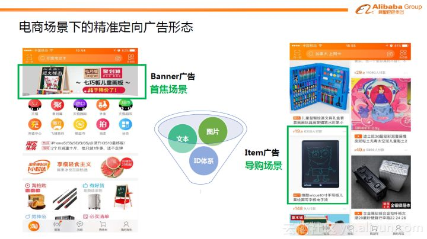
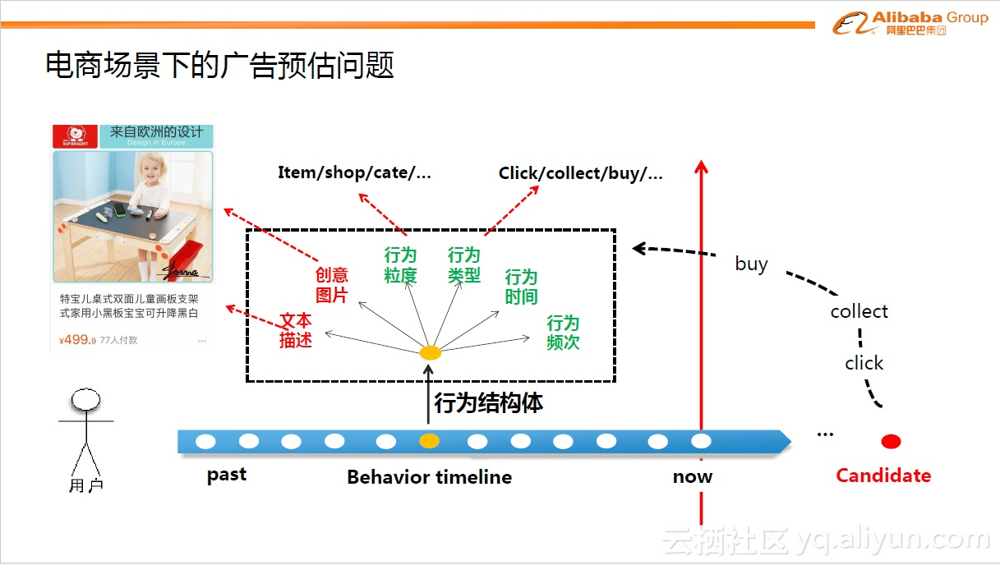

# 点击预估

CTR（Click-Through-Rate）即点击通过率，是互联网广告常用的术语，指网络广告（图片广告/文字广告/关键词广告/排名广告/视频广告等）的点击到达率，即该广告的实际点击次数除以广告的展现量。点击率预估（Click-Through Rate Prediction）是互联网主流应用\(广告、推荐、搜索等\)的核心算法问题，包括Google、Facebook等业界巨头对这个问题一直进行着持续投入和研究。 CTR预估是互联网计算广告中的关键技术环节，预估准确性直接影响公司广告收入。广告领域的CTR预估问题，面临的是超高维离散特征空间中模式发现的挑战——如何拟合现有数据的规律，同时又具备推广性。

在诸如信息检索、推荐系统、在线广告投放系统等工业级的应用中准确预估转化率（post-click conversion rate，CVR）是至关重要的。例如，在电商平台的推荐系统中，最大化场景商品交易总额（GMV）是平台的重要目标之一，而GMV可以拆解为流量×点击率×转化率×客单价，可见转化率是优化目标的重要因子；从用户体验的角度来说准确预估的转换率被用来平衡用户的点击偏好与购买偏好。

## CTR问题特点与挑战

以阿里定向广告为例介绍CTR预估问题的特点与挑战：

下图中可以看到手机淘宝端的定向广告形态。左边是首焦场景，在淘宝顶端的位置会有浮动的Banner广告。右边是往下滑动时候的导购场景（猜你喜欢区块），投放的是Item广告。这些不同形态的定向广告背后其实有一些内在的、从machine learning视角来看相似的特征。简单来说，可以归纳为几个方面，一个方面是广告中展现的创意图片，第二个是图片的文字信息，还有一些在背后看不到摸不到的统一的ID体系，比如某件商品是什么商品，属于哪个品牌等等信息。定向广告复杂多样的富媒介形态以及高维海量数据空间，给广告点击率预估问题带来了不小的挑战。

下图是电商环境下CTR预估问题的数学化模拟。假设一位用户登录手机淘宝，我们首先可以拿到用户的一些历史行为数据，这些行为数据构成了我们对用户兴趣的表达刻画。那么下一步需要预估给用户展现某个候选商品candidate，用户发生点击/购买的概率是多少。那么如何实现预估？我们需要利用历史行为数据建模出用户的兴趣偏好。

将用户的行为按照时间排列，可以构成一个行为时间轴。每个时刻点可以称为行为结构体，它包含了一系列表征行为的关键信息：比如此刻的行为类型，点击or购买某个商品；某个商品的文本描述信息；对应的创意图片；行为发生的时间，行为发生的频次；或者行为背后的粒度体系是什么，对应的是什么商品、什么店铺以及什么品牌等等。

这些大量的行为信息可以足够表达用户的兴趣偏好。时间轴左边是历史的静态信息，称为feature；右边就是待预测的用户的未来行为，如点击行为（点击概率）、购买行为（购买概率）等等。电商场景下的广告预估问题相比于大家熟知的静态预估模型有更大的挑战。

第一个挑战，在淘宝端每天有数亿的用户会登陆，并产生大量的行为。同时我们有海量的商品候选集，在淘宝中有大概10亿到20亿的商品，当然聚焦到广告商品，可能会有所减少，但依然达到了千万的数量级。如此，广告预估问题就变成了数亿用户与千万商品配对的点击概率预估问题，规模极其庞大。

第二个挑战，每个用户行为特征背后，有大量的信号源，比如图像信号、文字信号、品牌偏好信号等等，这些信号如何去捕捉，如何进行统一建模？

第三个挑战，在电商场景下用户的行为非常丰富，反映出用户的兴趣多样多变，寻找与建模用户点击某个广告商品背后的规律是高度非线性的问题。

## 传统CTR算法及其不足

业界传统的CTR预估解法是广义线性模型LR\(logistic regression，逻辑斯特回归\)+人工特征工程。LR使用了Logit变换将函数值映射到0~1区间，映射后的函数值就是CTR的预估值。LR这种线性模型很容易并行化，处理上亿条训练样本不是问题。但这种解法的不足是，因为线性模型的学习能力有限，需要引入大量的领域知识来人工设计特征以及特征之间的交叉组合来间接补充算法的非线性学习能力，非常消耗人力和机器资源，迁移性不够友好。

另外，目前业界也有一些效果不错的非线性模型不断被提出来，并被工程实践且取得不错效果，但这些模型都或多或少存在一些不足。比如Kernel方法，因为复杂度太高而不易实现；比如Tree based方法，这个是由Facebook团队在2014年首先提出，有效地解决了LR模型的特征组合问题，但缺点就是仍然是对历史行为的记忆，缺乏推广性；还有FM（factorization machine）模型，能自动学习高阶属性的权值，不用通过人工的方式选取特征来做交叉，但FM模型只能拟合特定的非线性模式，如最常用的2阶FM只能拟合特征之间的线性关系和二次关系。深度神经网络非线性拟合能力足够强，但面对广告这样的大规模工业级稀疏数据，适合数据规律的、具备推广性的网络结构业界依然在探索中，尤其是要做到端到端规模化上线，这里面的技术挑战依然很大。

所以，如何设计算法从大规模数据中挖掘出具有推广性的非线性模式即急需探索问题。

在Deep Learning时代启动初期，有着巨大的挑战，具体包括：

* 从数百维统计特征到数十亿离散特征，训练程序要做重大升级，从数据并行模式要升级到模型并行方式，且非线性模型复杂度高，需要充分利用数据的结构化特点进行加速；
* 在这种互联网尺度\(百亿参数&样本\)的数据上，模型能不能学习到兼具拟合能力与泛化能力的范式？
* 超大规模数据上的非凸优化\(MLR加入正则后进一步变成非光滑\)学术界鲜有先例。它的收敛性是一个巨大的问号。

## 实践建议

大厂为追求最高的收益可以选用复杂的技术，尤其是像广告这样的部门，资源和人力投入的性价比超值。但对于小厂技术储备和投入相对不足，上面介绍的大量精细工作其实很难实施。模型架构层面一个可行的建议是：采用DQM式结构，把user/ad/query或上下文统一嵌入到vector空间，然后用向量计算架构进行在线服务。好处是在线预估系统可以极简，从而可以集中精力到离线的特征/模型调优，rocket/MTL等协同网络架构都是可以尝试的点，这可以保障轻松拿到业务效果的第一桶金；

如果是规模化的算法团队，愿意投入DL算法的设计，建议: 参考而绝不要盲信现有paper里面的架构，不要再把WDL/DIN等这类已有工作当成宝典。我的观点是，DL时代model这个词已经虚化了，像浅层模型时代LR/MLR等固定的模型已经不存在。模型是死的，场景是活的，遵循一定的规律、充分了解你的领域数据特点，吸收DIN/DIEN/ESMM这类方法的思考套路，定制适合具体问题的网络结构；

再进一步，如果是中大型有较强的实力掌控技术大盘的团队，建议牢记”算法-系统-架构”一体化的理念和方法论，DL对广告/推荐/搜索这类典型互联网应用系统的技术改造是全面而彻底的，现今的系统和架构大都是浅层模型时代遗留的产物，今天面临着复杂算法、异构硬件的多重冲刷，是时候打破旧规则，建立全新的基础设施；

特别聚焦到CTR预估技术上，离散特征的丰富性跟DL模型的效果密切相关，如果本身是容量很低的特征表达，模型是很难发挥的。例如我知道不少团队拿大量的低维统计特征为主的数据喂给DL模型，结果发现没什么效果，这显然是不得要领。“特征-模型-样本”是机器学习三要素，要时刻牢记。建议有实力有需求的团队，尽量充分地拓展更丰富的特征表达和样本信息容量，给模型创造更大的发挥空间；

以上所有建议都有一个重要的前提——自动化的算法迭代和生产链路。这件事在LR模型时代还没那么突出，因为算法迭代速度快不起来，但是在DL模型时代算法的开发和试错成本很低，完整的自动化链路才能真正发挥算法的威力，否则陷入各种在/离线手工胶水代码、人肉debug的汪洋大海，只能望洋兴叹了。

少重复造轮子，多拥抱开源。贡献开源或者从开源技术中吸取最新成果高起点迭代。打个硬广，我们最近刚把上述大部分技术统一整理集成为阿里开源项目X-DeepLearning\(XDL\)。XDL项目包含了我们对大规模分布式DL训练框架、各种实战自研模型\(囊括了前述大部分模型\)、高性能在线serving引擎为一体的工业级深度学习解决方案，感兴趣的同学可以了解下，开源项目地址：[https://github.com/alibaba/x-deeplearning](https://github.com/alibaba/x-deeplearning)

## 趋势探讨

DL技术的兴起，给这个领域的算法工程师创造了巨大的施展空间，集结了信号迭代\(特征+样本\)的模型工程是升维攻击，技术演化如脱缰的骏马尽情驰骋——这是DL驱动的技术变革。有个量化的指标：DL以前我们团队专业的机器学习平台小组要花费好几个月时间才研发出大规模分布式MLR模型，今天我们刚入职的新同学分分钟能够写出跑在同样规模数据上的各种模型，并可以根据灵感随时进行算法创作，这就是DL工具化所带来的生产力巨大飞跃。这个阶段我称之为深度学习1.0时代。在互联网领域DL-1.0时代的起点是从15-16年左右开始，目前第一梯队的团队大都完成或即将完成1.0的全面DL化。我们团队在17年底18年初已经大致完成了这个过程，上面介绍的工作大都是17年就已经完成的。

凡是过往，皆为序曲。DL-1.0引发的技术飞跃，算法创新出现了数量级式的爆炸增长，一方面极大地推进了业务效果的提升速度和高度，另一方面带来了立体化的全栈技术挑战。如前面所述，我们已经试图迎合DL算法对依赖的系统和架构做了一些改造，但这还不足以完全抵御算法爆炸所带来的冲击。18年我们开始面临了一些新瓶颈、加上对DL技术本身有了更多的实践认知，这些输入兵合一处，推动着我们向新的阶段迈进。这个新阶段我称之为深度学习2.0时代。套用卖中年保健品的罗胖对未来的预测，谈谈我们看到的小趋势：

DL模型本身更精细化的解剖。16年端到端DL刚起步的时候，我们常把DL是实验科学挂在嘴边。但是经历了2年的高速发展，我们对DL模型的常见性态已经有了基本的掌握。下一阶段，对DL模型内在结构更精细的认知，将成为推动DL-2.0阶段算法架构升级的起点；

Data-driven的方法论缺陷。互联网用户行为理解是非完全信息建模问题，当算法发展到一定高度时，信息容量本身的固有不足将成为制约。今年学术界不少大佬开始讨论”物理世界模型”，我认为也是在反思Data-driven的不足。我也考虑过能否构建这个领域的物理世界模型，如最近又火了的Knowledge Graph，确实有助于帮助建立一些common sense的认知，但互联网领域是”人-信息-系统”的有机结合体，世界上最睿智的人恐怕也很难理清楚大数据里个人行为背后的动机，换句话说完全的”物理世界模型”应该不可行。歪一下楼，关于推荐系统的可解释性现在也有很多的讨论，我认为真正能够大规模工业应用的充分可解释模型是不现实的，因为训练模型的数据本身都很难有完全合理的解释，当然部分的因果或者关联解释应该是行得通的。回到主题，既然Data-driven方法受data制约，我们认为DL-2.0阶段对更完备连贯的用户行为数据串联，将有助于算法的进一步提升；

算法复杂度持续指数级增长，资源&算力全面告急，algo-system的co-design从口号变成胜负手。DL-2.0阶段ODL架构将全面串联”算法建模-离线系统-在线引擎”，形成标配解法。这个阶段技术性价比将纳入严肃讨论的范畴。回归技术的本源：什么叫做创新？用简洁低成本的方式优雅地解决问题，取得最好的效果。

DL本身从1.0阶段fancy的明星技术变成2.0阶段的基础设施。DL-2.0将更多地聚焦到领域问题本身，除了持续的效果提升外，工具的顺手将带来新的业务可能性，诸如冷启动、数据循环、推荐新颖性等硬核问题将会有新的思考和实践。

## Source









