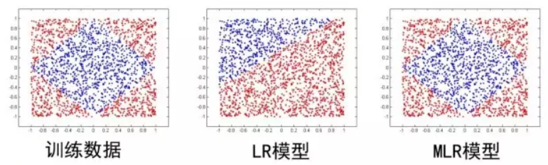
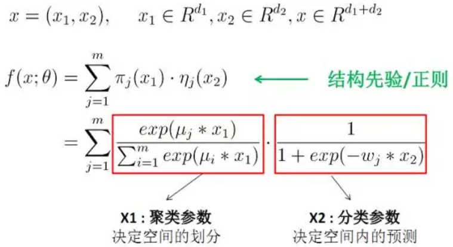
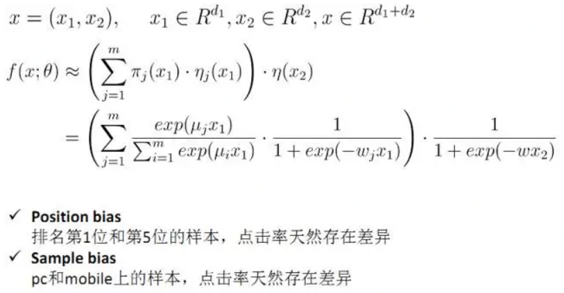
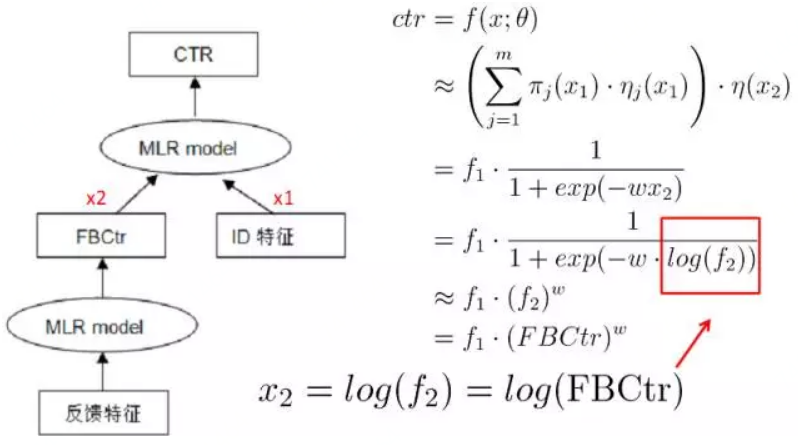
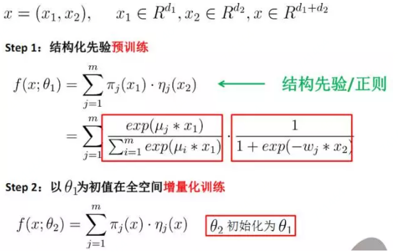
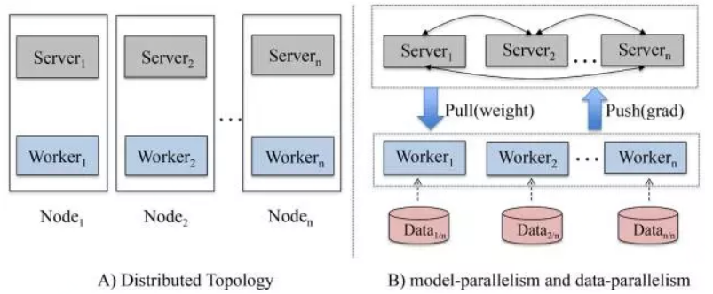
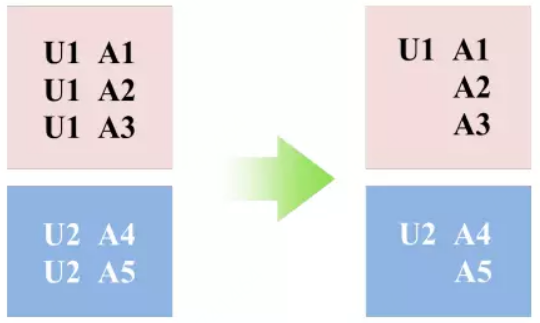

# 混合逻辑斯特回归

## 算法模型详解

2011-2012年期间，阿里妈妈资深专家盖坤（花名靖世）突破了主流大规模线性模型的思路，创新性地提出了[MLR\(mixed logistic regression, 混合逻辑斯特回归\)算法](https://arxiv.org/abs/1704.05194)，引领了广告领域CTR预估算法的全新升级。MLR算法创新地提出并实现了直接在原始空间学习特征之间的非线性关系，基于数据自动发掘可推广的模式，相比于人工来说效率和精度均有了大幅提升。

阿里自主研发的MLR模型是对线性LR模型的推广，它利用分片线性方式对数据进行拟合。基本思路是采用分而治之的策略：如果分类空间本身是非线性的，则按照合适的方式把空间分为多个区域，每个区域里面可以用线性的方式进行拟合，最后MLR的输出就变为了多个子区域预测值的加权平均。在今天看来，MLR模型是带有一个隐层的神经网络。

如下图， $$X$$ 是大规模的稀疏输入数据，MLR模型第一步是做了一个Embedding操作，分为两个部分，一种叫聚类Embedding（绿色），另一种是分类Embedding（红色）。两个投影都投到低维的空间，纬度为M，对应的是MLR模型中的分片数。完成投影之后，通过很简单的内积（Inner Product）操作便可以进行预测，得到输出Y。右边是不同节点上的激活函数Activation Function，已按不同颜色区分。

MLR可以看做是对LR的一个自然推广，它采用分而治之的思路，用分片线性的模式来拟合高维空间的非线性分类面，其形式化表达如下：

                                        $$f(x)=\sum\limits_{i=1}^m\pi_i(x)\cdot \eta_i(x)=\sum\limits_{i=1}^m\frac{e^{\mu_i\cdot x}}{\sum_{j=1}^me^{\mu_j\cdot x}}\cdot\frac{1}{1+e^{-w_i\cdot x}}$$ 

这里面超参数分片数 $$m$$ 可以较好地平衡模型的拟合与推广能力。当 $$m=1$$ 时MLR就退化为普通的LR， $$m$$ 越大模型的拟合能力越强，但是模型参数规模随 $$m$$ 线性增长，相应所需的训练样本也随之增长。因此实际应用中 $$m$$ 需要根据实际情况进行选择。例如，在我们的场景中， $$m$$ 一般选择为12。下图中MLR模型用4个分片可以完美地拟合出数据中的菱形分类面。

MLR算法适合于工业级的大规模稀疏数据场景问题，如广告CTR预估。背后的优势体现在两个方面：

1. 端到端的非线性学习：从模型端自动挖掘数据中蕴藏的非线性模式，省去了大量的人工特征设计，这 使得MLR算法可以端到端地完成训练，在不同场景中的迁移和应用非常轻松。
2. 稀疏性：MLR在建模时引入了L1和L2,1范数正则，可以使得最终训练出来的模型具有较高的稀疏度， 模型的学习和在线预测性能更好。当然，这也对算法的优化求解带来了巨大的挑战。

## 算法高级特性

**1）结构先验。**基于领域知识先验，灵活地设定空间划分与线性拟合使用的不同特征结构。例如精准定向 广告中验证有效的先验为：以user特征空间划分、以ad特征为线性拟合。直观来讲这是符合人们的认知的：不同人群具有聚类特性，同一类人群对广告有类似的偏好，例如高消费人群喜欢点击高客单价的广告。结构先验有助于帮助模型缩小解空间的探索范围，收敛更容易。

**2）线性偏置。**这个特性提供了一个较好的方法解决CTR预估问题中的bias特征，如位置、资源位等。实际应用中我们对位置bias信息的建模，获得了4%的RPM提升效果。

**3）模型级联。**MLR支持与LR模型的级联式联合训练，这有点类似于wide&deep learning。在我们的实践经验中，一些强feature配置成级联模式有助于提高模型的收敛性。例如典型的应用方法是：以统计反馈类特征构建第一层模型，它的输出\(如下图中的FBCtr\)级联到第二级大规模稀疏ID特征体系中去，这样能够有助于获得更好的提升效果。

**4）增量训练。**实践证明，MLR通过结构先验进行pretrain，然后再增量进行全空间参数寻优训练，会获得进一步的效果提升。同时增量训练模式下模型达到收敛的步数更小，收敛更为稳定。在我们的实际应用中，增量训练带来的RPM增益达到了3%。

## 大规模分布式实现

MLR算法面向的是工业级的数据，例如亿级特征，百亿级参数，千亿级样本。因此我们设计了一套分布式架构，以支持模型的高效并行训练。下图是架构示意图，它跟传统的parameter server架构略有区别，主要不同点在于我们在每一个分布式节点上同时部署了worker和server两种角色，而不是将server单独剥离出去部署。这背后的考虑是充分利用每个节点的CPU和内存，从而保证最大化机器的资源利用率。

此外，针对个性化广告场景中数据的结构化特性，我们提出并实现了common feature的trick，可以大幅度压缩样本存储、加速模型训练。例如下图示意，在展示广告中，一般来说一个用户在一天之内会看到多条广告展现，而一天之内这个用户的大量的静态特征（如年龄、性别、昨天以前的历史行为）是相同的，通过common feature压缩，我们对这些样本只需要存储一次用户的静态特征，其余样本通过索引与其关联；在训练过程中这部分特征也只需要计算一次。在实践中应用common feature trick使得我们用近1/3的资源消耗获得了12倍的加速。

## 商业落地应用

#### 基于MLR的定向广告CTR预估算法

基于MLR算法的非线性学习能力，阿里妈妈的定向广告CTR预估采用了大规模原始ID特征+MLR算法的架构。具体地，我们刻画一次广告展现为特征向量，它由三部分独立构成：用户部分特征（包括userid、profile信息、用户在淘宝平台上的历史行为特征（浏览/购买过的宝贝/店铺/类目上的id和频次等）、广告部分特征（包括adid、campainid、广告对应的卖家店铺id、类目id等）、场景部分特征（包括时间、位置、资源位等）。这些特征之间无传统的交叉组合，维度在2亿左右。然后我们将数据直接喂给MLR算法，并且应用了结构化先验、pretrain+增量训练、线性偏置等高级技巧，让模型从数据中自动去总结和拟合规律。实践证明，相比于传统的LR+特征工程思路，这种解法更为高效和优雅，模型精度更高，在实际生产中的可迭代更强。

#### 基于MLR的定向广告Learning to Match算法

Match算法是定向广告中的一个重要环节，它的核心使命是基于用户的人口属性、历史行为等信息来猜测用户可能感兴趣的广告集合。传统的Match算法更多采用的是规则匹配、协同过滤等方法，方法的扩展性不强。在阿里妈妈定向广告系统中，我们研发了基于MLR的learning to match算法框架。简单来说，用模型的方法基于用户的行为历史来学习用户个性化的兴趣，从而召回高相关性的候选广告集。同样地，基于MLR算法的非线性能力，我们可以很容易地将不同的特征源、标签体系融合到框架中，不需要过多地关注和设计特征的交叉组合，使得框架的灵活性大大增强。

## 算法问题挑战

虽然目前取得了非常不错的成绩，但是未来的挑战也不小：比如初值问题、非凸问题的局部极值、虽然MLR比LR好，但不知道和全局最优相比还有多远；第二，在初值的Pre-train方面需要改进和优化模型函数等等；第三，目前规模化能力方面也需要能够吞吐更多特征和数据，比如采用更快的收敛算法等等；最后，整体的MLR算法的抽象能力也需进一步得到强化。

## Source





