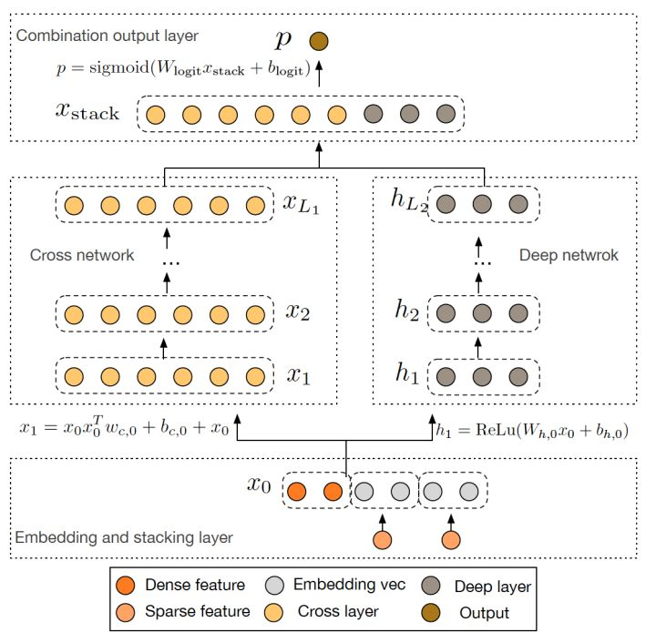

# Deep&Cross

Google 2017年发表的[Deep&Cross Network（DCN）](https://github.com/wzhe06/Reco-papers/blob/master/Deep%20Learning%20Recommender%20System/%5BDCN%5D%20Deep%20%26%20Cross%20Network%20for%20Ad%20Click%20Predictions%20%28Stanford%202017%29.pdf)同样是对Wide&Deep的进一步改进，主要的思路**使用Cross网络替代了原来的Wide部分**。其中设计Cross网络的基本动机是为了增加特征之间的交互力度，使用多层cross layer对输入向量进行特征交叉。单层cross layer的基本操作是将cross layer的输入向量xl与原始的输入向量x0进行交叉，并加入bias向量和原始xl输入向量。DCN本质上还是对Wide&Deep Wide部分表达能力不足的问题进行改进，与DeepFM的思路非常类似。

## Source



