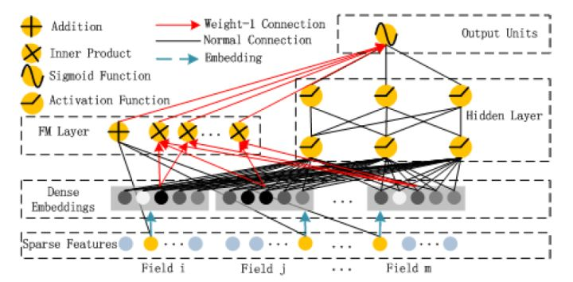

# DeepFM

在Wide&Deep之后，诸多模型延续了双网络组合的结构，[DeepFM](https://github.com/wzhe06/Reco-papers/blob/master/Deep%20Learning%20Recommender%20System/%5BDeepFM%5D%20A%20Factorization-Machine%20based%20Neural%20Network%20for%20CTR%20Prediction%20%28HIT-Huawei%202017%29.pdf)就是其中之一。DeepFM对Wide&Deep的改进之处在于，它**用FM替换掉了原来的Wide部分**，加强了浅层网络部分特征组合的能力。事实上，由于FM本身就是由一阶部分和二阶部分组成的，DeepFM相当于同时组合了原Wide部分+二阶特征交叉部分+Deep部分三种结构，无疑进一步增强了模型的表达能力。

## Source



