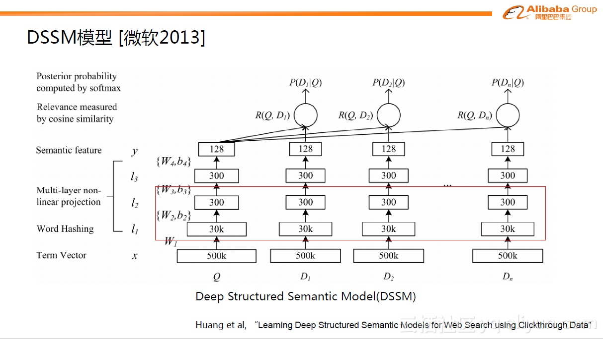

# DSSM

如果说MLR模型是阿里巴巴初次对于深度学习方面的探索，在深度学习真正引入到广告预估问题中之后，出现了更多演变的模型。Deep Structured Semantic Model（DSSM）模型是微软2013年提出的。虽然在最初DSSM模型不是用于广告预估，但是现在看来，它为广告预估提供了一个很好的思路。这里主要关注下图中红色框内的部分，原理是把query/doc中的关键信息（Term Vector）提取出来进行简单的Word Hashing之后，把query/doc域分别投影到300维的子空间去。query里的每个word都对应一个300维的向量，一个query里会有多个向量，后面用sum求和操作得到一个汇总的300维向量，这是一个典型的Embedding操作。从图中可以看到，30k是指word字典的长度，300是embedding维数，30k\*300≈千万量级的参数。DSSM模型第一次探索了如何把大量稀疏的ID进行稠密表达的路径。

当然，DSSM模型本意不是用于广告预估问题。在深度学习最初引入CTR预估问题时，当时业界的一些公司如Google、百度等已经在探索如何把大量的稀疏数据进行降维的方法。一个典型的做法是用辅助的方式分两阶段进行：第一阶段，用FM模型把大量的稀疏ID学习到对应的embedding表达，跟DSSM模型类似，能够得到几百维的稠密向量。第二阶段是基于稠密的输入用多层全连接网络预测最后的目标。从今天的视角来看，这种两阶段的方式是不如整体的端到端模型的。这个思考点在2013年-2014年左右一直有人进行尝试，但当时一是因为深入学习框架的没能普及，二是对整个计算力的估计不足，因此没有达到比较好的进展，直到2016年左右，才有所突破，当然这里面很重要的一点是得益于优秀的深度学习框架如TensorFlow、MXNet等的开源和普及，进一步促进了整个工业界的思考和前进。

## Source









