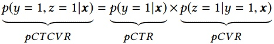
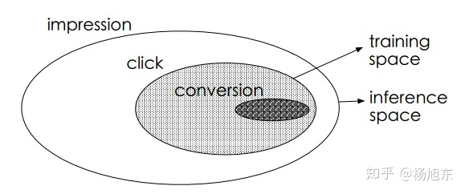
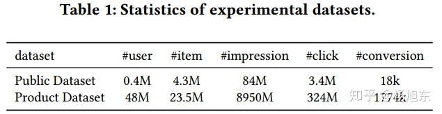

# ESMM

阿里妈妈算法团队最近发表了一篇关于CVR预估的论文《Entire Space Multi-Task Model: An Effective Approach for Estimating Post-Click Conversion Rate》，提出了一种新颖的CVR预估模型，称之为“完整空间多任务模型”（Entire Space Multi-Task Model，ESMM），下文简称为ESMM模型。ESMM模型创新地利用用户行为序列数据，在完整的样本数据空间同时学习点击率和转化率（post-view clickthrough&conversion rate，CTCVR），解决了传统CVR预估模型难以克服的样本选择偏差（sample selection bias）和训练数据过于稀疏（data sparsity ）的问题。

以电子商务平台为例，用户在观察到系统展现的推荐商品列表后，可能会点击自己感兴趣的商品，进而产生购买行为。换句话说，用户行为遵循一定的顺序决策模式：impression → click → conversion。CVR模型旨在预估用户在观察到曝光商品进而点击到商品详情页之后购买此商品的概率，即pCVR = p\(conversion\|click,impression\)。

假设训练数据集为 $$S={(x_i,y_i \to z_i)}|_{i=1}^N$$ ，其中的样本 $$(x,y \to z)$$ 是从域 $$X \times Y \times Z$$ 中按照某种分布采样得到的， $$X$$ 是特征空间， $$Y$$ 和 $$Z$$ 是标签空间， $$N$$ 为数据集中的样本总数量。在CVR预估任务中， $$x$$ 是高维稀疏多域的特征向量， $$y$$ 和 $$z$$ 的取值为 $$0$$ 或 $$1$$ ，分别表示是否点击和是否购买。 $$y \to z$$ 揭示了用户行为的顺序性，即点击事情一般发生在购买事件之前。CVR模型的目标是预估条件概率pCVR ，与其相关的两个概率为点击率pCTR 和点击且转换率 pCTCVR ，它们之间的关系如下：

传统的CVR预估任务通常采用类似于CTR预估的技术，比如最近很流行的深度学习模型。然而，有别于CTR预估任务，CVR预估任务面临一些特有的挑战：1\) 样本选择偏差；2\) 训练数据稀疏；3\) 延迟反馈等。

延迟反馈的问题不在本文讨论的范围内，下面简单介绍一下样本选择偏差与训练数据稀疏的问题。如上图所示，最外面的大椭圆为整个样本空间 $$S$$ ，其中有点击事件 $$(y=1)$$ 的样本组成的集合为 $$S_c=\{(x_j,z_j)|y_j=1\}|_{j=1}^M$$  ，对应图中的阴影区域，传统的CVR模型就是用此集合中的样本来训练的，同时训练好的模型又需要在整个样本空间做预测推断。由于点击事件相对于展现事件来说要少很多，因此 $$S_c$$ 只是样本空间 $$S$$ 的一个很小的子集，从 $$a = b$$ 上提取的特征相对于从 $$S$$ 中提取的特征而言是有偏的，甚至是很不相同。从而，按这种方法构建的训练样本集相当于是从一个与真实分布不完全一致的分布中采样得到的，这一定程度上违背了机器学习算法之所以有效的前提：训练样本与测试样本必须独立地采样自同一个分布，即独立同分布的假设。总结一下，训练样本从整体样本空间的一个较小子集中提取，而训练得到的模型却需要对整个样本空间中的样本做推断预测的现象称之为样本选择偏差。样本选择偏差会伤害学到的模型的泛化性能。

推荐系统展现给用户的商品数量要远远大于被用户点击的商品数量，同时有点击行为的用户也仅仅只占所有用户的一小部分，因此有点击行为的样本空间 $$S_c$$ 相对于整个样本空间 $$S$$ 来说是很小的，通常来讲，量级要少1~3个数量级。如表1所示，在淘宝公开的训练数据集上， $$S_c$$ 只占整个样本空间 $$S$$ 的4%。这就是所谓的训练数据稀疏的问题，高度稀疏的训练数据使得模型的学习变得相当困难。

阿里妈妈的算法同学提出的ESMM模型借鉴了多任务学习的思路，引入了两个辅助的学习任务，分别用来拟合pCTR和pCTCVR，从而同时消除了上文提到的两个挑战。ESMM模型能够充分利用用户行为的顺序性模式，其模型架构如下图所示。

整体来看，对于一个给定的展现，ESMM模型能够同时输出预估的pCTR、pCVR 和pCTCVR。它主要由两个子神经网络组成，左边的子网络用来拟合pCVR ，右边的子网络用来拟合pCTR。两个子网络的结构是完全相同的，这里把子网络命名为BASE模型。两个子网络的输出结果相乘之后即得到pCTCVR，并作为整个任务的输出。

需要强调的是，ESMM模型有两个主要的特点，使其区别于传统的CVR预估模型，分别阐述如下。

## Source











