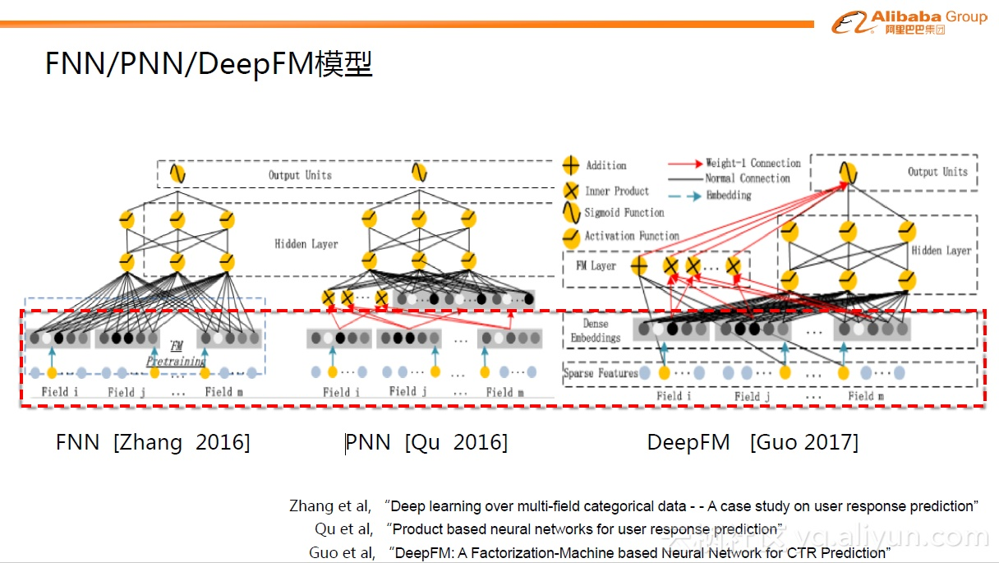
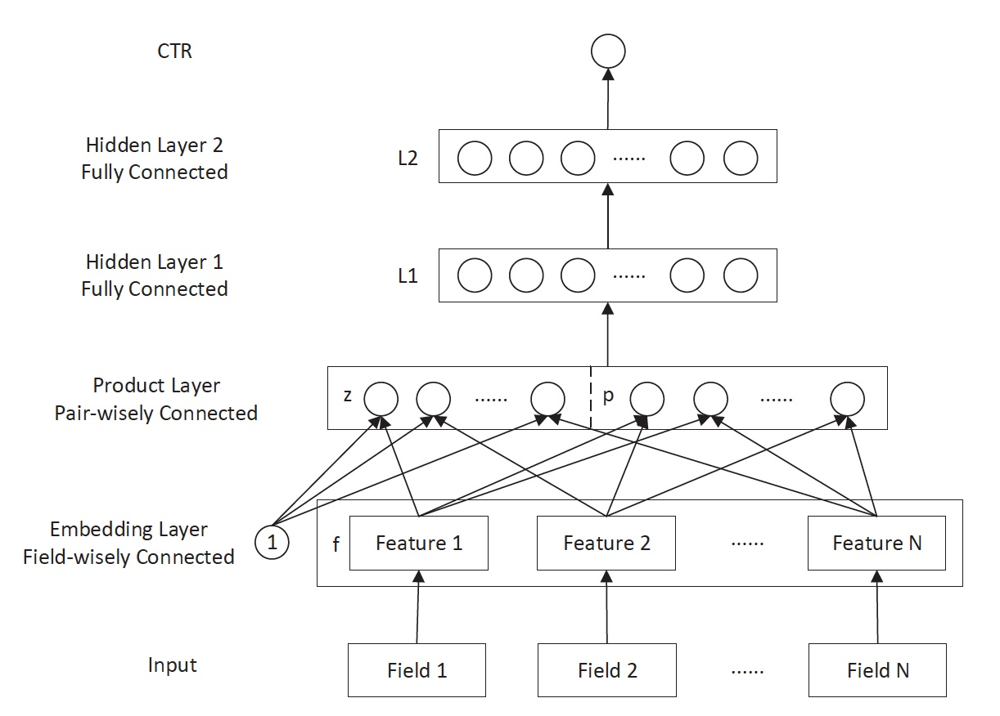

# FNN/PNN

GwEN和WDL是目前比较常用的模型，非常简单，所有后续人们继续做了很多改进，例如FNN，PNN以及DeepFM等。这些模型基础的部分与上面的GwEN和WDL模型类似，即Group-wise Embedding。改进的地方主要在后面的部分，引入了代数式的先验pattern，如FM模式，比较简单直接，可以给MLP 提供先验的结构范式。虽然理论上说，MLP可以表达任意复杂的分类函数，但越泛化的表达，拟合到具体数据的特定模式越不容易，也就是著名的“No Free Lunch”定理。因此代数式的先验结构引入确实有助于帮助MLP更好的学习。当然从另外的视角看，这种设定的结构范式比较简单，过于底层，也使得学习本身比较低效。

## FNN\(2016年\)—用FM的隐向量完成Embedding初始化

[FNN](https://github.com/wzhe06/Reco-papers/blob/master/Deep%20Learning%20Recommender%20System/%5BFNN%5D%20Deep%20Learning%20over%20Multi-field%20Categorical%20Data%20%28UCL%202016%29.pdf)相比Deep Crossing的创新在于**使用FM的隐层向量作为user和item的Embedding**，从而避免了完全从随机状态训练Embedding。由于id类特征大量采用one-hot的编码方式，导致其维度极大，向量极稀疏，所以Embedding层与输入层的连接极多，梯度下降的效率很低，这大大增加了模型的训练时间和Embedding的不稳定性，使用pre train的方法完成Embedding层的训练，无疑是降低深度学习模型复杂度和训练不稳定性的有效工程经验。

## PNN \(2016年\)—丰富特征交叉的方式

[PNN](https://github.com/wzhe06/Reco-papers/blob/master/Deep%20Learning%20Recommender%20System/%5BPNN%5D%20Product-based%20Neural%20Networks%20for%20User%20Response%20Prediction%20%28SJTU%202016%29.pdf)的全称是Product-based Neural Network，**PNN的关键在于在embedding层和全连接层之间加入了Product layer**。传统的DNN是直接通过多层全连接层完成特征的交叉和组合的，但这样的方式缺乏一定的“针对性”。首先全连接层并没有针对不同特征域之间进行交叉；其次，全连接层的操作也并不是直接针对特征交叉设计的。但在实际问题中，特征交叉的重要性不言而喻，比如年龄与性别的交叉是非常重要的分组特征，包含了大量高价值的信息，我们急需深度学习网络能够有针对性的结构能够表征这些信息。因此PNN通过加入Product layer完成了针对性的特征交叉，其product操作在不同特征域之间进行特征组合。并定义了inner product，outer product等多种product的操作捕捉不同的交叉信息，增强模型表征不同数据模式的能力 。

## Source









