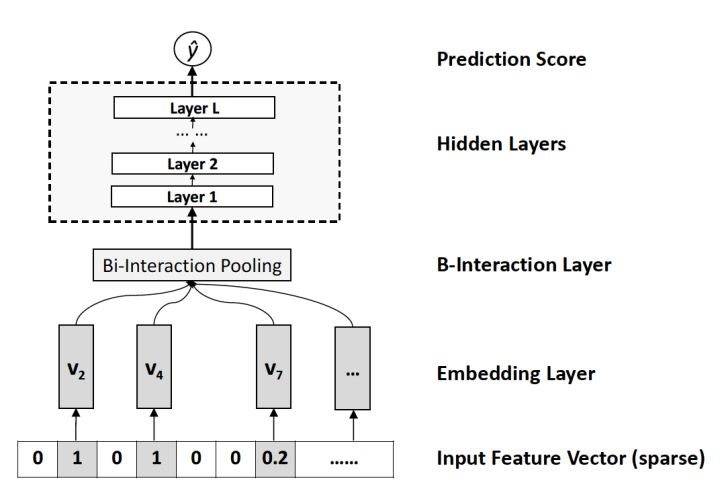

# NFM

相对于DeepFM和DCN对于Wide&Deep Wide部分的改进，**NFM可以看作是对Deep部分的改进**。NFM的全称是Neural Factorization Machines，如果我们从深度学习网络架构的角度看待FM，FM也可以看作是由单层LR与二阶特征交叉组成的Wide&Deep的架构，与经典W&D的不同之处仅在于Deep部分变成了二阶隐向量相乘的形式。再进一步，NFM从修改FM二阶部分的角度出发，用一个带Bi-interaction Pooling层的DNN替换了FM的特征交叉部分，形成了独特的Wide&Deep架构。其中Bi-interaction Pooling可以看作是不同特征embedding的element-wise product的形式。这也是NFM相比Google Wide&Deep的创新之处。

## Source



