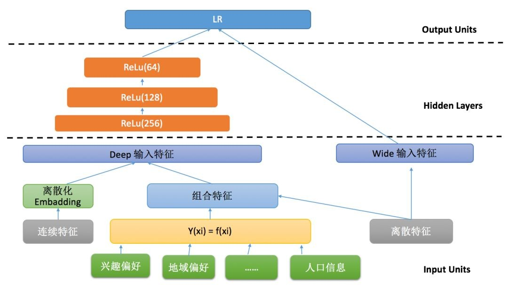

# Wide&Deep Learning

与阿里同时期，Google推出了Wide & Deep Learning（WDL）模型，一个非常出名的模型。详细内容可以从论文中查询Cheng et al, “Wide & deep learning for recommender systems” 。WDL模型也非常简单，但巧妙的将传统的特征工程与深度模型进行了强强联合。Wide部分是指人工先验的交叉特征，通过LR模型的形式做了直接的预测。右边是Deep部分，与GwEN网络结构一样，属于分组的学习方式。WDL相当于LR模型与GwEN结合训练的网络结构。

wide端对应的线性模型，输入特征可以是连续特征，也可以是稀疏的离散特征，离散特征之间进行进行交叉后可以构成更高维的特征，通过L1正则化能够很快收敛到有效的特征组合中。

deep端对应的是DNN模型，每个特征对应一个低维的稠密向量，我们称之为特征的embedding，DNN能够通过反向传播调整隐藏层的权重，并且更新特征的embedding

比如，在实际的新闻推荐场景中，wide model侧主要包含文章分类id、topic id、曝光位置以及其他部分离散特征，主要为了提高模型的记忆能力；deep model侧主要包含离散特征和部分连续特征，例如UserID、DocId、用户位置、分类ID、关键词ID以及各种统计类特征离散化结果，这些特征通常需要embedding向量然后拼接进行信息融合。

## Source









