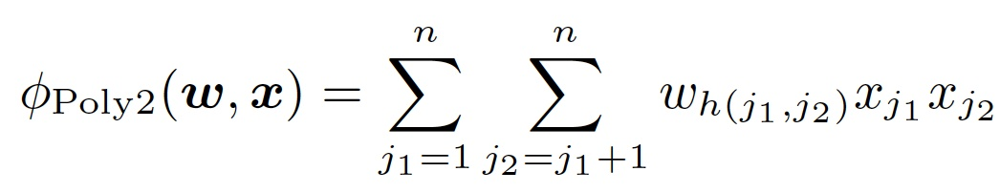
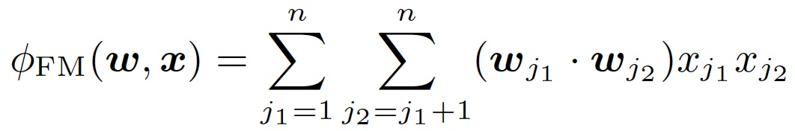
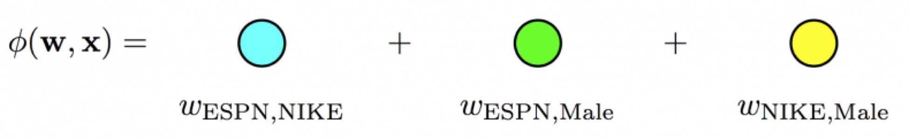
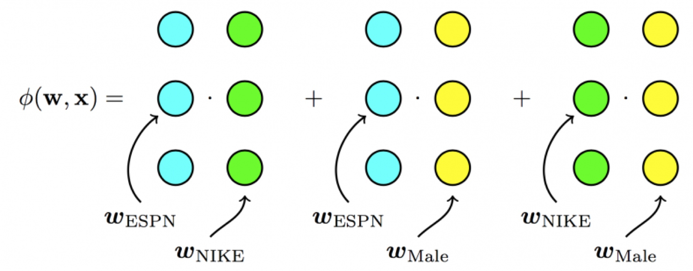
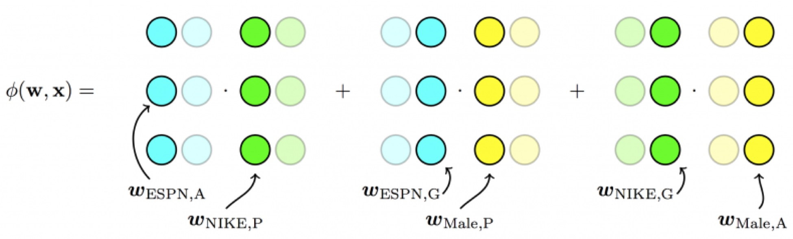

# 特征交叉方向的演化

## POLY2—特征交叉的开始

LR的表达能力毕竟是非常初级的。由于LR仅使用单一特征，无法利用高维信息，在“辛普森悖论”现象的存在下，只用单一特征进行判断，甚至会得出错误的结论。

针对这个问题，当时的算法工程师们经常采用手动组合特征，再通过各种分析手段筛选特征的方法。但这个方法无疑是残忍的，完全不符合“懒惰是程序员的美德”这一金科玉律。更遗憾的是，人类的经验往往有局限性，程序员的时间和精力也无法支撑其找到最优的特征组合。因此采用 PLOY2模型进行特征的“暴力”组合成为了可行的选择。

在上面POLY2二阶部分的目标函数中（上式省略一阶部分和sigmoid函数的部分），我们可以看到POLY2对所有特征进行了两两交叉，并对所有的特征组合赋予了权重 $$w_{h(j_1,j_2)}$$ 。POLY2通过暴力组合特征的方式一定程度上解决了特征组合的问题。并且由于本质上仍是线性模型，其训练方法与LR并无区别，便于工程上的兼容。

但POLY2这一模型同时存在着两个巨大的缺陷：

1、由于在处理互联网数据时，经常采用one-hot的方法处理id类数据，致使特征向量极度稀疏，POLY2进行无选择的特征交叉使原本就非常稀疏的特征向量更加稀疏，使得大部分交叉特征的权重缺乏有效的数据进行训练，无法收敛。 

2、权重参数的数量由 $$n$$ 直接上升到 $$n^2$$ ，极大增加了训练复杂度。

## FM—隐向量特征交叉

为了解决POLY2模型的缺陷，2010年德国康斯坦茨大学的Steffen Rendle提出了FM（Factorization Machine）。

从FM的目标函数的二阶部分中我们可以看到，相比POLY2，主要区别是用两个向量的内积 $$(w_{j_1}\cdot w_{j_2})$$ 取代了单一的权重 $$w_{h(j_1,j_2)}$$ 。具体来说，FM为每个特征学习了一个隐权重向量（latent vector），在特征交叉时，使用两个特征隐向量的内积作为交叉特征的权重。

通过引入特征隐向量的方式，把原先 $$n^2$$ 级别的权重数量减低到了 $$n*k$$ \($$k$$ 为隐向量维度， __$$n>>k$$\)。在训练过程中，又可以通过转换目标函数形式的方法，使FM的训练复杂度进一步降低到nk级别。相比POLY2极大降低训练开销。

**隐向量的引入还使得FM比POLY2能够更好的解决数据稀疏性的问题**。举例来说，我们有两个特征，分别是channel和brand，一个训练样本的feature组合是\(ESPN, Adidas\)，在POLY2中，只有当ESPN和Adidas同时出现在一个训练样本中时，模型才能学到这个组合特征对应的权重。而在FM中，ESPN的隐向量也可以通过\(ESPN, Gucci\)这个样本学到，Adidas的隐向量也可以通过\(NBC, Adidas\)学到，这大大降低了模型对于数据稀疏性的要求。甚至对于一个从未出现过的特征组合\(NBC, Gucci\)，由于模型之前已经分别学习过NBC和Gucci的隐向量，FM也具备了计算该特征组合权重的能力，这是POLY2无法实现的。也许FM相比POLY2丢失了某些信息的记忆能力，但是泛化能力大大提高，这对于互联网的数据特点是非常重要的。

工程方面，FM同样可以用梯度下降进行学习的特点使其不失实时性和灵活性。相比之后深度学习模型复杂的网络结构，FM比较容易实现的inference过程也使其没有serving的难题。因此FM在2012-2014年前后逐渐成为业界CTR模型的重要选择。

## FFM—引入特征域概念

2015年，基于FM提出的FFM（Field-aware Factorization Machine ，简称FFM）在多项CTR预估大赛中一举夺魁，并随后被Criteo、美团等公司深度应用在CTR预估，推荐系统领域。相比FM模型，FFM模型主要引入了Field-aware这一概念，使模型的表达能力更强。

上式是FFM的目标函数的二阶部分。其与FM目标函数的区别就在于隐向量由原来的 $$w_{j_1}$$ 变成了 $$w_{j_1,f_2}$$ ，这就意味着每个特征对应的不是一个隐向量，而是对应着不同域的一组隐向量，当 $$w_{j_1}$$ 特征与 $$w_{j_2}$$ 特征进行交叉时， $$x_{j_1}$$ 特征会从一组隐向量中挑出与特征 $$x_{j_2}$$ 的域 $$f_2$$ 对应的隐向量 $$w_{j_1,f_2}$$ 进行交叉。同理特征 $$x_{j_2}$$ 也会用与 $$x_{j_1}$$ 的域 $$f_1$$ 对应的隐向量进行交叉。

这里再次强调一下，上面所说的“域”就代表着特征域，域内的特征一般会采用one-hot编码形成one-hot特征向量。

FFM模型学习每个特征在f个域上的k维隐向量，交叉特征的权重由特征在对方特征域上的隐向量内积得到，权重数量共 $$n*k*f$$ 个。在训练方面，由于FFM的二次项并不能够像FM那样简化，因此其复杂度为 $$kn^2$$ 。

相比FM，FFM由于引入了field这一概念，为模型引入了更多有价值信息，使模型表达能力更强，但与此同时，FFM的计算复杂度上升到 $$kn^2$$ ，远远大于FM的 $$k*n$$ 。

## **CTR模型特征交叉方向的演化**

以上模型实际上是CTR模型朝着特征交叉的方向演化的过程，我们再用图示方法回顾一下从POLY2到FM，再到FFM进行特征交叉方法的不同。

POLY2模型直接学习每个交叉特征的权重，权重数量共 ****$$n^2$$ 个。

FM模型学习每个特征的 $$k$$ 维隐向量，交叉特征由相应特征隐向量的内积得到，权重数量共 $$n*k$$ 个。

FFM模型引入了特征域这一概念，在做特征交叉时，每个特征选择与对方域对应的隐向量做内积运算得到交叉特征的权重。参数数量共 $$n*k*f$$ 个。

## Source



