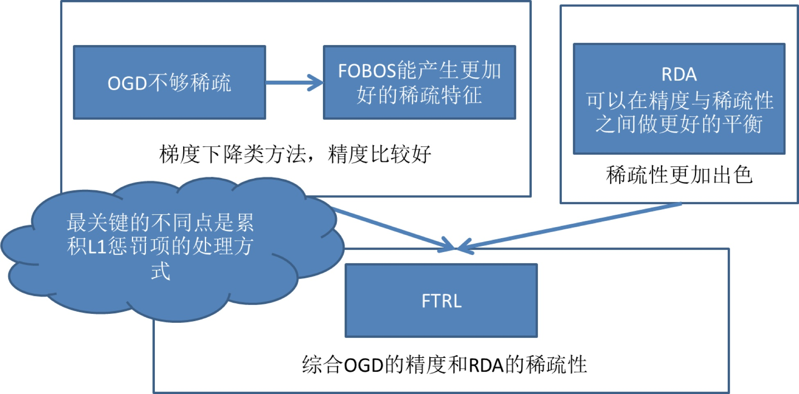

# 兼顾实时性与稀疏性

## **FTRL——天下武功，唯快不破**

FTRL的全称是Follow-the-regularized-Leader，是一种在线实时训练模型的方法，Google在2010年提出了FTRL的思路，2013年实现了FTRL的工程化，之后快速成为online learning的主流方法。与模型演化图中的其他模型不同，FTRL本质上是模型的训练方法。虽然Google的工程化方案是针对LR模型的，但理论上FTRL可以应用在FM，NN等任何通过梯度下降训练的模型上。

为了更清楚的认识FTRL，这里对梯度下降方法做一个简要的介绍，从训练样本的规模角度来说，梯度下降可以分为：batch，mini-batch，SGD（随机梯度下降）三种，batch方法每次都使用全量训练样本计算本次迭代的梯度方向，mini-batch使用一小部分样本进行迭代，而SGD每次只利用一个样本计算梯度。对于online learning来说，为了进行实时得将最新产生的样本反馈到模型中，SGD无疑是最合适的训练方式。

但SGD对于互利网广告和推荐的场景来说，有比较大的缺陷，就是难以产生稀疏解。为什么稀疏解对于CTR模型如此重要呢？

之前我们已经多次强调，由于one hot等id类特征处理方法导致广告和推荐场景下的样本特征向量极度稀疏，维度极高，动辄达到百万、千万量级。为了不割裂特征选择和模型训练两个步骤，如果能够在保证精度的前提下尽可能多的让模型的参数权重为0，那么我们就可以自动过滤掉这些权重为0的特征，生成一个“轻量级”的模型。“轻量级”的模型不仅会使样本部署的成本大大降低，而且可以极大降低模型inference的计算延迟。这就是模型稀疏性的重要之处。

而SGD由于每次迭代只选取一个样本，梯度下降的方向虽然总体朝向全局最优解，但微观上的运动的过程呈现布朗运动的形式，这就导致SGD会使几乎所有特征的权重非零。即使加入L1正则化项，由于CPU浮点运算的结果很难精确的得到0的结果，也不会完全解决SGD稀疏性差的问题。就是在这样的前提下，FTRL几乎完美地解决了模型精度和模型稀疏性兼顾的训练问题。

但FTRL的提出也并不是一蹴而就的。如上图所示，FTRL的提出经历了下面几个关键的过程：

1、**从最近简单的SGD到OGD**（online gradient descent），OGD通过引入L1正则化简单解决稀疏性问题；

2、**从OGD到截断梯度法**，通过暴力截断小数值梯度的方法保证模型的稀疏性，但损失了梯度下降的效率和精度；

3、**FOBOS**（Forward-Backward Splitting），google和伯克利对OGD做进一步改进，09年提出了保证精度并兼顾稀疏性的FOBOS方法；

4、**RDA**：微软抛弃了梯度下降这条路，独辟蹊径提出了正则对偶平均来进行online learning的方法，其特点是稀疏性极佳，但损失了部分精度。

5、Google**综合FOBOS在精度上的优势和RDA在稀疏性上的优势**，将二者的形式进行了进一步统一，提出并应用FTRL，使FOBOS和RDA均成为了FTRL在特定条件下的特殊形式。  
FTRL的算法细节对于初学者来说仍然是晦涩的，建议非专业的同学仅了解其特点和应用场景即可。对算法的数学形式和实现细节感兴趣的同学，我强烈推荐微博 冯扬 写的“在线最优化求解”一文，希望能够帮助大家进一步熟悉FTRL的技术细节。

## Source



