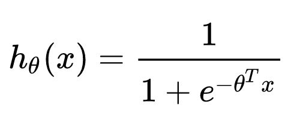

# CTR的核心LR模型

2012年各大中小公司的主流CTR模型无一例外全都是LR模型。LR模型的流行是有三方面原因的：一是数学形式和含义上的支撑；二是人类的直觉和可解释性的原因；三是工程化的需要。

## 逻辑回归的数学基础

逻辑回归作为广义线性模型的一种，它的假设是因变量y服从伯努利分布。那么在点击率预估这个问题上，“点击”这个事件是否发生就是模型的因变量y。而用户是否点击广告这个问题是一个经典的掷偏心硬币问题，因此CTR模型的因变量显然应该服从伯努利分布。所以采用LR作为CTR 模型是符合“点击”这一事件的物理意义的。

与之相比较，线性回归（Linear Regression）作为广义线性模型的另一个特例，其假设是因变量y服从高斯分布，这明显不是点击这类二分类问题的数学假设。

在了解LR的数学理论基础后，其数学形式就不再是空中楼阁了，具体的形式如下：

其中 $$x$$ 是输入向量， $$\theta$$ 是我们要学习的参数向量。结合CTR模型的问题来说， $$x$$ 就是输入的特征向量， $$h(x)$$ 就是我们最终希望得到的点击率。

##  **人类的直觉和可解释性**

直观来讲，LR模型目标函数的形式就是各特征的加权和，再施以sigmoid函数。忽略其数学基础（虽然这是其模型成立的本质支撑），仅靠人类的直觉认知也可以一定程度上得出使用LR作为CTR模型的合理性。

使用各特征的加权和是为了综合不同特征对CTR的影响，而由于不同特征的重要程度不一样，所以为不同特征指定不同的权重来代表不同特征的重要程度。最后要套上sigmoid函数，正是希望其值能够映射到0-1之间，使其符合CTR的物理意义。

LR如此符合人类的直觉认知显然有其他的好处，就是模型具有极强的可解释性，算法工程师们可以轻易的解释哪些特征比较重要，在CTR模型的预测有偏差的时候，也可以轻易找到哪些因素影响了最后的结果，如果你有跟运营、产品一起工作的经验的话，更会知道可解释性强是一个模型多么优秀的“品质”。

## 工业化的需要

在互联网公司每天动辄TB级别的数据面前，模型的训练开销就异常重要了。在GPU尚未流行开来的2012年之前，LR模型也凭借其易于并行化、模型简单、训练开销小等特点占据着工程领域的主流。囿于工程团队的限制，即使其他复杂模型的效果有所提升，在没有明显beat LR之前，公司也不会贸然加大计算资源的投入升级CTR模型，这是LR持续流行的另一重要原因。

## Source



