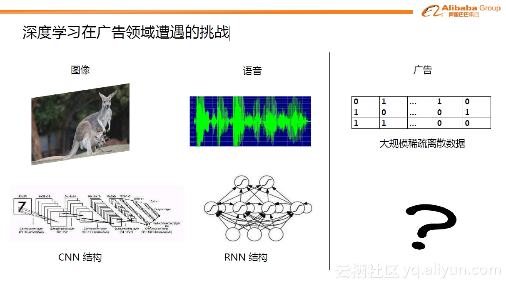
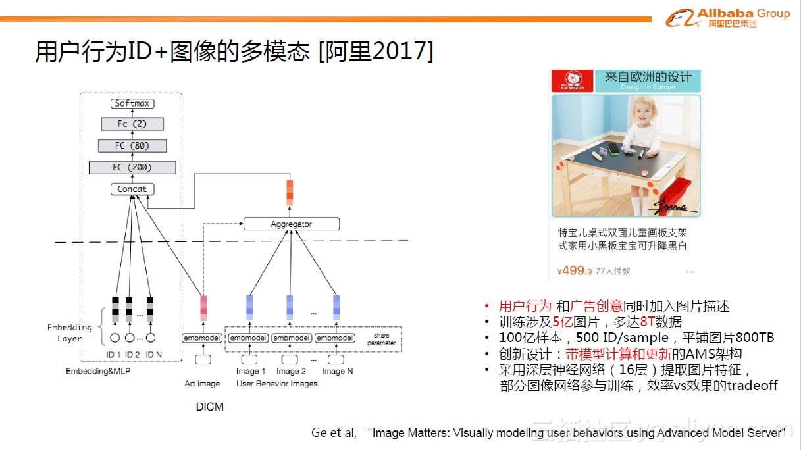
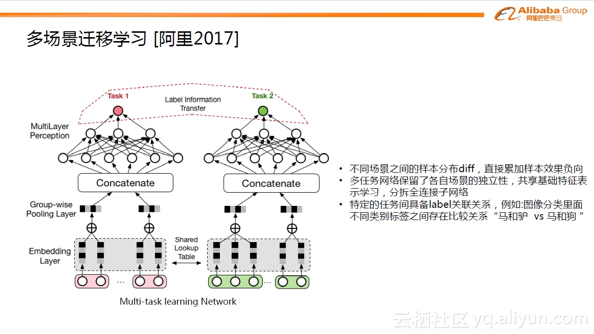
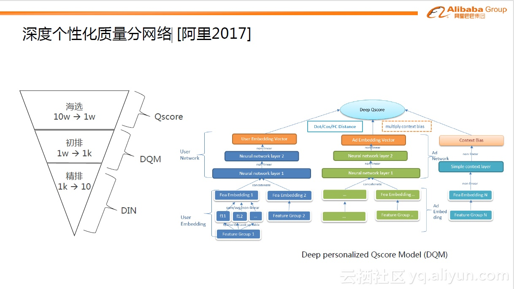

# 基于深度学习的CTR预估算法演化

## 基于深度学习的CTR预估

传统的图像领域或NLP领域内，深度学习已经取得非常多的成果，在大多的问题上成为了state-of-the-art的方法。如图中显示，不同的领域有不同的适用结构。如图像领域内的CNN结构、语音的RNN结构。那么回到广告领域内，究竟什么结构是合适的？广告预估问题有很强的特点，它的特征极其的大规模和稀疏。典型的数量级从百万级，千万级到数亿级都有，而且大都是0或1这类没有直接意义的数据。这个问题一度成为广告预估问题引入深入学习的关键点。

## 模型演化与探索方向

如果说大规模浅层机器学习时代的特征工程\(feature engineering, FE\)是经验驱动，那么大规模深度学习时代的模型工程\(model engineering, ME\)则是数据驱动，这是一次飞跃。当然ME时代不代表不关注特征，大家熟悉的FE依然可以进行，WDL式模型本来就有着调和feature派和model派的潜台词\(听过不同渠道的朋友类似表述，G家的同学可以证实下\)不过我要强调的是，传统FE大都是在帮助模型人工预设一些特征交叉关系先验，ME时代特征有更重要的迭代方式：给模型喂更多的、以前浅层模型难以端到端建模的signal\(下一节细说\)，DL model自带复杂模式学习的能力。

说到这，先交代下GwEN/WDL端到端deep CTR model成功后业界的情况：很多技术团队奉WDL为宝典，毕竟G背书的威力非常大。随后沿着“把特征工程的经验搬上DL模型”这个视角相继出了多个工作，如PNN/DeepFM/DCN/xDeepFM等。这些模型可以总结为一脉相承的思路：用人工构造的代数式先验来帮助模型建立对某种认知模式的预设，如LR模型时代对原始离散特征的交叉组合\(笛卡尔乘积\)，今天的DL时代演变为在embedding后的投影空间用內积、外积甚至多项式乘积等方式组合。理论上这比MLP直接学习特征的任意组合关系是有效的——"No Free Lunch"定理。但我经常看到业界有团队把这些模型逐个试一遍然后报告说难有明显收益，本质是没有真正理解这些模型的作用点。

16年底的时候，在第一代GwEN模型研发成功后我们启动了另一条模型创新的道路。业界绝大部分技术团队都已跨入了个性化时代，尤其在以推荐为主的信息获取方式逐渐超越了以搜索为主的信息获取方式时更是明显，因此在互联网尺度数据上对用户的个性化行为偏好进行研究、建模、预测，变成了这个时期建模技术的主旋律之一。具体来说，我们关注的问题是：定向广告/推荐及个性化行为丰富的搜索场景中，共性的建模挑战都是互联网尺度个性化用户行为理解，那么适合这种数据的网络结构单元是什么？图像/语音领域有CNN/RNN等基础单元，这种蕴含着高度非线性的大规模离散用户行为数据上该设计什么样的网络结构？显然特征工程式的人工代数先验是无法给出满意的解答的，这种先验太底层太低效。这个问题我们还没有彻底的认知，探索还在继续进行中，但至少在这条路上我们目前已经给出了两个阶段性成果，即上文提到的DIN和DIEN。

DIN/DIEN都是围绕着用户兴趣建模进行的探索，切入点是从我们在阿里电商场景观察到的数据特点并针对性地进行了网络结构设计，这是比人工代数先验更高阶的学习范式：DIN捕捉了用户兴趣的多样性以及与预测目标的局部相关性；DIEN进一步强化了兴趣的演化性以及兴趣在不同域之间的投影关系。DIN/DIEN是我们团队生产使用的两代主力模型，至今依然服务着很大一部分流量。

模型工程还有另外一个重要延伸，我称之为”超越单体模型”的建模思路，这里统一来介绍下。事实上前面关于模型工程的描述里面已经提到，因为DL模型强大的刻画能力，我们可以真正端到端地引入很多在大规模浅层模型时代很难引入的信号，比如淘宝用户每一个行为对应的商品原图/详情介绍等。

上图给出了阿里团队建模算法的整体视图。主模型结构在上一节已经介绍，与其正交的是一个全新的建模套路：跳出上一时代固化的建模信号域，开辟新的赛道——引入多模态/多目标/多场景/多模块信号，端到端地联合建模。注意这里面关键词依然是端到端。两篇工作ESMM和CrossMedia\(DICM\)。

假设固定网络结构，那么外部演化则考虑的是有没有一些更好的特征输入或样本的方式可以帮助模型学习的更好。外部演化具体可分为三个方向：多模态信号输入、多场景迁移学习、深度个性化质量分网络

### 多模态信号输入

首先介绍阿里在2017年发表的用户行为ID+图像的多模态学习模型的工作。用户在看到某个商品之后，映入眼帘的除了商品是什么的信息外，还有一系列的图片创意内容。比如下图是一款儿童画板商品，画板的大小、颜色甚至小宝宝可爱的模样等信息可能激发了用户点击的欲望。这类信息是无法单纯地通过画板这个ID完全表达的。所以这里面我们主要做的事情就是对于用户行为，除了商品ID之外，把对应的图像也放进来，统一表征用户的行为。

下图中左边部分描述了整个结构。与上面的DIN网络结构一致的是也使用了attention机制，引入Ad与User之间的相关性，不同的是网络结构将用户行为的ID特征与图片特征两种不同模态很自然的揉合在一起，解决了预测问题。这种做法在算法中非常直观，但事实上在背后真正建立模型时工程上面有很大的挑战。假设某个业务场景中有100亿的样本，每个样本有500个对应的用户行为ID特征，每个ID背后都有对应的图片。从图片视角来看，图片训练集有5亿张，多达8T数据，如果将图片训练装配到样本中平铺开来会接近800TB的数据。就算存储在SSD（2TB）磁盘上，也需要400台机器存储，何况要考虑更复杂的网络操作、图片加载到内存进行计算的巨大开销等等。为此，阿里研发设计了一种更高阶的AMS深度学习训练架构，AMS比传统的Parameter Server\(PS\)架构更高阶，具体细节可参见论文Ge et al, “Image Matters: Visually modeling user behaviors using Advanced Model Server” 。

### 多场景迁移学习

对于模型而言，如果有更多的数据进行模型训练，效果一般都能得到提高。在手机淘宝端，我们有很多不同场景的广告位，如首页焦点图，导购场景等等。每个场景蕴含了用户的不同兴趣的表达。将不同场景直接进行合并用来训练模型，结果不是很乐观。因为不同场景之间的样本分布存在diff，直接累加样本会导致效果负向。

随着深度学习发展，发现用Multi-task learning\(MTL\)的方式可以很漂亮的解决这个问题。如上图中左边的例子，分为两个task，即分为两个子网络，对于底层的难以学习的Embedding层（或称为特征稀疏表达层）做了表示学习的共享（Shared Lookup Table），这种共享有助于大样本的子任务帮助小样本的子任务，使得底层的表达学习更加充分。对于上层的子网络，不同的task是分拆为不同的子网络，这样每个子网络可以各自去拟合自己task对应的概念分布。当然，在一些更复杂的问题中，需要进一步考虑不同task之间存在的关系，这种关系也可以帮助task达到更好的预测效果，这里叫做Label Information Transfer。MTL给跨场景迁移应用打开了一扇新的大门，可以充分的挖掘不同场景之间的独立性和关联性，从而帮助每个场景达到更好的效果。

### 深度个性化质量分网络

当用户在访问手机淘宝时，一瞬间，系统会有数千万的候选广告可以展现给用户，那具体展现哪些广告？下图中有简单的筛选过程。最开始通过一层匹配算法，圈出10万量级广告。这些广告需要在几十毫秒内展现给用户，如果全部进行复杂的模型打分，计算量是无法想象的，所以一般是分阶段进行：第一步利用简单的质量分数进行海选（Qscore是对每个Ad点击率的简单度量）。第二步利用DQM模型进行初排，这是一个从1万到1千的筛选过程。最后，用最复杂精细的模型，如DIN ，从1千中获取10个非常精准的广告。

在第二步中，因为需要在几个毫秒内完成近万广告的打分过程，所以这个模型结构不能过于复杂。DQM模型类似与DSSM模型，分成不同域，如用户域，广告域以及场景域。将这些域表达成向量形式，最后的输出是通过向量间的简单操作，如内积操作，生成分数。相比传统的静态质量分Qscore模型，DQM引入了个性化，所以比Qscore好很多。

## Source









