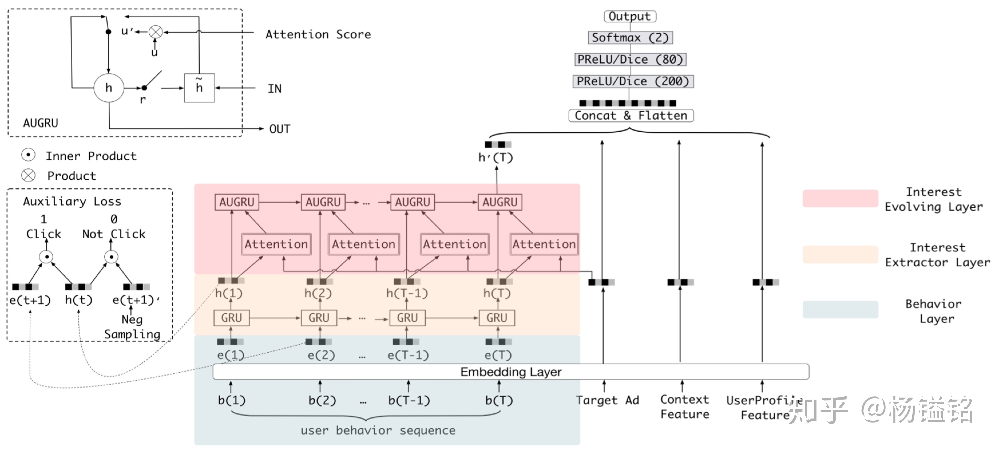
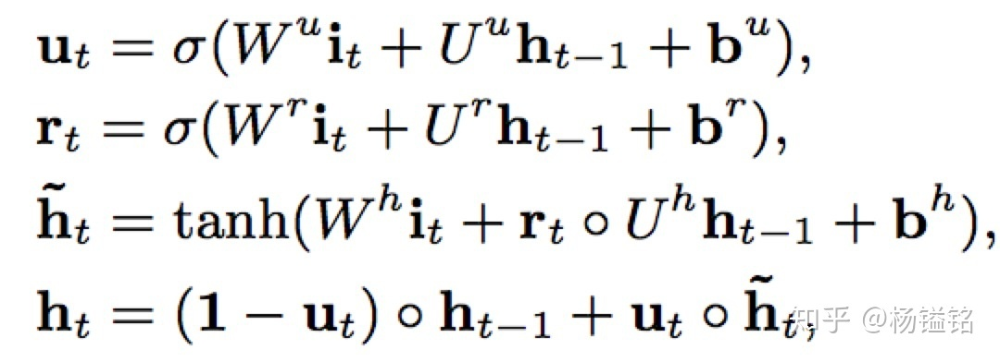
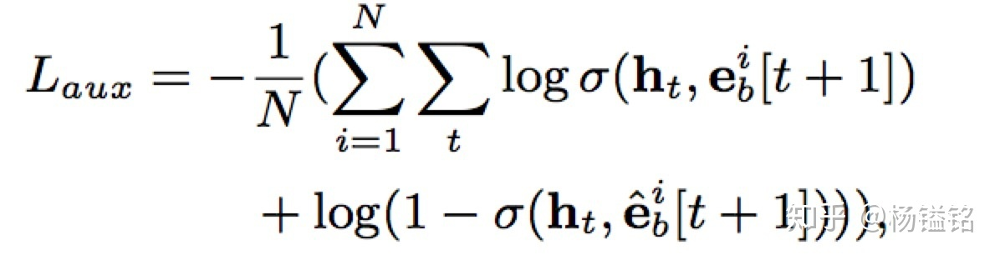
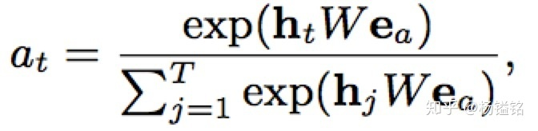

# DIEN

Deep Interest Evolution Network\(DIEN\)是深度兴趣网络DIN的升级版，链接为[\[1809.03672v1\] Deep Interest Evolution Network for Click-Through Rate Prediction](http://link.zhihu.com/?target=https%3A//arxiv.org/abs/1809.03672v1)，具体实现地址为[mouna99/dien](http://link.zhihu.com/?target=https%3A//github.com/mouna99/dien)。文章中的辅助损失的设计和我们实际业务中采用的做法很相似，文章最后会提到。

## 模型动机

在推荐场景，用户无需输入搜索关键词来表达意图，这种情况下捕捉用户兴趣并考虑兴趣的动态变化将是提升模型效果的关键。以Wide&Deep为代表的深度模型更多的是考虑不同field特征之间的相互作用，未关注用户兴趣。DIN则考虑了用户兴趣，提出用户兴趣是多样的，使用注意力机制来捕捉和target item的相对兴趣，将这种自适应的兴趣表示用于模型预估。但是大多该类模型将用户的行为直接看做兴趣，而用户的潜在兴趣往往很难通过行为来完全表示。因此需要挖掘行为背后的用户真实兴趣，并考虑用户兴趣的动态变化。基于这些考虑作者提出了Deep Interest Evolution Network\(DIEN\)模型。

## 模型总体结构

下图清晰地展示了模型的框架图。首先将所有特征转换成对应的embedding，特征除了用户行为模块，还有Target Ad、Context和User Profile特征等。用户行为建模（图中带颜色的部分）主要包含两个核心模块：Interest Extractor Layer和Interest Evolving Layer，也是文章重点。后续跟DIN类似，就是把所有特征concat起来送入全连接进行预测。损失是常见的交叉熵损失，这里记作 $$L_{\text{target}}$$ 。下面先简单介绍兴趣建模的核心模块的作用，再详细介绍如何实现。

### Interest Extractor层

合适的兴趣表示是兴趣演化模型的基础。在Interest Extractor层，模型使用GRU来对用户行为之间的依赖进行建模。GRU的输入是用户按时间排序的行为序列，也就是行为对应的商品。

但是作者指出GRU只能学习行为之间的依赖，并不能很好反映用户兴趣。 $$L_{\text{target}}$$ 只包含了最终兴趣的监督信息（因为最终兴趣导致了点击行为），而中间的历史状态 $$\textbf h_t(t<T)$$ 并不能得到监督信息来指导学习。我们知道兴趣可能会导致产生多个连续行为。所以模型引入辅助loss。具体来说就是用行为 $$\textbf b_{t+1}$$ 来知道 $$\textbf h_t$$ 的学习，正样本就是真实的下一个item，负样本就是从item set中随机抽取的item。

辅助loss的引入有多个好处：1、正如作者强调的，辅助loss可以帮助GRU的隐状态更好地表示用户兴趣。2、RNN在长序列建模场景下梯度传播可能并不能很好的影响到序列开始部分，如果在序列的每个部分都引入一个辅助的监督信号，则可一定程度降低优化难度。3、辅助loss可以给embedding层的学习带来更多语义信息，学习到item对应的更好的embedding。

### **Interest Evolving层**

随着外部环境和内部认知的变化，用户兴趣也不断变化。用户对不同商品的点击行为受不同兴趣的影响。Interest Evolving层对与target item相关的兴趣演化轨迹进行建模。作者提出了带注意力更新门的GRU结果也就是AUGRU。通过使用兴趣状态和target item计算得到的相关性，AUGRU增强相关兴趣的影响，同时减弱不相关兴趣的影响。

##  **模型核心模块详解**

###  **Interest Extractor层**

电商网站用户的行为数据一般都很丰富。对于行为之间的依赖进行建模，作者使用GRU结果（权衡效果和性能）。GRU的计算方式如下：

其中 $$\sigma$$ 表示sigmoid函数， $$\circ$$ 表示element-wise product， $$i_t$$ 是GRU的输入，代表用户的第 $$t$$ 个行为的embedding向量， $$h_t$$ 则是GRU的隐状态。

接下来介绍辅助损失 $$L_{\text{aux}}$$ 。假设有 $$N$$ 对行为embedding序列 $$\{e_b^i,\hat{x}_b^i\},i\in 1,2,\dots,N$$ ，其中 $$e_b^i$$ 表示点击行为的序列， $$\hat{x}_b^i$$ 表示负样本序列。

最终损失函数为 $$L=L_{\text{target}}+\alpha*L_{\text{aux}}$$ ，其中 $$\alpha$$ 是平衡最终预测和兴趣表示的超参数。

###  **Interest Evolving层**

这部分结合了注意力机制中的局部激活能力和GRU的序列学习能力来实现建模兴趣演化的目标。该层GRU的输入就是上一层GRU的输出， ****$$i'_t = h_t$$ ，输出是 $$h'_t$$ ，最后一个状态 $$h'_T$$ 是最终的输出，和其他各类特征concat一起送给全连接。

attention部分系数计算方式如下：其中 $$e_a$$ 是advertisement的不同field特征的concat。

但是如何将attention机制加到GRU中呢？文中提出了三个方法：

1、GRU with attentional input（AIGRU）: 较为简单，直接将attention系数和输入相乘：

                                                                            $$i'_t = h_t*a_t$$ 

2、Attention based GRU（AGRU）：采用问答领域文章提到的一种方法，直接将attention系数来替换GRU的update gate，直接对隐状态进行更新：

                                                         $$h'_t = (1-a_t)*h'_{t-1}+a_t*\tilde{h}'_t$$ 

3、GRU with attentional update gate（AUGRU）：虽然AGRU使用attention系数来直接控制隐状态的更新，但是它使用了一个标量\( $$a_t$$ \)来代替了update gate\( $$\textbf u_t$$ \)，也就是忽略了不同维度重要的区别。作者提出了增加了attentional update gate的GRU结构实现attention机制和GRU的无缝结合：

                                                                            $$\tilde{u}'_t = a_t*u'_t$$ 

                                                          $$h'_t=(1-\tilde{u}'_t)\circ h'_{t-1}+\tilde{u}'_t\circ\tilde{h}'_t$$ 

## **对实际业务的启示**

### 辅助loss的设计

这点类似于引入多目标，在一些文章中也经常看到。今年滴滴在kdd2018上发表的一篇关于到达时间预估的论文也是类似的思路，不仅使用预测整个轨迹序列的时间预测损失，还引入每两个轨迹点之间的时间预测损失。

前段时间我在我们的实际业务场景中设计和引入了细粒度的辅助损失，指标得到了一定提升。关于辅助损失的好处，这里我再补充一点。增加辅助loss带来效果提升的同时，只增加了训练的成本，并未增加线上inference的时间，所以相比新增特征或者使用更复杂模型对于线上压力也更友好。

### 线上压力

深度模型的工程化是件很有意思也很有挑战的事情，特别是在高并发场景。文中提到线上在峰值时压力很大，为了保持低延迟和高吞吐，对GRU的实现加入了并行化并且做了模型压缩的处理。工业界中积累不够的组应该没办法很好支持到这点。

## Source











