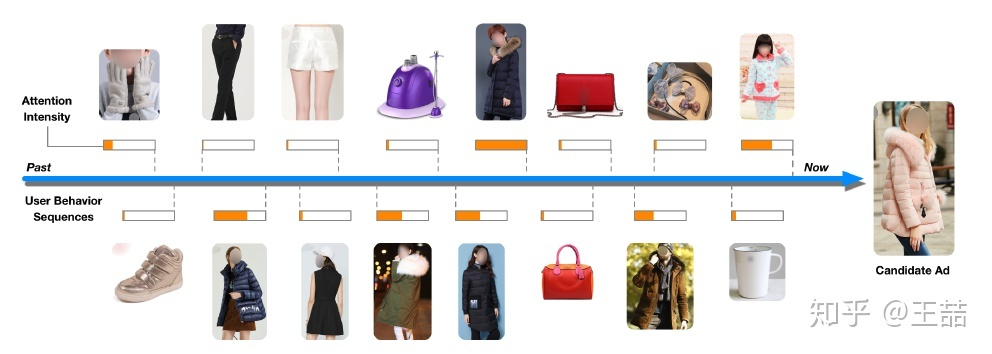
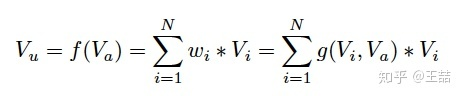
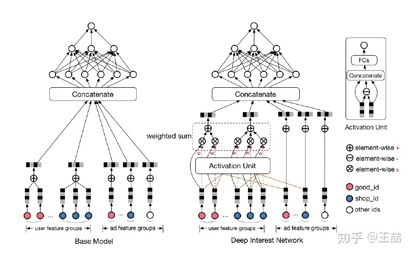

# DIN

Deep Interest Network\(DIN\)模型是阿里在2017年发表的用户兴趣分布网络。与上面的FNN,PNN等引入低阶代数范式不同，DIN的核心是基于数据的内在特点，引入了更高阶的学习范式。互联网上用户兴趣是多种多样的，从数学的角度来看，用户的兴趣在兴趣空间是一个多峰分布。在预测多兴趣的用户点击某个商品的概率时，其实用户的很多兴趣跟候选商品是无关的，也就是说我们只需要考虑用户跟商品相关的局部兴趣。所以DIN网络结构引入了兴趣局部激活单元，它受attention机制启发，从用户大量的行为集合中捕获到与candidate商品相关的行为子簇，对于用户行为子簇，通过Embedding操作，做weighted sum便可很好的预估出用户与candidate相关的兴趣度。传统的GwEN、WDL、FNN等模型在刻画用户兴趣分布时，会简单的将用户兴趣特征组做sum或average的pooling操作，这会把用户真正相关的兴趣淹没在pooling过程中。DIN模型的具体细节可以参考论文：[Zhou et al, “Deep Interest Network for click-through rate prediction”](https://arxiv.org/pdf/1706.06978.pdf) 。

阿里的深度兴趣网络（Deep Interest Network）这篇文章好主要有三个原因：

* 一是因为这篇文章的工程性很强。工程性很强的文章首先是便于实现的，其次你可以从字里行间看到很多实践出真知的影子，比如DIN这篇文章中GAUC这样的metric的改进，以及Dice这样的激活函数的创新，都是对经典知识在实践中改进的例子。
* 第二个原因是因为这篇文章对用户行为的观察非常精准。有句话说做推荐其实就是“揣摩人心”，你把用户的行为和习惯揣摩好了，才能够以此出发，从技术上映射用户的习惯。DIN这篇文章有效的利用了用户兴趣多样性以及当前候选商品仅与用户一部分兴趣有关这一特点，引入注意力机制，这是非常精准的动机。
* 第三个原因是模型的微创新，从低维到高维是创新，从离散到连续是创新，从单一到融合也是创新，这篇文章把NLP大行其道的注意力机制引入推荐领域，当然是典型并且有效的创新手段，也是所有算法工程师应该学习的地方。

用户场景很简单，就是在一个电商网站或APP中给用户推荐广告，当然对于阿里妈妈来说，广告也是商品，所以这篇文章的广告场景其实也是一个经典的推荐场景。

好，既然要推荐，我们当然需要利用用户的历史数据了，对于一个电商来说，历史数据当然就是点击，添加购物车，下单这些行为了。论文中给了一位用户的行为序列。

显然是一个女生的行为历史啦，从最左边的手套，鞋子到右边的杯子，睡衣。要被推荐的候选商品是一件女式大衣。我们应该如何计算这件大衣的CTR呢？

如果按照之前的做法，我们会一碗水端平的考虑所有行为记录的影响，对应到模型中就是我们会用一个average pooling层把用户交互过的所有商品的embedding vector平均一下形成这个用户的user vector，机灵一点的工程师最多加一个time decay，让最近的行为产生的影响大一些，那就是在做average pooling的时候按时间调整一下权重。

但是我们仔细想一想我们自己的购买过程，其实每个用户的兴趣都是多样的，女生喜欢买衣服包包，也喜欢化妆品，甚至还为自己男朋友挑选过球衣球鞋，那么你在买大衣的时候，真的要把给男朋友买球鞋的偏好考虑进来么？具体到本文的例子中，在预测大衣的CTR这件事情上，用户浏览过杯子，跟用户浏览过另一件大衣这两个行为的重要程度是一样的吗？

这事不用问算法工程师，你就回家问问你老妈估计答案都是一定的，肯定是浏览过另一件大衣这件事的参考价值高啊。好了，就是这件你老妈都知道的事情，让阿里妈妈的算法工程师们加上了attention机制。

注意力机制顾名思义，就是模型在预测的时候，对用户不同行为的注意力是不一样的，“相关”的行为历史看重一些，“不相关”的历史甚至可以忽略。那么这样的思想反应到模型中也是直观的。

上式中， $$V_u$$ 是用户的embedding向量， $$V_a$$ 是候选广告商品的embedding向量， $$V_i$$ 是用户 $$u$$ 的第 $$i$$ 次行为的embedding向量，因为这里用户的行为就是浏览商品或店铺，所以行为的embedding的向量就是那次浏览的商品或店铺的embedding向量。

因为加入了注意力机制， $$V_u$$ 从过去 $$V_i$$ 的加和变成了 $$V_i$$ 的加权和， $$V_i$$ 的权重 $$w_i$$ 就由 $$V_i$$ 与 $$V_a$$ 的关系决定，也就是上式中的 $$g(V_i,V_a)$$ ，这个 $$g(V_i,V_a)$$ 的加入就是本文的重点所在。

那么 $$g(V_i,V_a)$$ 这个函数到底采用什么比较好呢？看完下面的架构图自然就清楚了。

相比原来这个标准的深度推荐网络（Base model），DIN在生成用户embedding vector的时候加入了一个activation unit层，这一层产生了每个用户行为 $$V_i$$ 的权重，下面我们仔细看一下这个权重是怎么生成的，也就是 $$g(V_i,V_a)$$ 是如何定义的。

传统的Attention机制中，给定两个item embedding，比如 $$u$$ 和 $$v$$ ，通常是直接做点积 $$u\cdot v$$ 或者 $$uW v$$ ，其中 $$W$$ 是一个 $$|u|\times|v|$$ 的权重矩阵，但这篇paper中阿里显然做了更进一步的改进，着重看上图右上角的activation unit，首先是把 $$u$$ 和 $$v$$以及 $$u$$$$v$$的element wise差值向量合并起来作为输入，然后喂给全连接层，最后得出权重，这样的方法显然损失的信息更少。但如果你自己想方便的引入attention机制的话，不妨先从点积的方法做起尝试一下，因为这样连训练都不用训练。

再稍微留意一下这个架构图中的红线，你会发现每个ad会有 good\_id, shop\_id 两层属性，shop\_id只跟用户历史中的shop\_id序列发生作用，good\_id只跟用户的good\_id序列发生作用，这样做的原因也是显而易见的。

好了，到这里为止我们基本讲完了这篇文章的重点部分，如果说上面的部分是文70%的价值所在，那么余下30%应该还有这么几点：

* 用GAUC这个离线metric替代AUC
* 用Dice方法替代经典的PReLU激活函数
* 介绍一种Adaptive的正则化方法
* 介绍阿里的X-Deep Learning深度学习平台

## Source











