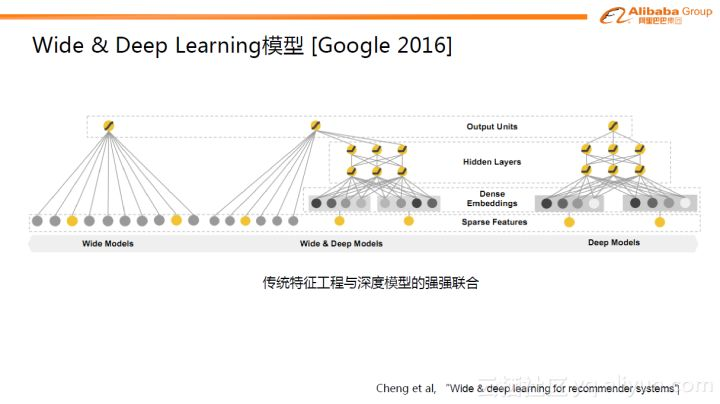

# Wide&Deep Learning

与阿里同时期，Google推出了Wide & Deep Learning（WDL）模型，一个非常出名的模型。详细内容可以从论文中查询Cheng et al, “Wide & deep learning for recommender systems” 。WDL模型也非常简单，但巧妙的将传统的特征工程与深度模型进行了强强联合。Wide部分是指人工先验的交叉特征，通过LR模型的形式做了直接的预测。右边是Deep部分，与GwEN网络结构一样，属于分组的学习方式。WDL相当于LR模型与GwEN结合训练的网络结构。

## Source









