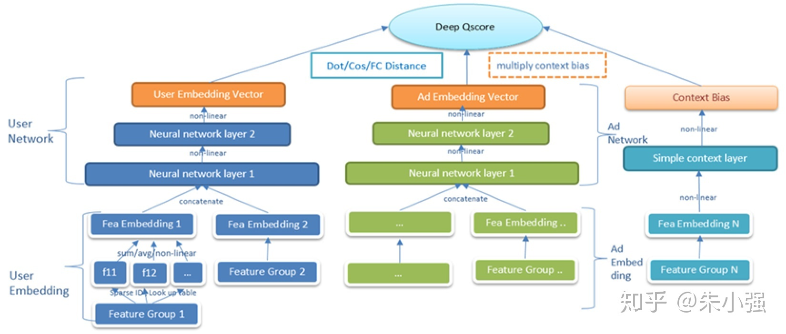
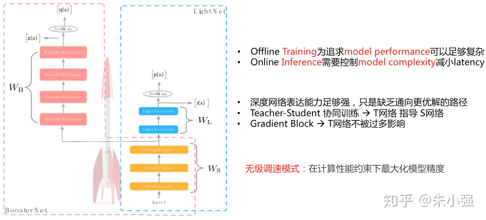

# 嵌入工程系统的算法设计

实际的工业系统，除了上面抽象出来的CTR预估问题，还有很多独立的话题。介绍下我们在既有系统架构中算法层面的一些实践。以广告系统为例，从算法视角来看至少包括以下环节：匹配&gt;召回&gt;海选&gt;粗排&gt;精排&gt;策略调控，这些算法散落在各个工程模块中。现在让我们保持聚焦在CTR相关任务，看看在系统中不同的阶段都可以有哪些新的变化。几个典型的系统瓶颈：海选/粗排所在的检索引擎，精排所在的在线预估引擎，以及这些算法离线所依赖的模型生产链路。在DL时代以前，技术已经迭代形成了一些既有的共识，如检索引擎性能关键不宜涉及复杂的模型计算。但是跨入DL时代后，既有的共识可以被打破、新的共识逐渐形成。

## 海选/粗排的复杂模型化升级

在我们原有的系统中，检索过程中涉及到的排序是用一个静态的、非个性化的质量分来完成，可以简单理解为广告粒度的一个统计分数，显然跟精排里面我们采用的各种各样复杂精细的模型技术\(前几节的内容\)相比它很粗糙。据我了解业界也有团队用了一些简化版的模型，如低配版LR模型来完成这个过程。背后的核心问题是检索时候选集太大，计算必须精简否则延迟太长。图5给出了我们升级后的深度个性化质量分模型，约束最终的输出是最简单的向量內积。这种设计既迎合了检索引擎的性能约束，同时实测跟不受限DL模型\(如DIN\)在离线auc指标上差距不太显著，但比静态模型提升巨大。

这里有两个延伸: 1\) 海选/粗排DQM模型只帮助缩减候选集规模，不作为最终广告的排序分，因此它的精度可以不像精排模型那样追求极致，相应地多考虑系统性能和数据循环扰动；2\) DQM模型对于检索匹配召回等模块同样适用，例如现在很多团队已经普通接受的向量化召回架构，跟DQM在模型架构上完全吻合。只不过作用在召回模块，其建模信号和训练样本有很大的不同，更多地要考虑用户兴趣泛化。提到向量化高效计算，F/M两家都开源了优秀的架构，推荐大家参阅：[faiss](https://github.com/facebookresearch/faiss) 和 [SPTAG](https://github.com/Microsoft/SPTAG)

## 面向在线预估引擎的模型压缩

在LR/MLR时代在线预估引擎的计算相对简单、压力不大。但当复杂的DL模型层出不穷后，在线引擎的算力瓶颈凸显。为了缓解这个问题，我们在17年试水了一个工作：[轻量级模型压缩算法\(Rocket Training, AAAI'18\)](https://zhuanlan.zhihu.com/p/28625922)，形象地称之为无极调速模式。

DL模型的over-parameterization使得我们可以通过不同的优化方法寻找更好的解路径，Rocket只是一条，未来在这个方向上我们还会有更多的工作。但有可以肯定模型DL化带来的在线预估引擎的算力瓶颈是一个新常态，这个方向上会引起更大的关注并演化成新一代系统架构。

## 打破资源依赖的增量/实时化算法架构

DL模型的复杂化除了带来在线预估引擎的性能挑战外，对离线生产链路的资源挑战也急剧放大。容易理解的是全量模型的训练时间及占用机器规模肯定会逐步增加，同时模型的并行研发规模也会大增，即：”模型个数x模型时长x机器规模”全面膨胀。在这种情况下增量/实时模型训练架构就成为了胜负手。虽然业界很多时效性强的场景\(如信息流\)online模型的效果收益是巨大和关键的，但这里我不想过多地强调效果层面的收益，而更愿意从资源架构层面做探讨。虽然DL模型采用了sgd-based优化算法，直觉来看batch训练和incremental或online训练应该同构。然而ODL\(Online Deep Learning\)所存在的问题和挑战绝不止于此，且它跟LR时代的Online Learning有很多的差异性。目前同时完成了全面DL并进而ODL化的团队不太多。当然也有团队是从OL系统直接向ODL升级的，这个路径固然看似更快捷，但也许错过了DL模型盛宴的不少美妙菜肴——batch训练是纯模型探索的更优土壤。

