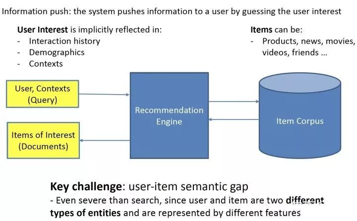
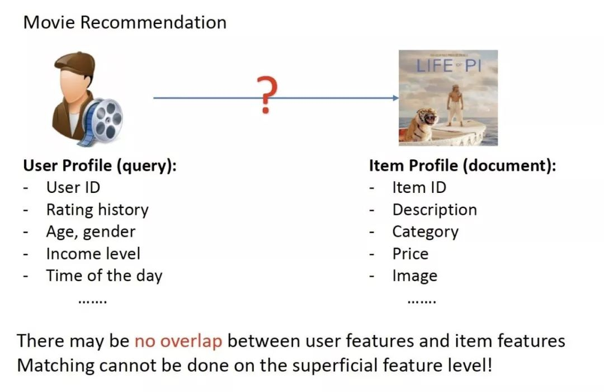

# 推荐系统

## 推荐系统概述

推荐系统是由系统来根据用户过去的行为、用户的属性（年龄、性别、职业等）、上下文等来猜测用户的兴趣，给用户推送物品（包括电商的宝贝、新闻、电影等）。推荐一般是非主动触发的，和搜索的主动触发不一样（搜索一般有主动提供的query）；也有小部分情况，用户有提供query：例如用户在电商里搜索一个商品后，结果页最底下推荐给用户的商品，这种情况算是有提供query。

直观写成公式，即 $$f(X_{\text{User Feature}},Y_{\text{Item Feature}})\to 0/1$$ 。通过用户特征信息和候选推荐品找到这样一个映射， $$0$$ 表示未点击或未购买等， $$1$$ 表示点击有浏览了或下单购买了。

推荐系统涉及到的两大实体：user和item往往是不同类型的东西，例如user是人，item是电商的宝贝，他们表面上的特征可能是没有任何的重叠的，这不同于搜索引擎里的query和doc都是文本：

正是由于user和item不同类型的东西，所以推荐里匹配可能比搜索里的更难。

## 传统匹配模型

###  **Collaborative Filtering Models**

###  **Generic Feature-based Models**

## **深度学习匹配模型**

###  **基于representation learning的方法**

####  **基于Collaborative Filtering的方法**

####  **基于Collaborative Filtering + Side Info的方法**

###  **基于matching function learning的方法**

###  **representation learning和matching function learning的融合**

## Source





