# 深度学习匹配模型

representation learning，这类方法是分别由NN，学习出user和item的embedding，然后由两者的embedding做简单的内积或cosine等，计算出他们的得分。

matching function learning，这类方法是不直接学习出user和item的embedding表示，而是由基础的匹配信号，由NN来融合基础的匹配信号，最终得到他们的匹配分。

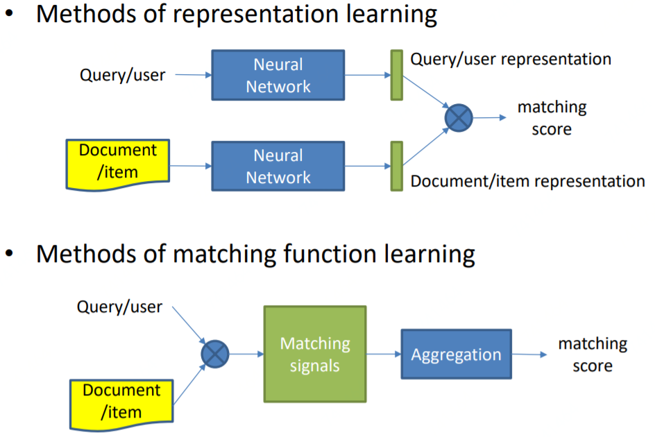

## **基于representation learning的方法**

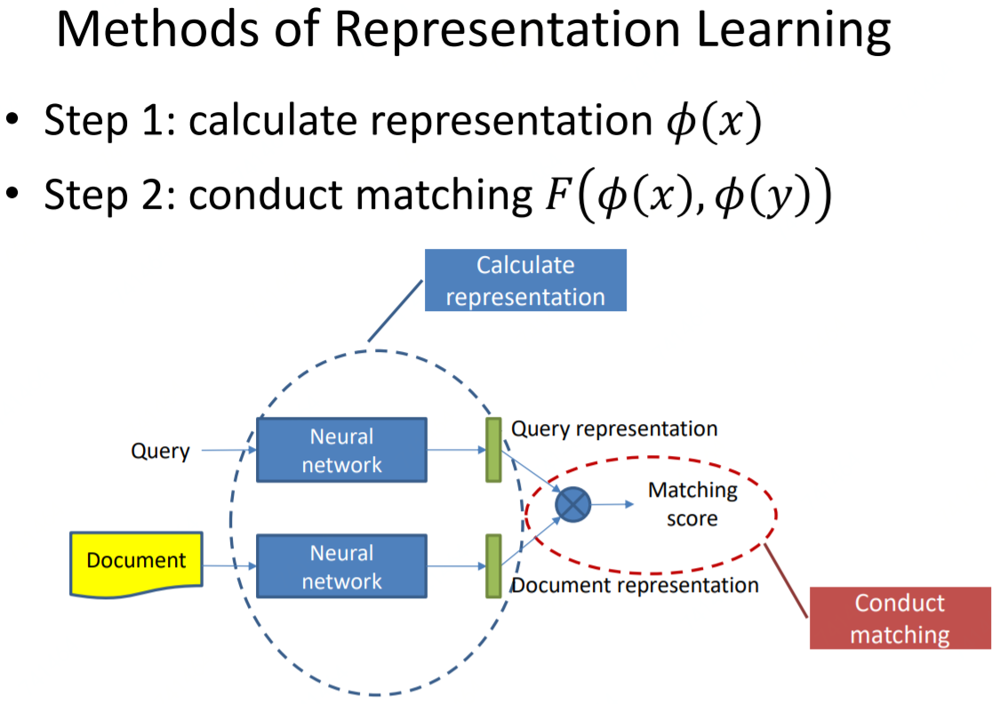

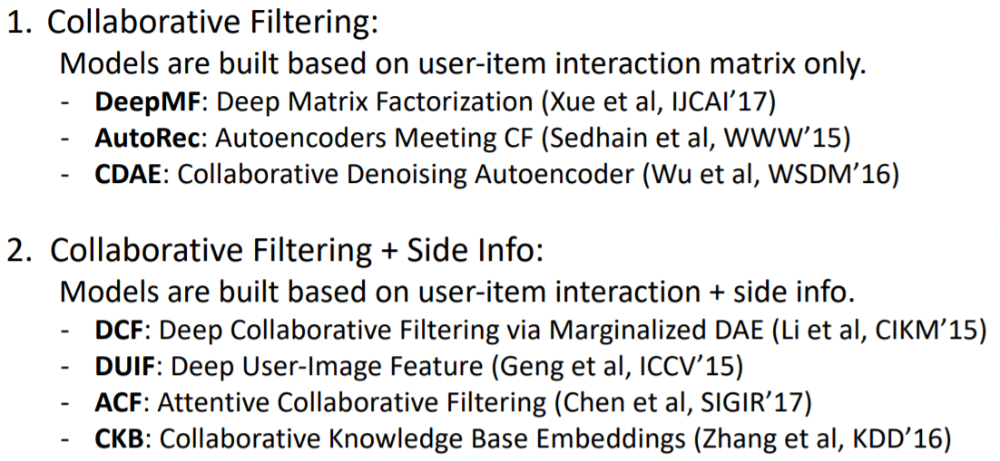

### **基于Collaborative Filtering的方法**

这类方法是仅仅建立在user-item的交互矩阵上。简单总结一下，基于Collaborative Filtering的做representation learning的特点：

* 用ID或者ID对应的历史行为作为user、item的profile
* 用历史行为的模型更具有表达能力，但训练起来代价也更大

而Auto-Encoder的方法可以等价为：

用MLP来进行representation learning（和MF不一样的是，是非线性的），然后用MF进行线性的match。

首先，简单复习一下MF，如果用神经网络的方式来解释MF，就是如下这样的：

输入只有userID和item\_ID，representation function就是简单的线性embedding层，就是取出id对应的embedding而已；然后matching function就是内积。

#### \*\*\*\*[**Deep Matrix Factorization\(Xue et al, IJCAI' 17\)**](https://pdfs.semanticscholar.org/35e7/4c47cf4b3a1db7c9bfe89966d1c7c0efadd0.pdf?_ga=2.148333367.182853621.1552882810-701334199.1540873247)\*\*\*\*

用user作用过的item的打分集合来表示用户，即multi-hot，例如\[0 1 0 0 4 0 0 0 5\]，然后再接几层MLP，来学习更深层次的user的embedding的学习。例如，假设item有100万个，可以这么设置layer：1000 \* 1000 -&gt;1000-&gt;500-&gt;250。

用对item作用过的用户的打分集合来表示item，即multi-hot，例如\[0 2 0 0 3 0 0 0 1\]，然后再接几层MLP，来学习更深层次的item的embedding的学习。例如，假设user有100万个，可以这么设置layer：1000 \* 1000 -&gt;1000-&gt;500-&gt;250。

得到最后的user和item的embedding后，用cosine计算他们的匹配分。这个模型的明显的一个缺点是，第一层全连接的参数非常大，例如上述我举的例子就是1000\*1000\*1000。

#### [AutoRec \(Sedhain et al, WWW’15\)](http://users.cecs.anu.edu.au/~u5098633/papers/www15.pdf)

这篇论文是根据auto-encoder来做的，auto-encoder是利用重建输入来学习特征表示的方法。auto-encoder的方法用来做推荐也分为user-based和item-based的，这里只介绍user-based。

先用user作用过的item来表示user，然后用auto-encoder来重建输入。然后隐层就可以用来表示user。然后输入层和输出层其实都是有V个节点（V是item集合的大小），那么每一个输出层的节点到隐层的K条边就可以用来表示item，那么user和item的向量表示都有了，就可以用内积来计算他们的相似度。值得注意的是，输入端到user的表示隐层之间，可以多接几个FC；另外，隐层可以用非线性函数，所以auto-encoder学习user的表示是非线性的。

#### [Collaborative Denoising Auto-Encoder\(Wu et al, WSDM’16\)](https://dl.acm.org/citation.cfm?id=2835837)

这篇论文和上述的auto-encoder的差异主要是输入端加入了userID，但是重建的输出层没有加user\_ID，这其实就是按照svd++的思路来的，比较巧妙，svd++的思想在很多地方可以用上：

### **基于Collaborative Filtering + Side Info的方法**

#### [Deep Collaborative Filtering via Marginalized DAE \(Li et al, CIKM’15\)](https://dl.acm.org/citation.cfm?id=2806527)

这个模型是分别单独用一个auto-encoder来学习user和item的向量表示（隐层），然后用内积表示他们的匹配分。

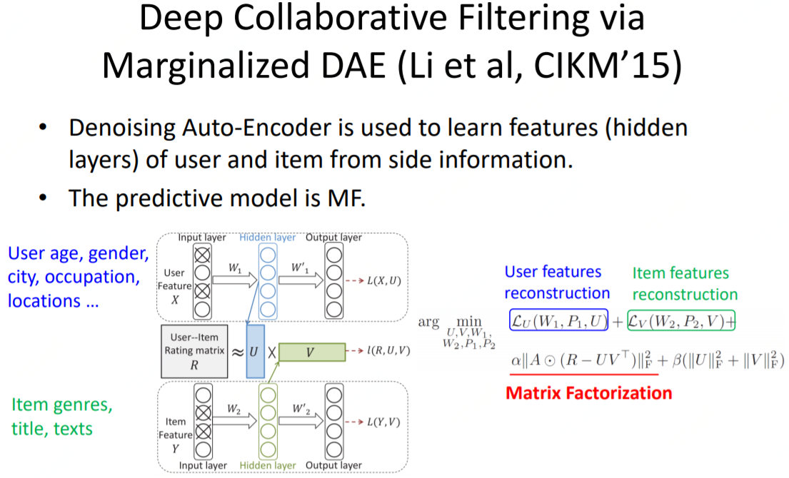

#### [DUIF: Deep User and Image Feature Learning \(Geng et al, ICCV’15\)](https://www.cv-foundation.org/openaccess/content_iccv_2015/papers/Geng_Learning_Image_and_ICCV_2015_paper.pdf)

这篇论文比较简单，就是用一个CNN来学习item的表示（图像的表示），然后用MF的方法（内积）来表示他们的匹配分：

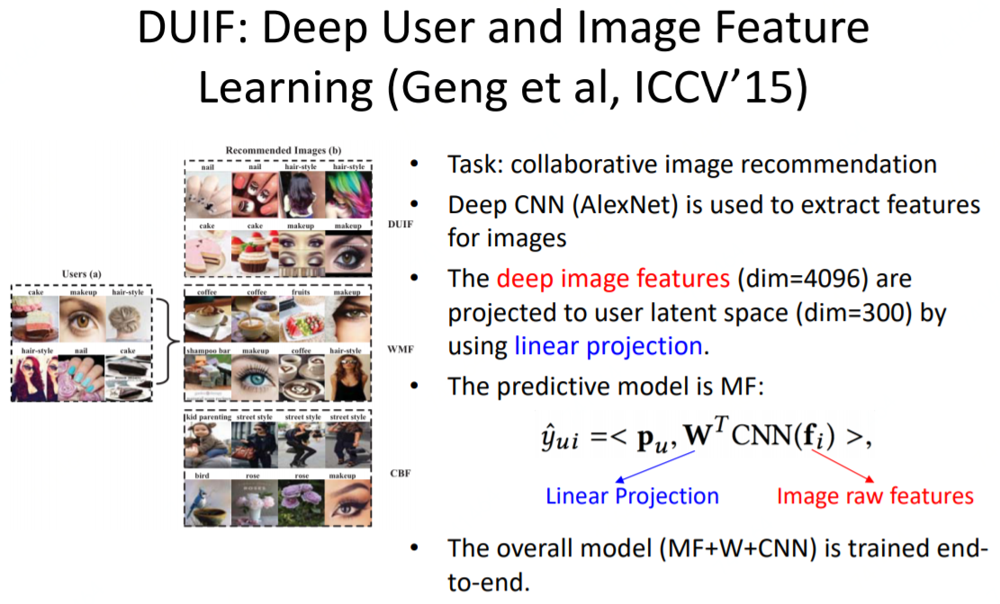

#### [ACF: Attentive Collaborative Filtering\(Chen et al, SIGIR’17\)](https://dl.acm.org/citation.cfm?id=3080797)

这篇论文主要是根据SVD++进行改进，使用两层的attention。输入包括两部分：1、user部分，user\_ID以及该user对应的作用过的item；2、item部分，item\_ID和item的特征。

Component-level attention：不同的components 对item的embedding表示贡献程度不一样，表示用户对不同feature的偏好程度；由item的不同部分的特征，组合出item的表示：

attention weight由下述式子做归一化后得到：

其中u表示用户的向量，x\[l\]\[m\]表示物品的第m部分的特征。

Item-level attention：用户历史作用过的item，对用户的表示的贡献也不一样，表示用户对不同item的偏好程度；attention weight的计算公式如下，其中u表示用户的向量，v表示基础的item向量，p表示辅助的item向量，x表示由上述的component-level的attention计算出来的item的特征的表示向量：

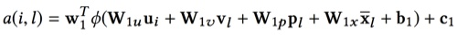

然后使用svd++的方式计算用户的方式，只是这里的item部分不是简单的加和，而是加权平均：

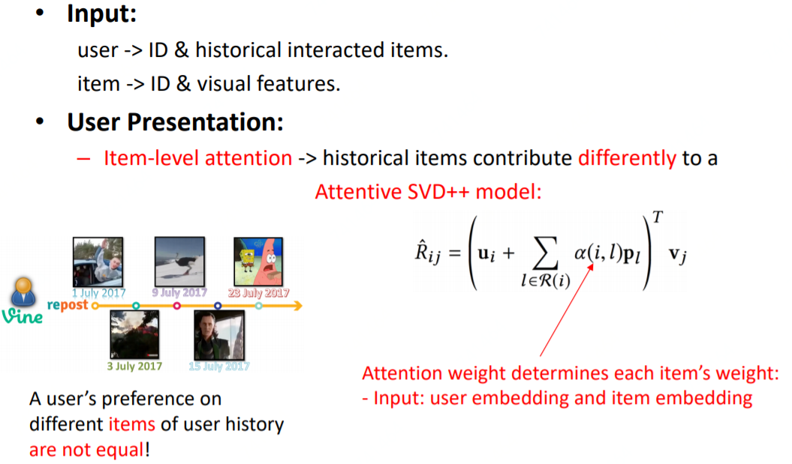

这个论文是采用pairwise ranking的方法进行学习的，整个模型的结构图如下：

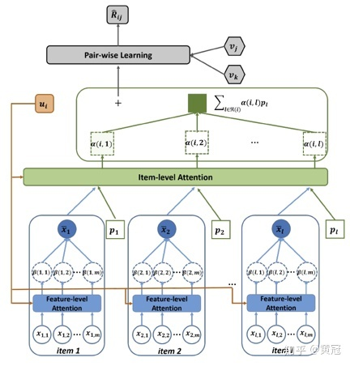

模型采用pairwise ranking的loss来学习：

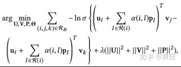

#### [CKE: Collaborative Knowledge Base Embedding \(Zhang et al, KDD’16\)](https://dl.acm.org/citation.cfm?id=2939673)

这篇论文比较简单，其实就是根据可以使用的side-info（文本、图像等），提取不同特征的表示：

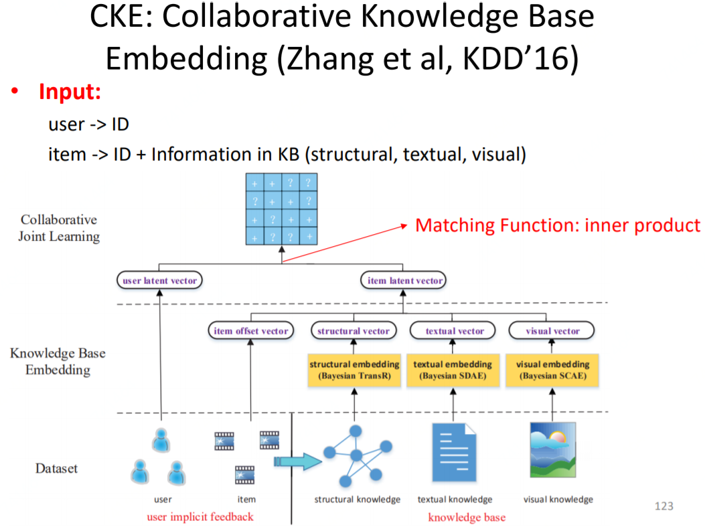

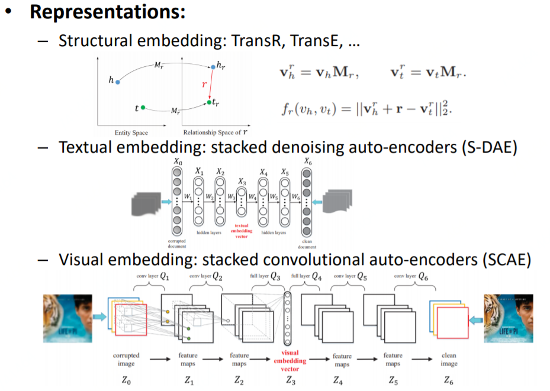

##  **基于matching function learning的方法**

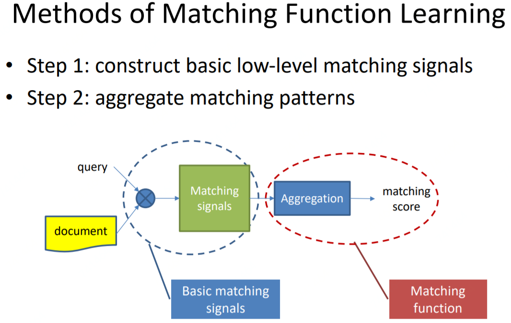

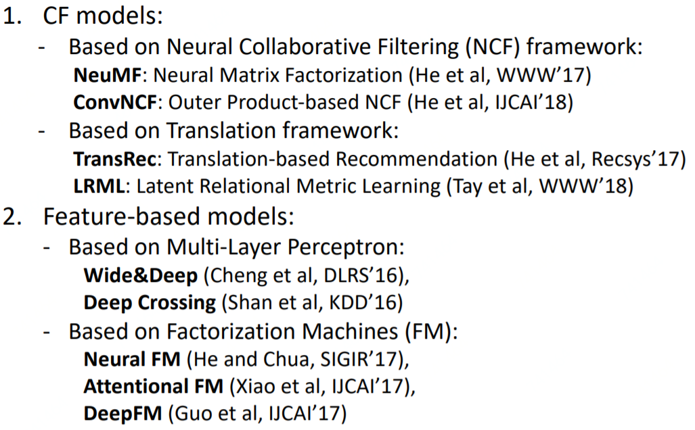

### **基于Collaborative Filtering的方法**

**Based on Neural Collaborative Filtering\(NCF\) framework**

#### [Neural Collaborative Filtering Framework \(He et al, WWW’17\)](https://www.comp.nus.edu.sg/~xiangnan/papers/ncf.pdf)

这篇论文是使用NN来学习match function的通用框架：

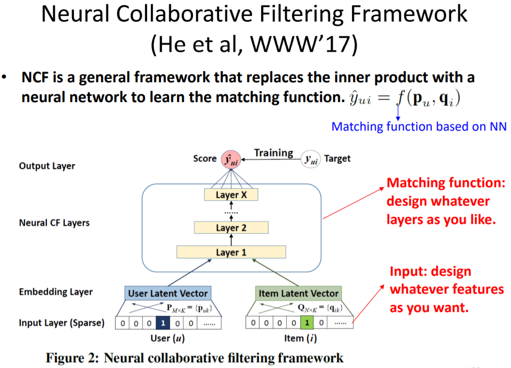

这篇论文的模型就是将user的embedding和item的embedding concat到一起，然后用几层FC来学习他们的匹配程度。

然而很不幸的是，MLP在抓取多阶信息的时候，表现并不好，MLP效果并没有比内积好。有一篇论文证明了，MLP在抓取多阶的信息的时候，表现并不好：

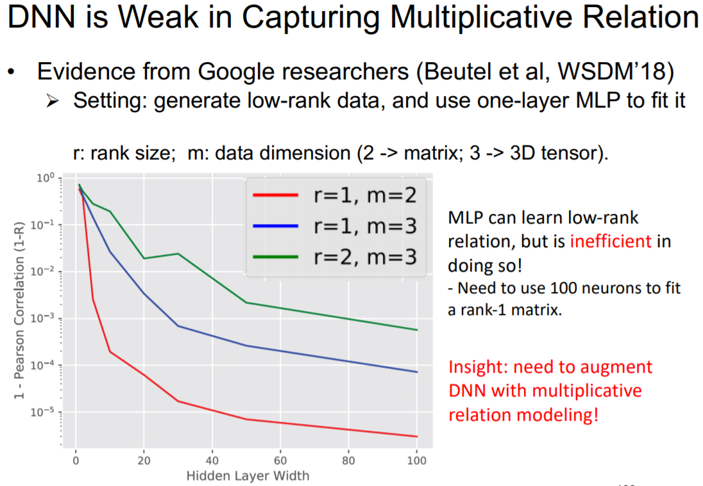

这篇论文要说的是，即使是二维的1阶的数据，也需要100个节点的一层FC才能比较好的拟合；而如果是2阶的数据，100个节点的一层FC拟合得非常差，所以MLP在抓取多阶信息上并不擅长。

#### [NeuMF: Neural Matrix Factorization \(He et al, WWW’17\)](http://papers.www2017.com.au.s3-website-ap-southeast-2.amazonaws.com/proceedings/p173.pdf)

这篇论文其实是MF和MLP的一个融合，MF适合抓取乘法关系，MLP在学习match function上更灵活：

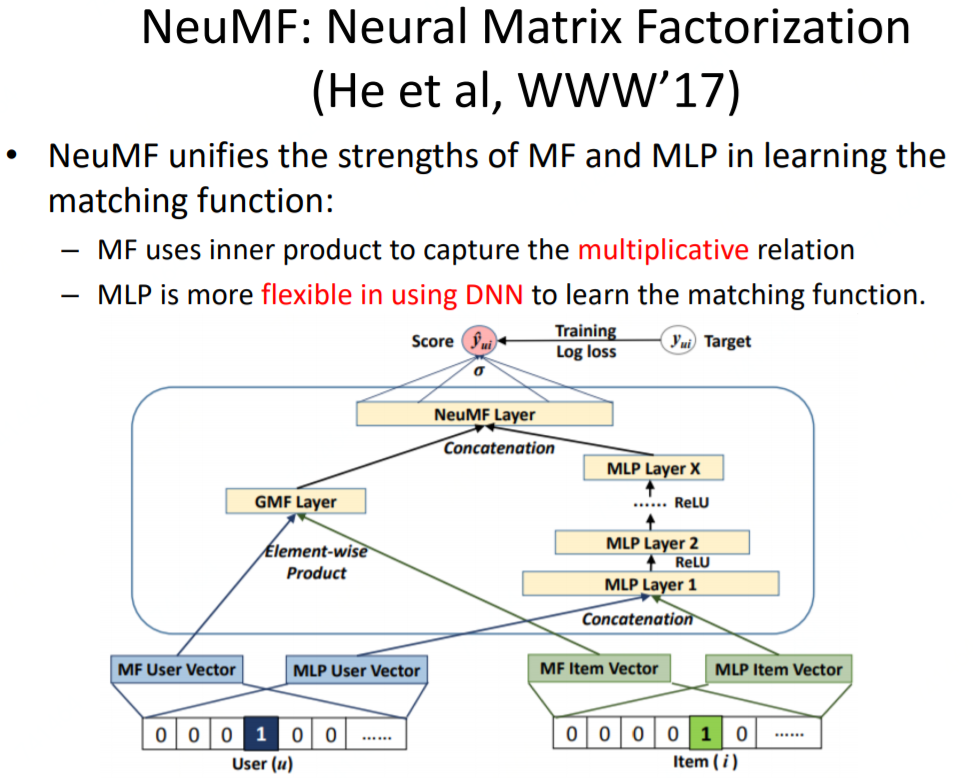

user和item分别用一个单独的向量做内积（element-wise product，没求和）得到一个向量v1；然后user和item分别另外用一个单独的向量，通过几层FC，融合出另外一个向量v2，然后v1和v2拼接\(concat\)到一起，再接一个或多个FC就可以得到他们的匹配分。

#### [ONCF: Outer-Product based NCF \(He et al, IJCAI’18\)](https://www.ijcai.org/proceedings/2018/0308.pdf)

上述的模型，user向量和item向量要不是element-wise product，要不是concat，这忽略了embedding的不同维度上的联系。一个直接的改进就是使用outer-product，也就是一个m维的向量和n维的向量相乘，得到一个m\*n的二维矩阵（即两个向量的每一个维度都两两相乘）:

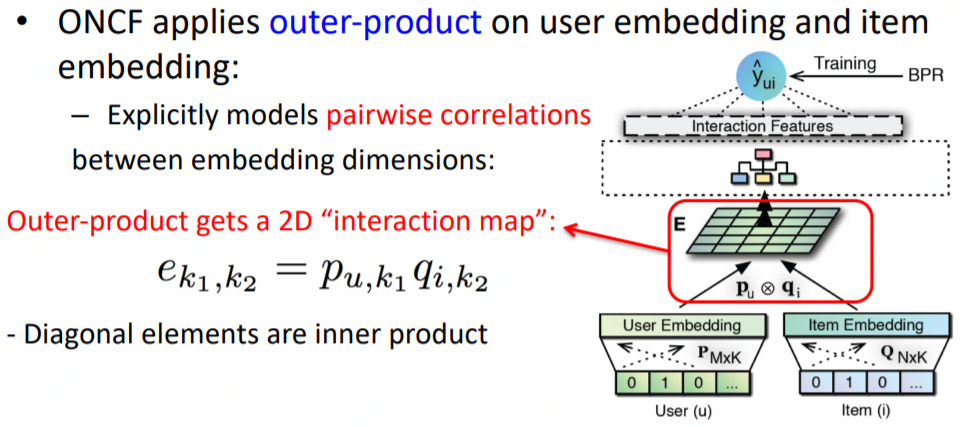

其中也包含了内积的结果。

然后就得到一个mn的矩阵，然后就可以接MLP学习他们的匹配分。但是由于m\*n比较大，所以这样子是内存消耗比较大的：

很自然的一个改进就是将全连接，改成局部全连接，这就是CNN了。

使用CNN来处理上述的outer-product的二维矩阵，可以起到大大节省内存的效果：

效果上，ConvNCF要比NeuMF和MLP都要好：

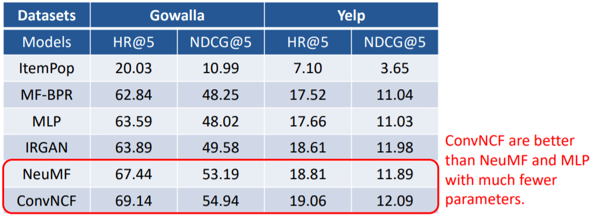

**Based on Translation framework**

MF-based的model是让user和他喜欢的item的向量更接近，而translation-based的模型是，让用户的向量加上一个relation vector尽量接近item的向量：

#### [TransRec \(He et al, Recsys’17\)](https://arxiv.org/pdf/1707.02410.pdf)

这篇论文的主要思想是，item是在一个transition空间中的，用户下一次会喜欢的item和他上一个喜欢的item有很大关系。

这篇论文要解决的下一个物品的推荐问题，利用三元关系组来解决这个问题：，主要的思想是：

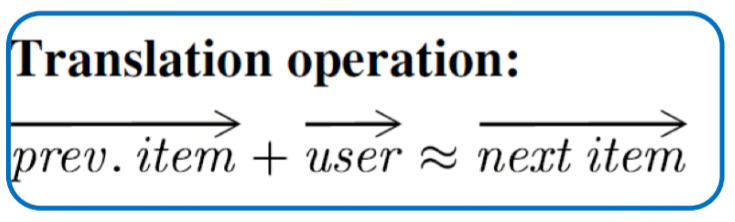

那么用户喜欢下一次物品的概率和下述式子成正比：

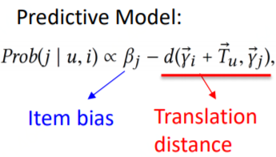

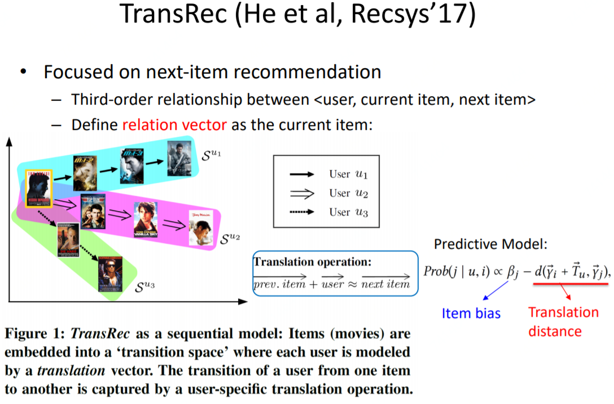

#### [Latent Relational Metric Learning\(Tay et al, WWW’18\)](https://arxiv.org/pdf/1707.05176.pdf)

这个论文主要是relation vector通过若干个memory vector的加权求和得到，然后采用pairwise ranking的方法来学习。

首先和attention里的k、q、v类似，计算出attention weight:

其中p和q分别是user和item的向量。然后对memory vector进行加权求和得到relation vector\(该论文中用了6个memory vector\):

如果item\_q是user\_p喜欢的item，那么随机采样另一对p和q，就可以进行pairwise ranking的学习，即正样本的 $$|p+r-q|$$  （$$p$$ 喜欢 $$q$$）应该小于负样本的 $$|p'+r-q'|$$  \( $$p'$$ 不喜欢 $$q'$$ ，这里的正负样本用同一个 $$r$$ \)：

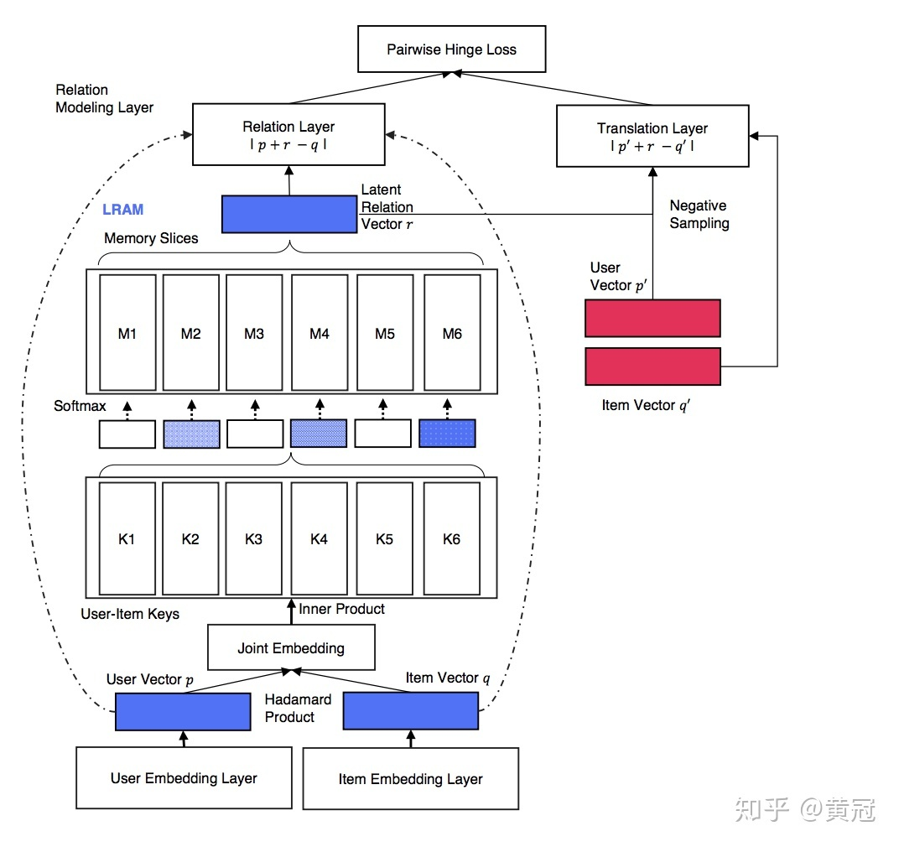

### **基于Collaborative Filtering + Side Info的方法**

推荐里的特征向量往往是高维稀疏的，例如CF中feature vector = user\_ID + item\_ID。对于这些高维稀疏特征来说，抓取特征特征之间的组合关系非常关键：

* 二阶特征组合：

  * users like to use food delivery apps at meal-time
  * app category和time之间的二阶组合

  三阶特征组合：

  * male teenagers like shooting games
  * gender, age, 和app category之间的三阶组合

对于feature-based的方法来说，能抓取特征的交互作用和关系非常重要。

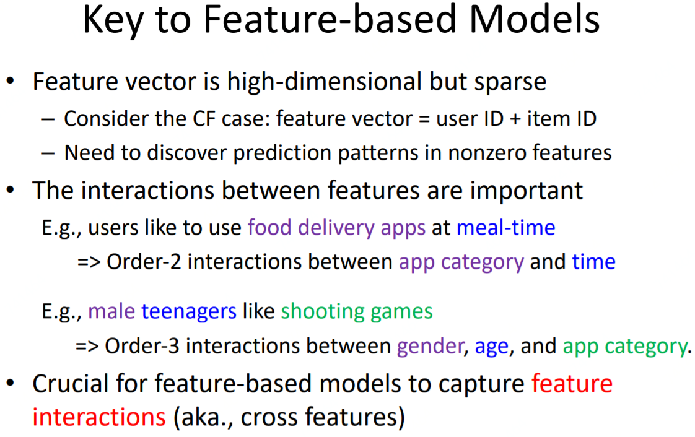

#### **Based on Multi-Layer Perceptron**

#### \*\*\*\*[**Wide&Deep \(Cheng et al, Recsys’16\)**](https://arxiv.org/abs/1606.07792)\*\*\*\*

这个模型主要是将LR和DNN一起联合训练，注意是联合训练，一般的ensemble是两个模型是单独训练的。思想主要是：

* LR擅长记忆；DNN擅长泛化（包括抓取一些难以人工设计的交叉特征）

  LR部分需要大量的人工设计的feature，包括交叉特征

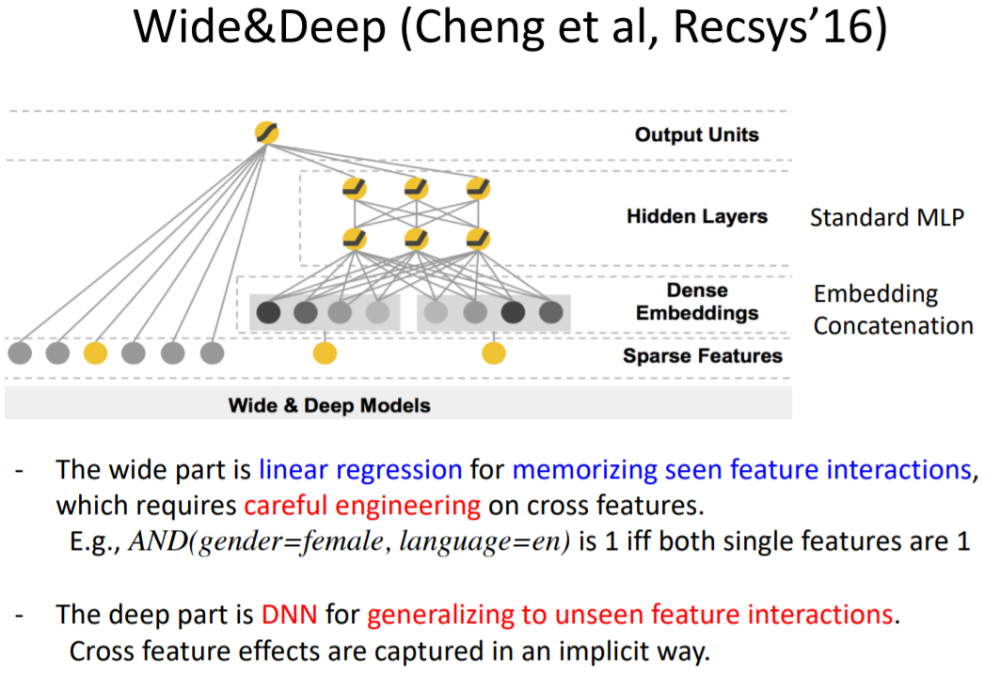

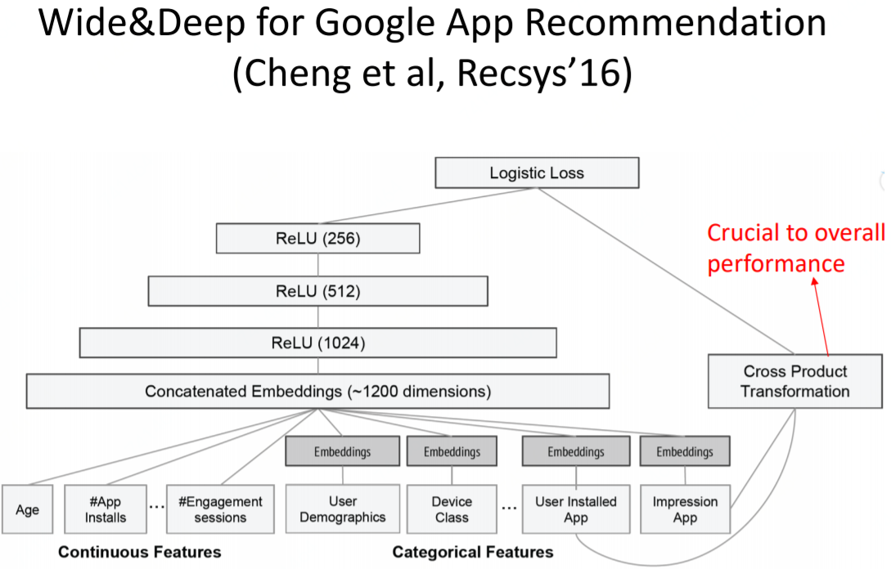

#### \*\*\*\*[**Deep Crossing \(Shan et al, KDD’16\)**](https://www.kdd.org/kdd2016/papers/files/adf0975-shanA.pdf)\*\*\*\*

这篇论文和wide&deep的主要差别是加了残差连接：

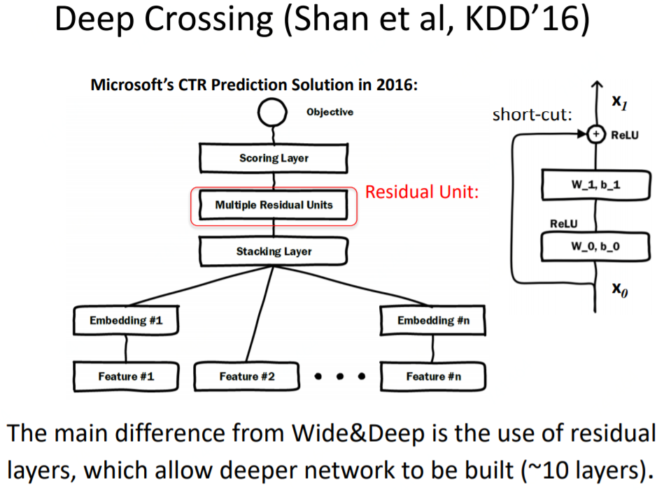

**Empirical Evidence \(He and Chua, SIGIR’17\)**

这篇论文主要想说明两点：

* 如果只有raw feature，如果没有人工设计的特征，DNN效果并不够好

  如果没有很好的初始化，DNN可能连FM都打不过。如果用FM的隐向量来初始化DNN，则DNN的效果比FM好

#### **Based on Factorization Machines\(FM\)**

#### **NFM: Neural Factorization Machine\(He and Chua, SIGIR’17\)**

这个模型主要是，将FM里的二阶特征组合放到NN里，后面再接几层FC学习更高阶的特征组合。具体方法是：两两特征进行组合，即进行element-wise dot，得到一个K维的向量，然后所有组合的K维向量进行加和，得到一个K维的向量，往后再接几个FC，模型结构图如下：

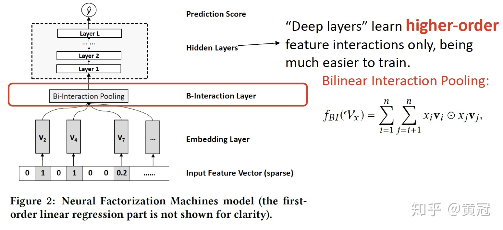

效果上，该模型完爆了之前没有手工做特征组合的模型和FM：

**AFM: Attentional Factorization Machine\(Xiao et al, IJCAI’17\)**

这个模型主要是针对FM的不同特征的组合的结果的简单加和，变成加权平均，用attention来求权重（有利于提取重要的组合特征；NFM是使用MLP来学习不同特征组合的权重，且没有归一化的过程）：

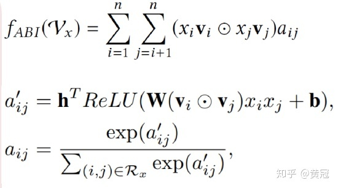

模型的整体结构图如下：

效果上，不带隐层的AFM就能干掉带一层隐层的NFM。如果增加隐层，AFM的效果能进一步提升：

**DeepFM \(Guo et al., IJCAI’17\)**

这一篇论文主要是将wide&deep的LR替换成FM，FM可以抓取二阶的特征组合关系，而DNN可以抓取更高阶的特征组合关系：

对上述的feature-based的方法做个简单总结：

* 特征交互对matching function learning非常关键

  早期的对raw feature进行交叉，对效果提升非常有用：

  * wide&deep是手工进行组合
  * FM-based的模型是自动进行组合

  用DNN可以用来学习高阶的特征组合，但可解释性差。怎么学习可解释性好的高阶组合特征，依然是一个大的挑战。

##  **representation learning和matching function learning的融合**

## Source





