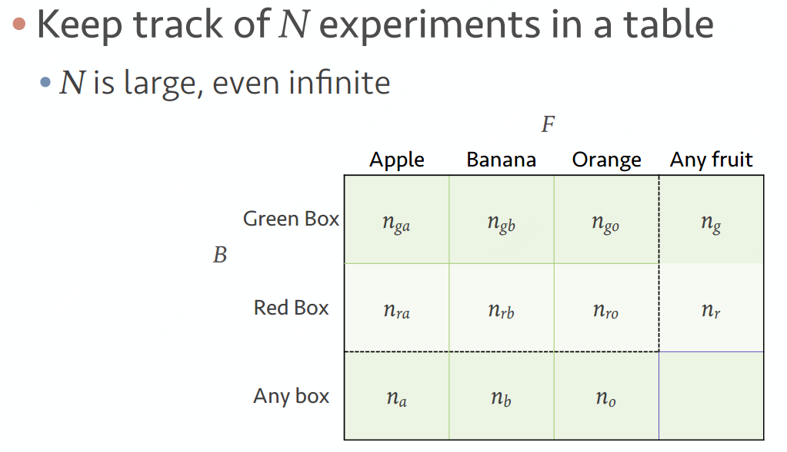

# 概率基础

## 单变量概率\(Single variable probabilities\)

水果是从箱子 $$i(Green, Red)$$中取出的概率： $$P(B == i) = n_i/N$$ 

取出水果 $$j(Apple, Banana, Orange)$$的概率： $$P(F ==  j) = n_j/N$$ 

## 联合概率\(Joint probabilities\)

从箱子 $$i(Green, Red)$$取出水果，且水果是 $$j(Apple, Banana, Orange)$$的概率：

                                         $$P(B == i, F == j) = P(F == j, B == i) = n_{ij}/N$$ 

## 条件概率\(Conditional probability\)

从箱子 $$i(Green, Red)$$中取水果，水果是 $$j(Apple, Banana, Orange)$$的概率：

                                                                 $$P(F==j|B==i) = \frac{n_{ij}}{n_i}$$ 

## 和定律\(Sum rule\)

水果是从箱子 $$i(Green, Red)$$中取出的概率： 

                   $$P(B == i) = n_i/N = (n_{ia}+n_{ib}+n_{io})/N = \sum \limits_{\forall j}P(B==i,F==j)$$ 

                                                                 $$P(X) = \sum \limits_Y P(X,Y) $$ 

## 积定律\(Product rule\)

从箱子 $$i(Green, Red)$$取出水果，且水果是 $$j(Apple, Banana, Orange)$$的概率：

               $$P=(B==i,F==j)=\frac{n_{ij}}{N} = \frac{n_{ij}}{n_i}\frac{n_i}{N} = P(F==j|B==i)P(B==i) $$ 

                                                              $$P(X,Y) = P(Y|X)P(X)$$ 

## 贝叶斯定理\(Bayes theorem\)

                                                                $$\mathop{P(Y|X)} \limits^{Posterior} = \frac{\mathop{P(X|Y)} \limits^{Likelihood}\mathop{P(Y)} \limits^{Prior}}{\mathop{P(X)} \limits_{Normalizing constant}}$$ 

## 独立事件\(Independence\)

如果满足 $$P(B ==i,F==j)=P(B==i)P(F==j)$$，则 $$B$$ 与 $$F$$ 即为相互独立事件

## [频率&贝叶斯学派](https://www.zhihu.com/question/20587681)

今天降雨概率：

频率学派：将今天重复过 $$N$$ 次，下雨次数 $$n$$ ， $$P(rain) = n / N$$ 

贝叶斯学派：根据一系列模型，假设，先验概率\(云，风，湿度...\)计算出下雨的likelihood

贝叶斯学派认为：先验分布+实验数据=后验分布

