# 概率分布

## 各分布相关联系

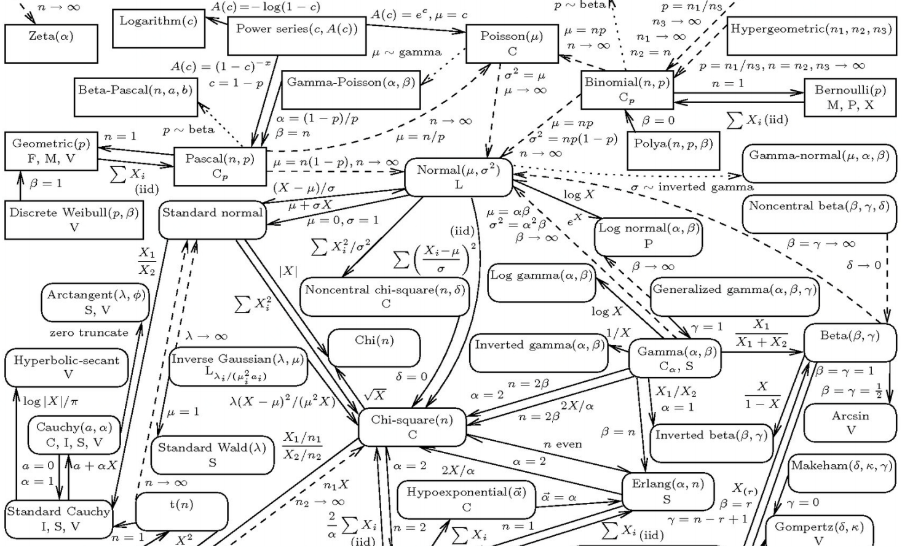

## 伯努利分布\(Bernoulli\)

伯努利分布是关于布尔变量 $$x\in\{0,1\}$$ 的概率分布，其连续参数 $$\mu\in[0,1]$$ 表示变量 $$x=1$$ 的概率

                                                   $$P(x|\mu) = Bern(x|\mu) = \mu^x(1-\mu)^{1-x} $$ 

                                                    $$E(x)=\mu$$          $$var(x) = \mu(1-\mu)$$ 

## 二项分布\(Binomial\)

二项分布就是重复 $$n$$ 次独立的伯努利试验，即当 $$n = 1$$ 时，二项分布退化为伯努利分布。在每次试验中只有两种可能的结果，而且两种结果发生与否互相对立，并且相互独立，与其它各次试验结果无关，事件发生与否的概率在每一次独立试验中都保持不变

一枚硬币扔 $$n$$ 次，扔出正面概率为 $$prob(head) = p$$，得到 $$k$$ 次正面的概率：

                                                                 $$P(X=k)=\binom{n}{k}p^k(1-p)^{n-k}$$ 

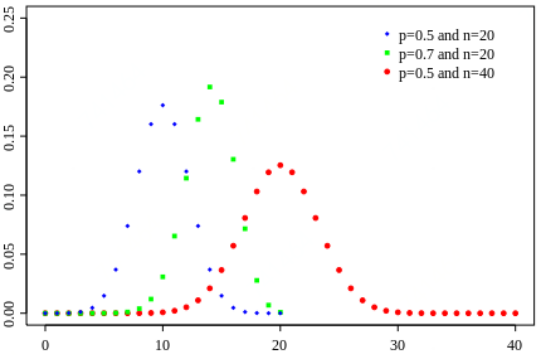

当 $$n$$ 非常大且 $$p$$ 固定时，我们就得到 $$\mu=np,\ \sigma=sqrt(np(1-p))$$ 的正态分布

## 泊松分布\(Poisson\)

当 $$n$$ 非常大且 $$p$$ 很小时，我们就得到泊松分布。泊松分布可作为二项分布的近似，通常当 $$n \geq 20$$， $$p\leq 0.05$$ 时，就可以用泊松公式近似得计算：

由二项分布： 

                  $$P(X=k)=\binom{n}{k}p^k(1-p)^{n-k} = \binom{n}{k}(\frac{\lambda}{n})^k(1-(\frac{\lambda}{n}))^{n-k} , \ \ \ \lambda = np$$ 

当 $$n \to \infty$$ 时：

                         $$\frac{\binom{n}{k}}{n^k}\to \frac{1}{k!}$$ 和 $$(1-(\frac{\lambda}{n}))^n \to e^{-\lambda}$$ 

所以，代入上式：

                          $$P(X=k)=\binom{n}{k}(\frac{\lambda}{n})^k(1-(\frac{\lambda}{n}))^{n-k}$$ 

                                                 $$= \frac{e^{-\lambda}\lambda^k}{k!} =  \frac{\lambda^k}{k!}e^{-\lambda} , \ \ \ \lambda = np$$ 

## [多项分布\(Multinomial\)](http://crescentmoon.info/2012/09/23/%E5%A4%9A%E9%A1%B9%E5%88%86%E5%B8%83%E6%A6%82%E7%8E%87%E5%85%AC%E5%BC%8F%E7%9A%84%E7%90%86%E8%A7%A3/)

二项分布的典型例子是扔硬币，硬币正面朝上概率为p, 重复扔n次硬币，k次为正面的概率即为一个二项分布概率。把二项分布公式推广至多种状态，比如掷骰子\(6种状态\)，就得到了多项分布。由二项分布$$P(X=k)=\binom{n}{k}p^k(1-p)^{n-k}$$，第一部分$$\binom{n}{k}$$ 即表示扔 $$n$$ 次硬币正面朝上 $$k$$ 次有多少种组合，第二部分$$p^k(1-p)^{n-k}$$即扔 $$k$$ 次正面概率 $$(n-k)$$ 次背面概率。推广到多项式如下：

设我们现在有 $$n$$ 个相同箱子，每个箱子都含 $$k$$ 个标记为 $$x_1,x_2,\dots,x_k$$ 的小球，每次从一个箱子里取出一个小球， $$r_i$$ 表示取出标记为 $$x_i$$ 小球的个数，显然 $$r_1+r_2+\cdots+r_k=n$$ \(一个箱子取一个球，取出的球总数和箱子数一致\)。我们取出 $$r_1$$ 个 $$x_1$$ ， $$r_2$$ 个 $$x_2$$ ... $$r_k$$ 个 $$x_k$$ 有多少种取法呢？即下式：

$$C_n^{r_1,r_2,\dots,r_k} = C_n^{r_1}C_{n-r_1}^{r_2}C_{n-r_1-r_2}^{r_3}\dots C_{n-r_1-r_2-\dots r_{k-1}}^{r_k}$$        \(每拿 $$r$$ 个球就表示少了 $$r$$ 个可拿球箱子\)

                      $$=\frac{n!}{r_1!(n-r_1)!}\cdot\frac{(n-r_1)!}{r_2!(n-r_1-r_2)!}\cdots \frac{(n-r_1-r_2\dots r_{k-2})!}{r_{k-1}!(n-r_1-r_2\dots r_{k-1})!}$$ 

                      $$=\frac{n!}{r_1!r_2!\dots r_{k-1}!(n-r_1-r_2\dots r_{k-1})!}$$                                      \(又 $$r_1+r_2+\dots r_k=n$$\)

                      $$=\frac{n!}{r_1!r_2!\dots r_{k}!r_k!}$$ 

这里 $$\frac{n!}{r_1!r_2!\dots r_{k}!r_k!}$$ 即多项分布第一部分\(表示取出 $$r_1$$ 个 $$x_1$$ ， $$r_2$$ 个 $$x_2$$ ... $$r_k$$ 个 $$x_k$$ 有多少种取法\)，第二部分显然就是他们的概率与次数作为次方 $$p_i^{r_i}$$ 的累乘，即如下公式：

                   $$P(r_1,r_2,\dots,r_k|n,p) = \frac{n!}{r_1!r_2!\dots r_{k}!r_k!} p_1^{r_1}\cdot p_2^{r_2}\cdots p_k^{r_k} = \frac{n!}{r_1!r_2!\dots r_{k}!r_k!} \prod\limits_{i=1}^kp_i^{r_i}$$ 

                    $$E(r_i) = np_i$$          $$var(r_i)=np_i(1-p_i)$$          $$cov (r_1,r_2) =-np_jp_i$$ 

## [伽玛分布\(Gamma\)](http://www.victoriawy.com/wp-content/uploads/2017/12/LDA%E6%95%B0%E5%AD%A6%E5%85%AB%E5%8D%A6.pdf)

$$\Gamma$$ 函数，也叫做伽玛函数（Gamma函数），是阶乘函数在实数与复数域上的扩展。如果$$n$$为正整数，则：

                                                             $$\Gamma(n)=(n-1)!$$ 

对于实数部分为正的复数 $$x$$ ，伽玛函数定义为：

                                                          $$\Gamma(x) = \int_0^{\infty}t^{x-1}e^{-t}dt$$ 

通过分部积分的方法，可以推导出这个函数有如下递归性质： 

                                                            $$\Gamma(x+1)=x\Gamma(x)$$ 

我们把数列的通项公式定义从整数集合延拓到实数集合，例如 $$1,4,9,16,\cdots$$ 可用通项公式 $$n^2$$ 表达。直观的说，也就是可以找到一条平滑的曲线通过 $$y = x^2$$ 通过所有的整数点 $$(n,n^2)$$ 这些点，从而把定义在整数集上的公式延拓到实数集合。对于阶乘序列 $$1,2,6,24,120,720,\cdots$$ ，我们可以计算 $$2!$$ ， $$3!$$ ，那么 $$2.5!$$ 如何计算呢？

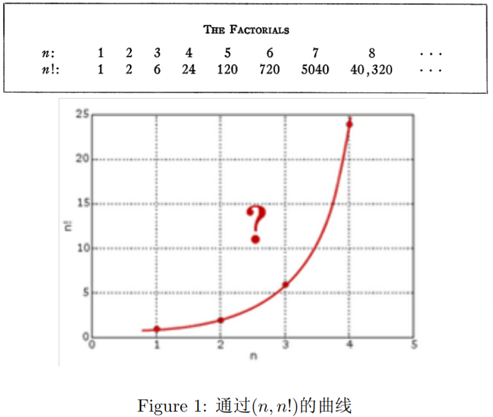

通过欧拉的推导，我们就有了： $$\Gamma(x) = \int_0^{\infty}t^{x-1}e^{-t}dt = (x-1)!$$ ，为什么不定义为 $$\Gamma(n)=n!$$ ，可能因为通过Gamma函数构造Beta函数时，Beta函数更协调。

对Gamma函数的定义做一个变形，就可以得到如下式子：

                                                                    $$\int_0^{\infty}\frac{x^{\alpha-1}e^{-x}}{\Gamma(\alpha)}dx=1$$ 

于是，取积分中的函数作为概率密度，就得到一个形式最简单的Gamma分布的密度函数：

                                                                $$Gamma(x|\alpha) = \frac{x^{\alpha-1}e^{-x}}{\Gamma(\alpha)}$$ 

如果做一个变换 $$x=\beta t$$ ，就得到Gamma分布更一般形式

                                                           $$Gamma(t|\alpha,\beta)=\frac{\beta^{\alpha}t^{\alpha-1}e^{-\beta t}}{\Gamma(\alpha)}$$ 

Gamma分布是统计学的一种连续概率函数。伽玛分布中的参数 $$\alpha$$ ，称为形状参数\(shape parameter\)，主要决定了分布曲线的形状；$$\beta$$ 称为尺度参数\(rate parameter\)或者 $$\frac{1}{\beta}$$ 称为scale parameter，主要决定曲线有多陡。

                    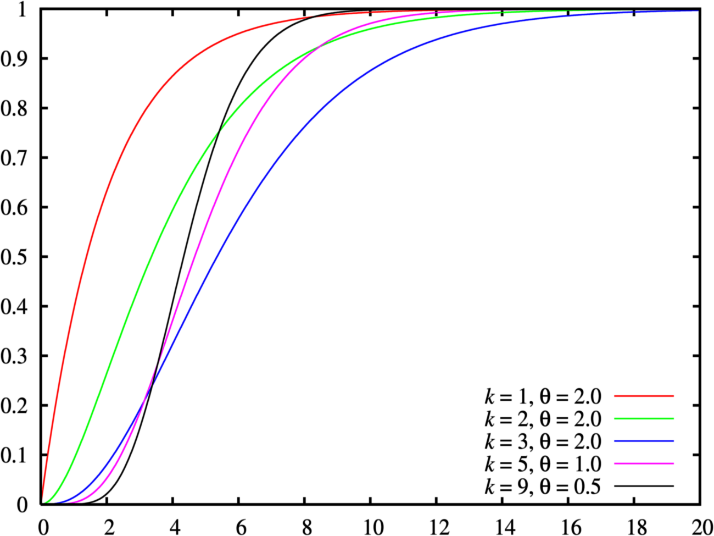 

                                       概率密度函数                                                          累积分布函数

Gamma分布和众多统计分布都有千丝万缕的联系。我们容易发现，Gamma分布的概率密度和Poisson分布在数学形式上具有高度的一致性：

                                                        $$Poisson(X=k|\lambda) = \frac{\lambda^ke^{-\lambda}}{k!}$$ 

在Gamma分布的密度中取 $$\alpha=k+1$$ ，得到

                                             $$Gamma(x|\alpha=k+1)=\frac{x^ke^{-x}}{\Gamma(k+1)}=\frac{x^ke^{-x}}{k!}$$ 

两个分布数学形式上一致，只是Poisson分布是离散的，Gamma分布是连续的，可以直观的认为Gamma分布是Poisson分布在正实数集上的连续化版本。

## [贝塔分布\(Beta\)](https://www.zhihu.com/question/30269898)

贝塔函数\(B函数或第一类欧拉积分\)，是一个特殊函数，由下式定义：

                                                   $$B(x,y) = \int_0^1t^{x-1}(1-t)^{y-1}dt$$ 

贝塔函数具有对称性质 $$ B(x,y) = B(y,x)$$ ；当 $$x,y$$ 是正整数时，我们可以从Gamma函数定义得到如下式子 $$B(x,y) = \frac{(x-1)!(y-1)!}{(x+y-1)!}$$ ，它有许多其他形式，比如 $$B(x,y) = \frac{\Gamma(x)\Gamma(y)}{\Gamma(x+y)}$$ 

假设一均匀分布 $$X\sim Uniform(0,1)$$ ，随机生成10个数，把这10个数排序，问第7大的数的概率分布是多少？这就是一个Beta分布。

我们先将之一般化，对于一般的情况 $$X_k$$ 的概率密度是什么呢？下面，我们尝试计算一下 $$X_k$$ 落在一个区间 $$[x,x+\Delta x]$$ 的概率值： $$P(x\leq X_k\leq x+ \Delta x) = ?$$ 

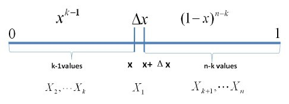

如上图所示，我们把 $$[0,1]$$ 区间划分成 $$[0,x)$$ ， $$[x,x+\Delta x]$$ ， $$(x+\Delta x,1]$$ 三段。我们假定， $$\Delta x$$ 足够小，只能够容纳一个点，则由排列组合理论可得

                                    $$P(x\leq X_k\leq x+ \Delta x) = \binom{n}{1}\Delta x\binom{n-1}{k-1}x^{k-1}(1-x-\Delta x)^{n-k}$$ 

所以我们可以得到 $$X_k$$ 的概率密度函数为

                                              $$f(x)=\lim \limits_{x\to0}\frac{P(x\leq X_k\leq x+ \Delta x)}{\Delta x}$$ 

                                                         $$= \binom{n}{1}\binom{n-1}{k-1}x^{k-1}(1-x)^{n-k}$$

                                                         $$= \frac{n!}{(k-1)!(n-k)!}x^{k-1}(1-x)^{n-k}$$

                                                         $$= \frac{\Gamma(n+1)}{\Gamma(k)\Gamma(n-k+1)}x^{k-1}(1-x)^{n-k}$$

我们取 $$\alpha=k,\ \beta=n-k+1$$ ，于是

                                              $$f(x) = \frac{\Gamma(\alpha+\beta)}{\Gamma(\alpha)\Gamma(\beta)}x^{\alpha-1}(1-x)^{\beta-1}$$ 

这就是Beta分布。

回到上面题目，把$$n=10,\ k=7$$ 带入其中，得到密度函数 $$f(x) = \frac{10!}{6!\times3!}x^6(1-x)^3,\ x\in[0,1]$$ 

贝塔分布是关于连续变量 $$\mu\in[0,1]$$ 的概率分布，它由两个参数$$a>0$$和$$b>0$$确定，概率密度函数如下

                       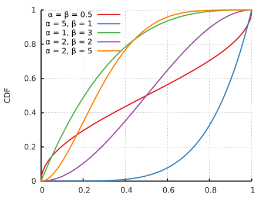 

                                       概率密度函数                                                                   累积分布函数

## [狄利克雷分布\(Dirichlet\)](https://www.zhihu.com/question/26751755)

狄利克雷分布是关于一组 $$d$$ 个连续变量 $$\mu_i\in [0,1]$$ 的概率分布， $$\sum_{i=1}^d\mu_i=1$$ ，令 $$\mu=(\mu_1;\mu_2;\dots;\mu_d)$$ ，参数 $$\alpha=(\alpha_1;\alpha_2;\dots;\alpha_d),\ \alpha_i>0,\ \hat{\alpha}=\sum_{i=1}^d\alpha_i$$ 。Dirichlet是多变量普遍化的Βeta分布，常用于成分分析模型，可以看到，将 $$d=2$$ 时，Dirichlet退化为Beta分布。

                                   $$P(\mu|\alpha)=Dir(\mu|\alpha)=\frac{\Gamma(\hat{\alpha}) }{\Gamma(\alpha_1)\dots\Gamma(\alpha_i)}\prod\limits_{i=1}^d\mu_i^{\alpha_i-1}$$ 

其中均值 $$E[\mu_i]=\frac{\alpha_i}{\hat{\alpha}}$$ ， 方差$$var[\mu_i]=\frac{\alpha_i(\hat{\alpha}-\alpha_i)}{\hat{\alpha}^2(\hat{\alpha}+1)}$$ ，协方差 $$cov[\mu_j,\mu_i]=\frac{\alpha_j\alpha_i}{\hat{\alpha}^2(\hat{\alpha}+1)}$$ 

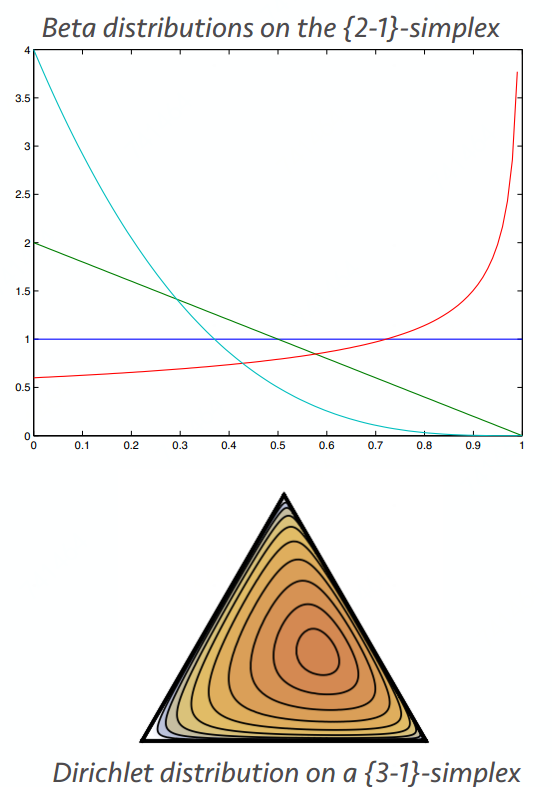

## 高斯分布\(Gaussian\)

高斯分布是最常见的数据分布，又称正态分布

$$\mathcal{N}(x;\mu,\Sigma) = \frac{1}{\sqrt{2\pi^D|\Sigma|}}e^{-\frac{1}{2}(x-\mu)^T\Sigma^{-1}(x-\mu)} \ \ \ \ \ x \in \mathbb{R}^D$$ 其中均值 $$\mu = E(x)$$ ，协方差 $$\Sigma =cov(x)$$ 

若损失函数使用欧氏距离的平方： $$\mathcal{N}(x;\mu,\Sigma) = \frac{1}{(2\pi \sigma^2)^{1/2}}e^{-\frac{(x-\mu)^2}{2\sigma^2}}$$ 

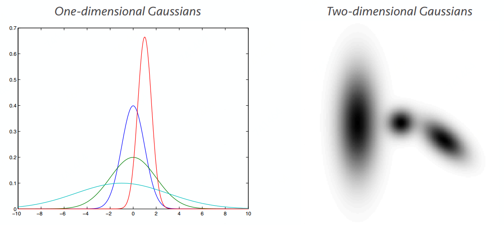

## 拉普拉斯分布\(Laplacian\)

拉普拉斯分布多用于稀疏模型，比高斯分布要陡，使用绝对距离非欧氏距离

                                   $$P(x;\mu,b) = \frac{1}{2b}e^{-\frac{|x-\mu|}{b}}$$   其中均值 $$\mu$$ ，协方差 $$2b^2$$ 

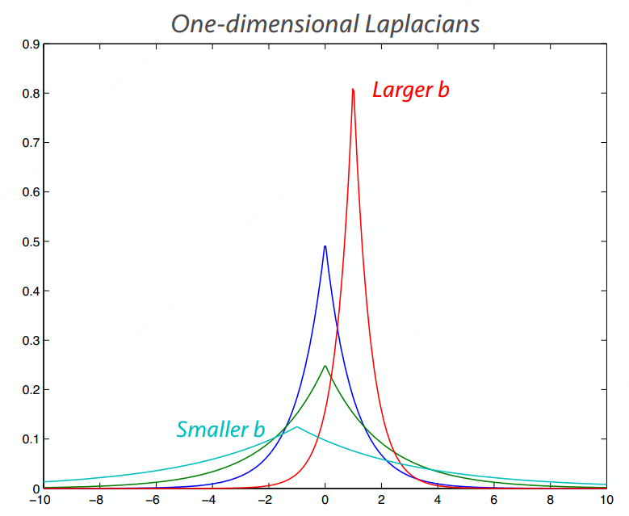

## [卡方分布\(Chi-square\)](https://blog.csdn.net/bitcarmanlee/article/details/52279907)

卡方分布\($$\chi^2$$\)是一种特殊的[伽玛分布](https://zh.wikipedia.org/wiki/%E4%BC%BD%E7%8E%9B%E5%88%86%E5%B8%83)，是[统计推断](https://zh.wikipedia.org/wiki/%E7%BB%9F%E8%AE%A1%E6%8E%A8%E6%96%AD)中应用最为广泛的[概率分布](https://zh.wikipedia.org/wiki/%E6%A6%82%E7%8E%87%E5%88%86%E5%B8%83)之一，例如[假设检验](https://zh.wikipedia.org/wiki/%E5%81%87%E8%AE%BE%E6%A3%80%E9%AA%8C)和[置信区间](https://zh.wikipedia.org/wiki/%E7%BD%AE%E4%BF%A1%E5%8C%BA%E9%97%B4)的计算。k个独立的标准正态分布变量的平方和服从自由度为k的卡方分布。

若 $$k$$ 个独立的随机变量 $$Z_1,Z_2,\dots,Z_k$$ 是相互独立， 符合[标准正态分布](https://zh.wikipedia.org/wiki/%E6%A0%87%E5%87%86%E6%AD%A3%E6%80%81%E5%88%86%E5%B8%83)的[随机变量](https://zh.wikipedia.org/wiki/%E9%9A%8F%E6%9C%BA%E5%8F%98%E9%87%8F)（[数学期望](https://zh.wikipedia.org/wiki/%E6%95%B0%E5%AD%A6%E6%9C%9F%E6%9C%9B)为 $$0$$ 、[方差](https://zh.wikipedia.org/wiki/%E6%96%B9%E5%B7%AE)为 $$1$$ ），则随机变量 $$Z$$ 的平方和：

                                                                       $$X=\sum\limits_{i=1}^kZ^2_i$$ 

被称为服从自由度为 $$k$$ 的卡方分布，记作：

                                                           $$X\sim \chi^2(k)$$    或   $$X\sim \chi^2_k$$ 

           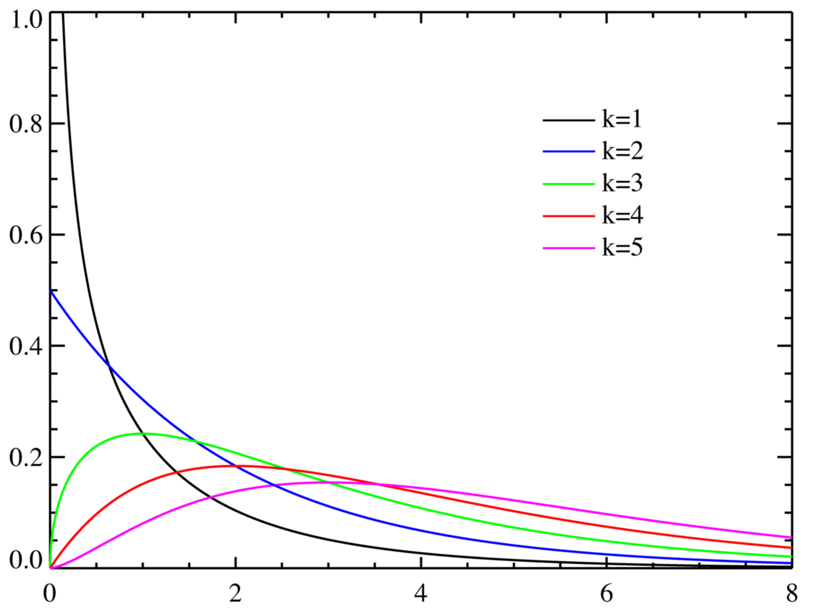     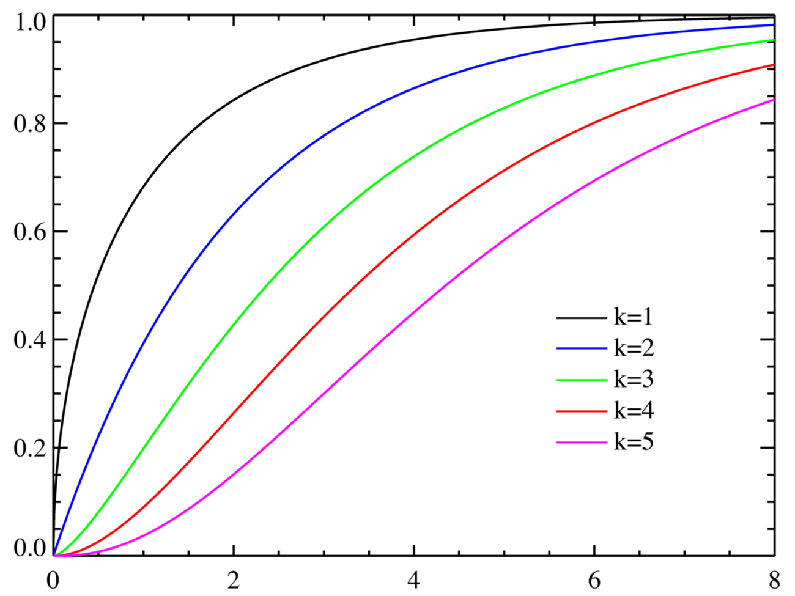 

                                      概率密度函数                                                         累积分布函数

## [t分布\(Student's t\)](https://baike.baidu.com/item/t%E5%88%86%E5%B8%83)

在概率论和统计学中，学生t-分布（t-distribution），可简称为t分布，用于根据小样本来估计呈正态分布且方差未知的总体的均值。如果总体方差已知（例如在样本数量足够多时），则应该用正态分布来估计总体均值。t分布曲线形态与 $$n$$ （确切地说与[自由度](https://baike.baidu.com/item/%E8%87%AA%E7%94%B1%E5%BA%A6/5936984) $$df$$ ）大小有关。与标准正态分布曲线相比，自由度 $$df$$ 越小，t分布曲线愈平坦，曲线中间愈低，曲线双侧尾部翘得愈高；自由度 $$df$$ 愈大，t分布曲线愈接近正态分布曲线，当自由度 $$df=\infty$$ 时，t分布曲线为标准正态分布曲线。

由于在实际工作中，往往 $$\sigma$$ 是未知的，常用 $$s$$ 作为 $$\sigma$$ 的估计值，为了与u变换区别，称为t变换，统计量t 值的分布称为t分布。 假设 $$X$$ 是呈[正态分布](https://zh.wikipedia.org/wiki/%E6%AD%A3%E6%80%81%E5%88%86%E5%B8%83)的独立的[随机变量](https://zh.wikipedia.org/wiki/%E9%9A%8F%E6%9C%BA%E5%8F%98%E9%87%8F)（随机变量的[期望值](https://zh.wikipedia.org/wiki/%E6%9C%9F%E6%9C%9B%E5%80%BC)是 $$\mu$$ ，[方差](https://zh.wikipedia.org/wiki/%E6%96%B9%E5%B7%AE)是 $$\sigma^2$$ 但未知）。 令：

                           样本均值：$$\overline{X}_n=\frac{X_1,+\cdots X_n}{n}$$ ， 样本方差：$$S_n^2=\frac{1}{n-1}\sum\limits_{i=1}^n(X_i-\overline{X}_n)^2$$ 

它显示了数量 $$Z=\frac{\overline{X}_n-\mu}{\frac{\sigma}{\sqrt{n}}}$$ 呈正态分布且均值为 $$0$$ ，方差为 $$1$$ \(标准正态分布\)

另一个相关数量：

                                                                   $$T=\frac{\overline{X}_n-\mu}{\frac{S_n}{\sqrt{n}}}$$ 

上式的 [概率密度函数](https://zh.wikipedia.org/wiki/%E6%A6%82%E7%8E%87%E5%AF%86%E5%BA%A6%E5%87%BD%E6%95%B0)是：

                                                    $$f(t)=\frac{\Gamma(\frac{v+1}{2})}{\sqrt{v\pi}\Gamma(\frac{v}{2})}(1+\frac{t^2}{v})^{\frac{-(v+1)}{2}}, \ \ \ \ \ v=n-1$$ 

$$T$$ 的分布称为t分布，参数 $$v$$ 一般称为自由度， $$\Gamma$$ 是伽马函数。

$$T$$ 的概率密度函数的形状类似于均值为0方差为1的正态分布，但更低更宽。随着自由度 $$v$$ 的增加，则越来越接近均值为0方差为1的正态分布。

                 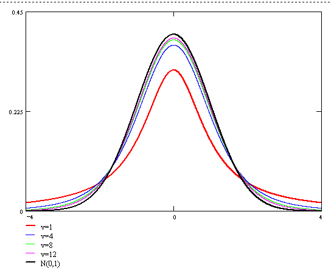     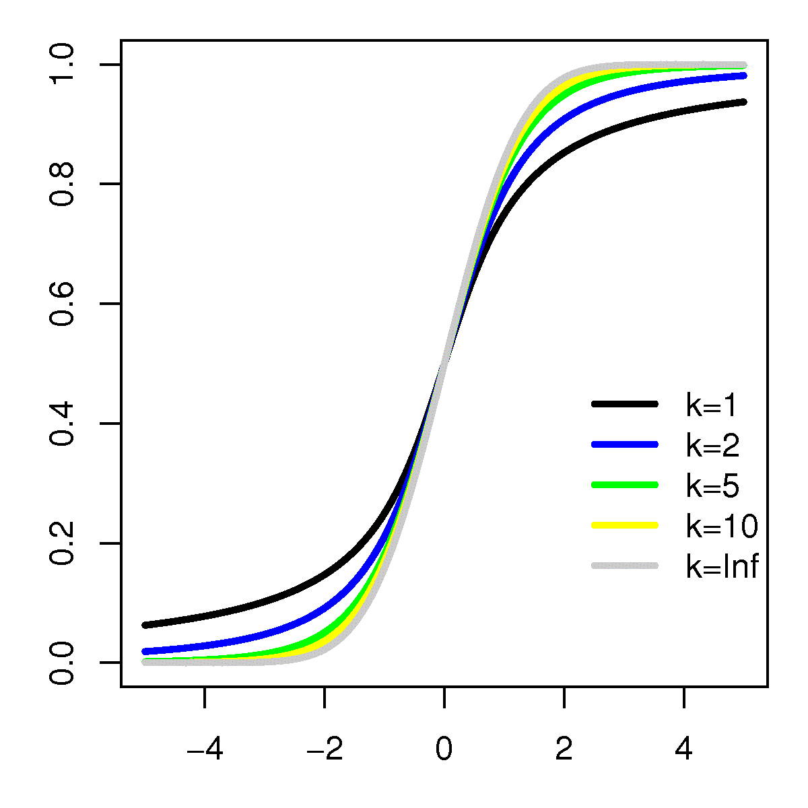 

                                             概率密度函数                                                          累积分布函数

## [F分布\(F-distribution\)](https://blog.csdn.net/suzyu12345/article/details/80135732)

在概率论和统计学里，F-分布（F-distribution）是一种连续概率分布，被广泛应用于似然比率检验，特别是[方差分析\(ANOVA\)](https://baike.baidu.com/item/%E6%96%B9%E5%B7%AE%E5%88%86%E6%9E%90)中。若总体 $$X\sim N(0,1)$$ ， $$(X_1,X_2,\dots,X_{n_1})$$ 与 $$(Y_1,Y_2,\dots,Y_{n_2})$$ 为来自 $$X$$ 的两个独立样本，设统计量

                                                            $$F=\frac{\sum_{i=1}^{n_1}X_i^2}{n_1}/\frac{\sum_{i=1}^{n_2}Y_i^2}{n_2}$$ 

则称统计量 $$F$$ 服从自由度 $$n_1$$ 和 $$n_2$$ 的 $$F$$ 分布，记为 $$F\sim F(n_1,n_2)$$ 

$$F(n_1,n_2)$$ 分布的概率密度为

                          $$f(x;n_1;n_2)=\frac{\sqrt{\frac{(n_1x)^{n_1}n_2^{n_2}}{(n_1x+n_2)^{n_1+n_2}}}}{xB(\frac{n_1}{2},\frac{n_2}{2})} = \frac{1}{B(\frac{n_1}{2},\frac{n_2}{2})}(\frac{n_1}{n_2})^{\frac{n_1}{2}}x^{\frac{n_1}{2}-1}(1+\frac{n_1}{n_2}x)^{-\frac{d_1+d_2}{2}}$$ 

          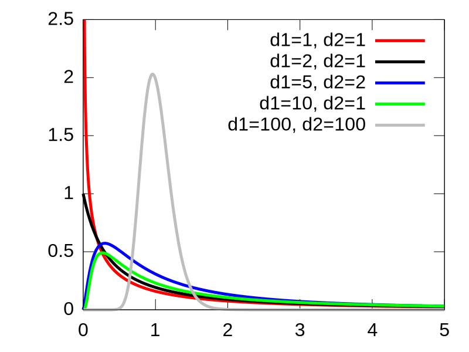     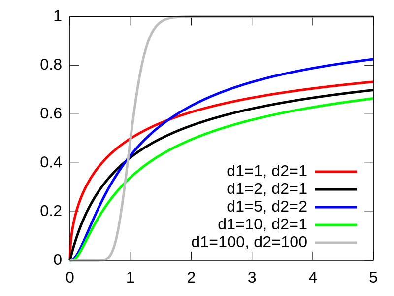 

                                        概率密度函数                                                          累积分布函数

## 指数分布\(Exponential Family\)

任何分布写成 $$P(X;\eta)=h(x)g(\eta)e^{\eta^Tu(x)}$$，其中 $$\eta$$ 包含参数，$$u(x)$$ 是 $$x$$ 的函数，$$g(\eta)$$ 为了标准化

比如高斯：

将 $$u(x) = \left[  \begin{matrix}    x \\ x^2   \end{matrix}   \right] $$ ， $$h(x) = (2\pi)^{-1/2}$$ ， $$\eta = \left[  \begin{matrix}    \mu/\sigma^2 \\ -1/2\sigma^2   \end{matrix}   \right] $$ ， $$g(\eta) = (-2\eta_2)^{1/2}e^{\eta_1^2/4\eta_2}$$ 代入

 $$P(X;\eta)=h(x)g(\eta)e^{\eta^Tu(x)} \to P(x;h)=\frac{1}{(2\pi\sigma^2)^{1/2}}e^{-\frac{1}{2\sigma^2}x^2+\frac{\mu}{\sigma^2}x-\frac{1}{2\sigma^2}\mu^2} = \frac{1}{(2\pi\sigma^2)^{1/2}}e^{-\frac{(x-\mu)^2}{2\sigma^2}}$$

## [共轭分布\(Conjugate\)](https://blog.csdn.net/baimafujinji/article/details/51374202)

假设变量 $$x$$ 服从分布 $$P(x|\Theta)$$ ，其中 $$\Theta$$ 为参数。 $$X=\{x_1,x_2,\dots,x_m\}$$ 为变量 $$x$$ 的观测样本，假设参数 $$\Theta$$ 服从先验分布 $$\prod(\Theta)$$ 。若由先验分布 $$\prod(\Theta)$$ 和抽样分布\(实验数据\) $$P(X|\Theta)$$ 决定的后验分布 $$F(\Theta|X)$$ 与 $$\prod(\Theta)$$ 是同种类型的分布，则称先验分布 $$\prod(\Theta)$$ 为分布 $$P(x|\Theta)$$ 或 $$P(X|\Theta)$$ 的共轭分布\(Conjugate Distribution\)。

其中，贝塔分布\(Beta\)与伯努利分布\(Bernoulli\)共轭；狄利克雷分布\(Dirichlet\)与多项分布\(Multinomial\)共轭；高斯分布的共轭分布仍是高斯分布。

先验分布反映了某种先验信息；后验分布既反映了先验分布提供的信息，又反映了样本提供的信息。当先验分布与抽样分布\(实验数据\)共轭时，后验分布与先验分布属于同种类型，这意味着先验信息与样本提供的信息具有某种同一性。于是，若使用后验分布作为进一步抽样的先验分布，则新的后验分布仍将属于同种类型。因此，共轭分布在不少情况下会使得问题得以简化。

## Source

{% embed url="https://github.com/chmx0929/UIUCclasses/blob/master/598MachLrngforSignalProcessng/Slide/Lecture%202%20-%20Probability%2C%20Statistics%2C%20PE.pdf" %}

{% embed url="http://www.victoriawy.com/wp-content/uploads/2017/12/LDA%E6%95%B0%E5%AD%A6%E5%85%AB%E5%8D%A6.pdf" %}

