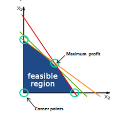

# 估参优化

## 参数估计

根据一系列独立样本 $$X=\{x_1,x_2, \dots , x_N\}$$，以及模型 $$P(X;\theta)$$，找到参数 $$\theta$$ 

### [最大似然估计\(Maximum likelihood estimation\)](https://www.jianshu.com/p/f1d3906e4a3e)

        $$P(X;\theta) = P(x_1,x_2,\dots,x_N;\theta) = \prod \limits_i P(x_i;\theta)$$

$$\to \theta_{ML} = \mathop{argmax}\limits_\theta \prod\limits_i P(x_i;\theta)$$ 

#### 例子1：抽球

假设一个袋子装有白球与红球，比例未知，现在抽取10次（每次抽完都放回，保证事件独立性），假设抽到了7次白球和3次红球，在此数据样本条件下，可以采用最大似然估计法求解袋子中白球的比例（最大似然估计是一种“模型已定，参数未知”的方法）。当然，这种数据情况下很明显，白球的比例是70%，但如何通过理论的方法得到这个答案呢？一些复杂的条件下，是很难通过直观的方式获得答案的，这时候理论分析就尤为重要了，这也是学者们为何要提出最大似然估计的原因。我们可以定义从袋子中抽取白球和红球的概率如下：

其中 $$a = b$$ 是未知的，因此，我们定义似然 $$L$$ 为：

两边取 $$ln$$ ，取 $$ln$$ 是为了将右边的乘号变为加号，方便求导。

最大似然估计的过程，就是找一个合适的 $$\theta$$ ，使得平均对数似然的值为最大。因此，可以得到以下公式：

这里讨论的是2次采样的情况，当然也可以拓展到多次采样的情况：

我们定义 $$M$$ 为模型（也就是之前公式中的 $$f$$ ），表示抽到白球的概率为 $$\theta$$ ，而抽到红球的概率为 $$1-\theta$$ ，因此10次抽取抽到白球7次的概率可以表示为：

将其描述为平均似然可得：

那么最大似然就是找到一个合适的 $$\theta$$ ，获得最大的平均似然。因此我们可以对平均似然的公式对 $$\theta$$ 求导，并令导数为0。

由此可得，当抽取白球的概率 $$\theta$$ 为0.7时，最可能产生10次抽取抽到白球7次的事件。

#### 例子2：正态分布

假如有一组采样值 $$(x_1,\dots,x_n)$$ ，我们知道其服从正态分布，且标准差已知。当这个正态分布的期望为多少时，产生这个采样数据的概率为最大？

这个例子中正态分布就是模型 $$M$$ ，而期望就是前文提到的 $$\theta$$ 

#### 综上所述，可得求解最大似然估计的一般过程为：

1. 写出似然函数；

2. 如果无法直接求导的话，对似然函数取对数；

3. 求导数 ；

4. 求解模型中参数的最优值。

### [最大后验概率估计\(Maximum a posteriori\)](https://www.cnblogs.com/liliu/archive/2010/11/24/1886110.html)

假设有五个袋子，各袋中都有无限量的饼干\(樱桃口味或柠檬口味\)，已知五个袋子中两种口味的比例分别是

1.樱桃 100%    2.樱桃 75% + 柠檬 25%    3.樱桃 50% + 柠檬 50%    4.樱桃 25% + 柠檬 75%    5.柠檬 100%

如果只有上所述条件，从同一个袋子中连续拿到2个柠檬饼干，那这个袋子最有可能是上述五个的哪一个？

      我们首先采用最大似然估计来解这个问题，写出似然函数。假设从袋子中能拿出柠檬饼干的概率为 $$p$$ \(我们通过这个概率 $$p$$ 来确定是从哪个袋子中拿出来的\)，则似然函数可以写作

                                                                  $$p(两个柠檬饼干|袋子) = p^2$$ 

由于 $$p$$ 的取值是一个离散值，即上面描述中的0,25%，50%，75%，1。我们只需要评估一下这五个值哪个值使得似然函数最大即可，得到为袋子5。这里便是最大似然估计的结果。

上述最大似然估计有一个问题，就是没有考虑到模型本身的概率分布，下面我们扩展这个饼干的问题。

假设拿到袋子1或5的概率 $$g$$ 都是0.1，拿到2或4的概率都是0.2，拿到3的概率是0.4，那同样上述问题的答案呢？这个时候就变 $$MAP$$ 了（若本例中拿到五个袋子概率都是0.2，即 $$\theta$$ 为均匀分布时， $$MAL = MLE$$ ；当 $$p(\theta)$$不同时，即本例子， $$MAP \neq MLE$$ ）。我们根据公式

                                                                $$\theta_{MAP} = \mathop{argmax}\limits_\theta P(\theta)P(x|\theta)$$ 

写出我们的

                                                                               $$MAP = p^2 \times g$$ 

 根据题意的描述可知， $$p$$ 的取值分别为0,25%, 50%, 75%, 1， $$g$$ 的取值分别为0.1, 0.2, 0.4, 0.2, 0.1.分别计算出 $$MAP$$ 函数的结果为：0, 0.0125, 0.125, 0.28125, 0.1.由上可知，通过 $$MAP$$ 估计可得结果是从第四个袋子中取得的最高。

## 优化方案

这里介绍机器学习常用优化算法，先无约束\(梯度下降、牛顿、拟牛顿\(DFP、BFGS\)、坐标下降、最小二乘\)，后有约束\(拉格朗日、KKT、线性规划、二次规划、半正定规划、\)。深度学习中常用的优化\(SGD、Momentum、NAG、Adagrad、Aadadelta、Rmsprop\)我放到深度学习章节。

### 梯度下降法\(Gradient descent\)

梯度下降法\(Gradient descent\)或最速下降法\(Steepest descent\)是求解无约束最优化问题的一种最常见的方法，有实现简单的有点。梯度下降法是迭代算法，每一步需要求解目标函数的梯度向量。

假设 $$f(x)$$ 是 $$R^n$$ 是具有一阶连续偏导数的函数，要求解的无约束最优化问题是：

                                                                        $$\mathop{min}\limits_{x\in R^n}f(x)$$ 

梯度下降法是一种迭代算法，选取适当的初值 $$x^{(0)}$$ ，不断迭代，更新 $$x$$ 的值，进行目标函数的极小化，直到收敛。由于负梯度方向是使函数值下降最快的方向，在迭代的每一步，以负梯度方向更新 $$x$$ 的值，从而达到减少函数值的目的。

由于$$f(x)$$具有一阶连续偏导数，若第 $$k$$ 词迭代值为 $$x^{(k)}$$ ，则可将 $$f(x)$$ 在 $$x^{(k)}$$ 附近进行一阶泰勒展开

                                                   $$f(x) = f(x^{(k)})+g_k^T(x-x^{(k)})$$ 

这里， $$g_k=g(x^{(k)}) = \nabla f(x^{(k)})$$ 为 $$f(x)$$ 在 $$x^{(k)}$$ 的梯度，求出第 $$k+1$$ 次迭代值 $$x^{(k+1)}$$ 

                                                            $$x^{(k)}+\lambda_kp_k \to x^{(k+1)}$$ 

其中， $$p_k$$ 是搜索方向，取负梯度方向 $$p_k=-\nabla f(x^{(k)})$$ ， $$\lambda_k$$ 是步长，由一维搜索确定，即 $$\lambda_k$$ 使得

                                             $$f(x^{(k)}+\lambda_kp_k) = \mathop{min}\limits_{\lambda\geq 0}f(x^{(k)}+\lambda p_k)$$ 

#### [泰勒展开式](https://www.zhihu.com/question/25627482)

定义：泰勒公式是一个用函数在某点的信息描述其附近取值的公式。具有局部有效性。

基本形式： $$f(x)=\sum\limits_{n=0}^{\infty}\frac{f^{(n)}(x_0)}{n!}(x-x_0)^n$$ 

    一阶泰勒展开： $$f(x)\approx f(x_0)+f'(x_0)(x-x_0)$$ 

    二阶泰勒展开： $$f(x)\approx f(x_0)+f'(x_0)(x-x_0)+f''(x_0)\frac{(x-x_0)^2}{2}$$ 

迭代形式：假设 $$x^t=x^{t-1}+\Delta x$$ ，将 $$f(x^t)$$ 在 $$x^{t-1}$$ 处进行泰勒展开：

                   $$f(x^t)=f(x^{t-1}+\Delta x) \approx f(x^{t-1})+f'(x^{t-1})\Delta x+f''(x^{t-1})\frac{\Delta x^2}{2}$$ 

 举个例子，例如函数 $$y = x^3$$ ，当自变量有变化时，即 $$\Delta x$$ ，就有：

                   $$\Delta y = (x+\Delta x)^3-x^3 = 3x^2\Delta x+3x(\Delta x)^2+(\Delta x)^3$$ 

当 $$\Delta x \to 0$$ 时，上式的后两项是 $$\Delta x$$ 的高阶无穷小舍去的话上式就变成了 $$\Delta y = 3x^2\Delta x$$ 。也就是说当自变量 $$x$$ 足够小的时候，也就是在某点的很小的邻域内， $$\Delta y$$ 是可以表示成 $$\Delta x$$ 的线性函数的。线性函数计算起来，求导起来会很方便，若进行 $$n$$ 次近似，就得到了泰勒展开的基本形式。

#### 具体算法如下

输入：目标函数 $$f(x)$$ ，梯度函数 $$g(x)=\nabla f(x)$$ ，计算精度 $$\varepsilon$$ ；输出： $$f(x)$$ 的极小点 $$x^*$$ 

1. \(1\) 取初始值 $$x^{(0)}\in R^n$$ ，置 $$k = 0$$ 
2. \(2\) 计算 $$f(x^{(k)})$$ 
3. \(3\) 计算梯度$$g_k=g(x^{(k)})$$：
4.     当$$||g_k||<\varepsilon$$时，停止迭代，令$$x^* = x^{(k)}$$；
5.     否则，令$$p_k=-g(x^{(k)})$$，求 $$\lambda_k$$ ，使 $$f(x^{(k)}+\lambda_kp_k)=\mathop{min}\limits_{\lambda\geq0}f(x^{(k)}+\lambda p_k)$$ 
6. \(4\) 置 $$x^{(k+1)}=x^{(k)}+\lambda_kp_k$$ ，计算 $$f(x^{(k+1)})$$ 
7.     当$$||f(x^{(k+1)})-f(x^{(k)})||<\varepsilon$$或$$||x^{(k+1)}-x^{(k)}||<\varepsilon$$时，停止迭代，令 $$x^*=x^{(k+1)}$$ 
8. \(5\) 否则，置 $$k = k+1$$ ，转\(3\)

当目标函数是凸函数时，梯度下降法的解是全局最优解。一般情况下，其解不保证是全局最优解，梯度下降法的收敛速度也未必是很快的。

### [牛顿法\(Newton's method\)](https://blog.csdn.net/itplus/article/details/21896453)

优化问题的最优解一般出现在函数的极值点上，也就 $$f'(x)=0$$ 的解，所以，牛顿法求解优化问题即求 $$f'(x)$$ 的零点。

首先，随机选择初始值 $$x_0$$，对于 函数 $$f(x)$$ ，计算相应的 $$f(x_0)$$ 和切线斜率 $$f'(x_0)$$\(这里 $$f'$$ 即表示 $$f$$ 的导数\)。然后我们计算穿过点 $$(x_0,f(x_0))$$ 并且斜率为 $$f'(x_0)$$ 的直线和 $$x$$ 轴的交点的 $$x$$ 坐标，也就是

                                                          $$0=f'(x_0)(x-x_0)+f(x_0)$$ 

我们将新求得的点的 $$x$$ 坐标命名为 $$x_1$$ ，通常 $$x_1$$ 会比 $$x_0$$ 更接近方程 $$f(x)=0$$ 的解。因此我们可以利用 $$x_1$$ 开始下一轮迭代。迭代公式可简化为下式：

                                                                $$x_{n+1}=x_n-\frac{f(x_n)}{f'(x_n)}$$ 

上述的一维问题的迭代法可以被推广至多维问题. 只需将导数替换为梯度 $$\nabla f(x)$$ ，并将二阶导数的倒数替换为[Hessian矩阵](https://zh.wikipedia.org/wiki/%E6%B5%B7%E6%A3%AE%E7%9F%A9%E9%98%B5)的[逆矩阵](https://zh.wikipedia.org/wiki/%E9%80%86%E7%9F%A9%E9%98%B5) $$Hf(x)$$ , 即：

                                             $$x_{n+1} = x_n-[Hf(x_n)]^{-1}\nabla f(x_n),\ n\geq 0$$ 

通常，使用牛顿法时会加入一个步长变量 $$\gamma\in(0,1)$$ 作微调，即：

                                                    $$x_{n+1} = x_n-\gamma[Hf(x_n)]^{-1}\nabla f(x_n)$$ 

这个方法被称为无约束牛顿法, 通常用于第一步之后的迭代。下面是详细解释：

考虑无约束最优化问题： $$\mathop{min}\limits_{x\in R^n}f(x)$$ 

假设$$f(x)$$具有二阶连续偏导数，若第 $$k$$ 次迭代值为 $$x^{(k)}$$ ，则可将 $$f(x)$$ 在 $$x^{(k)}$$ 附近进行二阶泰勒展开

                     $$f(x)=f(x^{(k)})+g^T_k(x-x^{(k)})+\frac{1}{2}(x-x^{(k)})^TH(x^{(k)})(x-x^{(k)})$$ 

这里， $$g_k=g(x^{(k)})=\nabla f(x^{(k)})$$ 是 $$f(x)$$ 的梯度向量在点 $$x^{(k)}$$ 的值， $$H(x^{(k)})$$ 是 $$f(x)$$ 的海赛矩阵

                                                             $$H(x)=[\frac{\partial^2f}{\partial x_i \partial x_j}]_{n\times n}$$ 

函数 $$f(x)$$ 有极值的必要条件是在极值点处一阶导数为 $$0$$ ，即梯度向量为 $$0$$ 特别是当 $$H(x^{(k)})$$ 是[正定矩阵](https://zh.wikipedia.org/wiki/%E6%AD%A3%E5%AE%9A%E7%9F%A9%E9%98%B5)时，函数 $$f(x)$$ 的极值为极小值。牛顿法利用极小值的必要条件 $$\nabla f(x)=0$$ ，每次迭代从点 $$x^{(k)}$$开始，求目标函数的极小点，作为第 $$k+1$$次迭代值 $$x^{(k+1)}$$ ，具体地，假设 $$x^{(k+1)}$$满足 $$\nabla f(x^{(k+1)}) = 0$$ 结合泰勒展开则有

                                                     $$\nabla f(x)=g_k+H_k(x-x^{(k)})$$ 

其中 $$H_k=H(x^{(k)})$$ ，这样

                                                     $$g_k+H_k(x^{(k+1)}-x^{(k)})=0$$ 

因此，

                                                         $$x^{(k+1)}=x^{(k)}-H^{-1}_kg_k$$ 

将上式作为迭代公式的算法就是牛顿法。

#### 具体算法如下

输入：目标函数 $$f(x)$$ ，梯度 $$g(x)=\nabla f(x)$$ ，海塞矩阵 $$H(x)$$ ，精度要求 $$\varepsilon$$ 

输出： $$f(x)$$ 的极小点 $$x^*$$ 

1. \(1\) 取初始值 $$x^{(0)}$$ ，置 $$k = 0$$ 
2. \(2\) 计算 $$g_k=g(x^{(k)})$$ 
3. \(3\) 若 $$||g_k||<\varepsilon$$ ，则停止计算，得近似解 $$x^*=x^{(k)}$$ 
4. \(4\) 计算 $$H_k=H(x^{(k)})$$ ，并求 $$p_k$$ ： $$H_kp_k=-g_k$$ 
5. \(5\) 置 $$x^{(k+1)}=x^{(k)}+p_k$$ 
6. \(6\) 置 $$k = k+1$$ ，转\(2\) 

### 拟牛顿法\(quasi-Newton method\)

在牛顿法的迭代中，需要计算海赛矩阵的逆矩阵，这一计算比较复杂，考虑用一个 $$n$$ 阶矩阵 $$G_k=G(x^{(k)})$$ 来近似替代 $$H^{-1}=H^{-1}(x^{(k)})$$ 。这就是拟牛顿法的基本想法。先看牛顿法迭代中海赛矩阵 $$H_k$$ 满足的条件。首先， $$H_k$$ 满足以下关系。在 $$\nabla f(x)=g_k+H_k(x-x^{(k)})$$ 中取 $$x = x^{(k)}$$ ，得

                                              $$g_{k+1}-g_k=H_k(x^{(k+1)}-x^{(k)})$$ 

记 $$y_k=g_{k+1}-g_k$$ ， $$\delta_k=x^{(k+1)}-x^{(k)}$$ ，则

                                                 $$y_k=H_k\delta_k$$ 或 $$H_k^{-1}y_k=\delta_k$$ 

上式即称为拟牛顿条件。如果 $$H_k$$ 是正定的\( $$H^{-1}_k$$也是正定的\)，那么可以保证牛顿法搜索方向 $$p_k$$ 是下降方向。这是因为搜索方向是 $$p_k=-H^{-1}_kg_k$$ ，结合牛顿法迭代式 $$x^{(k+1)}=x^{(k)}-H^{-1}_kg_k$$ 有

                                            $$x=x^{(k)}+\lambda p_k=x^{(k)}-\lambda H^{-1}_kg_k$$ 

所以 $$f(x)$$ 在 $$x^{(k)}$$ 的泰勒展开式可以近似写成

                                               $$f(x)=f(x^{(k)})-\lambda g^T_kH^{-1}_kg_k$$ 

因 $$H^{-1}_k$$ 正定，故有 $$g^T_kH^{-1}_kg_k>0$$ 当 $$\lambda$$ 为一个充分小的正数时，总有 $$f(x)<f(x^{(k)})$$ ，也就是说 $$p_k$$ 是下降方向。

拟牛顿法将 $$G_k$$ 作为 $$H^{-1}_k$$ 的近似，要求矩阵 $$G_k$$ 满足同样的条件。首先，每次迭代矩阵 $$G_k$$ 是正定的。同时， $$G_k$$ 满足下面的拟牛顿条件：

                                                              $$G_{k+1}y_k=\delta_k$$ 

按照拟牛顿条件选择 $$G_k$$ 作为 $$H^{-1}_k$$ 的近似或选择 $$B_k$$ 作为 $$H_k$$ 的近似的算法称为拟牛顿法。按照拟牛顿条件，在每次迭代中可以选择更新矩阵 $$G_{k+1}$$ ：

                                                         $$G_{k+1}=G_k+\Delta G_k$$ 

#### DFP

DFP算法选择 $$G_{k+1}$$ 的方法是，假设每一步迭代中矩阵 $$G_{k+1}$$ 是由 $$G_k$$ 加上两个附加项构成的，即

                                                       $$G_{k+1}=G_k+P_k+Q_k$$ 

其中 $$P_k,\ Q_k$$ 是待定矩阵。这时，

                                                $$G_{k+1}y_k=G_ky_k+P_ky_k+Q_ky_k$$ 

为使 $$G_{k+1}$$ 满足拟牛顿条件，可使 $$P_k$$ 和 $$Q_k$$ 满足：

                                                $$P_ky_k=\delta_k$$           $$Q_ky_k=-G_ky_k$$ 

事实上，不难找出这样的 $$P_k$$ 和 $$Q_k$$ ，例如取

                                                 $$P_k=\frac{\delta_k\delta_k^T}{\delta_k^Ty_k}$$           $$Q_k = -\frac{G_ky_ky^T_kG_k}{y_k^TG_ky_k}$$ 

这样就可得到矩阵 $$G_{k+1}$$ 的迭代公式：

                                                    $$G_{k+1}=G_k+\frac{\delta_k\delta_k^T}{\delta_k^Ty_k} -\frac{G_ky_ky^T_kG_k}{y_k^TG_ky_k}$$ 

称为DFP算法。可以证明，如果初始矩阵 $$G_0$$ 是正定的，则迭代过程中的每个矩阵 $$G_k$$ 都是正定的。

1. 输入：目标函数 $$f(x)$$ ，梯度 $$g(x)=\nabla f(x)$$ ，精度要求 $$\varepsilon$$ ；输出： $$f(x)$$ 的极小点 $$x^*$$ 
2. \(1\) 选定初始点 $$x^{(0)}$$ ，取 $$G_0$$ 为正定对称矩阵，置 $$k = 0$$ 
3. \(2\) 计算 $$g_k=g(x^{(k)})$$ 若 $$||g_k||<\varepsilon$$ ，则停止计算，得近似解 $$x^*=x^{(k)}$$ 
4. \(3\) 置 $$p_k=-G_kg_k$$ 
5. \(4\) 一维搜索：求 $$\lambda_k$$ 使得 $$f(x^{(k)}+\lambda_kp_k)=\mathop{min}\limits_{\lambda\geq0}f(x^{(k)}+\lambda p_k)$$ 
6. \(5\) 置 $$x^{(k+1)}=x^{(k)}+\lambda_kp_k$$ 
7. \(6\) 计算 $$g_{k+1}=g(x^{(k+1)})$$ 
8.          若 $$||g_k||<\varepsilon$$ ，则停止计算，得近似解 $$x^*=x^{(k+1)}$$ ；
9.          否则，按 $$G_{k+1}=G_k+\frac{\delta_k\delta_k^T}{\delta_k^Ty_k} -\frac{G_ky_ky^T_kG_k}{y_k^TG_ky_k}$$ 计算出 $$G_{k+1}$$ 
10. \(7\) 置 $$k = k+1$$ ，转\(3\)

#### BFGS

BFGS算法是最流行的拟牛顿算法。可以考虑用 $$G_k$$ 逼近海赛矩阵的逆矩阵 $$H^{-1}$$ ，也可以考虑用 $$B_k$$ 逼近海赛矩阵 $$H$$ 。这时，相应的拟牛顿条件是

                                                                  $$B_{k+1}\delta_k=y_k$$ 

可以用同样的方法得到另一迭代公式。首先令

                                                         $$B_{k+1}=B_k+P_k+Q_k$$ 

                                                $$B_{k+1}\delta_k=B_k\delta_k+P_k\delta_k+Q_k\delta_k$$ 

考虑使 $$P_k$$ 和 $$Q_k$$ 满足：

                                                  $$P_k\delta_k=y_k$$       $$Q_k\delta_k=-B_k\delta_k$$ 

找出适合条件的 $$P_k$$ 和 $$Q_k$$，得到BFGS算法矩阵 $$B_{k+1}$$ 的迭代公式：

                                                   $$B_{k+1}=B_k+\frac{y_ky_k^T}{y^T_k\delta_k}-\frac{B_k\delta_k\delta_k^TB_k}{\delta_k^TB_k\delta_k}$$ 

可以证明，如果初始矩阵 $$B_0$$ 是正定的，则迭代过程中的每个矩阵 $$B_k$$ 都是正定的。

1. 输入：目标函数 $$f(x)$$ ，梯度 $$g(x)=\nabla f(x)$$ ，精度要求 $$\varepsilon$$ ；输出： $$f(x)$$ 的极小点 $$x^*$$ 
2. \(1\) 选定初始点 $$x^{(0)}$$ ，取 $$B_0$$ 为正定对称矩阵，置 $$k = 0$$ 
3. \(2\) 计算 $$g_k=g(x^{(k)})$$ 若 $$||g_k||<\varepsilon$$ ，则停止计算，得近似解 $$x^*=x^{(k)}$$ 
4. \(3\) 由 $$B_kp_k = -g_k$$ 求出 $$p_k$$ 
5. \(4\) 一维搜索：求 $$\lambda_k$$ 使得 $$f(x^{(k)}+\lambda_kp_k)=\mathop{min}\limits_{\lambda\geq0}f(x^{(k)}+\lambda p_k)$$ 
6. \(5\) 置 $$x^{(k+1)} = x^{(k)}+\lambda_k p_k $$ 
7. \(6\) 计算 $$g_{k+1} = g(x^{(k+1)})$$ 
8.         若 $$||g_{k+1}||<\varepsilon$$ ，则停止计算，得近似解 $$x^*=x^{(k+1)}$$ 
9.         否则，按 $$B_{k+1}=B_k+\frac{y_ky_k^T}{y^T_k\delta_k}-\frac{B_k\delta_k\delta_k^TB_k}{\delta_k^TB_k\delta_k}$$ 计算出 $$B_{k+1}$$ 
10. \(7\) 置 $$k = k+1$$ ，转\(3\)

### 坐标下降法\(Coordinate descent\)

坐标下降法是一种非梯度优化方法，它在每步迭代中沿一个坐标方向进行搜索，通过循环使用不用的坐标方向来达到目标函数的局部极小值。

假设我们求解 $$f(x)$$ 的极小值，其中 $$x=(x_1,x_2,\dots,x_d)^T\in \mathbb{R}^d$$ 是一个 $$d$$ 维向量。从初始点 $$x^0$$ 开始，坐标下降法通过迭代地构造序列 $$x^0,x^1,x^2,\dots$$ 来解决问题， $$x^{t+1}$$ 的第 $$i$$ 个分量 $$x_i^{t+1}$$ 构造为：

                               $$x_i^{t+1}=\mathop{argmin}\limits_{y\in\mathbb{R}}f(x_1^{t+1},\dots,x_{i-1}^{t+1},y,x^t_{i+1},\dots,x_d^t)$$ 

通过执行此操作，显然有

                                               $$f(x^0)\geq f(x^1) \geq f(x^2)\geq\dots$$ 

与梯度下降法类似，通过迭代执行该过程，序列 $$x^0,x^1,x^2,\dots$$ 能收敛到所期望的局部极小点或驻点。坐标下降法不需计算目标函数的梯度，在每次迭代中仅需求解一维搜索问题，对于某些复杂问题计算较为简便。但若目标函数不光滑，则坐标下降法有可能陷入非驻点。

### 最小二乘法\(Least squares\)

最小二乘法是无约束的数学优化方法，通过最小化误差的平方和寻找数据的最佳函数匹配。利用最小二乘法可以简便地求得未知的数据，并使得这些求得的数据与实际数据之间误差的平方和为最小，即

                                                           $$\mathop{min}\limits_\theta \sum_{i=1}^n(\hat{y}-y_i)^2$$ 

 最小值可以通过对上式参数分别求[偏导数](https://zh.wikipedia.org/wiki/%E5%81%8F%E5%AF%BC%E6%95%B0)，然后使它们等于零得到。

#### Example

某次实验得到了四个数据点 $$(x,y)$$ ： $$(1,6)、(2,5)、(3,7)、(4,10)$$ 。我们希望找出一条和这四个点最匹配的直线 $$y = \beta_1+\beta_2 x$$， 即找出在“最佳情况”下能够大致符合如下超定线性方程组的 $$\beta_1$$ 和 $$\beta_2$$：

                 $$\beta_1+1\beta_2 = 6$$       $$\beta_1+2\beta_2 = 5$$       $$\beta_1+3\beta_2 = 7$$       $$\beta_1+4\beta_2 = 10$$ 

最小二乘法采用的手段是尽量使得等号两边的方差最小，也就是找出这个函数的最小值：

$$S(\beta_1,\beta_2) = [6-(\beta_1+1\beta_2)]^2+[5-(\beta_1+2\beta_2)]^2+[7-(\beta_1+3\beta_2)]^2+[10-(\beta_1+4\beta_2)]^2$$

最小值可以通过对 $$S(\beta_1,\beta_2)$$ 分别求 $$\beta_1$$ 和 $$\beta_2$$ 的偏导数，然后使它们等于零得到。

                     $$\frac{\partial S}{\partial\beta_1} = 0 =8\beta_1+20\beta_2-56$$        $$\frac{\partial S}{\partial\beta_2} = 0 =20\beta_1+60\beta_2-154$$ 

如此就得到了一个只有两个未知数的方程组，易得 $$\beta_1=3.5,\ \beta_2 = 1.4$$ ，所以 $$y = 3.5+1.4x$$ 最佳

### [拉格朗日乘子法\(Lagrange multiplier\)](https://zh.wikipedia.org/wiki/%E6%8B%89%E6%A0%BC%E6%9C%97%E6%97%A5%E4%B9%98%E6%95%B0)

在数学中的最优化问题中，拉格朗日乘数法是一种寻找多元函数在其变量受到一个或多个条件的约束时的极值的方法，这里的条件约束是等式约束，不等式约束使用KKT解决。这种方法可以将一个有 $$n$$ 个变量与k个约束条件的最优化问题转换为一个解有 $$n+k$$ 个变量的方程组的解的问题。这种方法中引入了一个或一组新的未知数，即拉格朗日乘数，又称拉格朗日乘子，或拉氏乘子，它们是在转换后的方程，即约束方程中作为梯度\(gradient\)的线性组合中各个向量的系数。

比如，要求$$f(x,y)$$在 $$g(x,y)=c$$ 时的最大值时，我们可以引入新变量拉格朗日乘数 $$\lambda$$ ，这时我们只需要下列拉格朗日函数的极值：

                                             $$\mathcal{L}(x,y,\lambda) = f(x,y)+\lambda\cdot(g(x,y)-c)$$ 

 更一般地，对含 $$n$$ 个变量和 $$k$$ 个约束的情况，有：

                       $$\mathcal{L}(x_1,\dots,x_n,\lambda_1,\dots,\lambda_k) = f(x_1,\dots,x_n)-\sum\limits_{i=1}^k\lambda_ig_i(x_1,\dots,x_n)$$ 

拉格朗日乘数法所得的极点会包含原问题的所有极值点，但并不保证每个极值点都是原问题的极值点。

假设有函数 $$f(x,y)$$ ，要求其极值\(最大值/最小值\)，且满足条件： $$g(x,y)=c$$ ， $$c$$ 是常数。对不同 $$d_n$$ 的值，不难想象出 $$f(x,y)=d_n$$ 的等高线。而方程 $$g$$ 的可行集所构成的线正好是 $$g(x,y) = c$$ 。想像我们沿着 $$g = c$$ 的可行集走；因为大部分情况下 $$f$$ 的等高线和 $$g$$ 的可行集线不会重合，但在有解的情况下，这两条线会相交。想像此时我们移动 $$g = c$$ 上的点，因为 $$f$$ 是连续的方程，我们因此能走到 $$f(x,y)=d_n$$ 更高或更低的等高线上，也就是说 $$d_n$$ 可以变大或变小。只有当 $$g = c$$ 和 $$f(x,y)=d_n$$ 相切，也就是说，此时，我们正同时沿着 $$g = c$$ 和 $$f(x,y) = d_n$$ 走。这种情况下，会出现极值或鞍点。

用向量的形式来表达的话，我们说相切的性质在此意味着 $$f$$ 和 $$g$$ 的切线在某点上平行，同时也意味着两者的梯度平行。此时引入一个未知标量 $$\lambda$$ ，并求解：

                                                 $$\nabla[f(x,y)+\lambda(g(x,y)-c)] = 0$$ 

一旦求出 $$\lambda$$ 的值，将其套入下式，易求在无约束条件下的极值和对应的极值点：

                                              $$F(x,y,\lambda) = f(x,y)+\lambda(g(x,y)-c)$$ 

新方程 $$F(x,y,\lambda)$$ 在达到极值时与 $$f(x,y)$$ 相等，因为 $$F(x,y,\lambda)$$ 达到极值时 $$g(x,y)-c$$ 总等于零

#### Example

求 $$f(x,y)=x^2y$$ 满足 $$x^2+y^2 = 1$$ 的最小值。

因为只有一个限制条件，我们只需要用一个乘数 $$\lambda$$ 

$$\Phi(x,y,\lambda) = f(x,y)+\lambda(g(x,y)-c) = x^2y+\lambda((x^2+y^2)-1)$$ 

将所有 $$\Phi$$ 方程的偏微分设为零，得到一个方程组，最小值是以下方程组的解中的一个：

               $$2xy+2\lambda x = 0$$ 

               $$x^2+2\lambda y =0$$ 

               $$x^2+y^2-1 = 0$$ 

### [卡罗需－库恩－塔克条件\(KKT\)](https://www.zhihu.com/question/23311674)

卡罗需-库恩-塔克条件\(Kuhn-Tuhn, KKT\)是在满足一些规则的条件\(可以为不等式\)下，一个非线性规划\(Nonlinear Programming\)问题有最优化解法的一个必要和充分条件，是一个广义化拉格朗日乘数的成果。

现在考虑不等式 $$g(x)\leq 0$$ ，此时最优点要不在 $$g(x)<0$$ 的区域中，或在边界 $$g(x) = 0$$ 上。

1. 1、对于 $$g(x)<0$$ 的情形，约束 $$g(x)\leq0$$ 不起作用，可直接通过条件 $$\nabla f(x) = 0$$ 来获得最优点；这等价于将 $$\lambda$$ 置零然后对 $$\nabla_x\mathcal{L}(x,\lambda)$$ 置零得到最优点。
2. 2、 $$g(x) =0$$ 的情形类似于上面等式约束的分析，但需要注意的是，此时 $$\nabla f(x^*) $$ 的方向必须与 $$\nabla g(x^*) $$ 相反\(即一个增大另一个必须减小，才能使两者和为零\)，即存在常数 $$\lambda>0$$ \(若 $$\lambda<0$$则会出现 $$g(x)>0$$，不符合约束 \)使得 $$\nabla f(x^*) +\lambda\nabla g(x^*) =0$$整合这两种情形，必满足 $$\lambda g(x)=0$$ 

因此，在约束 $$g(x)\leq 0 $$ 下最小化 $$f(x)$$ ，可转化为在如下约束下最小化 $$\mathcal{L}(x,\lambda)=f(x)+\lambda g(x)$$ 的拉格朗日函数：

                                                                     $$\begin{cases}h(x)=0\\g(x)\leq0\\ \lambda\geq 0 \\ \lambda g(x) = 0\end{cases}$$ 

上式即称为Karush-Kuhn-Tucker\(KKT\)条件。上式可推广到多个约束，比如问题：

                         $$max_xf(x)\ \ \ s.t.\ \ \ h_j(x)=0,j=1,\dots,q\ ;\ \ g_i(x)\leq0,i=1,\dots,p$$ 

也就是说，自变量 $$x$$ 是一个 $$n$$ 维向量，要最大化一个目标函数 $$f$$ ，满足若干等式和不等式约束。KKT条件宣称，如果有一个点 $$x^*$$ 是满足所有约束的极值点，则

                          $$\nabla f(x^*)=\sum\limits_j\lambda_j\nabla h_j(x^*)+\sum\limits_i\mu_i\nabla g_j(x^*)\ \ \ \ \mu_i\geq0,\ \mu_ig_i(x^*) = 0$$ 

简单说，就是在极值处， $$f$$ 的梯度是一系列等式约束 $$h_j$$ 的梯度和不等式约束 $$g_i$$ 的梯度的线性组合。在这个线性组合中，等式约束梯度的权值 $$\lambda_j$$ 没有要求；不等式约束梯度的权值 $$\mu_i$$ 是非负的，并且如果每个 $$g_i(x^*)$$ 严格小于 $$0$$ ，那这个约束不会出现在加权式子中，因为对应的权值 $$\mu_i$$ ，必须为 $$0$$ .换句话说，只有 $$x^*$$ 恰好在边界 $$g_i=0$$ 上的那些 $$g_i$$ 的梯度才会出现在加权式中。如果去掉不等式约束部分，那么上式就是拉格朗日乘子法的精确表述。

给定一个优化问题，我们把满足所有约束条件的n维空间区域称为可行域。从可行域中的每一个点 $$x$$ 朝某个方向 $$v$$ 出发走一点点，如果还在可行域中，或者偏离可行域的程度很小，准确地说，偏移量是行进距离的高阶无穷小量，那么我们就说 $$v$$ 是一个可行方向。我们用 $$F(x)$$ 表示点 $$x$$ 的所有可行方向的集合。对于 可行域中的一个极大值点 $$x^*$$ ，它的可行方向集合为 $$F(x^*)$$ ，从 $$x^*$$ 朝 $$F(x^*)$$ 中某个方向走一小步，那么落点仍然\(近似\)在可行域中。 $$x^*$$ 是局部最大值点就意味着在这些可行方向上目标函数 $$f(x)$$ 不能增大，从而我们得到这样一个结论： 在极值点 $$x^*$$ ，让目标函数增大的方向不能在 $$F(x^*)$$ 中。

#### Example

求解    $$\mathop{min} (x_1^2+x_2^2) \ \ \ s.t.\ x_1+x_2=1, x_2\leq \alpha$$ 

写出拉格朗日函数：

                          $$\mathcal{L}(x_1,x_2,\lambda,\mu) = x_1^2+x_2^2+\lambda(1-x_1-x_2)+\mu(x_2-\alpha)$$ 

KKT方程组：

                         $$\begin{cases}\frac{\partial L}{\partial x_i} = 0 \to \frac{\partial L}{\partial x_1} = 2x_1-\lambda = 0, \ \ \frac{\partial L}{\partial x_2} = 2x_2-\lambda+\mu = 0\\ x_1+x_2 - 1=0\\ x_2-\alpha\leq0\\ \mu\geq0\\\mu(x_2-\alpha) = 0 \end{cases}$$ 

### 拉格朗日对偶性\(Lagrange duality\)

在约束最优化问题中，常常利用拉格朗日对偶性将原始问题转换为对偶问题，通过解对偶问题而得到原始问题的解。

#### 原始问题

假设 $$f(x),\ c_i(x),\ h_j(x)$$ 是定义在 $$R^n$$ 上的连续可微函数。考虑约束最优化问题：

               $$\mathop{min}\limits_{x\in R^n}f(x)\ \ \ s.t.\ \  c_i(x)\leq 0,\ i=1,2,\dots,k\ \ \ \ h_j(x)=0,\ j=1,2,\dots,l$$ 

称此约束最优化问题为原始最优化问题或原始问题。

首先，引入拉格朗日函数：

                                $$\mathcal{L}(x,\alpha,\beta) = f(x)+\sum\limits_{i=1}^k\alpha_ic_i(x)+\sum\limits_{j=1}^l\beta_jh_j(x)$$ 

这里， $$x = (x^{(1)},x^{(2)},\cdots,x^{(n)})^T\in R^n,\ \alpha_i,\ \beta_j$$ 是拉格朗日乘子， $$\alpha\geq0$$ 。考虑 $$x$$ 的函数

                                                $$\theta_P(x)=\mathop{max}\limits_{\alpha,\beta:\alpha_i\geq0}\mathcal{L}(x,\alpha,\beta)$$ 

这里，下标 $$P$$ 表示原始问题。假定给定某个 $$x$$ 。如果 $$x$$ 违反原始问题的约束条件，即存在某个 $$i$$ 使得 $$c_i(w)>0$$ 或者存在某个 $$j$$ 使得 $$h_j(w)\neq0$$ ，那么就有

                           $$\theta_P(x)=\mathop{max}\limits_{\alpha,\beta:\alpha\geq0}[f(x)+\sum\limits_{i=1}^k\alpha_ic_i(x)+\sum\limits_{j=1}^l\beta_jh_j(x)]=+\infty$$ 

因为若某个 $$i$$ 使约束 $$c_i(x)>0$$ ，则可令 $$\alpha_i\to+\infty$$ ，若某个 $$j$$ 使约束 $$h_j(x)\neq0$$ ，则可令 $$\beta_jh_j(x)\to+\infty$$ ，而降将其余各项 $$\alpha_i,\ \beta_j$$ 均取值为 $$0$$ 

相反地，若 $$x$$ 满足等式和不等式约束，则可知 $$\theta_P(x)=f(x)$$ ，因此

                                            $$\theta_P(x)=\begin{cases}f(x),\ x满足原始约束\\+\infty,\ 其他\end{cases}$$ 

所以如果考虑极小化问题

                                            $$\mathop{min}\limits_x\theta_P(x)=\mathop{min}\limits_x\mathop{max}\limits_{\alpha,\beta:\alpha\geq0}\mathcal{L}(x,\alpha,\beta)$$ 

它是与原始最优化问题等价的，即他们有相同解。问题 $$\mathop{min}\limits_x\mathop{max}\limits_{\alpha,\beta:\alpha\geq0}\mathcal{L}(x,\alpha,\beta)$$ 称为广义拉格朗日函数的极小极大问题。这样一来，就把原始最优化问题表示为拉格朗日函数的极小极大问题。为了方便，定义原始问题的最优值

                                                         $$p^* = \mathop{min}\limits_x\theta_P(x)$$ 

#### 对偶问题

定义 $$\theta_D(\alpha,\beta)=\mathop{min}\limits_x\mathcal{L}(x,\alpha,\beta)$$ 再考虑极大化，即

                                          $$\mathop{max}\limits_{\alpha,\beta:\alpha_i\geq0}\theta_D(\alpha,\beta) = \mathop{max}\limits_{\alpha,\beta:\alpha_i\geq0}\mathop{min}\limits_x\mathcal{L}(x,\alpha,\beta)$$ 

可以将广义拉格朗日函数的极大极小为表示为约束最优化问题：

                     $$\mathop{max}\limits_{\alpha,\beta:\alpha_i\geq0}\theta_D(\alpha,\beta) = \mathop{max}\limits_{\alpha,\beta:\alpha_i\geq0}\mathop{min}\limits_x\mathcal{L}(x,\alpha,\beta)\ \ \ \ s.t.\ \alpha_i\geq0,\ i=1,2,\dots,k$$ 

称为原始问题的对偶问题。定义对偶问题的最优值

                                                        $$d^* = \mathop{max}\limits_{\alpha,\beta:\alpha_i\geq0}\theta_D(\alpha,\beta)$$ 

#### 原始问题和对偶问题关系

若原始问题和对偶问题都有最优值，则

                           $$d^* = \mathop{max}\limits_{\alpha,\beta:\alpha_i\geq0}\mathop{min}\limits_x\mathcal{L}(x,\alpha,\beta)\leq \mathop{min}\limits_x\mathop{max}\limits_{\alpha,\beta:\alpha_i\geq0}\mathcal{L}(x,\alpha,\beta)=p^*$$ 

证明：

由 $$\mathop{max}\limits_{\alpha,\beta:\alpha_i\geq0}\theta_D(\alpha,\beta) = \mathop{max}\limits_{\alpha,\beta:\alpha_i\geq0}\mathop{min}\limits_x\mathcal{L}(x,\alpha,\beta)$$ 和 $$\theta_P(x)=\mathop{max}\limits_{\alpha,\beta:\alpha_i\geq0}\mathcal{L}(x,\alpha,\beta)$$ ，对任意 $$\alpha,\beta,x$$ 

                  $$\theta_D(\alpha,\beta)=\mathop{min}\limits_x\mathcal{L}(x,\alpha,\beta)\leq\mathcal{L}(x,\alpha,\beta)\leq\mathop{max}\limits_{\alpha,\beta:\alpha_i\geq0}\mathcal{L}(x,\alpha,\beta)=\theta_P(x)$$ 

即 $$\theta_D(\alpha,\beta)\leq\theta_P(x)$$ ，由于原始问题和对偶问题均有最优解，所以

                                                 $$\mathop{max}\limits_{\alpha,\beta:\alpha_i\geq0}\theta_D(\alpha,\beta)\leq\mathop{min}\limits_x\theta_P(x)$$ 

即

                           $$d^* = \mathop{max}\limits_{\alpha,\beta:\alpha_i\geq0}\mathop{min}\limits_x\mathcal{L}(x,\alpha,\beta)\leq \mathop{min}\limits_x\mathop{max}\limits_{\alpha,\beta:\alpha_i\geq0}\mathcal{L}(x,\alpha,\beta)=p^*$$ 

推论：设 $$x^*,\ \alpha^*,\ \beta^*$$ 分别是原始问题和对偶问题的可行解，并且 $$d^*=p^*$$ ，则 $$x^*,\ \alpha^*,\ \beta^*$$ 分别是原始问题和对偶问题的最优解。

### [线性规划\(Linear programming\)](https://zh.wikipedia.org/wiki/%E7%BA%BF%E6%80%A7%E8%A7%84%E5%88%92)

在数学中，线性规划（Linear Programming，简称LP）特指目标函数和约束条件皆为线性的最优化问题。描述线性规划问题的常用和最直观形式是标准型。标准型包括以下三个部分：

1. 1、一个需要极大化的线性函数，例如 $$c_1x_1+c_2x_2$$ 
2. 2、以下形式的问题约束，例如 $$a_{11}x_1+a_{12}x_2\leq b_1\ \ \ a_{21}x_1+a_{22}x_2\leq b_2$$ 
3. 3、和非负变量，例如 $$x_1\geq 0 , x_2\geq 0$$ 

线性规划问题通常可以用矩阵形式表达成：

                                             $$\mathop{max}c^Tx\ \ \ \ \ s.t.Ax\leq b, x\geq0$$ 

其他类型的问题，例如极小化问题，不同形式的约束问题，和有负变量的问题，都可以改写成其等价问题的标准型。

### 二次规划\(Quadratic programming\)

二次规划包括凸二次优化和非凸二次优化。在此类问题中，目标函数是变量的二次函数，约束条件是变量的线性不等式。假定变量个数为 $$d$$ ，约束条件的个数为 $$m$$ ，则标准的二次规划问题形如下：

                                                         $$\mathop{min}\limits_x\frac{1}{2}x^TQx+c^Tx\ \ s.t.\ Ax\leq b$$ 

其中 $$x$$ 为 $$d$$ 维向量， $$Q\in \mathbb{R}^{d\times d}$$ 为[实对称矩阵](https://baike.baidu.com/item/%E5%AE%9E%E5%AF%B9%E7%A7%B0%E7%9F%A9%E9%98%B5)， $$A\in \mathbb{R}^{m\times d}$$ 为[实矩阵](https://baike.baidu.com/item/%E5%AE%9E%E7%9F%A9%E9%98%B5)， $$b\in \mathbb{R}^m$$ 和 $$c\in \mathbb{R}^d$$ 为实向量， $$Ax\leq b$$ 的每一行对应一个约束。

1. 1、若 $$Q$$ 为[半正定矩阵](https://blog.csdn.net/asd136912/article/details/79146151)，则上式是凸函数，相应的二次规划是凸二次优化问题；此时若约束条件 $$Ax\leq b$$ 定义的可行域不为空，且目标函数在此可行域有下界，则该问题将有全局最小值。
2. 2、若 $$Q$$ 为[正定矩阵](https://blog.csdn.net/asd136912/article/details/79146151)，则该问题有唯一的全局最小解
3. 3、若 $$Q$$ 为非正定矩阵，则上式有多个平稳点和局部极小点的NP-hard问题

常用的二次规划解法有椭球法，内点法，增广拉格朗日法、梯度投影法等。

### 半正定规划\(Semi-Definite programming\)

半正定规划\(SDP\)是一类凸优化问题，其中的变量可组织成半正定对称矩阵形式，且优化问题的目标函数和约束都是这些变量的线性函数。给定 $$d\times d$$ 的对称矩阵 $$X、C$$ 

                                                        $$C\cdot X = \sum\limits_{i=1}^{d}\sum\limits_{j=1}^{d}C_{ij}X_{ij}$$ 

若 $$A_i(i=1,2,\dots,m)$$ 也是 $$d\times d$$ 的对称矩阵， $$b_i(i=1,2,\dots,m)$$ 为 $$m$$ 个实数，则半正定规划问题形如：

                                     $$\mathop{min}\limits_{X} C\cdot X  \ \ \ s.t.\ A_i\cdot X=b_i,\ i=1,2,\dots,m\ \  X\succeq 0$$ 

半正定规划与线性规划都拥有线性的目标函数和约束，但半正定规划中的约束 $$X\succeq 0$$ 是一个非线性、非光滑约束条件。在优化理论中，半正定规划具有的一般性，能将几种标准的优化问题\(如线性规划、二次规划\)统一起来。

常见的用于求解线性规划的内点法经过少许改造即可求解半正定规划问题，但半正定规划的计算复杂度较高，难以直接用于大规模的问题。

## Source





