# 非连续可微

## [蚁群算法](https://blog.csdn.net/zuochao_2013/article/details/71872950)

蚁群算法\(AG\)是一种模拟蚂蚁觅食行为的模拟优化算法，它是由意大利学者Dorigo M等人于1991年首先提出，并首先使用在解决TSP（旅行商问题）上。之后，又系统研究了蚁群算法的基本原理和数学模型。

蚁群算法的基本思想：

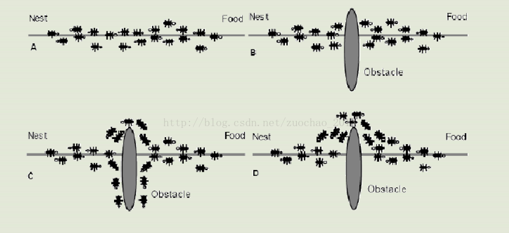

### 基本原理

1、蚂蚁在路径上释放信息素。 

2、碰到还没走过的路口，就随机挑选一条路走。同时，释放与路径长度有关的信息素。 

3、信息素浓度与路径长度成反比。后来的蚂蚁再次碰到该路口时，就选择信息素浓度较高路径。 

4、最优路径上的信息素浓度越来越大。 

5、最终蚁群找到最优寻食路径。

### 基于旅行商\(TSP\)问题的基本蚁群算法

旅行商\(TSP\)求解中，假设蚁群算法中的每只蚂蚁是具有以下特征的简单智能体：

* 每次周游，每只蚂蚁在其经过的支路 $$(i,j)$$ 上都留下信息素。
* 蚂蚁选择城市的概率与城市之间的距离和当前连接支路上所包含的信息素余量有关。
* 为了强制蚂蚁进行合法的周游，直到一次周游完成后，才允许蚂蚁游走已访问过的城市（这可由禁忌表来控制）。

基本蚁群的两个过程：（1）状态转移（2）信息素更新

#### （1）状态转移

为了避免残留信息素过多而淹没启发信息，在每只蚂蚁走完一步或者完成对所有 $$n$$ 个城市的遍历\(也即一个循环结束\)后，要对残留信息进行更新处理。

由此， $$t+n$$ 时刻在路径 $$(i,j)$$ 上的信息量可按如下规则进行调整：

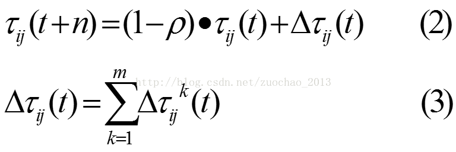

#### （2）信息素更新模型

* 蚁周模型（Ant-Cycle模型）
* 蚁量模型（Ant-Quantity模型）
* 蚁密模型（Ant-Density模型）

区别： 

* 蚁周模型利用的是全局信息，即蚂蚁完成一个循环后更新所有路径上的信息素。
* 蚁量和蚁密模型利用的是局部信息，即蚂蚁完成一步后更新路径上的信息素。

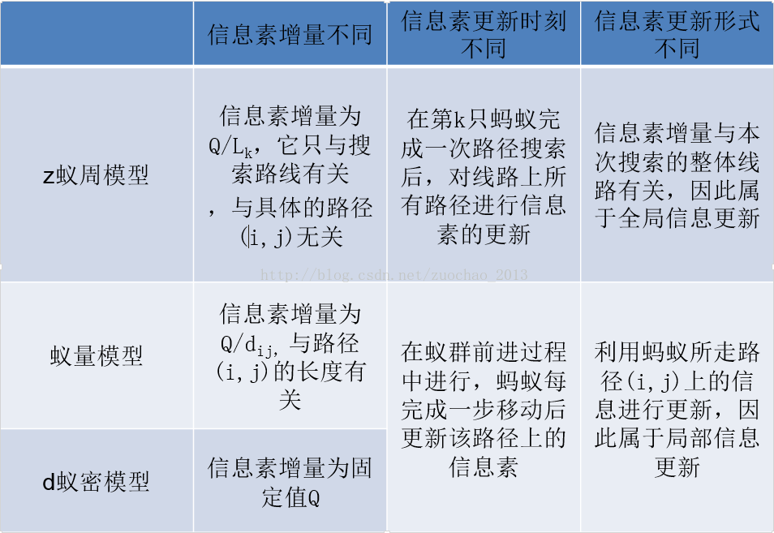

### 蚁群算法基本流程与参数

#### 蚁群算法基本流程

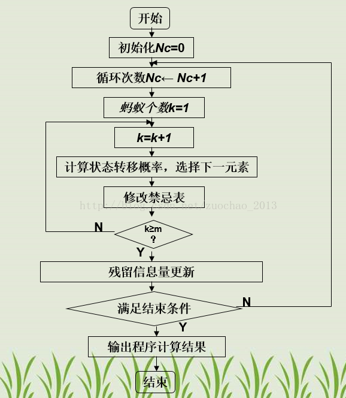

#### 蚁群算法主要参数

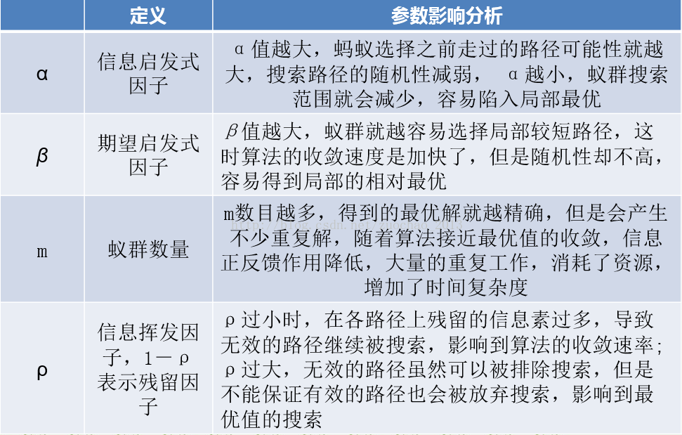

蚁群算法中主要参数的理想选择如下：

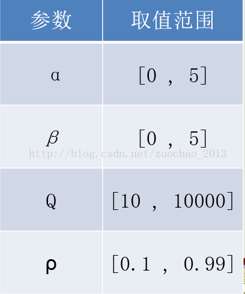

### 蚁群系统对基本蚁群算法改进

国内外对于离散域蚁群算法的改进研究成果很多，例如自适应蚁群算法、基于信息素扩散的蚁群算法等，这里仅介绍离散域优化问题的自适应蚁群算法。

自适应蚁群算法：对蚁群算法的状态转移概率、信息素挥发因子、信息量等因素采用自适应调节策略为一种基本改进思路的蚁群算法。

自适应蚁群算法中两个最经典的方法：蚁群系统\(AntColony System, ACS\)和最大-最小蚁群系统\(MAX-MINAnt System, MMAS\)。

（1）蚂蚁的状态转移规则不同

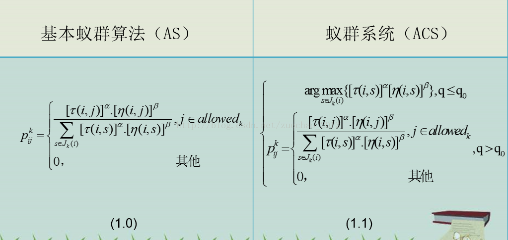

（2） 全局更新规则不同

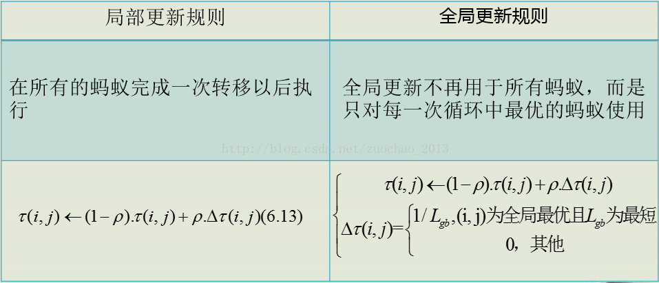

（3）新增了对各条路径信息量调整的局部更新规则

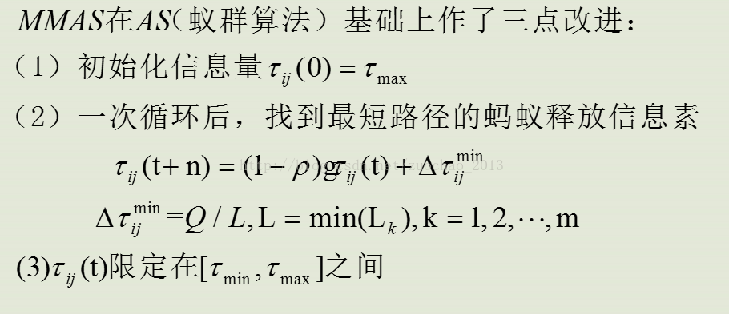

### 相关例子

用蚁群算法求解TSP问题：一个旅行商人要拜访全国31个省会城市，需要选择最短的路径。

```text
clear all; %清除所有变量
close all; %清图
clc ;      %清屏
m=50;    %% m 蚂蚁个数
Alpha=1;  %% Alpha 表征信息素重要程度的参数
Beta=5;  %% Beta 表征启发式因子重要程度的参数
Rho=0.1; %% Rho 信息素蒸发系数
NC_max=200; %%最大迭代次数
Q=100;         %%信息素增加强度系数

C=[
1304 2312;
3639 1315;
4177 2244;
3712 1399;
3488 1535;
3326 1556;
3238 1229;
4196 1004;
4312 790;
4386 570;
3007 1970;
2562 1756;
2788 1491;
2381 1676;
1332 695;
3715 1678;
3918 2179;
4061 2370;
3780 2212;
3676 2578;
4029 2838;
4263 2931;
3429 1908;
3507 2367;
3394 2643;
3439 3201;
2935 3240;
3140 3550;
2545 2357;
2778 2826;
2370 2975
];                %%31个省会坐标
%%-------------------------------------------------------------------------
%% 主要符号说明
%% C n个城市的坐标，n×2的矩阵
%% NC_max 最大迭代次数
%% m 蚂蚁个数
%% Alpha 表征信息素重要程度的参数
%% Beta 表征启发式因子重要程度的参数
%% Rho 信息素蒸发系数
%% Q 信息素增加强度系数
%% R_best 各代最佳路线
%% L_best 各代最佳路线的长度
%%=========================================================================
%%第一步：变量初始化
n=size(C,1);%n表示问题的规模（城市个数）
D=zeros(n,n);%D表示完全图的赋权邻接矩阵
for i=1:n
    for j=1:n
        if i~=j
            D(i,j)=((C(i,1)-C(j,1))^2+(C(i,2)-C(j,2))^2)^0.5;
        else
            D(i,j)=eps;      %i=j时不计算，应该为0，但后面的启发因子要取倒数，用eps（浮点相对精度）表示
        end
        D(j,i)=D(i,j);   %对称矩阵
    end
end
Eta=1./D;          %Eta为启发因子，这里设为距离的倒数
Tau=ones(n,n);     %Tau为信息素矩阵
Tabu=zeros(m,n);   %存储并记录路径的生成
NC=1;               %迭代计数器，记录迭代次数
R_best=zeros(NC_max,n);       %各代最佳路线
L_best=inf.*ones(NC_max,1);   %各代最佳路线的长度
L_ave=zeros(NC_max,1);        %各代路线的平均长度


while NC<=NC_max        %停止条件之一：达到最大迭代次数，停止
    %%第二步：将m只蚂蚁放到n个城市上
    Randpos=[];   %随即存取
    for i=1:(ceil(m/n))
        Randpos=[Randpos,randperm(n)];
    end
    Tabu(:,1)=(Randpos(1,1:m))';   
    %%第三步：m只蚂蚁按概率函数选择下一座城市，完成各自的周游
    for j=2:n     %所在城市不计算
        for i=1:m
            visited=Tabu(i,1:(j-1)); %记录已访问的城市，避免重复访问
            J=zeros(1,(n-j+1));       %待访问的城市
            P=J;                      %待访问城市的选择概率分布
            Jc=1;
            for k=1:n
                if length(find(visited==k))==0   %开始时置0
                    J(Jc)=k;
                    Jc=Jc+1;                         %访问的城市个数自加1
                end
            end
            %下面计算待选城市的概率分布
            for k=1:length(J)
                P(k)=(Tau(visited(end),J(k))^Alpha)*(Eta(visited(end),J(k))^Beta);
            end
            P=P/(sum(P));
            %按概率原则选取下一个城市
            Pcum=cumsum(P);     %cumsum，元素累加即求和
            Select=find(Pcum>=rand); %若计算的概率大于原来的就选择这条路线
            to_visit=J(Select(1));
            Tabu(i,j)=to_visit;
        end
    end
    if NC>=2
        Tabu(1,:)=R_best(NC-1,:);
    end
    %%第四步：记录本次迭代最佳路线
    L=zeros(m,1);     %开始距离为0，m*1的列向量
    for i=1:m
        R=Tabu(i,:);
        for j=1:(n-1)
            L(i)=L(i)+D(R(j),R(j+1));    %原距离加上第j个城市到第j+1个城市的距离
        end
        L(i)=L(i)+D(R(1),R(n));      %一轮下来后走过的距离
    end
    L_best(NC)=min(L);           %最佳距离取最小
    pos=find(L==L_best(NC));
    R_best(NC,:)=Tabu(pos(1),:); %此轮迭代后的最佳路线
    L_ave(NC)=mean(L);           %此轮迭代后的平均距离
    NC=NC+1                      %迭代继续

    
    %%第五步：更新信息素
    Delta_Tau=zeros(n,n);        %开始时信息素为n*n的0矩阵
    for i=1:m
        for j=1:(n-1)
            Delta_Tau(Tabu(i,j),Tabu(i,j+1))=Delta_Tau(Tabu(i,j),Tabu(i,j+1))+Q/L(i);
            %此次循环在路径（i，j）上的信息素增量
        end
        Delta_Tau(Tabu(i,n),Tabu(i,1))=Delta_Tau(Tabu(i,n),Tabu(i,1))+Q/L(i);
        %此次循环在整个路径上的信息素增量
    end
    Tau=(1-Rho).*Tau+Delta_Tau; %考虑信息素挥发，更新后的信息素
    %%第六步：禁忌表清零
    Tabu=zeros(m,n);             %%直到最大迭代次数
end
%%第七步：输出结果
Pos=find(L_best==min(L_best)); %找到最佳路径（非0为真）
Shortest_Route=R_best(Pos(1),:) %最大迭代次数后最佳路径
Shortest_Length=L_best(Pos(1)) %最大迭代次数后最短距离

figure(1) 
plot(L_best)
xlabel('迭代次数')
ylabel('目标函数值')
title('适应度进化曲线')


figure(2)
subplot(1,2,1)                  %绘制第一个子图形
   %画路线图
%%=========================================================================
%% DrawRoute.m
%% 画路线图
%%-------------------------------------------------------------------------
%% C Coordinate 节点坐标，由一个N×2的矩阵存储
%% R Route 路线
%%=========================================================================
N=length(R);
scatter(C(:,1),C(:,2));
 hold on
 plot([C(R(1),1),C(R(N),1)],[C(R(1),2),C(R(N),2)],'g')
 hold on
for ii=2:N
    plot([C(R(ii-1),1),C(R(ii),1)],[C(R(ii-1),2),C(R(ii),2)],'g')
     hold on
end
title('旅行商问题优化结果 ')

subplot(1,2,2)                  %绘制第二个子图形
plot(L_best)
hold on                         %保持图形
plot(L_ave,'r')
title('平均距离和最短距离')     %标题
```

输出结果如下：

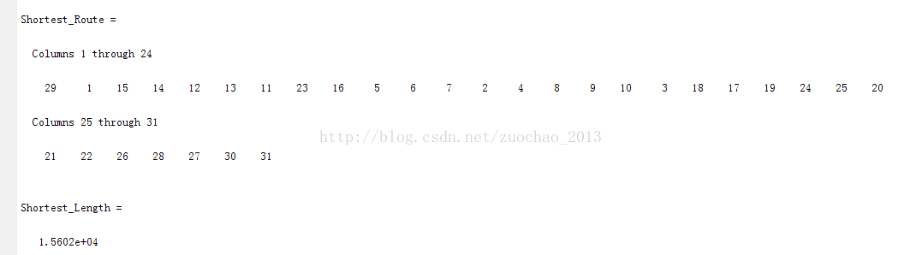

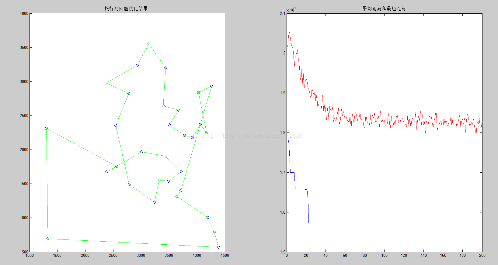

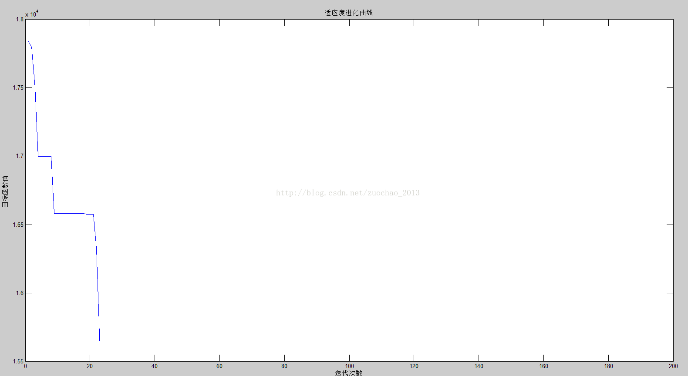

## [模拟退火](https://www.cnblogs.com/heaad/archive/2010/12/20/1911614.html)

### 爬山算法

介绍模拟退火前，先介绍爬山算法。爬山算法是一种简单的贪心搜索算法，该算法每次从当前解的临近解空间中选择一个最优解作为当前解，直到达到一个局部最优解。爬山算法实现很简单，其主要缺点是会陷入局部最优解，而不一定能搜索到全局最优解。如下图所示：假设C点为当前解，爬山算法搜索到A点这个局部最优解就会停止搜索，因为在A点无论向那个方向小幅度移动都不能得到更优的解。


### 模拟退火思想

爬山法是完完全全的贪心法，每次都鼠目寸光的选择一个当前最优解，因此只能搜索到局部的最优值。模拟退火其实也是一种贪心算法，但是它的搜索过程引入了随机因素。模拟退火算法以一定的概率来接受一个比当前解要差的解，因此有可能会跳出这个局部的最优解，达到全局的最优解。以上图为例，模拟退火算法在搜索到局部最优解A后，会以一定的概率接受到E的移动。也许经过几次这样的不是局部最优的移动后会到达D点，于是就跳出了局部最大值A。

模拟退火算法来源于固体退火原理，将固体加温至充分高，再让其徐徐冷却，加温时，固体内部粒子随温升变为无序状，内能增大，而徐徐冷却时粒子渐趋有序，在每个温度都达到平衡态，最后在常温时达到基态，内能减为最小。

模拟退火算法是一种随机算法，并不一定能找到全局的最优解，可以比较快的找到问题的近似最优解。 如果参数设置得当，模拟退火算法搜索效率比穷举法要高。


### 算法描述

* 若 $$J(Y_{i+1})>=J(Y_{i})$$，即移动后得到更优解，则总是接受该移动。
* 若 $$J(Y_{i+1})<J(Y_{i})$$，即移动后的解比当前解要差，则以一定的概率接受移动，而且这个概率随着时间推移逐渐降低（逐渐降低才能趋向稳定）。

这里的“一定的概率”的计算参考了金属冶炼的退火过程，这也是模拟退火算法名称的由来。

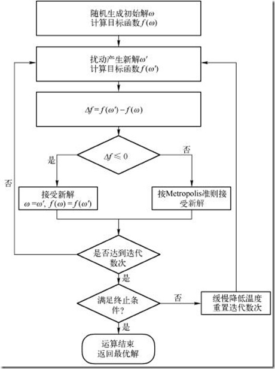

### 算法伪代码

```java
/*
* J(y)：在状态y时的评价函数值
* Y(i)：表示当前状态
* Y(i+1)：表示新的状态
* r： 用于控制降温的快慢
* T： 系统的温度，系统初始应该要处于一个高温的状态
* T_min ：温度的下限，若温度T达到T_min，则停止搜索
*/
while( T > T_min )
{
　　dE = J( Y(i+1) ) - J( Y(i) ) ; 

　　if ( dE >=0 ) //表达移动后得到更优解，则总是接受移动
Y(i+1) = Y(i) ; //接受从Y(i)到Y(i+1)的移动
　　else
　　{
// 函数exp( dE/T )的取值范围是(0,1) ，dE/T越大，则exp( dE/T )也
if ( exp( dE/T ) > random( 0 , 1 ) )
Y(i+1) = Y(i) ; //接受从Y(i)到Y(i+1)的移动
　　}
　　T = r * T ; //降温退火 ，0<r<1 。r越大，降温越慢；r越小，降温越快
　　/*
　　* 若r过大，则搜索到全局最优解的可能会较高，但搜索的过程也就较长。若r过小，则搜索的过程会很快，但最终可能会达到一个局部最优值
　　*/
　　i ++ ;
}
```

### 相关例子

使用模拟退火算法可以比较快的求出TSP的一条近似最优路径。模拟退火解决TSP的思路：

1. 1、产生一条新的遍历路径 $$P_{(i+1)}$$ ，计算路径 $$P_{(i+1)}$$ 的长度 $$L(P_{(i+1)})$$ 
2. 2、若 $$L(P_{(i+1)})<L(P_{(i)})$$ ，则接受 $$P_{(i+1)}$$ 为新的路径，否则模拟退火的那个概率接受

   1.  $$P_{(i+1)}$$ ，然后降温（即接受概率减小）

   3、重复1、2直到满足推出条件

产生新的遍历路径的方法有很多，下面列举其中3种：

* 随机选择2个节点，交换路径中的这2个节点的顺序。
* 随机选择2个节点，将路径中这2个节点间的节点顺序逆转。
* 随机选择3个节点m，n，k，然后将节点m与n间的节点移位到节点k后面。

## [遗传算法](http://www.cnblogs.com/heaad/archive/2010/12/23/1914725.html)

遗传算法 \( GA , Genetic Algorithm \) ，也称进化算法 。 遗传算法是受达尔文的进化论的启发，借鉴生物进化过程而提出的一种启发式搜索算法。

### 遗传算法思想

借鉴生物进化论，遗传算法将要解决的问题模拟成一个生物进化的过程，通过复制、交叉、突变等操作产生下一代的解，并逐步淘汰掉适应度函数值低的解，增加适应度函数值高的解。这样进化N代后就很有可能会进化出适应度函数值很高的个体。

举个例子，使用遗传算法解决“0-1背包问题”的思路：0-1背包的解可以编码为一串0-1字符串（0：不取，1：取） ；首先，随机产生M个0-1字符串，然后评价这些0-1字符串作为0-1背包问题的解的优劣；然后，随机选择一些字符串通过交叉、突变等操作产生下一代的M个字符串，而且较优的解被选中的概率要比较高。这样经过G代的进化后就可能会产生出0-1背包问题的一个“近似最优解”。

编码：需要将问题的解编码成字符串的形式才能使用遗传算法。最简单的一种编码方式是二进制编码，即将问题的解编码成二进制位数组的形式。例如，问题的解是整数，那么可以将其编码成二进制位数组的形式。将0-1字符串作为0-1背包问题的解就属于二进制编码。

### 遗传算法步骤

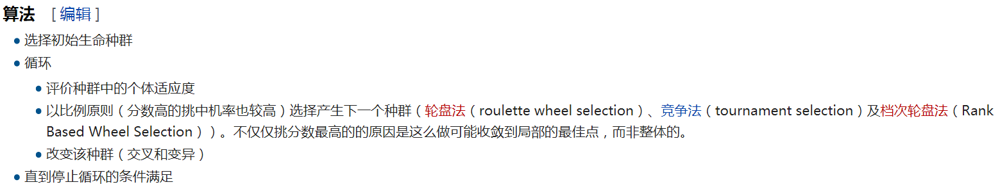

## Source





{% embed url="https://baike.baidu.com/item/%E6%A8%A1%E6%8B%9F%E9%80%80%E7%81%AB%E7%AE%97%E6%B3%95" %}



{% embed url="https://zh.wikipedia.org/wiki/%E9%81%97%E4%BC%A0%E7%AE%97%E6%B3%95" %}




