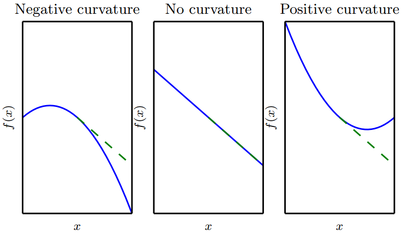

# Jacobian和Hessian矩阵

有时我们需要计算输入和输出都为向量的函数的所有偏导数。包含所有这样的偏导数的矩阵被称为Jacobian矩阵。具体来说，如果我们有一个函数： $$f:\mathbb{R}^m\to\mathbb{R}^n$$ ， $$f$$ 的Jacobian矩阵 $$J\in\mathbb{R}^{n\times m}$$ 定义为 $$J_{i,j}=\frac{\partial}{\partial x_j}f(x)_i$$ 。

有时，我们也对导数的导数感兴趣，即二阶导数\(second derivative\)。例如，有一个函数 $$f:\mathbb{R}^m\to \mathbb{R}$$ ， $$f$$ 的一阶导数\(关于 $$x_j$$\)关于 $$x_i$$ 的导数记为 $$\frac{\partial^2}{\partial x_i\partial x_j}f$$ 。在一维的情况下，我们可以将 $$\frac{\partial^2}{\partial x^2}f$$ 为 $$f''(x)$$ 。二阶导数告诉我们，一阶导数将如何随着输入的变化而变化。它表示只基于梯度信息的梯度下降步骤是否会产生如我们预期的那样大的改善，因此它是重要的。我们可以认为，二阶导数是对曲率的衡量。假设我们有一个二次函数\(虽然很多实践中的函数都不是二次的，但至少在局部可以很好地用二次近似\)。如果这样的函数具有零二阶导数，那就没有曲率。也就是一条完全平坦的线，仅用梯度就可以预测它的值。我们使用沿负梯度方向大小为 $$\epsilon$$ 的下降步，当该梯度是 $$1$$ 时，代价函数将下降 $$\epsilon$$ 。如果二阶导数是负的，函数曲线向下凹陷\(向上凸出\)，因此代价函数将下降的比 $$\epsilon$$ 多。如果二阶导数是正的，函数曲线是向上凹陷\(向下凸出\)，因此代价函数将下降的比 $$\epsilon$$ 少。从下图可以看出不同形式的曲率如何影响基于梯度的预测值与真实的代价函数值的关系。

当我们的函数具有多维输入时，二阶导数也有很多。我们可以将这些导数合并成一个矩阵，称为Hessian矩阵。Hessian矩阵 $$H(f)(x)$$ 定义为：

                                                              $$H(f)(x)_{i,j}=\frac{\partial^2}{\partial x_i \partial x_j}f(x)$$ 

Hessian等价于梯度的Jacobian矩阵。

微分算子在任何二阶偏导连续的点处可交换，也就是它们的顺序可以互换：

                                                              $$\frac{\partial^2}{\partial x_i\partial x_j}f(x)=\frac{\partial^2}{\partial x_j\partial x_i}f(x)$$ 

这意味着 $$H_{i,j}=H_{j,i}$$ ，因此Hessian矩阵在这些点上是对称的。在深度学习背景下，我们遇到的大多数函数的Hessian几乎处处都是对称的。因为Hessian矩阵是实对称的，我们可以将其分解成一组实特征值和一组特征向量的正交基。在特定方向 $$d$$ 上的二阶导数可以写成 $$d^\top Hd$$ 。当 $$d$$ 是 $$H$$ 的一个特征向量时，这个方向的二阶导数就是对应的特征值。对于其他的方向 $$d$$ ，方向二阶导数是所有特征值的加权平均，权重在 $$0$$ 和 $$1$$ 之间，且与 $$d$$ 夹角越小的特征向量的权重越大。最大特征值确定最大二阶导数，最小特征值确定最小二阶导数。

