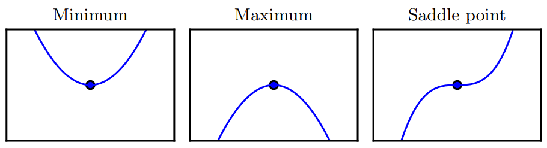
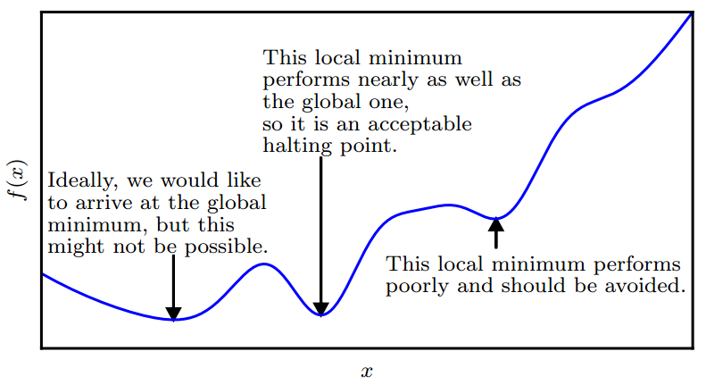

# 极大、极小和鞍点

当 $$f'(x)=0$$ ，即导数为零时，导数无法提供往哪个方向移动的信息。 $$f'(x)=0$$ 的点成为临界点\(critical point\)或驻点\(stationary point\)。一个局部极小点\(local minimum\)意味着这个点的 $$f(x)$$ 小于所有临近点，因此不可能通过移动无穷小的步长来减小 $$f(x)$$。一个局部极大点\(local maximum\)意味着这个点的 $$f(x)$$大于所有邻近点，因此不可能通过移动无穷小的步长来增大 $$f(x)$$。有些临近点既不是最小点也不是最大点。这些点被称为鞍点\(saddle point\)。如下图所示

使 $$f(x)$$ 取得绝对的最小值（相对所有其他值）的点是全局最小点\(global minimum\)。函数可能有一个全局最小点或存在多个全局最小点，还可能存在不是全局最优的局部极小点。在深度学习的背景下，我们要优化的函数可能含有许多不是最优的局部极小点，或者还有很多处于非常平坦的局域内的鞍点。尤其是当输入是多维的时候，所有这些都将使优化变得困难。因此，我们通常寻找使 $$f$$ 非常小的点，但这在任何形式意义下并不一定是最小，如下图例子：

