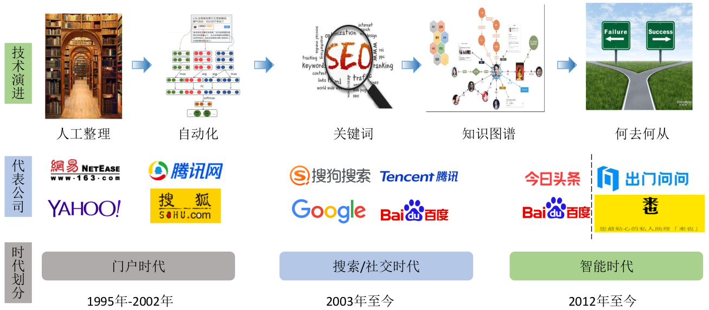
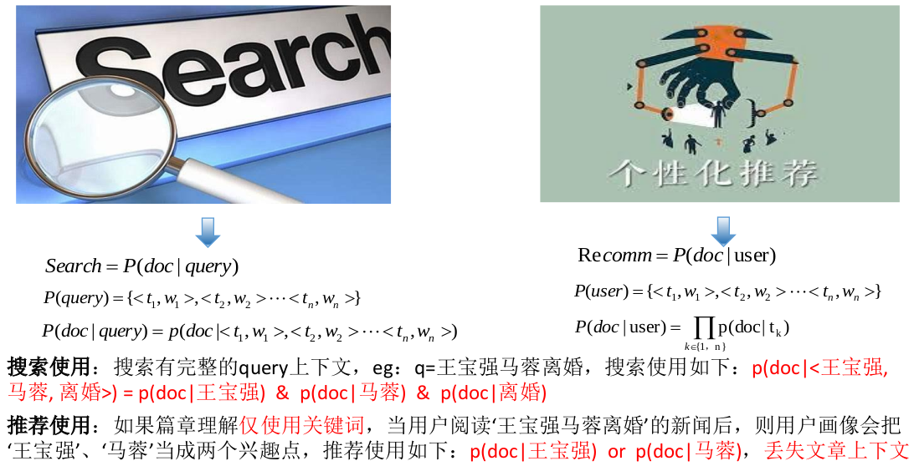
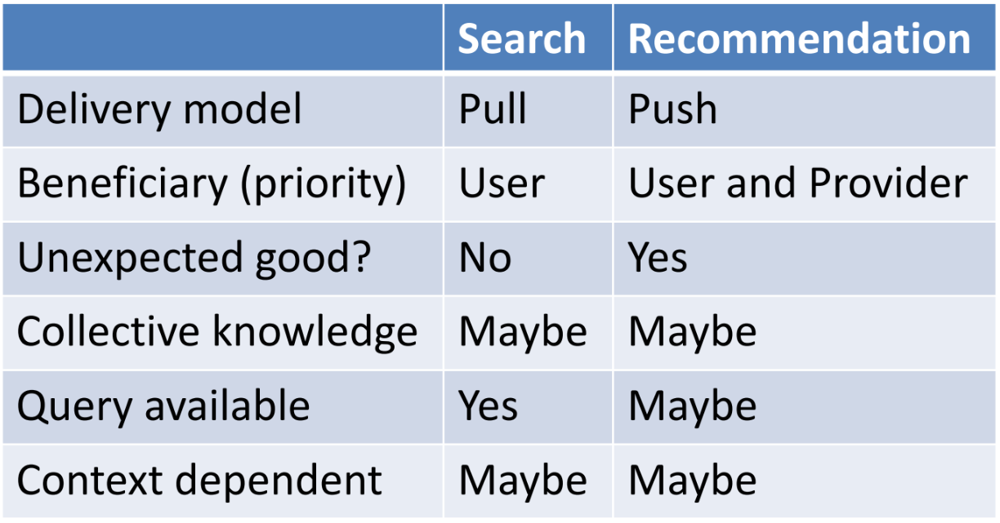
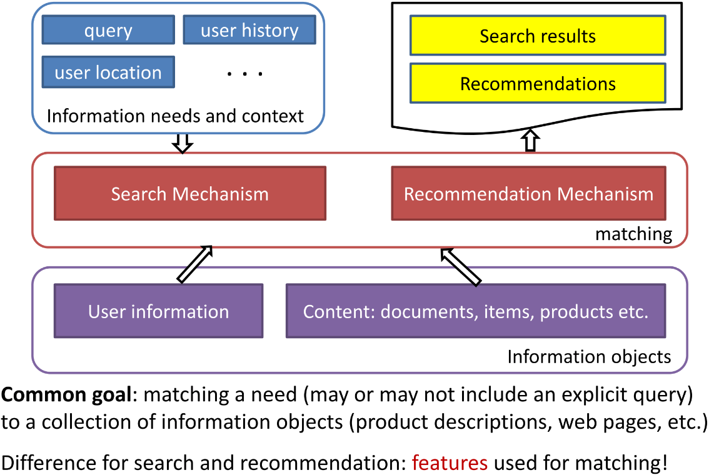
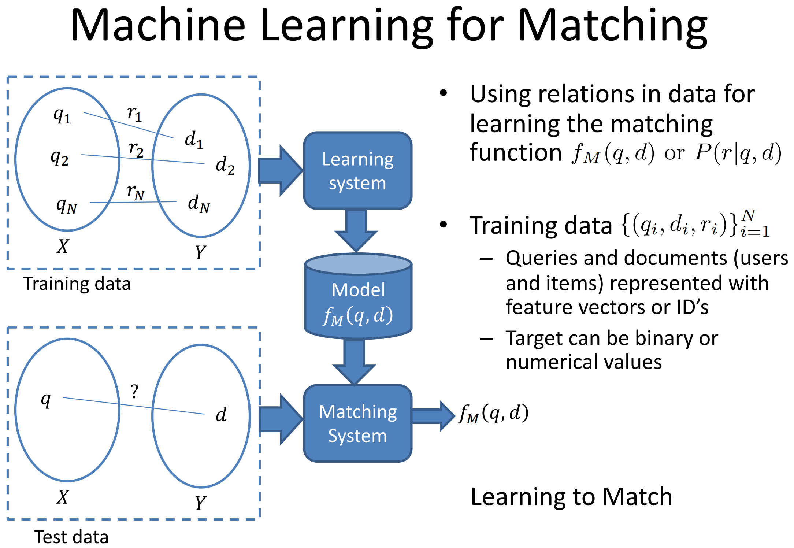

# 搜索推荐广告

流量和变现是互联网公司能否成功的两个关键因素。流量简单来说就是活跃用户量。变现有各种途径，比如滴滴向乘客收取服务费用，美团向商家获取加盟费，京东操作现金流盈利等等，但互联网公司最核心的还是广告变现，自从雅虎开创向广告主收费的互联网盈利模式，企业不再需要像通讯公司那样用户使用一次服务计一次费，这也为互联网行业安上了翅膀，助其腾飞。

互联网人对行业看的很透彻，就是流量和变现，所以策略也就简单了，先砸钱打开市场，培养用户粘性，当然纯砸钱可以带来一定的活跃用户，但真正让用户留存下来，还需要搜索及推荐技术的支撑，简单来说，就是产品要好用。当掌控了一定的流量，盈利就提上日程了，毕竟公司要盈利赚钱才能走向良性循环，不然就变成了炸弹套娃行为，每个人许下美好愿景后套现逃离，最后老实人接盘爆炸，所以如何变现很重要，广告作为最核心的手段，也是互联网公司变现最根本的一种方式。

因为搜索、推荐、广告如此重要，所以被称为互联网的三驾马车，我在这里单独拿出一个章节来仔细和大家讨论分享一下。由于是互联网的核心，学术界和工业界都做了很多的探索与研究，成果也纷繁。这里做一下对比整理，帮助大家理解互联网核心的工作技术。

## 发展历史

搜索推荐广告密不可分，发展历程基本一致，同每个行业一样，互联网的项目大都发展历程也是

1. 项目运转：先让项目跑起来，流程走通
2. 自动化：项目跑起来后，开始从人力到自动化过渡
3. 智能化：完成自动化后，优化项目进行智能化提升效果

早期数据量少，靠人工即可做简单分类，所以门户网站在那时占据主导地位。年纪小的小朋友可能不太了解，但千禧年左右的中国最初的互联网三巨头是三大门户网站：新浪、网易、搜狐，当时二马还是以学生姿态向当时中国互联网第一人张朝阳学习讨教。海外雅虎门户作为互联网公司的先驱，开创了向广告主收费，用户免费的模式，为互联网的普及打下基础，否则若再像传统移动、联通、T-Mobile按次收费或量收费的模式，互联网的推广还要再晚不知道多少年。

03年至12年的十年属于搜索和社交的十年。全网搜索、细领域搜索，Google、百度等一众搜索起家公司开始腾飞。社交方面，熟人社交、陌生人社交，腾讯、Facebook、Twitter等通讯工具、媒体中介起家公司也开始腾飞。可以说这十年是互联网行业黄金十年。在资本积累之后，有大量的财力去反哺技术，实现了基于关键词等等的自动化能力。

12年至今，随着互联网的蓬勃发展，信息更一步爆炸，用户的需求也进一步提高，这就要求互联网公司要能提供更智能化，更贴近用户想要的才能更好的发展。所以，搜索推荐广告针对各垂直领域进行了细分优化，衣食住行，淘宝、美团、链家、滴滴...

## 联系与区别

三者本质都是匹配问题，都用相似的召回-排序-展示的技术框架，但又有很多不同。

|  | 搜索 | 推荐 | 广告 |
| :---: | :---: | :---: | :---: |
| 目标 | 流量 | 流量 | 变现 |
| Query | 有 | 无 | 无 |
| 系统 | 搜索 | 个性化 | 个性化 |

### 目标

互联网产品的搜索、推荐模块大都是为了提高用户体验以达到增加用户黏性或者吸引用户的目的，本质都是获得流量；而广告则是为了变现，要博弈兼顾广告主\(转化\)、用户\(体验\)和平台\(盈利\)，这是本质区别。从优化目标上体现最为明显，搜索推荐大都采用点击率最为主要评价指标，转化率为辅；而广告是以转化率为主，点击率为辅。

### Query

搜索一般都会有用户主动提供的query，不论是文本还是像以图搜图各种类型的query；而推荐和广告大部分没有用户主动提供的query，需要自行提取用户特征。当然也有例外，比如搜索推荐，在头条里搜索个事件，推荐根据内容和query进行排序，list谁第一谁第三都是有依据的。当然，你如果放到百度里去搜，那就是搜索广告，百度搜索留学后出现的留学广告是有query依照，但这只占广告的一小部分。

### 系统

个性化系统和搜索系统都是互联网时代具有挑战性的大规模计算问题。两者的主要差别在于大量的用户特征的使用。这个很好理解，因为搜索有query，带有很强的目的性，且我们为了尽快满足用户的搜索需求，大量的用户特征使用的较少。相较而言，推荐和广告采用个性化系统，为了达到用户感兴趣的目的，会使用大量的用户特征以匹配排序到更贴合用户的内容，怎样获取用户特征，怎样使用用户特征，这也是业界和学界探索的方向。

## 搜索 vs 推荐

正如前文所属，搜索推荐都是匹配问题，都有一堆候选集，我们要在候选集里反回用户所需求的。不同的是搜索有用户提供的明确指导这次匹配任务的query，而推荐没有query，需要自己挖掘用户兴趣需求。比如下图举例，用户搜索王宝强马蓉离婚，我们只需要从候选集里取出相关数据即可。而推荐则是出了王宝强马蓉离婚这个事后，要不要推给用户，推的话是因为用户对王宝强草根明星感兴趣，还是对马蓉颜值到底长什么样感兴趣，还是因为明星离婚想吃瓜，还是说压根对这个事件不感兴趣。

从上面的举例就可以看出下图对比的两者区别，比如delivery model，搜索是从信息库候选集中拉取信息，而推荐是push信息等。

## 推荐 vs 广告

推荐和广告都没有query可以利用，都是基于用户信息从信息候选集里挑选内容push给用户。不同的是推荐的候选集是自然信息，而广告的候选集则是广告信息。

## 最大挑战

既然搜索推荐都是匹配问题，那它们的最大难点，或者说要解决的问题，其实就是语义差距\(Semantic Gap\)，搜索是针对Query-doc之间的mismatch，推荐广告是针对User-item之间的mismatch。

## 机器学习的应用

## Source









