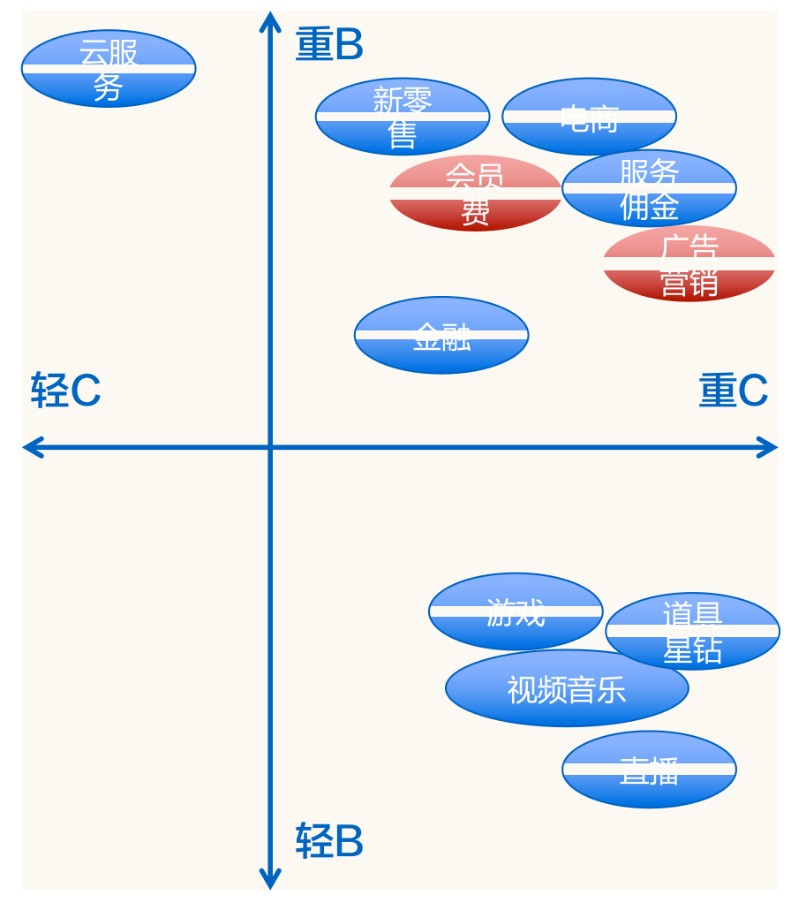
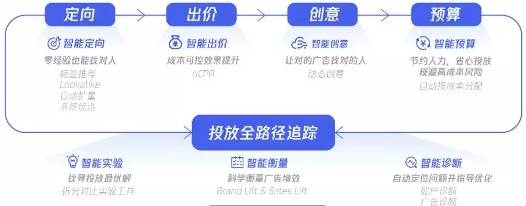

# 广告

互联网公司根据其核心业务的不同收入也可有多种渠道形式，正如之前举例的，滴滴收取打车用户服务佣金、美团收取商品会员费、京东卖出东西后的款项做现金流投资到结算时间再交付给供应商...虽然变现渠道众多，但大部分互联网最主要的方式是会员费与广告营销两种渠道，其中业界比较大的广告商业化产品有Google AdWords、Facebook、百度凤巢、阿里妈妈、腾讯广点通、头条巨量...从To B和To C端维度划分可以如下图

## 广告知识

### 三方博弈

整个广告系统由三方组成：用户、媒体平台、广告主

* 用户：使用产品满足自身的诉求。
* 媒体平台：有流量资源，有变现赚钱的需求。
* 广告主：有广告预算，希望影响到客户。

### 广告主

广告主就是金主爸爸。广告主范围非常广，比较大的广告主像宝洁、欧莱雅等等大型企业，小的广告主比如小区门口配钥匙的老大爷在58同城上买服务发布广告，也是广告主。

### 广告流程

整个广告主投放广告的流程，开完账户后：设置预算、流量定向、进行出价、制定广告创意。配置完成后投放广告，然后再验证投放效果，进行相关分析，然后再去进行相关调整的一个过程。

### 广告位

广告位顾名思义，就是展示广告的地方。不同的产品有不同的广告位，比如百度搜索广告插入在搜索结果中，爱奇艺广告放在视频的开头\(前贴\)、结尾\(中贴\)、中插\(暂停\)等，当然一个产品会有很多的广告位，爱奇艺除了视频播放界面，推荐流中也会有广告，微博甚至有近30种不同广告位。

当然随着互联网的蓬勃发展，各个产品也对自己的广告位做了不同策略的优化，最经典的优化即Facebook将广告从侧面插入在信息流中。再有就是为了不影响用户对产品的体验，媒体对广告位做的优化，比如抖音根据你平时刷的习惯，估计出你本次会刷多少条短视频，间隔多少视频放一个广告视频比较合适。

### 流量 vs 需求

广告行业有各种博弈，因为其本质就是一个供需市场。比如我因为不想因为广告过度影响用户体验，设定每10个抖音短视频间插入1个广告，假设每天有约100个视频曝光量，按之前的设定就有约10个广告插入，这就是供方\(媒体平台\)能提供的商品，买方\(广告主\)根据自身情况对商品进行出价。再比如各App开启后有3秒的登录广告，每天登录次数量级就那么大，这个几乎最优质的广告位怎么进行售卖就需要各个平台仔细规划了。所以，流量预测、流量分配是门很大的学问，很多广告投放预算平滑技术对此做了很多研究。

### 短期收益 vs 长期生态

上面提到的流量vs需求是媒体平台和广告主的博弈，最开始就讲了互联网广告是三方博弈，自然就存在媒体平台和用户之间的博弈。媒体平台可以通过广告进行变现赚钱，这个钱怎么个赚法，是注重短期收益，疯狂增加广告位，一条搜索10个结果9个广告，还是维持良好生态100个结果只展示1个广告还是放在最后？动态调整达到较均衡，健康的生态才是正确的道路。所以各个公司的第一步基本都会建设自身的生态健康评价体系，即包含各种指标：点击率、日活量、收入...的一个指标平台来监控生态变化，以方便进行策略调整，保证自己在活下去的前提下越活越好。

### 品牌广告 vs 效果广告

广告业界分为品牌广告和效果广告：

* 品牌广告一般是品牌为了增加曝光和自身在社会中形象而购买的，一般都是大企业如宝洁、欧莱雅等，注重长期影响力，短期收益并不重要。
* 效果广告如名字，就是看中效果，看重短期转化率，一般都是中小微型用户，毕竟不像大公司财大气粗，做宣传就是为了更好的赚钱。

### 公域流量 vs 私域流量

大家有没有想过为什么阿里和腾讯是国内互联网公司里的两极，他们本身的变现方式是一个很大的因素，腾讯游戏变现这里不详细展开。我们先说说淘宝，也就是电商，还有京东和拼多多也一样，他们的广告主就是商家或品牌，在这种媒体类型中推荐就是广告，转化场景直接，广告主众多，最好做。再来讲讲抖音，头条这种内容为王的公域流量，用户看的内容就是他感兴趣的，那根据他感兴趣的内容直接匹配相关广告就可以，也是简单直接，不过相较于电商多了一层兴趣点到广告的匹配。然后就是微博这种私域流量，大家有没有想过看B站之类的视频时，up都是留微博账号，而不是其他的？就是因为像抖音内容为王，火的时候非常火，但一星期甚至三天你的内容不吸引人了，曝光量就一落千丈，而微博这种私域流量可以保证稳定的曝光，一个有千万非垃圾粉的账号，每条微博的曝光度相对稳定。但是私域流量的转化较复杂，因为用户是对这个人感兴趣，需要从感兴趣的人推理到感兴趣的点再到广告的匹配，多一层难度不止是指数级上升了。

### 拍卖博弈

明标\(开放式拍卖\)：买家相互间知道价格，明枪博弈。

* [英式拍卖](https://baike.baidu.com/item/%E8%8B%B1%E5%9B%BD%E5%BC%8F%E6%8B%8D%E5%8D%96/4015845)：就是我们在春晚上看到的本山大叔卖轮椅时的方式，价格从低到高叫价，相互知道价格。
* [荷兰拍卖](https://baike.baidu.com/item/%E8%8D%B7%E5%85%B0%E5%BC%8F%E6%8B%8D%E5%8D%96)：又称为减价拍卖，拍卖的竞价由高到低依次递减直到第一个竞买人应价或超过底价。

暗标\(封闭式拍卖 \)：如名所示，即采用保密手段暗中较劲，大家不知道明确竞价。互联网广告就是基于封闭式拍卖，竞价者只能知道自己的出价，而不知其他竞价者的出价。

### 结算方式

广告计费分为定价计费和竞价计费两种形式

#### 定价计费

#### 竞价计费

媒体平台承担风险：CPT/CPM-- CPC -- CPA：广告主承担风险

选择合适的竞价计费方式其实也是一种需求方\(广告主\)和供给方\(媒体平台\)的一种博弈形式：若采用CPT/CPM的模式，风险全部都在需求方，供给方只需要按约定进行广告曝光即可，所以这种模式一般适用于品牌广告；若采用CPA的模式，风险全部都在供给方，比如虽然供给方给予了合适人群场景大量的曝光但广告主提供的广告很烂，可能依旧没人点击转化，这种模式受到效果广告广告主的欢迎；相对而言CPC模式算是均衡需求方和供给方双方利益的模式，但是需要有良好的竞价环境，技术挑战也比较大。

<table>
  <thead>
    <tr>
      <th style="text-align:center">&#x7ED3;&#x7B97;&#x65B9;&#x5F0F;</th>
      <th style="text-align:center">&#x70B9;&#x51FB;&#x7387;&#x9884;&#x4F30;</th>
      <th style="text-align:center">&#x70B9;&#x51FB;&#x4EF7;&#x503C;&#x4F30;&#x8BA1;</th>
      <th style="text-align:center">&#x4F18;&#x7F3A;&#x70B9;</th>
      <th style="text-align:center">&#x9002;&#x7528;&#x573A;&#x666F;</th>
    </tr>
  </thead>
  <tbody>
    <tr>
      <td style="text-align:center">CPT</td>
      <td style="text-align:center">&#x9700;&#x6C42;&#x65B9;</td>
      <td style="text-align:center">&#x9700;&#x6C42;&#x65B9;</td>
      <td style="text-align:center">
        
&#x53EF;&#x4EE5;&#x5145;&#x5206;&#x53D1;&#x6325;&#x6A71;&#x7A97;&#x6548;&#x5E94;

        
&#x65E0;&#x6CD5;&#x5229;&#x7528;&#x53D7;&#x4F17;&#x5B9A;&#x5411;&#x6280;&#x672F;

      </td>
      <td style="text-align:center">&#x9AD8;&#x66DD;&#x5149;&#x7684;&#x54C1;&#x724C;&#x5E7F;&#x544A;</td>
    </tr>
    <tr>
      <td style="text-align:center">CPM</td>
      <td style="text-align:center">&#x9700;&#x6C42;&#x65B9;</td>
      <td style="text-align:center">&#x9700;&#x6C42;&#x65B9;</td>
      <td style="text-align:center">
        
&#x53EF;&#x5229;&#x7528;&#x53D7;&#x4F17;&#x5B9A;&#x5411;&#x9009;&#x62E9;&#x76EE;&#x6807;&#x4EBA;&#x7FA4;

        
&#x5408;&#x7EA6;&#x552E;&#x5356;&#x4E0B;&#x53D7;&#x4F17;&#x5212;&#x5206;&#x4E0D;&#x80FD;&#x8FC7;&#x7EC6;

      </td>
      <td style="text-align:center">
        
&#x53D7;&#x4F17;&#x9009;&#x62E9;&#x9700;&#x6C42;&#x7684;&#x54C1;&#x724C;&#x5E7F;&#x544A;

        
&#x5B9E;&#x65F6;&#x7ADE;&#x4EF7;&#x5E7F;&#x544A;&#x4EA4;&#x6613;

      </td>
    </tr>
    <tr>
      <td style="text-align:center">CPC</td>
      <td style="text-align:center">&#x4F9B;&#x7ED9;&#x65B9;</td>
      <td style="text-align:center">&#x9700;&#x6C42;&#x65B9;</td>
      <td style="text-align:center">
        
&#x53EF;&#x4EE5;&#x7CBE;&#x7EC6;&#x5212;&#x5206;&#x53D7;&#x4F17;&#x4EBA;&#x7FA4;

        
&#x5408;&#x7406;&#x7684;&#x4F9B;&#x7ED9;&#x65B9;&#x548C;&#x9700;&#x6C42;&#x65B9;&#x5206;&#x5DE5;

      </td>
      <td style="text-align:center">&#x7ADE;&#x4EF7;&#x5E7F;&#x544A;&#x7F51;&#x7EDC;</td>
    </tr>
    <tr>
      <td style="text-align:center">CPS/CPA/ROI</td>
      <td style="text-align:center">&#x4F9B;&#x7ED9;&#x65B9;</td>
      <td style="text-align:center">&#x4F9B;&#x7ED9;&#x65B9;</td>
      <td style="text-align:center">
        
&#x9700;&#x6C42;&#x65B9;&#x65E0;&#x4EFB;&#x4F55;&#x98CE;&#x9669;

        
&#x4F9B;&#x7ED9;&#x65B9;&#x8FD0;&#x8425;&#x96BE;&#x5EA6;&#x8F83;&#x5927;

      </td>
      <td style="text-align:center">
        
&#x6548;&#x679C;&#x7C7B;&#x5E7F;&#x544A;&#x8054;&#x76DF;

        
&#x6548;&#x679C;&#x7C7B;DSP

      </td>
    </tr>
    <tr>
      <td style="text-align:center">oCPM</td>
      <td style="text-align:center">&#x4F9B;&#x7ED9;&#x65B9;</td>
      <td style="text-align:center">&#x4F9B;&#x7ED9;&#x65B9;</td>
      <td style="text-align:center">&#x504F;&#x4F9B;&#x7ED9;&#x65B9;&#x7684;&#x5747;&#x8861;&#x7684;&#x7ED3;&#x7B97;&#x6A21;&#x5F0F;</td>
      <td
      style="text-align:center">&#x6570;&#x636E;&#x80FD;&#x529B;&#x5F3A;&#x7684;&#x5E7F;&#x544A;&#x5E73;&#x53F0;</td>
    </tr>
    <tr>
      <td style="text-align:center">oCPC</td>
      <td style="text-align:center">&#x4F9B;&#x7ED9;&#x65B9;</td>
      <td style="text-align:center">&#x4F9B;&#x7ED9;&#x65B9;</td>
      <td style="text-align:center">&#x5747;&#x8861;&#x7684;&#x7ED3;&#x7B97;&#x6A21;&#x5F0F;</td>
      <td style="text-align:center">&#x6570;&#x636E;&#x80FD;&#x529B;&#x5F3A;&#x7684;&#x5E7F;&#x544A;&#x5E73;&#x53F0;</td>
    </tr>
    <tr>
      <td style="text-align:center">oCPA</td>
      <td style="text-align:center">&#x4F9B;&#x7ED9;&#x65B9;</td>
      <td style="text-align:center">&#x4F9B;&#x7ED9;&#x65B9;</td>
      <td style="text-align:center">&#x504F;&#x9700;&#x6C42;&#x65B9;&#x7684;&#x5747;&#x8861;&#x7684;&#x7ED3;&#x7B97;&#x6A21;&#x5F0F;</td>
      <td
      style="text-align:center">
        
&#x6570;&#x636E;&#x80FD;&#x529B;&#x5F3A;&#x7684;&#x5E7F;&#x544A;&#x5E73;&#x53F0;

        
&#x6570;&#x636E;&#x80FD;&#x529B;&#x5F3A;&#x7684;&#x5E7F;&#x544A;&#x4E3B;

        </td>
    </tr>
    <tr>
      <td style="text-align:center">oCPX</td>
      <td style="text-align:center">&#x4F9B;&#x7ED9;&#x65B9;</td>
      <td style="text-align:center">&#x4F9B;&#x7ED9;&#x65B9;</td>
      <td style="text-align:center">&#x6DF7;&#x5408;&#x6A21;&#x5F0F;</td>
      <td style="text-align:center">
        
&#x6570;&#x636E;&#x80FD;&#x529B;&#x6781;&#x5F3A;&#x7684;&#x5E7F;&#x544A;&#x5E73;&#x53F0;

        
&#x6570;&#x636E;&#x80FD;&#x529B;&#x5F3A;&#x7684;&#x5E7F;&#x544A;&#x4E3B;

      </td>
    </tr>
  </tbody>
</table>CPT\(Cost per Time\)：将某个广告位的一定时段以独占形式售卖给广告主收取费用的方式。

CPM\(Cost per Mille\)：这里“Mille”是拉丁文千次的意思，即千次展示作为计费标准的衡量单位。

CPC\(Cost per Click\)：顾名思义，即按照点击结算，适用于效果广告。

CPS\(Cost per Sale\)/CPA\(Cost per Action\)/ROI：按销售、转化行为或投入产出比结算。这里简单介绍一下转化行为A\(Action\)，即用户行为到哪一步。比如一个游戏App的广告主，用户点击媒体上这则广告后的行为：下载、安装、注册、使用、付费。每一步都算作一种转化Action，即制定针对用户行为步的结算方式。

oCPM\(optimized Cost per Mille\)：本质还是按照CPM付费。采用更精准的点击率和转化率预估机制，将广告展现给最容易产生转化的用户，在获取流量的同时，提高转化率、降低转化成本，跑量提速更快。

oCPC\(optimized Cost per Click\)：本质还是按照CPC付费。采用更科学的转化率预估机制的准确性，可帮助需求方在获取更多优质流量的同时提高转化完成率。供给方会在需求方出价基础上，基于多维度、实时反馈及历史积累的数据，根据预估的转化率以及竞争环境智能化的动态调整出价，进而优化广告排序，帮助需求方竞得最适合的流量，并降低转化成本。

oCPA\(optimized Cost per Action\)：本质还是按照CPA付费。当广告主在广告投放流程中选定特定的优化目标，比如上面举例的游戏App广告，点击就付费、使用才付费、点击/安装/使用行为各支付一部分费用...要求需求方提供愿意为此投放目标而支付的平均价格，并及时、准确回传效果数据。

oCPX\(optimized Cost per X\)：这里的X可以是T/M/C/A，是一种混合模式，提供给广告主不同玩法。

|  | CPM | eCPM | oCPM |
| :---: | :---: | :---: | :---: |
| 全称 | Cost per Mille | effecive Cost per Mille | optimized Cost per Mille |
|  |  |  |  |

大家时常会听到[eCPM\(effective Cost per Mille\)](https://baike.baidu.com/item/eCPM)，他是计算广告中最常被提及，也是最关键的定量估计收益的指标。所以CPM前加个e，这又是啥呢？简单来说，eCPM一般指的是估计的千次展示的收益，是媒体平台看的值，而CPM指的千次展示成本，是广告主需要花多少钱的指标，在实用中这两者的区别不大。

## 广告技术

广告技术的核心目标其实可以用一个公式来表达： $$f(u,s,a)$$ ，其中 $$u$$ 是用户， $$s$$ 是场景， $$a$$ 是广告，我们所要做的就是找到这样一个函数 $$f$$ ，让用户在合适的场景下看到适合的广告。

### 发展趋势

广告技术发展的业界趋势总的来说是从宏观特征、简单模型逐步演进到采用微观特征、复杂模型。

做广告就像做饭一样，原材料是数据、特征，模型是我们的工具： 

阶段1：广告技术初期采用传统机器学习方法，例如LR等模型，这就要求大量的特征工程，但特征工程我们都知道，需要很深的业务理解而且比较玄学，就像我们要炒土豆，但是刀工不行，只能切片，如果进行简单的醋溜后能吃，但是不够入味，要是切片不够薄还容易生。

阶段2：采用了深度学习技术以后，我们避免的大量的特征工程，只需收集合理数据放入模型，模型会自己学习提取有价值特征，如同手握合适的土豆去皮器，有了擦丝工具，可以做醋溜土豆丝，并且味道直接提升一个层次。

阶段3：大胆预测下一技术阶段是知识图谱加深度学习，上了深度学习我们有了顺手的厨卫工具了，知识图谱能提供什么呢？1、新的原材料，简单来说，简单的广告投放场景就像炒西红柿，对原材料和工具的要求都不大，但复杂的场景广告有如做佛跳墙，材料都不太够肯定不地道，而图谱可以提供一些额外的数据、特征等；2、调料，有了原料和工具，调料不好味道也不行，图谱可以提供一些结构化信息，可以用来加约束更好关联用户、场景和广告，相当于给我们配齐了从南亚到东北亚各式调料。当然，有了新的原料和调料，锅得大啊，所以知识图谱的合理构建就是首先要解决的问题。再有材料多了，火候也要跟上，机器的运算力，对实时性的要求，也是一个挑战。

现阶段处在阶段2到阶段3的过渡时期，将丰富的特征和Embedding后的图谱信息代入深度学习模型中去。总而言之，数据是我们的核心，若食材为佳品，清水蒸也是美味。然而由于现实之复杂，我们无法知晓哪些数据是佳品，所以增加数据的细节程度及涵盖范围\(特征从宏观到微观\)，使用工具及调料\(模型由简单到复杂\)进行烹饪，得到味道越来越好的菜品。

### 核心问题

#### CTR预估

#### Lookalike

### 技术难点

#### 高维稀疏

高维稀疏的问题简单来说就是以下两点：

* 数据高维稀疏，用户、商品、场景特征维度很高。
* 正样本少，点击样本少，转化样本极其少，而且不同平台转化跟踪还需解决。

正样本少的问题，不同平台有各自的难点，有的正样本量级可能是千分之几，有的可能是万分之几，甚至十万百万分之几的量级。不仅正样本少，还有一些获取问题

* 转化影响问题，比如广告主比较有钱，广告投了很多平台，我刷抖音、知乎、微博时都刷到了三亚旅游的广告，先在抖音上看到引起了兴趣，过几天刷知乎时也看到这个广告且已经决定要去正在做攻略，又过几天在微博上又一次看到这个广告，直接决定点击进行购买。用户只要在平台点击广告，平台就会发送信息，现在有三个媒体平台信息，广告主将这次转化归给最后一次。这就造成了，对前面转化造成影响的平台不公平，且若用户看了后有兴趣但不点击广告，自行去搜索，这样转化数据更难以记录。
* 转化滞后问题，比如游戏App广告，我们规定用户充钱才算转化，如果从爱奇艺平台入口点击、下载、安装、注册、试玩，但是半年后才充钱，这种由于转化滞后性的问题如何解决。现在naive的方法是转化的样本是1，给以样本权重，比如安装0.1，注册0.3，试玩0.6的正样本概率等；再者增加转化追踪时长，一般一个样本7天内未完成转化就当负样本了，现在由于存储量的升级，可以追踪更多用户，追踪更长的时间窗口。

从媒体平台角度来看，越接近用户日常的，特征越多，比如微博、知乎等；越接近转化出口的，转化数据越多，比如淘宝、美团等。所以如果有一个完整的生态体系，可以有更好的机会去解决这个问题。媒体平台越接近转化出口的平台越好做。淘宝、美团等转化直接就在平台完成，有丰富的转化数据。

#### 实时性

## 相关技术

### 广告创意

广告创意十分重要，Netflix做过实验，一部电影采用不同的宣传展示导流图，发现不同的宣传图对点击影响很大。更一般的，比如广告宣传图伪装成红包的样子和明明白白的广告两字摆在那里，这两种样式的正、负反馈天差地别。

### 预算平滑

## 名词解析

