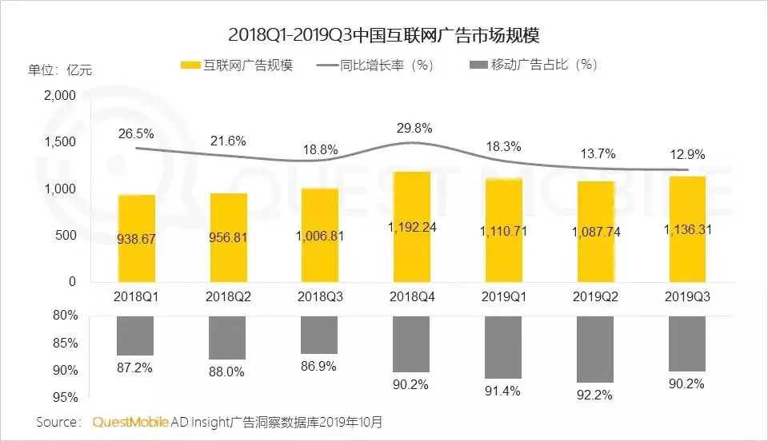
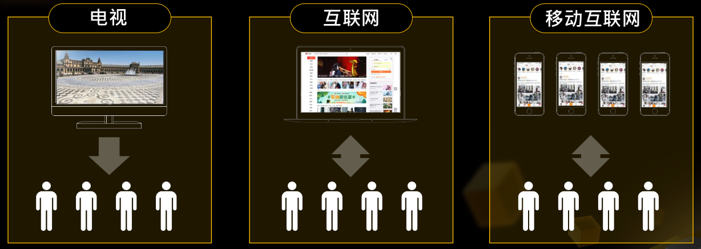

# 广告

互联网公司根据其核心业务的不同收入也可有多种渠道形式，比如，滴滴收取打车用户服务佣金、美团收取商铺会员费、京东卖出东西后的款项做现金流投资到结算时再交付给供应商等。挣用户的钱，还是挣客户的钱？从To B和To C端维度划分可以如下图。

虽然变现渠道众多，但大部分互联网最主要的方式是会员费与广告营销两种渠道，下图为18年第一季度到19年第三季度互联网广告规模，可以看到这是个千亿级的市场。这么大盘蛋糕，大家都想分一杯羹，其中业界国内外比较大的广告商业化产品有Google AdWords、Facebook、百度凤巢、阿里妈妈、腾讯广点通、头条巨量...

除了市场大，社会及技术的发展推动着信息传播主动权慢慢从企业到用户偏移，最直接的表现就是终端的变化，从电视到电脑再到移动终端，信息媒介的升级变化让互联网更加贴近人的生活，当然广告也接风直上，可以更贴近人们的生活。

