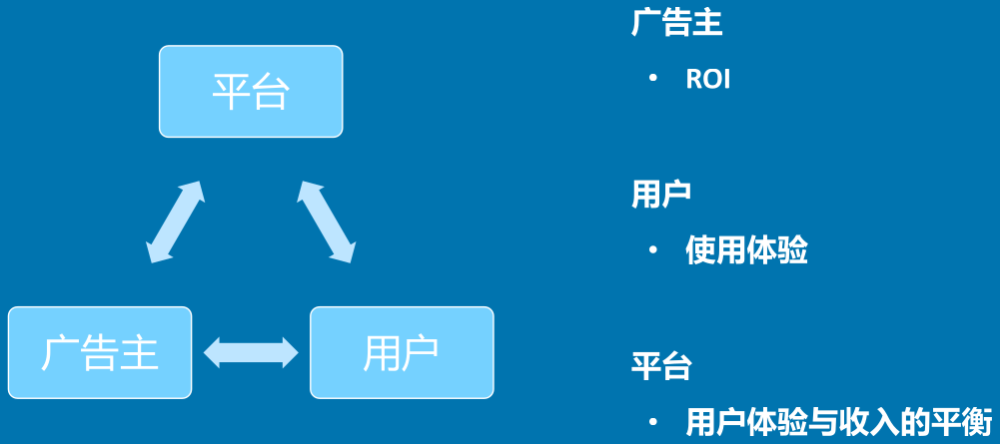
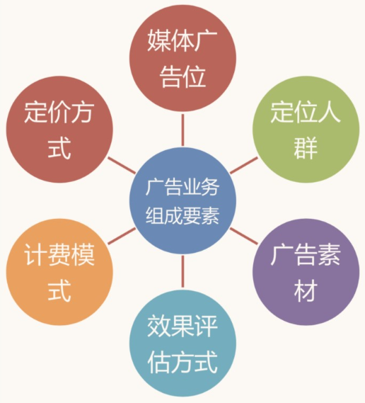
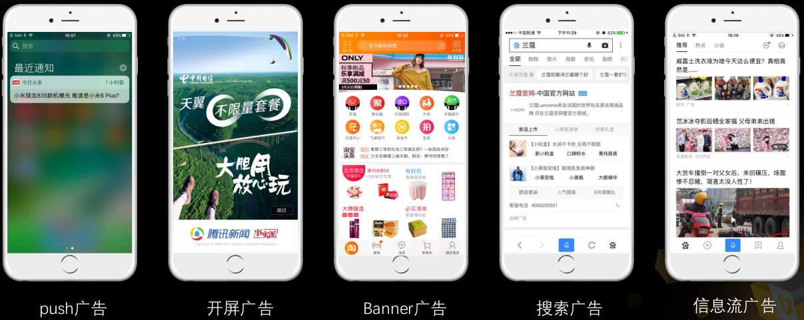
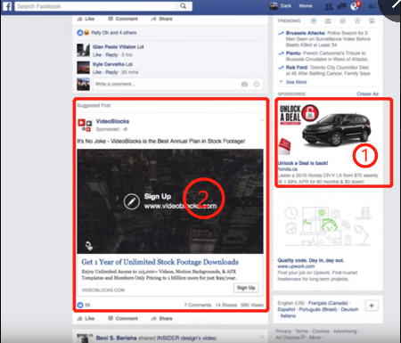
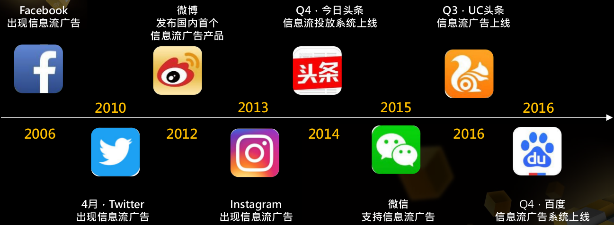
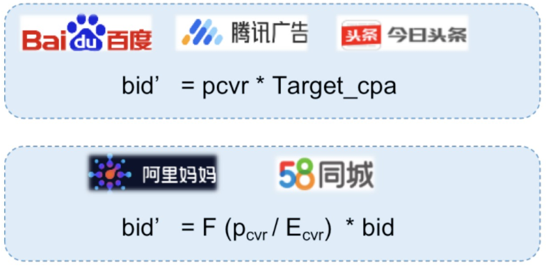
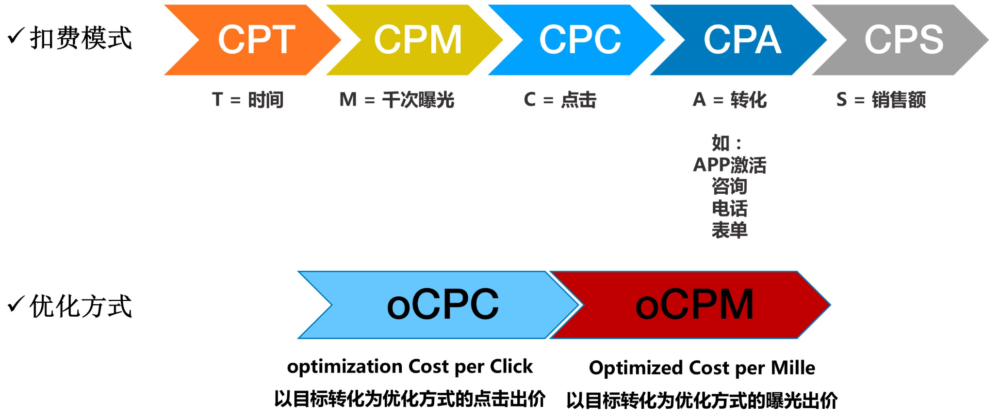
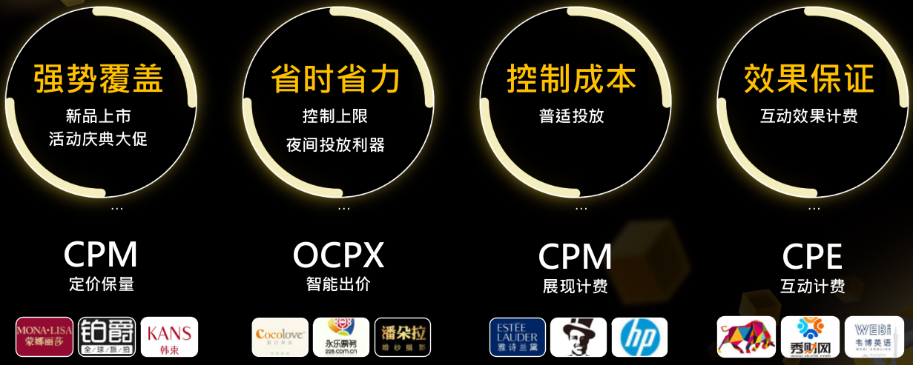

# 行业知识

## 总体介绍

### 三方博弈

整个广告系统由三方组成：用户、媒体平台、广告主。

* 用户：使用产品满足自身的诉求。
* 媒体平台：有流量资源，有变现赚钱的需求。
* 广告主：有广告预算，希望影响到客户。

### 广告主

广告主是指给以经济利益换取广告投放的主体。广告主范围非常广，比较大的广告主像宝洁、欧莱雅等等大型企业，小的广告主比如小区门口配钥匙的老大爷在58同城上买服务发布广告，也是广告主。因为广告主给钱，所以广告主又被称作金主爸爸，而用户则是上帝，媒体平台需要在家庭和教义间找到平衡。

### 广告流程

整个广告主投放广告的流程，开完账户后：流量定向、进行出价、制定创意、设置预算，当然，这几项的顺序并不是固定的，比如先制定合适创意再根据创意定向人群，或想好了目标人群再设置创意都可以。配置完成后投放广告，验证投放效果，进行相关分析，然后再去进行相关调整，这样的一个过程即广告投放流程。

上面提到的是大体的一个流程，根据不同的广告主，合作形式也不一样。有的广告主喜欢直接找4A广告公司，广告公司全权管理其广告业务；有的喜欢直接跟媒体平台合作等等各种合作形式，这就牵扯到对接和责任会有所不同。

### 组成要素

广告主要的组成要素有以下6大要素：媒体广告位、定位人群、广告素材、评估方式、计费模式、定价方式

### 广告位

广告位顾名思义，就是展示广告的地方。不同的产品有不同的广告位，比如百度搜索广告插入在搜索结果中，当然一个产品会有很多的广告位，爱奇艺广告放在视频的开头\(前贴\)、结尾\(后贴\)、中插\(硬插入或暂停时\)等，除了视频播放界面，推荐流中也会有广告。

社会和技术的发展推动着信息传播主动权慢慢从企业到用户偏移，最直接的表现就是终端的变化，从电视到电脑再到移动终端，信息媒介的升级变化让互联网更加贴近人的生活，当然广告也接风直上，更贴近人们的生活。

移动时代下的营销信息类型大致分为上图五种，大家应该都接触过，在此重点展开信息流广告来说。如同雅虎奠基了互联网的收费盈利模式，使互联网的普及成为可能，Facebook优化其广告位出现的信息流形式的广告，如下图，其实就是将从1位置移到了2，如果放在1位置用户会自动屏蔽，直接无视，而放在2伪装成信息流，无论是点击还是转化都成倍的提升，带来的经济效益也直接飙升。

点击和转化都提高，意味着能为金主爸爸们赚钱了，这还愣着干啥，各公司马上就学起来。主要靠信息流的产品马上学了过来，比如Twitter、微博等；有信息流但非核心业务的，比如微信主要即时通讯但有朋友圈，也学起来，看看大家刷到朋友圈学习python的广告进行的点赞和留言，啧啧啧，人生苦短，我要学python；甚至像百度搜索，之前没有信息流业务，现在也加上了搜索热点啥的信息流然后怼一波广告。

### 收入等式

媒体平台的收入可以从两个视角进行拆解：

1、平台视角：$$\text{adimp*cpm2/1000}$$ ，即，单个广告展示次数\*千次展示计费/1000。物理意义即展示次数\*展示单价，这里cpm是指的千次计费，所以除以1000和adimp\(单个广告展示次数\)单位对齐。

2、客户视角：客户数\*客户投入\($$\text{arpu}$$\)，即，客户数量\*平均每个客户投入金额。

下图展示的非常清晰，每个成分又可以进行进一步拆解，以及如何做优化提升，我就不赘述了。

所以说，技术做的好，可以给销售同学在谈判桌上提供筹码。反过来，销售同学给力，可以有大把的钱反哺技术。这里就要赞许一波阿里巴巴的销售铁军了，凭借优秀的业务能力，拉来了很多预算，才让阿里妈妈等部门放开手脚做事。

### 平台方案

不同的平台采用不同的出价技术方案。比较主流的有下图两种，其中

* $$\text{bid}$$ ：客户原始点击出价 or 平台设定点击单价
* $$p_{\text{cvr}}$$ ：当前请求，预估的广告点击转化率
* $$E_{\text{cvr}}$$ ：广告主期望点击转化率
* $$F()$$ ：调价函数
* $$\text{bid}'$$ ：优化后\(比如oCPC模式下\)点击价格

百度、腾讯、头条等出价等于预估转化率乘以目标转化成本。

阿里妈妈、58同城等出价等于预估转化率除以期望转化率在调价函数作用后再乘以客户原始出价。

为什么会出现这两种出价策略，主要不是看平台提供什么，而是看客户爸爸想要什么。采用第一种出价计算方式的广告主一般都是广告行业老手，需要对广告行业有深刻了解，了解实际转化成本，根据实际成本做出目标转化成本。而第二种方法对所有广告主都比较友好，设定心里价格后，由平台设计调价函数进行价格调整进行竞价。

举个简单例子，58上若采用第一种，配钥匙老大爷不懂广告行业规则，肯定想转化成本越低越好，所以可能会设置1块钱甚至1毛钱，然而这是远远偏离实际的，导致出价奇低，竞争不到展示机会，抱怨平台没啥用，若整个平台的用户都设置的很低，会导致平台崩盘的恶性循环。第二种则避免了这个问题，平台基于预估转化和期望转化去动态调节广告主的出价，帮助广告主调节到更合理价格。这两种方法没有谁优谁劣，关键还是看广告主适合哪种。总的来说，这跟平台客户群有关，大广告主肯定希望自己出价可控，大多喜欢采用第一种方法，小广告主没有很深的行业理解，需要平台协助进行出价。

## 对比介绍

### 流量 vs 需求

广告行业有各种博弈，因为其本质就是一个供需市场。比如我因为不想因为广告过度影响用户体验，设定每10个抖音短视频间插入1个广告，假设每天有约100个视频曝光量，按之前的设定就有约10个广告插入，这就是供方\(媒体平台\)能提供的商品，买方\(广告主\)根据自身情况对商品进行出价。再比如各App开启后有3秒的登录广告，每天登录次数量级就那么大，这个广告位怎么进行售卖就需要各个平台仔细规划了。所以，流量预测、流量分配是门很大的学问，很多广告投放预算平滑技术对此做了很多研究。

### 短期收益 vs 长期生态

上面提到的流量vs需求是媒体平台和广告主的博弈，最开始就讲了互联网广告是三方博弈，自然就存在媒体平台和用户之间的博弈。媒体平台可以通过广告进行变现赚钱，这个钱怎么个赚法，是注重短期收益，疯狂增加广告位，一条搜索10个结果9个广告，还是维持良好生态100个结果只展示1个广告还是放在最后？动态调整达到较均衡，健康的生态才是正确的道路。所以各个公司的第一步基本都会建设自身的生态健康评价体系，即包含各种指标：点击率、日活量、收入...的一个指标平台来监控生态变化，以方便进行策略调整，保证自己在活下去的前提下越活越好。

### 品牌广告 vs 效果广告

品牌广告一般是品牌为了增加曝光和自身在社会中形象而购买的，一般都是大企业如宝洁、欧莱雅等，注重长期影响力，短期收益并不重要。

效果广告如名字，就是看中效果，看重短期转化率，一般都是中小微型用户，毕竟不像大公司财大气粗，做宣传就是为了更好的赚钱。

### 近转化 vs 近流量

阿里、京东和拼多多等电商平台，他们的广告主就是商家或品牌，在这种类型平台中推荐和广告是一致的，转化场景直接，广告主众多，转化数据及时。

微信、微博和抖音等流量平台，近流量，用户量大，在应用上消耗时间长。

### 公域流量 vs 私域流量

大家有没有想过看B站之类的视频时，up都是留微博账号，而不是其他的？就是因为流量有私域流量和公域流量之分。

抖音，头条这种是内容为王的公域流量，曝光量不稳定，一个网红可能火一星期，但一星期后，可能被拍死在沙滩上。

微博是典型的私域流量，可以保证稳定的曝光。一个有百万粉丝的账号，每条微博的曝光度相对稳定。

### 明标 vs 暗标

这里简单介绍对比介绍一下拍卖形式，为结算方式的理解做铺垫。

明标\(开放式拍卖\)：买家相互间知道价格，明枪博弈。

* [英式拍卖](https://baike.baidu.com/item/%E8%8B%B1%E5%9B%BD%E5%BC%8F%E6%8B%8D%E5%8D%96/4015845)：就是我们在春晚上看到的本山大叔卖轮椅时的方式，价格从低到高叫价，相互知道价格。
* [荷兰拍卖](https://baike.baidu.com/item/%E8%8D%B7%E5%85%B0%E5%BC%8F%E6%8B%8D%E5%8D%96)：又称为减价拍卖，拍卖的竞价由高到低依次递减直到第一个竞买人应价或超过底价。

暗标\(封闭式拍卖 \)：如名所示，即采用保密手段暗中较劲，大家不知道明确竞价。又称封闭式拍卖，竞价者只能知道自己的出价，而不知其他竞价者的出价。

### 定价计费 vs 竞价计费

广告计费模式大致分为两种，定价计费和竞价计费。定价计费很好理解，广告位以固定价格售卖，有很多定价保量的广告产品就是这种。竞价计费是大部分广告产品采用的模式，毕竟是博弈行为，竞价对市场资源分配可以起到更好的分配作用。

选择合适的计费方式其实也是一种需求方\(广告主\)和供给方\(媒体平台\)的一种博弈形式：若采用CPT/CPM的模式，风险全部都在需求方，供给方只需要按约定进行广告曝光即可，所以这种模式一般适用于品牌广告；若采用CPA的模式，风险全部都在供给方，比如虽然供给方给予了合适人群场景大量的曝光但广告主提供的广告很烂，可能依旧没人点击转化，这种模式受到效果广告广告主的欢迎；相对而言CPC模式算是均衡需求方和供给方双方利益的模式，但是需要有良好的竞价环境，技术挑战也比较大。所以总的来说，风险承担排序：媒体平台承担风险 -&gt; CPT -- CPM -- CPC -- CPA -- CPS &lt;- 广告主承担风险。

<table>
  <thead>
    <tr>
      <th style="text-align:center">&#x7ED3;&#x7B97;&#x65B9;&#x5F0F;</th>
      <th style="text-align:center">&#x70B9;&#x51FB;&#x7387;&#x9884;&#x4F30;</th>
      <th style="text-align:center">&#x70B9;&#x51FB;&#x4EF7;&#x503C;&#x4F30;&#x8BA1;</th>
      <th style="text-align:center">&#x4F18;&#x7F3A;&#x70B9;</th>
      <th style="text-align:center">&#x9002;&#x7528;&#x573A;&#x666F;</th>
    </tr>
  </thead>
  <tbody>
    <tr>
      <td style="text-align:center">CPT</td>
      <td style="text-align:center">&#x9700;&#x6C42;&#x65B9;</td>
      <td style="text-align:center">&#x9700;&#x6C42;&#x65B9;</td>
      <td style="text-align:center">
        
&#x53EF;&#x4EE5;&#x5145;&#x5206;&#x53D1;&#x6325;&#x6A71;&#x7A97;&#x6548;&#x5E94;

        
&#x65E0;&#x6CD5;&#x5229;&#x7528;&#x53D7;&#x4F17;&#x5B9A;&#x5411;&#x6280;&#x672F;

      </td>
      <td style="text-align:center">&#x9AD8;&#x66DD;&#x5149;&#x7684;&#x54C1;&#x724C;&#x5E7F;&#x544A;</td>
    </tr>
    <tr>
      <td style="text-align:center">CPM</td>
      <td style="text-align:center">&#x9700;&#x6C42;&#x65B9;</td>
      <td style="text-align:center">&#x9700;&#x6C42;&#x65B9;</td>
      <td style="text-align:center">
        
&#x53EF;&#x5229;&#x7528;&#x53D7;&#x4F17;&#x5B9A;&#x5411;&#x9009;&#x62E9;&#x76EE;&#x6807;&#x4EBA;&#x7FA4;

        
&#x5408;&#x7EA6;&#x552E;&#x5356;&#x4E0B;&#x53D7;&#x4F17;&#x5212;&#x5206;&#x4E0D;&#x80FD;&#x8FC7;&#x7EC6;

      </td>
      <td style="text-align:center">
        
&#x53D7;&#x4F17;&#x9009;&#x62E9;&#x9700;&#x6C42;&#x7684;&#x54C1;&#x724C;&#x5E7F;&#x544A;

        
&#x5B9E;&#x65F6;&#x7ADE;&#x4EF7;&#x5E7F;&#x544A;&#x4EA4;&#x6613;

      </td>
    </tr>
    <tr>
      <td style="text-align:center">CPC</td>
      <td style="text-align:center">&#x4F9B;&#x7ED9;&#x65B9;</td>
      <td style="text-align:center">&#x9700;&#x6C42;&#x65B9;</td>
      <td style="text-align:center">
        
&#x53EF;&#x4EE5;&#x7CBE;&#x7EC6;&#x5212;&#x5206;&#x53D7;&#x4F17;&#x4EBA;&#x7FA4;

        
&#x5408;&#x7406;&#x7684;&#x4F9B;&#x7ED9;&#x65B9;&#x548C;&#x9700;&#x6C42;&#x65B9;&#x5206;&#x5DE5;

      </td>
      <td style="text-align:center">&#x7ADE;&#x4EF7;&#x5E7F;&#x544A;&#x7F51;&#x7EDC;</td>
    </tr>
    <tr>
      <td style="text-align:center">CPS/CPA/ROI</td>
      <td style="text-align:center">&#x4F9B;&#x7ED9;&#x65B9;</td>
      <td style="text-align:center">&#x4F9B;&#x7ED9;&#x65B9;</td>
      <td style="text-align:center">
        
&#x9700;&#x6C42;&#x65B9;&#x65E0;&#x4EFB;&#x4F55;&#x98CE;&#x9669;

        
&#x4F9B;&#x7ED9;&#x65B9;&#x8FD0;&#x8425;&#x96BE;&#x5EA6;&#x8F83;&#x5927;

      </td>
      <td style="text-align:center">
        
&#x6548;&#x679C;&#x7C7B;&#x5E7F;&#x544A;&#x8054;&#x76DF;

        
&#x6548;&#x679C;&#x7C7B;DSP

      </td>
    </tr>
    <tr>
      <td style="text-align:center">oCPM</td>
      <td style="text-align:center">&#x4F9B;&#x7ED9;&#x65B9;</td>
      <td style="text-align:center">&#x4F9B;&#x7ED9;&#x65B9;</td>
      <td style="text-align:center">&#x504F;&#x4F9B;&#x7ED9;&#x65B9;&#x7684;&#x5747;&#x8861;&#x7684;&#x7ED3;&#x7B97;&#x6A21;&#x5F0F;</td>
      <td
      style="text-align:center">
        
&#x53D7;&#x4F17;&#x9009;&#x62E9;&#x9700;&#x6C42;&#x7684;&#x54C1;&#x724C;&#x5E7F;&#x544A;

        
&#x5B9E;&#x65F6;&#x7ADE;&#x4EF7;&#x5E7F;&#x544A;&#x4EA4;&#x6613;

        </td>
    </tr>
    <tr>
      <td style="text-align:center">oCPC</td>
      <td style="text-align:center">&#x4F9B;&#x7ED9;&#x65B9;</td>
      <td style="text-align:center">&#x4F9B;&#x7ED9;&#x65B9;</td>
      <td style="text-align:center">&#x5747;&#x8861;&#x7684;&#x7ED3;&#x7B97;&#x6A21;&#x5F0F;</td>
      <td style="text-align:center">&#x7ADE;&#x4EF7;&#x5E7F;&#x544A;&#x7F51;&#x7EDC;</td>
    </tr>
    <tr>
      <td style="text-align:center">oCPA</td>
      <td style="text-align:center">&#x4F9B;&#x7ED9;&#x65B9;</td>
      <td style="text-align:center">&#x4F9B;&#x7ED9;&#x65B9;</td>
      <td style="text-align:center">&#x504F;&#x9700;&#x6C42;&#x65B9;&#x7684;&#x5747;&#x8861;&#x7684;&#x7ED3;&#x7B97;&#x6A21;&#x5F0F;</td>
      <td
      style="text-align:center">
        
&#x6548;&#x679C;&#x7C7B;&#x5E7F;&#x544A;&#x8054;&#x76DF;

        
&#x6548;&#x679C;&#x7C7B;DSP

        </td>
    </tr>
    <tr>
      <td style="text-align:center">oCPX</td>
      <td style="text-align:center">&#x4F9B;&#x7ED9;&#x65B9;</td>
      <td style="text-align:center">&#x4F9B;&#x7ED9;&#x65B9;</td>
      <td style="text-align:center">&#x6DF7;&#x5408;&#x6A21;&#x5F0F;</td>
      <td style="text-align:center">&#x6DF7;&#x5408;&#x573A;&#x666F;</td>
    </tr>
  </tbody>
</table>

CPT\(Cost per Time\)：将某个广告位的一定时段以独占形式售卖给广告主收取费用的方式。

CPM\(Cost per Mille\)：这里“Mille”是拉丁文千次的意思，即千次展示作为计费标准的衡量单位。

CPC\(Cost per Click\)：顾名思义，即按照点击结算，适用于效果广告。

CPS\(Cost per Sale\)/CPA\(Cost per Action\)/ROI：按销售、转化行为或投入产出比结算。这里简单介绍一下转化行为A\(Action\)，即用户行为到哪一步。比如一个游戏App的广告主，用户点击媒体上这则广告后的行为：下载、安装、注册、使用、付费。每一步都算作一种转化Action，即制定针对用户行为步的结算方式。

oCPM\(optimized Cost per Mille\)：本质还是按照CPM付费。采用更精准的点击率和转化率预估机制，将广告展现给最容易产生转化的用户，在获取流量的同时，提高转化率、降低转化成本，跑量提速更快。

oCPC\(optimized Cost per Click\)：本质还是按照CPC付费。采用更科学的转化率预估机制的准确性，可帮助需求方在获取更多优质流量的同时提高转化完成率。供给方会在需求方出价基础上，基于多维度、实时反馈及历史积累的数据，根据预估的转化率以及竞争环境智能化的动态调整出价，进而优化广告排序，帮助需求方竞得最适合的流量，并降低转化成本。

oCPA\(optimized Cost per Action\)：本质还是按照CPA付费。当广告主在广告投放流程中选定特定的优化目标，比如上面举例的游戏App广告，点击就付费、使用才付费、点击/安装/使用行为各支付一部分费用...要求需求方提供愿意为此投放目标而支付的平均价格，并及时、准确回传效果数据。

oCPX\(optimized Cost per X\)：这里的X可以是T/M/C/A，是一种混合模式，提供给广告主不同玩法。

|  | CPM | eCPM | oCPM |
| :---: | :---: | :---: | :---: |
| 全称 | Cost per Mille | effecive Cost per Mille | optimized Cost per Mille |
| 释义 | 千次展示计费 | 千次展示收入 | 优化后的CPM |
| 理解 | 对广告主来说千次展示付都少钱 | 对媒体来说千次展示赚多少钱 | 优化后付多少钱 |

大家时常会听到[eCPM\(effective Cost per Mille\)](https://baike.baidu.com/item/eCPM)，他是计算广告中最常被提及，也是最关键的定量估计收益的指标。所以CPM前加个e，这又是啥呢？简单来说，eCPM一般指的是估计的千次展示的收益，是媒体平台看的值，而CPM指的千次展示成本，是广告主需要花多少钱的指标，在实用中这两者的区别不大。

当然，根据和金主爸爸们的沟通，为满足其需求，还有很多结算方式，比如CPS\(Cost Per Sale\)按实际销售计费，CPR\(Cost Per Rating\)按用户反馈成本，比如以浏览者的每一个回应计费，CPL\(Cost Per Leads\)按搜集潜在客户名单多少来收费......

介绍了这么多种计费结算模式，其实没有最先进的一说，虽然由于广告主合作形式和技术优化的因素，各种计费结算方式出现时间不同，但后出现的并是说一定比先出现的好，只是整个行业趋势更倾向于媒体与广告主更深入的合作，比如数据交互，风险共担等。

大家都是在找最适合自己的结算计费模式，还是回到那句话，广告系统本质就是博弈，都想赚钱，但都不想担责。所以媒体平台会提供各种方式，广告主根据自身诉求选择对自己最合适的计费结算方式。

## 名词解释

### 效果评估

DAU\(Daily Active User\)：指日活跃用户数量。常用于反应网站、互联网应用或游戏的运营情况。

MAU\(Monthly Active User\)：月活跃用户数量。以月为单位记录的活跃用户数量。

UV\(Unique Visitor\)：指访问、浏览的自然人，即独立曝光。比如一台电脑24小时以内访问N次计为1次。

PV\(Page View\)：指页面浏览量，即曝光。

ADPV\(Advertisement Page View\)：载有广告的Page View流量。

VV\(Video View\)：视频播放次数。

CTR\(Click Through Rate\)：指点击到达率。点击率 =点击量/展现量

CVR\(Conversion Rate\)：转化率。

ROI\(Return On Investment\)：投资回报率 =订单额/消费量（即广告费用）=（单均额转化量）/（CPA转化量）=单均额/CPA

ARPU\(Average Revenue Per User\)：每用户平均收入。高端用户越多，ARPU越高，但未将成本计入。

ARPPU\(Average Revenue Per Paying User\)：指每位付费用户身上获得的收入。

ADimp\(ADimpression\)：单个广告的展示次数。

RPS\(Revenue Per Search\)：每搜索产生的收入，衡量搜索结果变现能力指标。

### 领域名词

Campaign：广告活动，指在某一特定市场上，为实现某一目标，所集中进行的广告活动。

Brief：甲方客户提供的需求大纲。

Budget：客户及广告主的预算。

Retargeting：二次触达，通过精准的广告投放技术，把广告投给曾经访问过客户网站的人群，从而通过二次、三次曝光刺激最终的销售。

TA\(Target Audience\)：指广告投放的目标受众，工作中TA浓度决定了定向人群的精确度。

PO\(Purchase Order\)：口语表达为“PO单”，指客户及广告主下的订单。

RTB\(Real Time Bidding\)：实时竞价，即在每个广告展示曝光的基础上进行实时竞价的广告类型。

ADX\(AD Exchange\)：广告交易平台。

DSP\(Demand Side Platform\)：需求方平台。

GMV\(Gross Merchandise Volume\)：销售额，用户在某网站或产品的成交总额。

GSP\(Generalized Second Price\)：广义第二高价。

KOL\(Key Opinion Leader\)：关键意见领袖，即指的网红或专家等。

KOC\(Key Opinion Customer\)：关键意见消费者，他们自身是消费者，分享的内容多是自身体验。

MCN\(Multi-Channel Network\)：指网红孵化，是一种多频道网络的产品形态。

UGC\(User Generated Content\)：用户原创内容。即用户通过自己原创的内容通过互联网展示或提供给其他用户的内容。

PGC\(Professional Generated Content\)：指专业生产内容。PGC来源于UGC的升华，是用户、社群运营提升活跃度增加用户粘性，比如还未恰饭的up主。

OGC\(Occupationally Generated Content\)：指职业生产内容。当专业用户成为签约、给报酬的内容生产者时，PGC变为OGC。比如，专栏作家，各品牌账号的运营，恰饭的up主。

