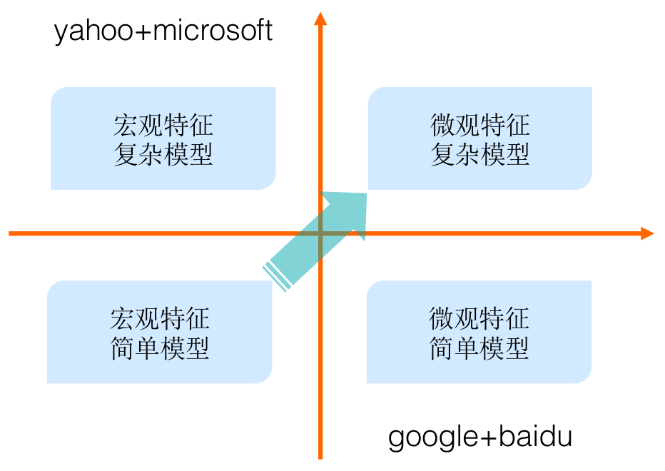

# 发展趋势

广告技术发展的趋势总的来说是从宏观特征、简单模型逐步演进到采用微观特征、复杂模型。

## 技术演化

下图展示里各大公司采用了不同的技术道路，有走宏观特征+复杂模型的Yahoo和Microsoft，也有尝试微观特征+简单模型的Google+Baidu，当然走哪条路决定性因素是各公司的业务，但需要指出的是在2005-2015这十年间，大规模机器学习模型\(特指浅层模型\)一度统治着CTR预估领域，以G/B两家为代表的”大规模离散特征+特征工程+分布式线性LR模型”解法几乎成为了那个时代的标准解。相关的工作相信读者们耳熟能详，甚至据我所知今天业界的不少团队依然采用这样的技术。随着数据量、计算能力和技术的发展，大家殊途同归，都向着微观特征+复杂模型的方向发展。

技术趋势总的来说是从宏观特征、简单模型逐步演进到采用微观特征、复杂模型。我们从特征和模型两个领域分开来说

### 模型

以最具代表性的阿里妈妈为例，从2012年开始，阿里妈妈的预估模型演进如下图所示

最经典传统点击率预估方法即大规模特征+逻辑回归模型的组合。通过大规模的 id 和特征能够获得更高分辨率的样本描述。这种方法下，模型结构相对固定，优化方法上讲也更注重系统效率。从效果上看工作重心主要在大量的特征工程，通过人工经验对特征进行组合、运算，解决 LR 无法表达非线性关系的问题。但是很明显这样的迭代模式整体受到人工能力制约，需要对业务理解足够透彻。

2011-2012年左右由盖坤同学创新性地提出了MLR\(Mixed Logistic Regression\)模型并实际部署到线上系统，同时期也有如FM模型等工作出现。这些模型试图打破线性LR模型的局限性，向非线性方向推进了一大步。

### 特征

上了深度学习后，调节网络结构自然是一大迭代方向。除此之外，还有加入多模态信息，时序信息等等。比如下图阿里妈妈的CTR模型演化

## 未来展望

做广告就像做饭一样，原材料是数据、特征，模型是我们的工具： 

阶段1：广告技术初期采用传统机器学习方法，例如LR等模型，这就要求大量的特征工程，但特征工程我们都知道，需要很深的业务理解而且比较玄学，就像我们要炒土豆，但是刀工不行，只能切片，如果进行简单的醋溜后能吃，但是不够入味，要是切片不够薄还容易生。

阶段2：采用了深度学习技术以后，我们避免的大量的特征工程，只需收集合理数据放入模型，模型会自己学习提取有价值特征，如同手握合适的土豆去皮器，有了擦丝工具，可以做醋溜土豆丝，并且味道直接提升一个层次。

阶段3：大胆预测下一技术阶段是知识图谱加深度学习，上了深度学习我们有了顺手的厨卫工具了，知识图谱能提供什么呢？1、新的原材料，简单来说，简单的广告投放场景就像炒西红柿，对原材料和工具的要求都不大，但复杂的场景广告有如做佛跳墙，材料都不太够肯定不地道，而图谱可以提供一些额外的数据、特征等；2、调料，有了原料和工具，调料不好味道也不行，图谱可以提供一些结构化信息，可以用来加约束更好关联用户、场景和广告，相当于给我们配齐了从南亚到东北亚各式调料。当然，有了新的原料和调料，锅得大啊，所以知识图谱的合理构建就是首先要解决的问题。再有材料多了，火候也要跟上，机器的运算力，对实时性的要求，也是一个挑战。

现阶段处在阶段2到阶段3的过渡时期，将丰富的特征和Embedding后的图谱信息代入深度学习模型中去。总而言之，数据是我们的核心，若食材为佳品，清水蒸也是美味。然而由于现实之复杂，我们无法知晓哪些数据是佳品，所以增加数据的细节程度及涵盖范围\(特征从宏观到微观\)，使用工具及调料\(模型由简单到复杂\)进行烹饪，得到味道越来越好的菜品。

### 表示学习

### 可解释性

## Source







