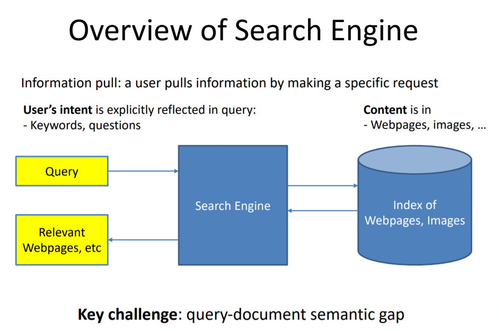
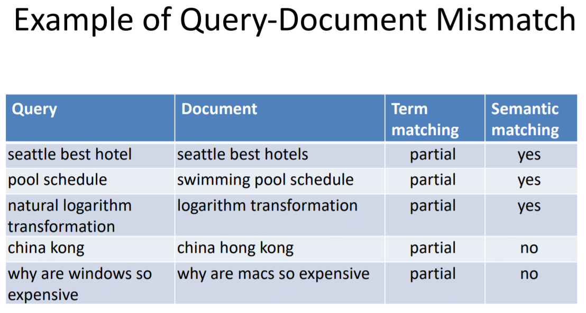
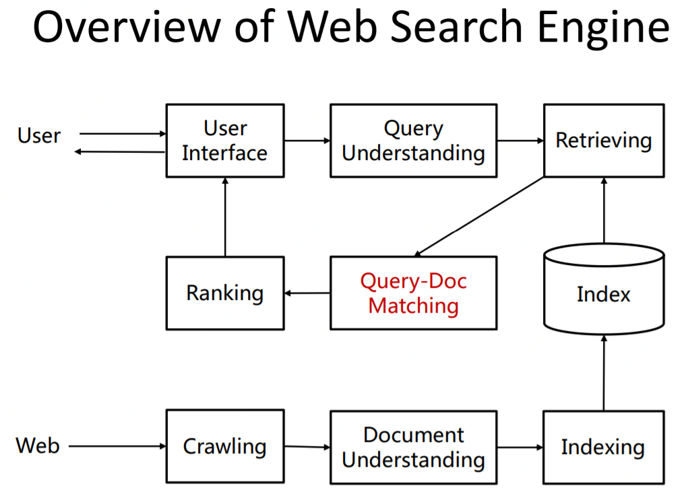
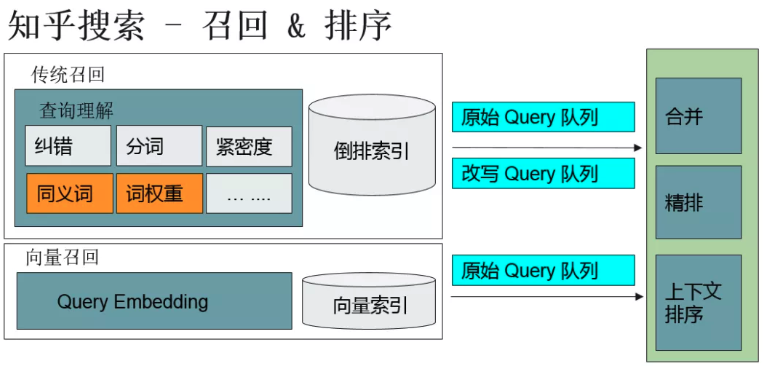

# 搜索

## 搜索本质

搜索的本质是匹配问题，但不像推荐与广告user和item属于两个空间或者说两种实体，搜索的query和item两者同属一个空间中。进一步说搜索是为了满足用户需求，所以，其核心的目标是：准、快。

## 工业架构

搜索引擎的总体架构如下图，根据用户的特定需求返回相应的信息，即有特定query：

最为广泛的应用即网站搜索引擎，如Google、Bing、百度等，总体流程如下：

1. 第一步：先爬取线上各种网站，进行内容理解后建立索引放入存储。
2. 第二步：用户输入query，进行query理解后进行query-doc匹配从存储中获取内容之后进行排序推送给用户。

## 核心工作

传统的搜索领域中的查询模块，往往包含这些子任务：纠错、分词、紧密度、同义词、词权重，以及其他的如实体词识别、意图识别等等。以知乎搜索如下图为例\(当然，知乎不是全网搜索，像Google这样的全网搜索要更为复杂，涉及的会更多\)。

## 问题挑战

既然是匹配问题，那它们的最大难点，或者说要解决的问题，其实就是语意鸿沟\(Semantic Gap\)，搜索是针对Query-doc之间的mismatch，推荐广告是针对User-item之间的mismatch。

除了之前提到的最核心的语意鸿沟\(Semantic Gap\)，搜索系统有很多挑战：

（1）长尾query：有一些query出现的次数及其少，有可能是由于输入错误和表达冗余等原因造成的，也有可能用户查询的query确实冷门。

（2）输入错误：例如 query "塞尔维雅" \( 塞尔维亚 \)，这里塞尔维亚的亚被输入成了雅，对于这种错误我们希望系统能够自动的纠错。

（3）表达冗余："孙子兵法智慧的现代意义"，在这个语境下，"智慧" 是一个无关紧要的词。如果强制去匹配 "智慧" 的话，反而匹配不出真正想要的结果。

## Source











