# 传统匹配模型

## 匹配与排序关系

在传统的信息检索\(Information Retrieval\)领域，排序和匹配基本可以划等号：

                                     $$f(q,d)=f_{\text{BM25}}(q,d)$$ 或者 $$f(q,d)=f_{\text{LMIR}}(d|q)$$

在Web搜索中，排序和匹配是分开的，比如Learning to rank将匹配作为排序的特征：

                                      $$f(q,d)=f_{\text{BM25}}(q,d)+\text{PageRank}(d)+\cdots$$ 

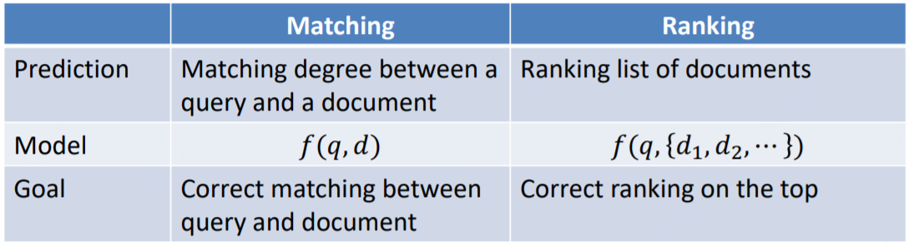

## Matching by query formulation

## Matching with term dependency

## Matching with topic model

## Matching in latent space model

Matching in latent space model将query和document映射至latent space，在从latent space进行挖掘。

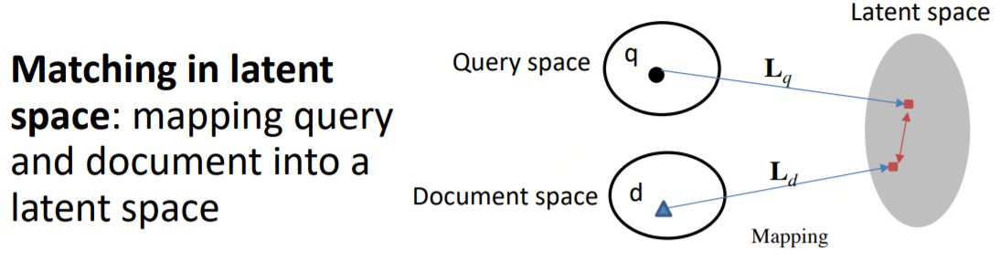

### BM25: Matching in Term Space

Term Space作为一个特殊的Latent Space值得单独拿出来说一下。其中BM25算法最为经典，也通常被作为各种算法模型比较的baseline，BM25是一种BOW（bag-of-words）模型，BOW模型只考虑document中词频，不考虑句子结构或者语法关系之类，把document当做装words的袋子，具体袋子里面可以是杂乱无章的。下面公式中 $$k_1,b$$ 为调节参数， $$avgdl$$ 即平均document长度。

TF的计算常用式： $$tf_{ij}=\frac{n_{ij}}{\sum_kn_{kj}}$$ 

其中 $$n_{ij}$$ 表示词 $$i$$ 在文档 $$j$$ 中出现的频次，但是仅用频次来表示，那长文本的词出现频次高的概率更大，这会影响到比较。所以计算时会对词频进行归一化，分母部分就是统计文档中每个词出现次数的总和，也就是文档的总词数。

IDF的计算常用式： $$idf_i=log(\frac{|D|}{1+|D_i|})$$ 

其中 $$|D|$$ 为文档集中总文档数， $$|D_i|$$ 为文档集中出现词 $$i$$ 的文档数量。分母加 $$1$$ 是采用了拉普拉斯平滑，避免有部分新的词没有在语料库中出现过而导致分母出现零的情况。

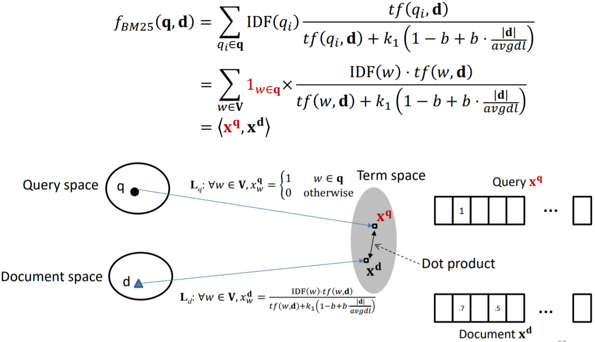

### Matching in Latent Space

Matching in Latent Space的假设是queries/documents具有"相似性"，而这个"相似性"是通过用户点击数据来表示的。方法就是将query和document映射至Latent Space，再加些正则或约束进行挖掘。

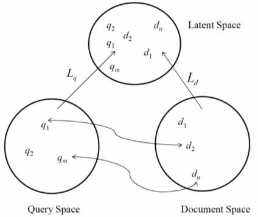

#### 偏最小二乘法\(Partial Least Square, PLS\)

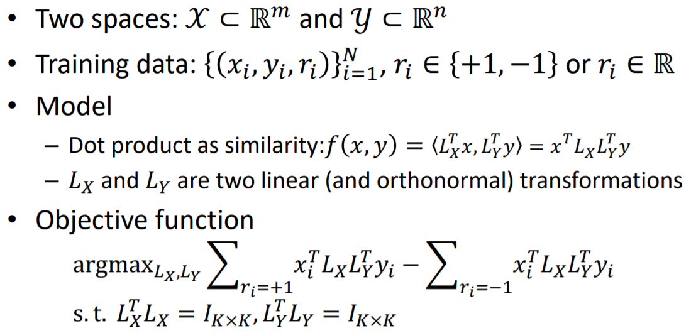

#### 规则映射至潜在空间\(Regularized Mapping to Latent Space, RMLS\)

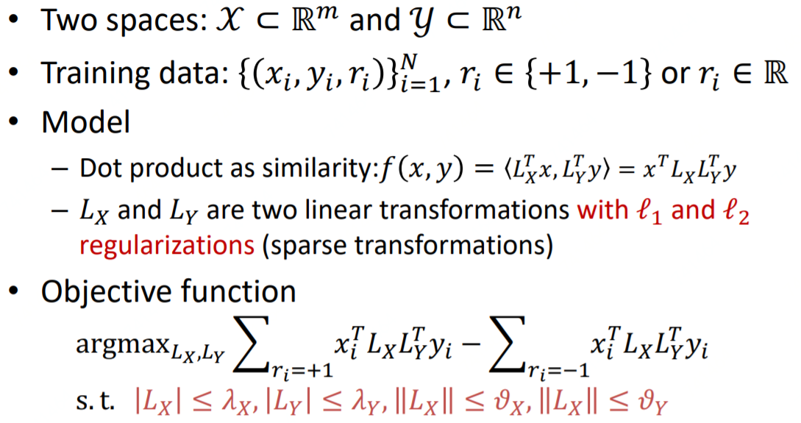

#### PLS vs.RMLS

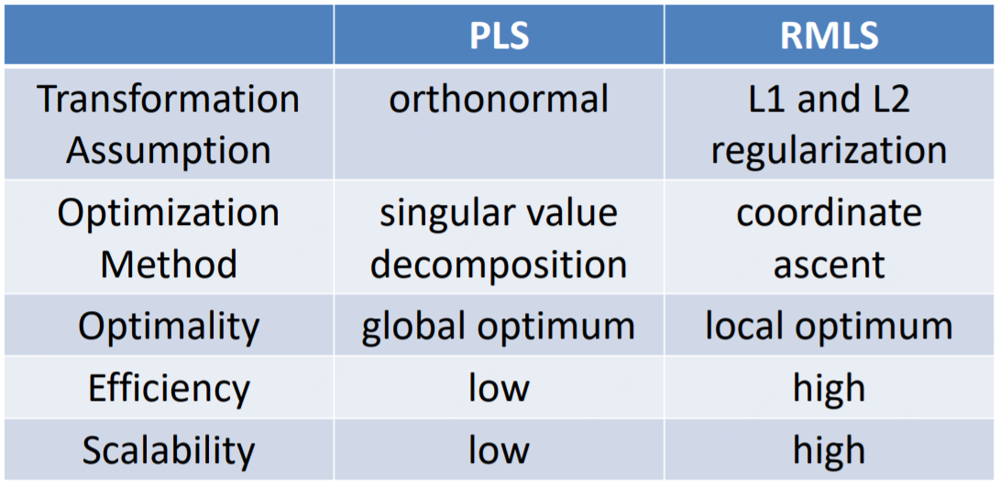

### Experimental Results

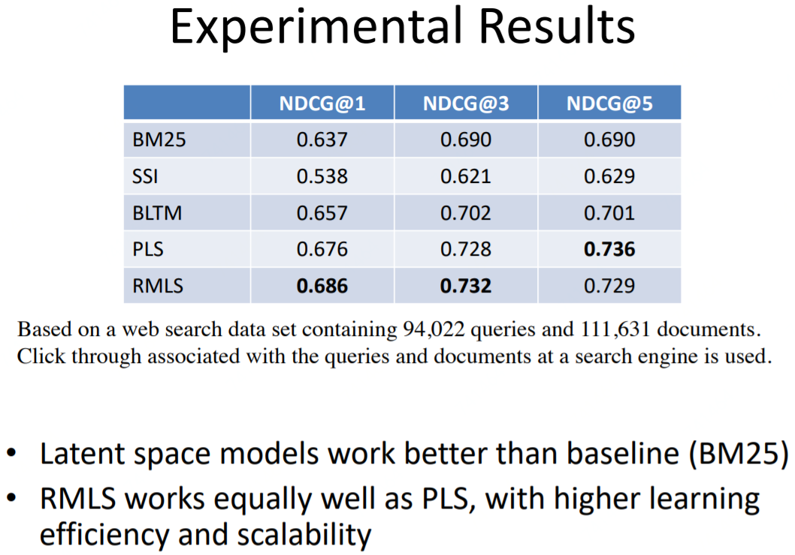

## Matching with translation model

Matching with translation model即将document映射至query space。

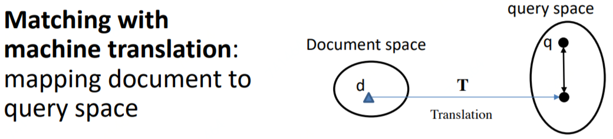

### [统计机器翻译\(Statistical Machine Translation, SMT\)](https://zh.wikipedia.org/wiki/%E7%BB%9F%E8%AE%A1%E6%9C%BA%E5%99%A8%E7%BF%BB%E8%AF%91)

噪声信道模型假定，源语言中的句子 $$c$$ \(信宿\)是由目标语言中的句子 $$e$$ \(信源\)经过含有噪声的信道编码后得到的。那么，如果已知了信宿 $$c$$ 和信道的性质，我们可以得到信源产生信宿的概率，即 $$p(e|c)$$  。而寻找最佳的翻译结果 $$\tilde{e}$$ 也就等同于寻找：

                                                                $$\tilde{e} = \arg\max\limits_{e\in e^*} p(e|c)$$ 

利用贝叶斯公式，并考虑对给定 $$a = b$$ ， $$p(c)$$ 为常量，上式即等同于

                              $$\tilde{e} = \arg\max\limits_{e\in e^*} p(e|c)=\arg\max\limits_{e\in e^*} \frac{p(c|e)p(e)}{p(c)}=\arg\max\limits_{e\in e^*} p(c|e)p(e)$$ 

由此，我们得到了两部分概率：

* $$p(c|e)$$ ，指给定信源，观察到信号的概率。在此称为翻译模型。
* $$p(e)$$ ，信源发生的概率。在此称为语言模型。

可以这样理解翻译模型与语言模型，翻译模型是一种语言到另一种语言的词汇间的对应关系，而语言模型则体现了某种语言本身的性质。翻译模型保证翻译的意义，而语言模型保证翻译的流畅。从中国对翻译的传统要求“信达雅”三点上看，翻译模型体现了信与达，而雅则在语言模型中得到反映。

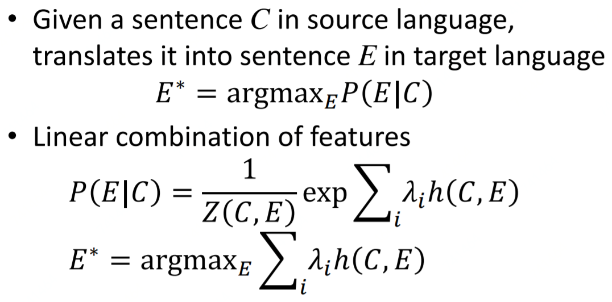

统计机器翻译模型在Query-Document Matching中的应用，即将document和query看作两种语言，将document翻译至query，得到翻译概率 $$P(q|d)$$ 。但是其实document和query不是两种语言，这是最重要的区别，所以需要解决自翻译\(self-translation\)问题。

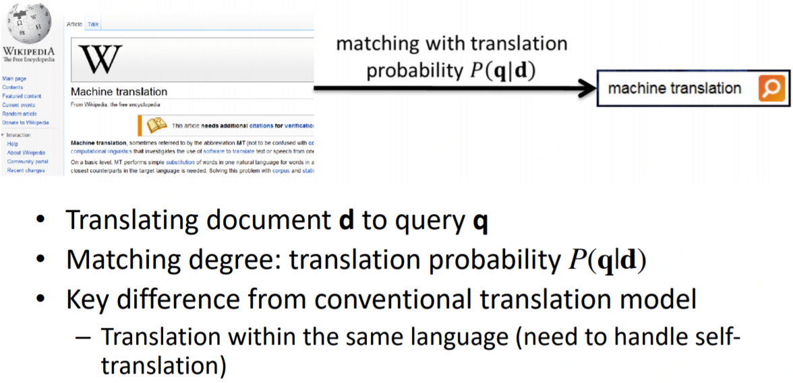

### 基于单词级的翻译模型匹配\(Matching with Word-based Translation Models\)

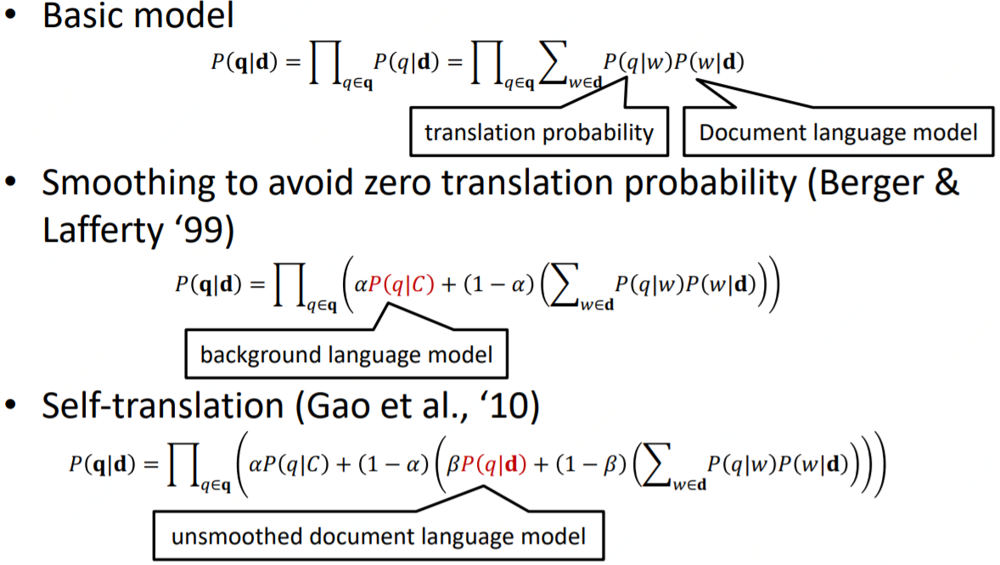

### Experimental Results

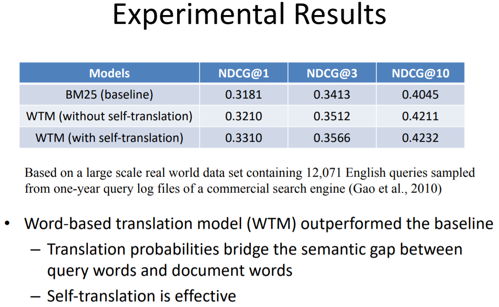

## Source







