# 基于特征

## 基于特征\(**Generic Feature-based Models\)**

协同过滤的方法只用了user-item交互矩阵，并没有用到user和item的特征

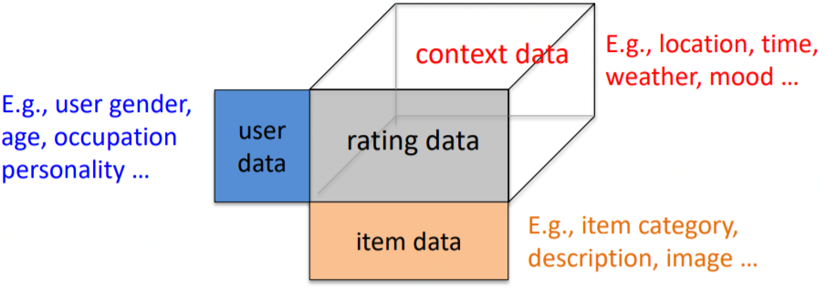

现代推荐系统框架大致如下：

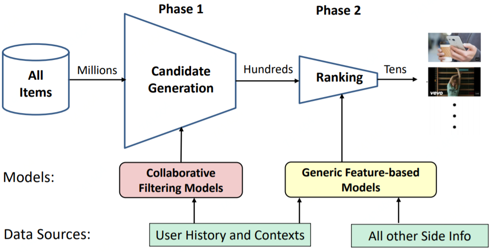

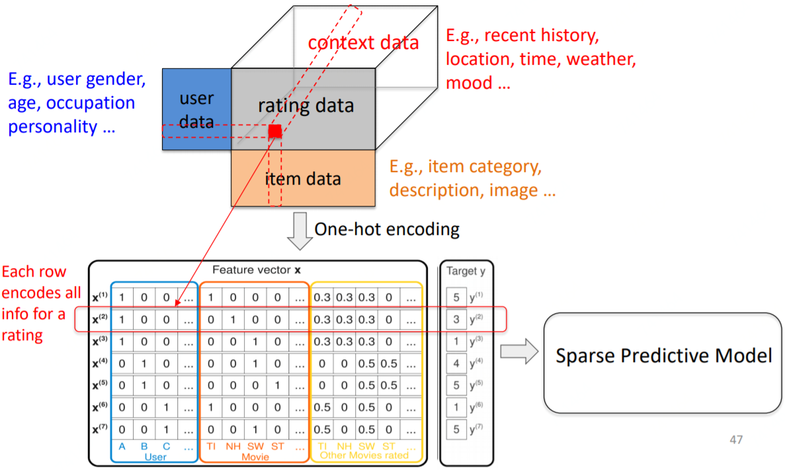

## [FM\(Factorization Machines\)](https://ieeexplore.ieee.org/abstract/document/5694074)

相比一般的线性模型，FM考虑了特征间的关联，在多项式模型中，特征 $$x_i$$ 和 $$x_j$$ 的组合用 $$x_ix_j$$ 表示，这一部分就是FM模型多出来的特征组合，从NN的角度考虑：

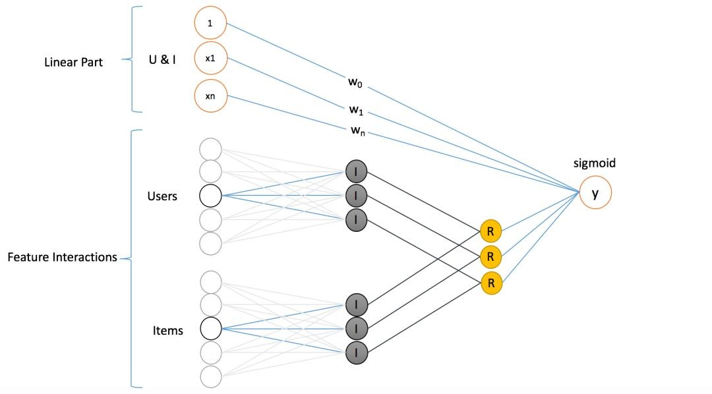

FM模型覆盖了LR的宽模型结构，同时也引入了交叉特征，增加了模型的非线性和泛化能力，提升了模型容量，能够捕捉更多额外的信息，对于像新闻推荐这样复杂的场景能有更好的预测能力。

### 从LR到SVM再到FM模型

LR模型是CTR预估领域早期最成功的模型，大多工业推荐排序系统采取LR这种“线性模型+人工特征组合引入非线性”的模式。因为LR模型具有简单方便易解释容易上规模等诸多好处，所以目前仍然有不少实际系统仍然采取这种模式。但是，LR模型最大的缺陷就是人工特征工程，耗时费力费人力资源，那么能否将特征组合的能力体现在模型层面呢？

其实想达到这一点并不难，如上图在计算公式里加入二阶特征组合即可，任意两个特征进行组合，可以将这个组合出的特征看作一个新特征，融入线性模型中。而组合特征的权重可以用来表示，和一阶特征权重一样，这个组合特征权重在训练阶段学习获得。其实这种二阶特征组合的使用方式，和多项式核SVM是等价的。虽然这个模型看上去貌似解决了二阶特征组合问题了，但是它有个潜在的问题：它对组合特征建模，泛化能力比较弱，尤其是在大规模稀疏特征存在的场景下，这个毛病尤其突出，比如CTR预估和推荐排序，这些场景的最大特点就是特征的大规模稀疏。所以上述模型并未在工业界广泛采用。那么，有什么办法能够解决这个问题吗？

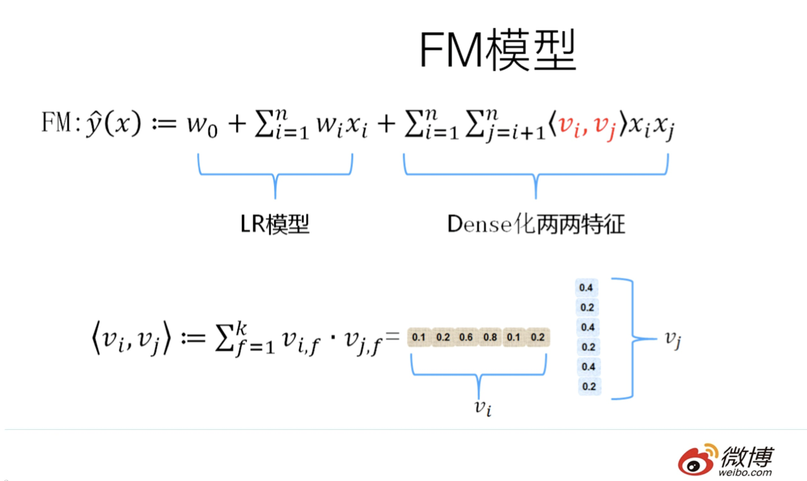

于是，FM模型此刻可以闪亮登场了。如上图所示，FM模型也直接引入任意两个特征的二阶特征组合，和SVM模型最大的不同，在于特征组合权重的计算方法。FM对于每个特征，学习一个大小为k的一维向量，于是，两个特征 $$x_i$$ 和 $$x_j$$ 的特征组合的权重值，通过特征对应的向量 $$v_i$$ 和 $$v_j$$ 的内积 $$\langle v_i,v_j \rangle$$ 来表示。这本质上是在对特征进行embedding化表征，和目前非常常见的各种实体embedding本质思想是一脉相承的，但是很明显在FM这么做的年代（2010年），还没有现在能看到的各种眼花缭乱的embedding的形式与概念。所以FM作为特征embedding，可以看作当前深度学习里各种embedding方法的老前辈。当然，FM这种模式有它的前辈模型吗？有，等会会谈。其实，和目前的各种深度DNN排序模型比，它仅仅是少了2层或者3层MLP隐层，用来直接对多阶特征非线性组合建模而已，其它方面基本相同。

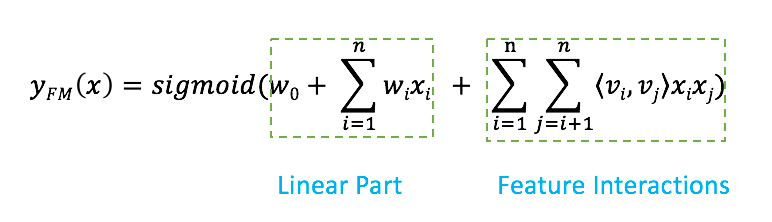

那么为什么说FM的这种特征embedding模式，在大规模稀疏特征应用环境下比较好用？为什么说它的泛化能力强呢？参考上图说明。即使在训练数据里两个特征并未同时在训练实例里见到过，意味着 $$x_i$$ 和 $$x_j$$ 一起出现的次数为0，如果换做SVM的模式，是无法学会这个特征组合的权重的。但是因为FM是学习单个特征的embedding，并不依赖某个特定的特征组合是否出现过，所以只要特征 $$x_i$$ 和其它任意特征组合出现过，那么就可以学习自己对应的embedding向量。于是，尽管 $$x_i$$ 和 $$x_j$$ 这个特征组合没有看到过，但是在预测的时候，如果看到这个新的特征组合，因为 $$x_i$$ 和 $$x_j$$ 都能学会自己对应的embedding，所以可以通过内积算出这个新特征组合的权重。这是为何说FM模型泛化能力强的根本原因。

其实本质上，这也是目前很多花样的embedding的最核心特点，就是从0/1这种二值硬核匹配，切换为向量软匹配，使得原先匹配不上的，现在能在一定程度上算密切程度了，具备很好的泛化性能。

### 从MF到FM模型

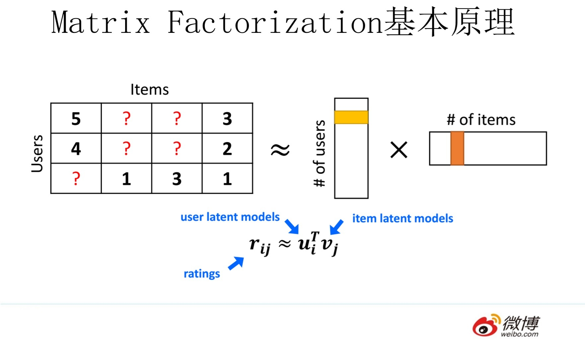

MF（Matrix Factorization，矩阵分解）模型是个在推荐系统领域里资格很深的老前辈协同过滤模型了。核心思想是通过两个低维小矩阵（一个代表用户embedding矩阵，一个代表物品embedding矩阵）的乘积计算，来模拟真实用户点击或评分产生的大的协同信息稀疏矩阵，本质上是编码了用户和物品协同信息的降维模型。

当训练完成，每个用户和物品得到对应的低维embedding表达后，如果要预测某个 $$\text{User}_i$$ 对 $$\text{Item}_j$$ 的评分的时候，只要它们做个内积计算 $$\langle \text{User}_i,\text{Item}_j\rangle$$ ，这个得分就是预测得分。看到这里，让你想起了什么吗？身为推荐算法工程师，我假设你对它还是比较熟悉的，更多的就不展开说了，相关资料很多，我们重点说MF和FM的关系问题。MF和FM不仅在名字简称上看着有点像，其实他们本质思想上也有很多相同点。那么，MF和FM究竟是怎样的关系呢？

本质上，MF模型是FM模型的特例，MF可以被认为是只有User ID 和Item ID这两个特征Fields的FM模型，MF将这两类特征通过矩阵分解，来达到将这两类特征embedding化表达的目的。而FM则可以看作是MF模型的进一步拓展，除了User ID和Item ID这两类特征外，很多其它类型的特征，都可以进一步融入FM模型里，它将所有这些特征转化为embedding低维向量表达，并计算任意两个特征embedding的内积，就是特征组合的权重，如果FM只使用User ID 和Item ID，你套到FM公式里，看看它的预测过程和MF的预测过程一样吗？

从谁更早使用特征embedding表达这个角度来看的话，很明显，和FM比起来，MF才是真正的前辈，无非是特征类型比较少而已。而FM继承了MF的特征embedding化表达这个优点，同时引入了更多Side information作为特征，将更多特征及Side information embedding化融入FM模型中。所以很明显FM模型更灵活，能适应更多场合的应用范围。

鉴于MF和FM以上错综复杂剪不断理还乱的关系，我推论出下面的观点（个人意见）：

其一：在你有使用MF做协同过滤的想法的时候，暂时压抑一下这种冲动，可以优先考虑引入FM来做的，而非传统的MF，因为可以在实现等价功能的基础上，很方便地融入其它任意你想加入的特征，把手头的事情做得更丰富多彩。

其二：从实际大规模数据场景下的应用来讲，在排序阶段，绝大多数只使用ID信息的模型是不实用的，没有引入Side Information，也就是除了User ID／Item ID外的很多其它可用特征的模型，是不具备实战价值的。原因很简单，大多数真实应用场景中，User/Item有很多信息可用，而协同数据只是其中的一种，引入更多特征明显对于更精准地进行个性化推荐是非常有帮助的。而如果模型不支持更多特征的便捷引入，明显受限严重，很难真正实用，这也是为何矩阵分解类的方法很少看到在Ranking阶段使用，通常是作为一路召回形式存在的原因。

### FM模型详解

Factorization Machines模型的最大的特点就是每一个特征都用要一个低维度的隐向量来表示（一般是10维左右），其实就是现在说的embedding；可以自动的做2阶的特征组合（自己和自己不组合）；并且很多其它的模型都是FM的特例。

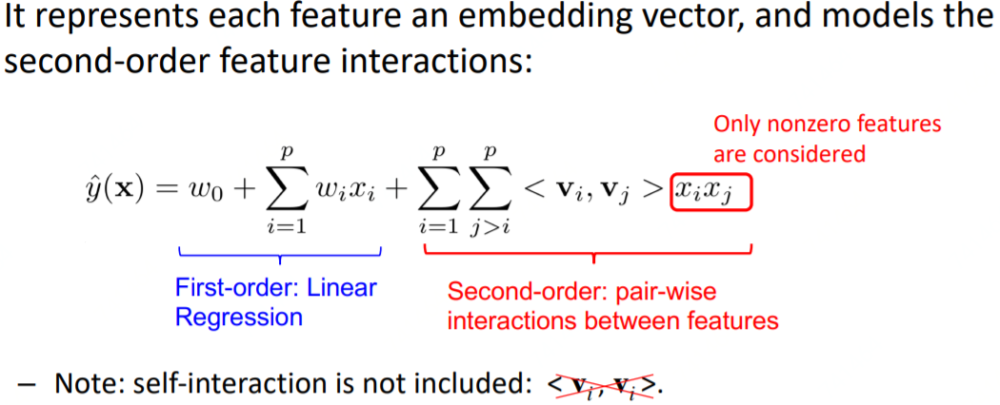

当只有两个输入的时候：userID和itemID，FM就等价于MF\(matrix factorization\):

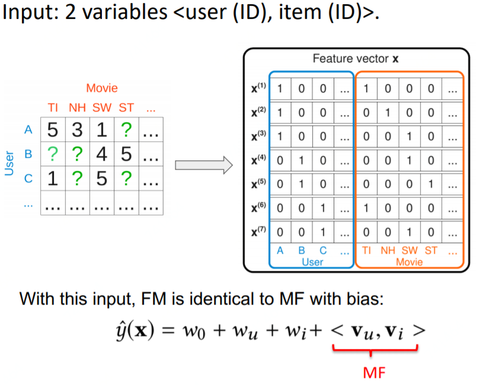

如果输入包含两个变量：1.用户的历史作用过的item 2.要预测的item的ID，那么FM也是包含了FISM模型的（Factored Item Similarity Model）：

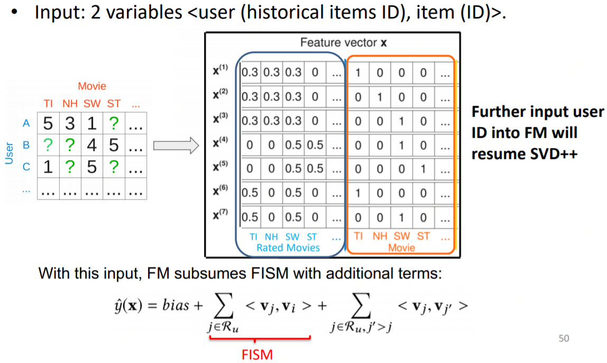

而如果再加上user的embedding，那就包含了svd++。所以mf，fism和svd++都是fm的特例。

而实践证明用打分预测来解决推荐系统的排序问题，效果不好。可能的原因：

* 预测打分用的RMSE和排序指标有差异性
* 观测到的打分数据有bias，例如用户偏向对他们喜欢的item打分

所以一般用pairwise的ranking来解决推荐的排序问题：

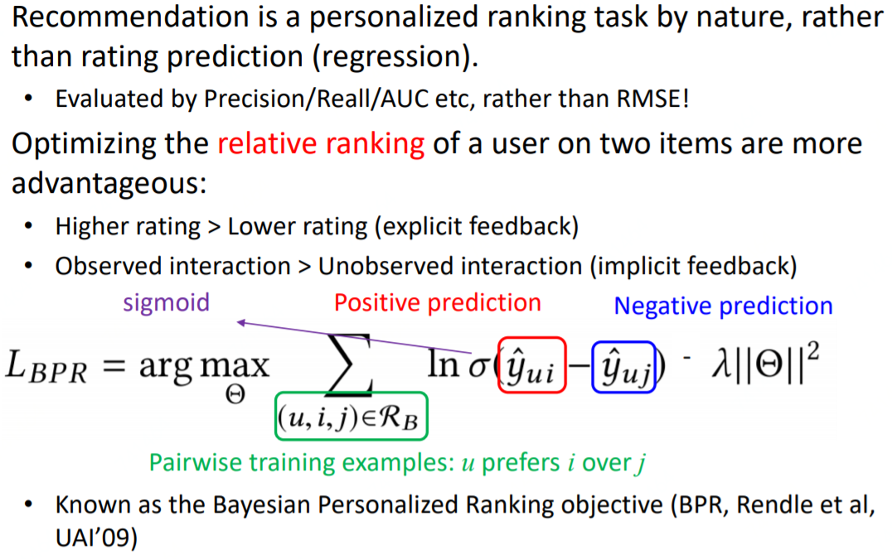

## FFM\(Field-aware Factorization Machine\)

2015年，基于FM提出的FFM（Field-aware Factorization Machine ，简称FFM）在多项CTR预估大赛中一举夺魁，并随后被Criteo、美团等公司深度应用在CTR预估，推荐系统领域。相比FM模型，FFM模型主要引入了Field-aware这一概念，使模型的表达能力更强。FFM模型中引入域（Field）的概念，把 $$n$$ 个特征归属到 $$f$$ 个field里，得到 $$n*f$$ 个隐向量的二次项，所以FFM可以看作是带多个域（Field）的FM，FM是只有一个域（Field）的FFM。

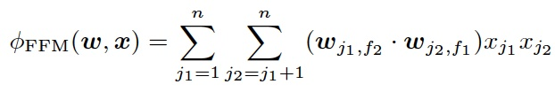

上式是FFM的目标函数的二阶部分。其与FM目标函数的区别就在于隐向量由原来的 $$w_{j_1}$$ 变成了 $$w_{j_1,f_2}$$ ，这就意味着每个特征对应的不是一个隐向量，而是对应着不同域的一组隐向量，当 $$w_{j_1}$$ 特征与 $$w_{j_2}$$ 特征进行交叉时， $$x_{j_1}$$ 特征会从一组隐向量中挑出与特征 $$x_{j_2}$$ 的域 $$f_2$$ 对应的隐向量 $$w_{j_1,f_2}$$ 进行交叉。同理特征 $$x_{j_2}$$ 也会用与 $$x_{j_1}$$ 的域 $$f_1$$ 对应的隐向量进行交叉。

这里再次强调一下，上面所说的“域”就代表着特征域，域内的特征一般会采用one-hot编码形成one-hot特征向量。

FFM模型学习每个特征在 $$f$$ 个域上的 $$k$$ 维隐向量，交叉特征的权重由特征在对方特征域上的隐向量内积得到，权重数量共 $$n*k*f$$ 个。在训练方面，由于FFM的二次项并不能够像FM那样简化，因此其复杂度为 $$kn^2$$ 。相比FM，FFM由于引入了field这一概念，为模型引入了更多有价值信息，使模型表达能力更强，但与此同时，FFM的计算复杂度上升到 $$kn^2$$ ，远远大于FM的 $$k*n$$ 。

性能往往是制约FFM大规模应用的因素，如果规模不是很大，而且特征比较稀疏的场景下，FFM有很好的效果。 在实际应用中，FM比FFM更广泛一些，是对性能和效果的一些折中，比较常用的像dmlc下的FM，支持全量和增量的分布式计算，比较适合新闻推荐中场景和兴趣多变而且很多稀疏特征的情况。

## Source







