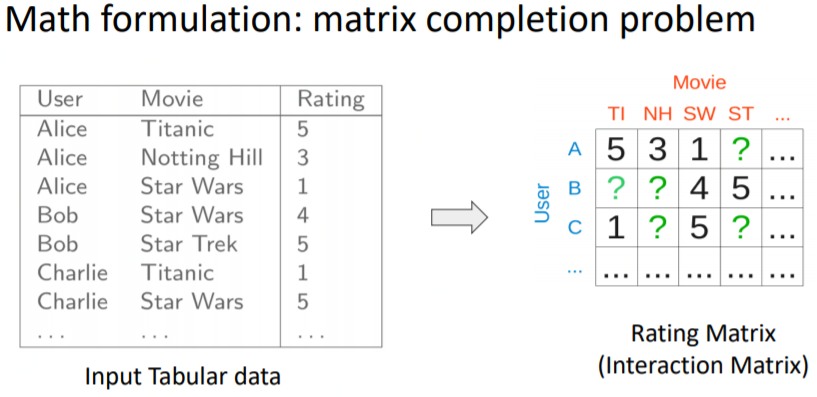
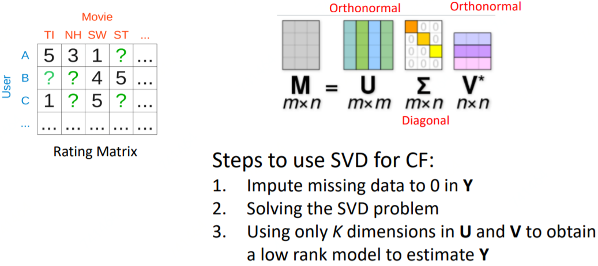
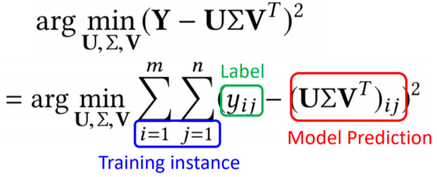
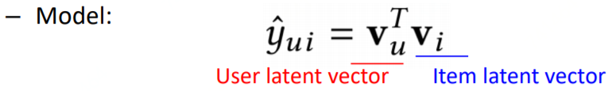
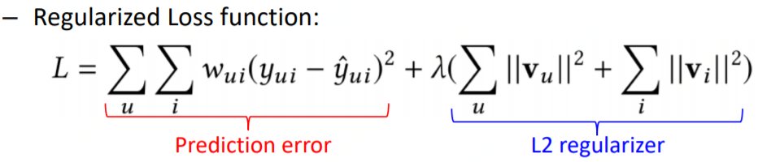
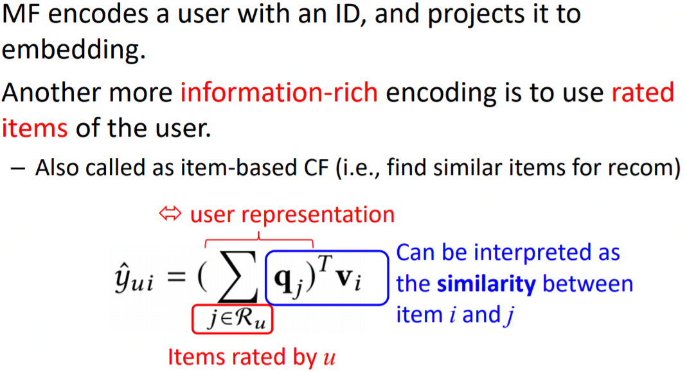
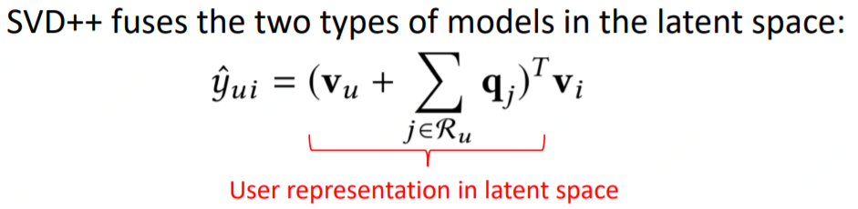

# 协同过滤

## 协同过滤\(Collaborative Filtering Models\)

协同过滤（CF）是推荐里最通用、最著名的算法了。CF的基本假设是：一个用户的行为，可以由跟他行为相似的用户进行推测。协同过滤一般分为user-based和item-based、model-based三类方法。user-based和item-based、model-based的协同过滤的算法的思想通俗的讲，就是：

* user-based：两个用户A和B很相似，那么可以把B购买过的商品推荐给A（如果A没买过）；例如你和你的师兄都是学机器学习的，那么你的师兄喜欢的书籍，你也很有可能喜欢
* item-based: 两个item：A和B很相似，那么某个用户购买过A，则可以给该用户推荐B。例如一个用户购买过《模式识别》这本书，它很有可能也喜欢《推荐系统》这本书。计算两个item是否相似的一种简单方法是，看看他们的共现概率，即他们被用户同时购买的概率
* model-based: 用机器学习的思想来建模解决，例如聚类、分类、PLSA、矩阵分解等

CF要解决的问题用数学化的语言来表达就是：一个矩阵的填充问题，已经打分的item为observed data，未打分的是missing data：

## SVD（Singular Value Decomposition）

既然是矩阵问题，首先想到的自然是用SVD去做，步骤如下

其实本质上来说，用SVD去尝试解决的是以下问题：

用SVD去做有两个缺点：1、missing data\(就是没打分的，占比99%\)和observed data（观测到的、已打分的）有一样的权重。2、没有加正则，容易过拟合。

## MF（Matrix Factorization，user-based CF）

针对SVD的问题，加以少许修改即构造了推荐系统中矩阵分解方法\(Matrix Factorization\)：

user和item分别用一个embedding表示，然后用户对item的偏好程度用这两个embedding的内积表示：

使用L2-loss（其它loss也可以）和正则：

## [Factored Item Similarity Model](https://dl.acm.org/citation.cfm?id=2487589)

Factored Item Similarity Model是用user作用过的item的embedding的和来表示user，item用另一套embedding下的一个embedding来表示，最后两者的内积表示user对该item的偏好。

这个模型也叫item-based的CF，因为把括号里的东西展开后，其实就是找用户作用过的item和item\[j\]的相似度。

## [SVD++](https://www.cs.rochester.edu/twiki/pub/Main/HarpSeminar/Factorization_Meets_the_Neighborhood-_a_Multifaceted_Collaborative_Filtering_Model.pdf)

SVD++用一个user的embedding，和上述的FISM的方法，融合来表示user。这曾经是netflix比赛中连续三年效果最好的单模型。

## Source





### 

