# 排序

排序环节是推荐系统最关键，也是最具有技术含量的部分，目前大多数推荐技术其实都聚焦在这块。下面我们从模型表达能力、模型优化目标以及特征及信息三个角度分述推荐排序模型的技术发展趋势。

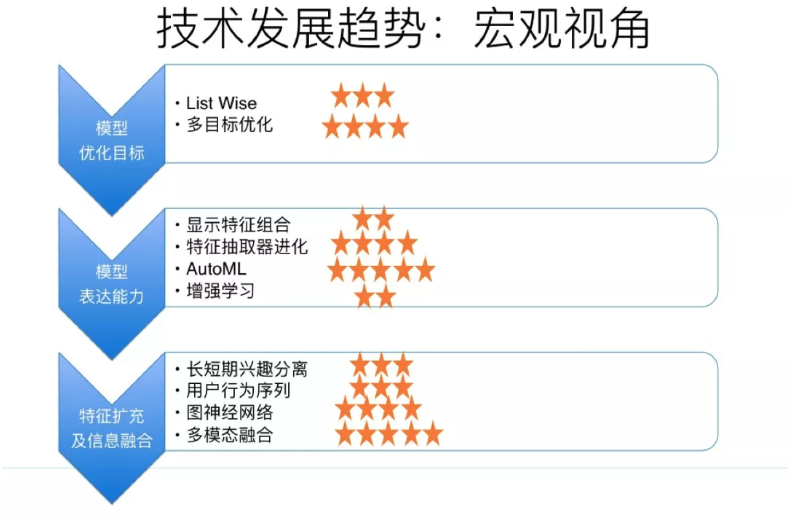

模型表达能力代表了模型是否具备充分利用有效特征及特征组合的能力，其中显示特征组合、新型特征抽取器、增强学习技术应用以及 AutoML 自动探索模型结构是这方面明显的技术进化方向；模型优化目标则体现了我们希望推荐系统去做好什么，往往跟业务目标有关联，这里我们主要从技术角度来探讨，而多目标优化以及 ListWise 最优是目前最常见的技术进化方向，ListWise 优化目标在排序阶段和重排阶段都可采用，我们把它放到重排部分去讲，这里主要介绍多目标优化；从特征和信息角度，如何采用更丰富的新类型特征，以及信息和特征的扩充及融合是主要技术进化方向，用户长短期兴趣分离、用户行为序列数据的使用、图神经网络以及多模态融合等是这方面的主要技术趋势，因为用户行为序列以及图神经网络在召回部分介绍过，这些点同样可以应用在排序部分，所以这里不再叙述这两点。

## 显式特征组合

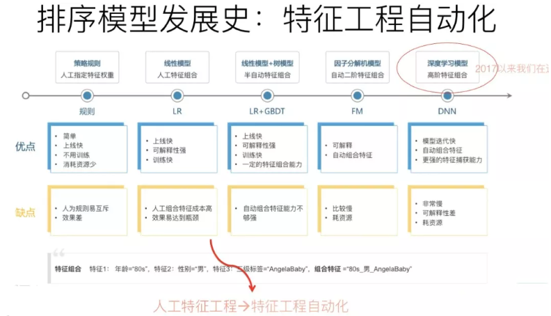

如果归纳下工业界 CTR 模型的演化历史的话，你会发现，特征工程及特征组合的自动化，一直是推动实用化推荐系统技术演进最主要的方向，而且没有之一。最早的 LR 模型，基本是人工特征工程及人工进行特征组合的，简单有效但是费时费力；再发展到 LR+GBDT 的高阶特征组合自动化，以及 FM 模型的二阶特征组合自动化；再往后就是 DNN 模型的引入，纯粹的简单 DNN 模型本质上其实是在 FM 模型的特征 Embedding 化基础上，添加几层 MLP 隐层来进行隐式的特征非线性自动组合而已。所谓隐式，意思是并没有明确的网络结构对特征的二阶组合、三阶组合进行直接建模，只是通过 MLP，让不同特征发生交互，至于怎么发生交互的，怎么进行特征组合的，谁也说不清楚，这是 MLP 结构隐式特征组合的作用，当然由于 MLP 的引入，也会在特征组合时候考虑进入了特征间的非线性关系。

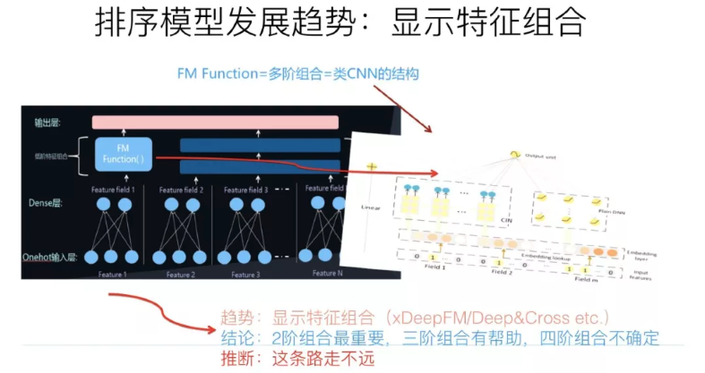

明白了隐式特征组合，也就明白了什么是显式特征组合。就是在模型结构中，明确设计一些子网络或者子结构，对二阶特征组合、三阶特征组合，甚至更高阶的特征组合进行表征。比如说 DeepFM，Deep 部分就是个典型的 DNN 模型，这个大家基本都会用，而 FM 部分则是明确对特征二阶组合进行建模的子模型。这就是一个典型的显式二阶特征组合的模型。而如果进一步拓展的话，很自然想到的一个改进思路是：除了明确的把特征二阶组合做一个子结构，还可以把特征三阶特征组合，更高阶特征组合…..分别做一个模型子结构。融合这些子结构一起来做预测。这就是显式特征组合的含义，其实这条线的发展脉络是异常清晰的。典型的对高阶特征组合建模的比如 Deep& Cross、XDeepFM 模型等，就是这么个思路。

在两年多前，我一直以为这个方向是 CTR 或者推荐模型的关键所在，而且可能如何简洁融入更多特征组合是最重要且最有前景的方向。但是后来发现可能错了，目前基本对这个方向改变了看法。目前我对这个方向的看法是：这个方向确实很重要，但是未来可挖掘的潜力和空间很有限，在这条路上继续行进，应该不会走得太远。原因在于，目前基本很多经验已经证明了，显式的二阶特征组合是非常重要的，三阶特征组合对不同类型任务基本都有帮助。四阶特征组合已经说不清楚是否有用了，跟数据集有关系，有些数据集合引入显式4阶特征组合有帮助，有些数据集合没什么用。至于更高阶的特征组合，明确用对应的子结构建模，基本已经没什么用了，甚至是负面作用。这说明：我们在实际做事情的时候，其实显式结构把三阶特征组合引入，已经基本足够了。这是为什么说这条路继续往后走潜力不大的原因。

#### 典型工作

Deep& Cross: Deep & Cross Network for Ad Click Predictions

XDeepFM: Combining Explicit and Implicit Feature Interactions for Recommender Systems

## 特征抽取器的进化

从特征抽取器的角度来看，目前主流的 DNN 排序模型，最常用的特征抽取器仍然是 MLP 结构，通常是两层或者三层的 MLP 隐层。目前也有理论研究表明：MLP 结构用来捕获特征组合，是效率比较低下的，除非把隐层神经元个数急剧放大，而这又会急剧增加参数规模。与自然语言处理和图像处理比较，推荐领域的特征抽取器仍然处于非常初级的发展阶段。所以，探寻新型特征抽取器，对于推荐模型的进化是个非常重要的发展方向。

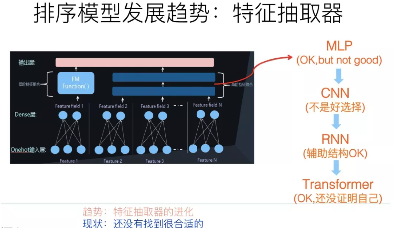

目前其它 AI 领域里，常用的特征抽取器包括图像领域的 CNN、NLP 领域的 RNN 和 Transformer。这些新型特征抽取器，在推荐领域最近两年也逐步开始尝试使用，但是宏观地看，在推荐领域，相对 MLP 结构并未取得明显优势，这里的原因比较复杂。CNN 捕获局部特征关联是非常有效的结构，但是并不太适合做纯特征输入的推荐模型，因为推荐领域的特征之间，在输入顺序上并无必然的序列关系，基本属于人工定义随机顺序，而 CNN 处理这种远距离特征关系能力薄弱，所以并不是特别适合用来处理特征级的推荐模型。当然，对于行为序列数据，因为本身带有序列属性，所以 CNN 和 RNN 都是非常适合应用在行为序列结构上的，也是有一定应用历史的典型工具，但是对于没有序关系存在的特征来说，这两个模型的优势不能发挥出来，反而会放大各自的劣势，比如 CNN 的捕获远距离特征关系能力差的弱点，以及 RNN 的不可并行处理、所以速度慢的劣势等。

Transformer 作为 NLP 领域最新型也是最有效的特征抽取器，从其工作机制来说，其实是非常适合用来做推荐的。为什么这么说呢？核心在于 Transformer 的 Multi-Head Self Attention 机制上。MHA 结构在 NLP 里面，会对输入句子中任意两个单词的相关程度作出判断，而如果把这种关系套用到推荐领域，就是通过 MHA 来对任意特征进行特征组合，而上文说过，特征组合对于推荐是个很重要的环节，所以从这个角度来说，Transformer 是特别适合来对特征组合进行建模的，一层 Transformer Block 代表了特征的二阶组合，更多的 Transformer Block 代表了更高阶的特征组合。但是，实际上如果应用 Transformer 来做推荐，其应用效果并没有体现出明显优势，甚至没有体现出什么优势，基本稍微好于或者类似于典型的 MLP 结构的效果。这意味着，可能我们需要针对推荐领域特点，对 Transformer 需要进行针对性的改造，而不是完全直接照搬 NLP 里的结构。

#### 典型工作

AutoInt: Automatic Feature Interaction Learning via Self-Attentive Neural Networks

DeepFM: An End-to-End Wide & Deep Learning Framework for CTR Prediction

## AutoML 在推荐的应用

AutoML 在17年初开始出现，最近三年蓬勃发展，在比如图像领域、NLP 领域等都有非常重要的研究进展，在这些领域，目前都能通过 AutoML 找到比人设计的效果更好的模型结构。AutoML 作为算法方向最大的领域趋势之一，能否在不同领域超过人类专家的表现？这应该不是一个需要回答 "会不会" 的问题，而是应该回答 "什么时间会" 的问题。原因很简单，AutoML 通过各种基础算子的任意组合，在超大的算子组合空间内，寻找性能表现最好的模型，几乎可以达到穷举遍历的效果，而人类专家设计出来的最好的模型，无非是算子组合空间中的一个点而已，而且人类专家设计的那个模型，是最好模型的可能性是很低的。如果设计精良的 AutoML，一定可以自己找到超过目前人类专家设计的最好的那个模型，这基本不会有什么疑问，就像人类就算不是2017年，也会是某一年，下围棋下不过机器，道理其实是一样的，因为 AutoML 在巨大的算子组合空间里寻找最优模型，跟围棋在无穷的棋盘空间寻找胜利的盘面，本质上是一个事情。无非，现在 AutoML 的不成熟，体现在需要搜索的空间太大，比较消耗计算资源方面而已，随着技术的不断成熟，搜索成本越来越低，AutoML 在很多算法方向超过人类表现只是个时间问题。

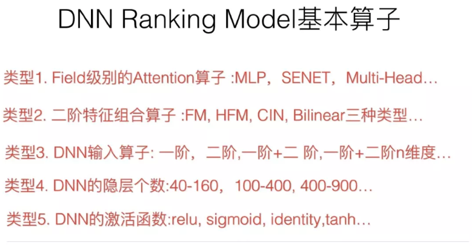

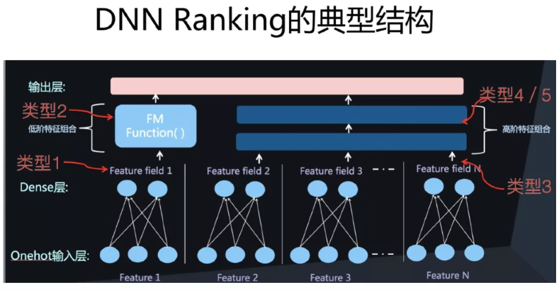

在推荐领域，采用 AutoML 做网络结构的工作还很少，这里面有很多原因。由于我一直以来特别看好这个方向，所以在18年的时候，我们也尝试过利用 AutoML 来自动探索推荐系统的网络结构，这里非常简略地介绍下过程及结果 \( 参考上面三图 \)。我们用 ENAS 作为网络搜索工具，设计了推荐领域网络结构自动探索的尝试。ENAS 是个非常高效率的 AutoML 工具，可以做到单 GPU 半天搜索找到最优的网络结构，但是它定义的主要是 CNN 结构和 RNN 结构搜索。我们对 ENAS 进行了改造，包括算子定义，优化目标以及评价指标定义等。DNN 排序模型因为模型比较单一，所以算子是比较好找的，我们定义了推荐领域的常用算子，然后在这些算子组合空间内通过 ENAS 自动寻找效果最优的网络结构，最终找到的一个表现最好的网络结构如下图所示：

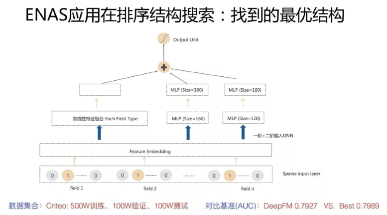

首先是特征 onehot 到 embedding 的映射，我们把这层固定住了，不作为模型结构探索因子。在特征 embedding 之上，有三个并行结构，其中两个是包含两个隐层的 MLP 结构，另外一个是特征双线性组合模块 \( Each Fields Type，具体含义可以参考下面的 FibiNet \)。其表现超过了 DeepFM 等人工结构，但是并未超过很多。\( 感谢黄通文同学的具体尝试 \)

总体而言，目前 AutoML 来做推荐模型，还很不成熟，找出的结构相对人工设计结构效果优势也不是太明显。这与 DNN Ranking 模型比较简单，算子类型太少以及模型深度做不起来也有很大关系。但是，我相信这里可以有更进一步的工作可做。

#### 典型工作

[ENAS 结构搜索：AutoML 在推荐排序网络结构搜索的应用](https://www.docin.com/p-2269372287.html)

双线性特征组合: FiBiNET: Combining Feature Importance and Bilinear feature Interaction for Click-Through Rate Prediction

## 增强学习在推荐的应用

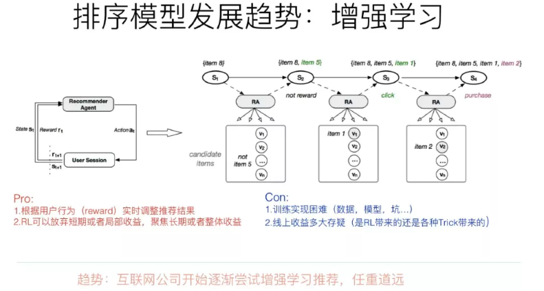

增强学习其实是比较吻合推荐场景建模的。一般而言，增强学习有几个关键要素：状态、行为以及回报。在推荐场景下，我们可以把状态 St 定义为用户的行为历史物品集合；推荐系统可选的行为空间则是根据用户当前状态 St 推荐给用户的推荐结果列表，这里可以看出，推荐场景下，用户行为空间是巨大无比的，这制约了很多无法对巨大行为空间建模的增强学习方法的应用；而回报呢，则是用户对推荐系统给出的列表内容进行互动的行为价值，比如可以定义点击了某个物品，则回报是1，购买了某个物品，回报是5….诸如此类。有了这几个要素的场景定义，就可以用典型的增强学习来对推荐进行建模。

利用增强学习来做推荐系统，有几个显而易见的好处，比如：

1. 比较容易对 "利用-探索" \( Exploitation/Exploration \) 建模。所谓利用，就是推荐给用户当前收益最大的物品，一般推荐模型都是优化这个目标；所谓探索，就是随机推给用户一些物品，以此来探测用户潜在感兴趣的东西。如果要进行探索，往往会牺牲推荐系统的当前总体收益，毕竟探索效率比较低，相当的通过探索渠道推给用户的物品，用户其实并不感兴趣，浪费了推荐位。但是，利用-探索的均衡，是比较容易通过调节增强学习的回报 \( Reward \) 来体现这个事情的，比较自然。

2. 比较容易体现用户兴趣的动态变化。我们知道，用户兴趣有长期稳定的，也有不断变化的。而增强学习比较容易通过用户行为和反馈的物品对应的回报的重要性，而动态对推荐结果产生变化，所以是比较容易融入体现用户兴趣变化这个特点的。

3. 有利于推荐系统长期收益建模。这点是增强学习做推荐最有优势的一个点。我们优化推荐系统，往往会有一些短期的目标比如增加点击率等，但是长期目标比如用户体验或者用户活跃留存等指标，一般不太好直接优化，而增强学习模型比较容易对长期收益目标来进行建模。

说了这么多优点，貌似增强学习应该重点投入去做，是吧？我的意见正好相反，觉得从实际落地角度来看，推荐系统里要尝试增强学习方法，如果你有这个冲动，最好还是抑制一下。主要原因是，貌似增强学习是技术落地投入产出比非常低的技术点。首先投入高，要想把增强学习做 work，意味着有很多大坑在等着你去踩，数据怎么做、模型怎么写、回报怎么拍，长期收益怎么定义、建模并拆解成回报…….超大规模实际场景的用户和物品，增强学习这么复杂的模型，系统怎么才能真的落地并撑住流量…..很多坑在里面；其次，貌似目前看到的文献看，貌似很少见到真的把增强学习大规模推到真实线上系统，并产生很好的收益的系统。Youtube 在最近一年做了不少尝试，虽说把系统推上线了，但是收益怎样不好说。而且，从另外一个角度看，做增强学习里面还是有不少 Trick 在，那些收益到底是系统带来的，还是 Trick 带来的，真还不太好说。所以，综合而言，目前看在增强学习做推荐投入，貌似还是一笔不太合算的买卖。当然，长远看，可能还是很有潜力的，但是貌似这个潜力还需要新的技术突破去推动和挖掘。

#### 典型工作

Youtube: Top-K Off-Policy Correction for a REINFORCE Recommender System

Youtube: Reinforcement Learning for Slate-based Recommender Systems: A Tractable Decomposition and Practical Methodology

## 多目标优化

推荐系统的多目标优化 \( 点击，互动，时长等多个目标同时优化 \) 严格来说不仅仅是趋势，而是目前很多公司的研发现状。对于推荐系统来说，不同的优化目标可能存在互相拉后腿的现象，比如互动和时长，往往拉起一个指标另外一个就会明显往下掉，而多目标旨在平衡不同目标的相互影响，尽量能够做到所有指标同步上涨，即使很难做到，也尽量做到在某个优化目标上涨的情况下，不拉低或者将尽量少拉低其它指标。多目标优化对于实用化的推荐系统起到了举足轻重的作用，这里其实是有很多工作可以做的，而如果多目标优化效果好，对于业务效果的推动作用也非常大。总而言之，多目标优化是值得推荐系统相关研发人员重点关注的技术方向。

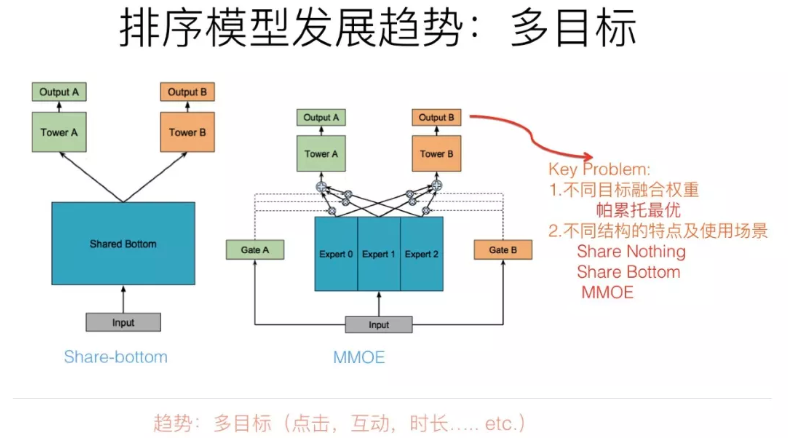

从技术角度讲，多目标优化最关键的有两个问题。第一个问题是多个优化目标的模型结构问题；第二个问题是不同优化目标的重要性如何界定的问题。

既然存在多个优化目标，最简单直接的方式，也是目前最常用的方式是：每个优化目标独立优化，比如点击目标训练一个模型，互动目标训练一个模型，时长目标训练一个模型，各自优化，然后每个目标独立给实例预测打分，给每个目标设定权重值，各个目标打分加权求和线性融合，或者引入权重指数及根据目标关系引入非线性融合。这是目前最常见的落地方案。因为目标之间独立优化，模型是通过分数融合来实现多目标的，所以可以把这种多目标方式称作 "Share-Nothing" 结构。这个结构实现和优化方式很简单。

与 Share-Nothing 结构相比，其实我们是可以让不同优化目标共享一部分参数的，一旦引入不同目标或者任务的参数共享，我们就踏入了 Transfer Learning 的领地了。那么为什么要共享参数呢？一方面出于计算效率考虑，不同目标共享结构能够提升计算效率；另外一点，假设我们有两类任务或者目标，其中一个目标的训练数据很充分，而另外一个目标的训练数据比较少；如果独立优化，训练数据少的目标可能很难获得很好的效果；如果两个任务相关性比较高的话，其实我们可以通过共享参数，达到把大训练数据任务的知识迁移给训练数据比较少的任务的目的，这样可以极大提升训练数据量比较少的任务的效果。Share-Bottom 结构是个非常典型的共享参数的多目标优化结构，核心思想是在比如网络的底层参数，所有任务共享参数，而上层网络，不同任务各自维护自己独有的一部分参数，这样就能达成通过共享参数实现知识迁移的目的。但是，Share-Bottom 结构有他的缺点：如果两个任务不那么相关的话，因为强制共享参数，所以可能任务之间相互干扰，会拉低不同目标的效果。MMOE 针对 Share-Bottom 结构的局限进行了改进，核心思想也很简单，就是把底层全部共享的参数切分成小的子网络，不同任务根据自己的特点，学习配置不同权重的小网络来进行参数共享。这样做的话，即使是两个任务不太相关，可以通过不同的配置来达到模型解耦的目的，而如果模型相关性强，可以共享更多的子网络。明显这样的组合方式更灵活，所以对于 MMOE 来说，无论是相关还是不相关的任务，它都可以达到我们想要的效果。

上面介绍的是典型的不同多目标的模型结构，各自有其适用场景和特点。而假设我们选定了模型结构，仍然存在一个很关键的问题：不同优化目标权重如何设定？当然，我们可以根据业务要求，强制制定一些权重，比如视频网站可能更重视时长或者完播率等指标，那就把这个目标权重设置大一些。但是，我们讲过，有些任务之间的指标优化是负相关的，提升某个目标的权重，有可能造成另外一些指标的下跌。所以，如何设定不同目标权重，能够尽量减少相互之间的负面影响，就非常重要。这块貌似目前并没有特别简单实用的方案，很多实际做法做起来还是根据经验拍一些权重参数上线AB测试，费时费力。而如何用模型自动寻找最优权重参数组合就是一个非常有价值的方向，目前最常用的方式是采用帕累托最优的方案来进行权重组合寻优，这是从经济学引入的技术方案，未来还有很大的发展空间。

#### 典型工作

MMOE：Modeling Task Relationships in Multi-task Learning with Multi-gate Mixture-of-Experts

帕累托最优：A Pareto-Efficient Algorithm for Multiple Objective Optimization in E-Commerce Recommendation

## 多模态信息融合

所谓模态，指的是不同类型的或者模态形式的信息存在形式，比如文本、图片、视频、音频、互动行为、社交关系等，都是信息不同的存在模态形式。如果类比一下的话，就仿佛我们人类感知世界，也是用不同的感官来感知不同的信息类型的，比如视觉、听觉、味觉、触觉等等，就是接受不同模态类型的信息，而大脑会把多模态信息进行融合，来接受更全面更综合的世界知识。类似的，如何让机器学习模型能够接受不同模态类型的信息，并做知识和信息互补，更全面理解实体或者行为。这不仅仅是推荐领域的技术发现趋势，也是人工智能几乎所有方向都面临的重大发展方向，所以这个方向特别值得重视。

多模态融合，从技术手段来说，本质上是把不同模态类型的信息，通过比如 Embedding 编码，映射到统一的语义空间内，使得不同模态的信息，表达相同语义的信息完全可类比。比如说自然语言说的单词 "苹果"，和一张苹果的图片，应该通过一定的技术手段，对两者进行信息编码，比如打出的 embedding，相似度是很高的，这意味着不同模态的知识映射到了相同的语义空间了。这样，你可以通过文本的苹果，比如搜索包含苹果的照片，诸如此类，可以玩出很多新花样。

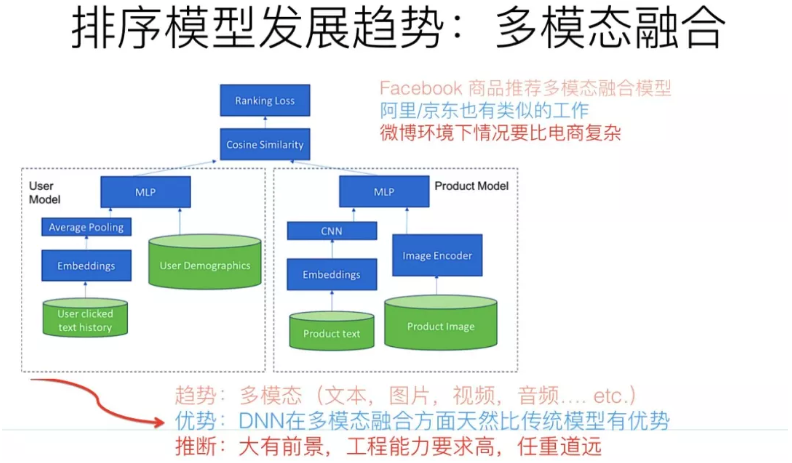

在推荐场景下，多模态融合其实不是个很有难度的算法方向，大的技术框架仍然遵循目前主流的技术框架，比如 DNN Ranking。为了体现多模态集成的目标，可以在 User 侧或者 Item 侧，把多模态信息作为新的特征融入，比如加入 CNN 特征抽取器，把商品图片的特征抽取出来，作为商品侧的一种新特征，不同模态的融入，很可能意味着找到对应的特征抽取器，以新特征的方式融入，而有监督学习的学习目标会指导特征抽取器抽出那些有用的特征。所以，你可以看到，如果在推荐里融入多模态，从算法层面看，并不难，它的难点其实在它处；本质上，多模态做推荐，如果说难点的话，难在工程效率。因为目前很多模态的信息抽取器，比如图片的特征抽取，用深层 ResNet 或者 ReceptionNet，效果都很好，但是因为网络层深太深，抽取图片特征的速度问题就是多模态落地面临的主要问题。所以，本质上，在推荐领域应用多模态，看上去其实是个工程效率问题，而非复杂的算法问题。而且，如果融合多模态的话，离开 DNN 模型，基本是不现实的。在这点上，可以比较充分体现DNN模型相对传统模型的绝对技术优势。

多模态信息融合，不仅仅是排序端的一个发展方向，在召回侧也是一样的，比如用用户点击过的图片，作为图片类型的新召回路，或者作为模型召回的新特征。明显这种多模态融合是贯穿了推荐领域各个技术环节的。

#### 典型工作

DNN召回：Collaborative Multi-modal deep learning for the personalized product retrieval in Facebook Marketplace

排序：Image Matters: Visually modeling user behaviors using Advanced Model Server

## 长期兴趣／短期兴趣分离

对于推荐系统而言，准确描述用户兴趣是非常重要的。目前常用的描述用户兴趣的方式主要有两类。一类是以用户侧特征的角度来表征用户兴趣，也是最常见的；另外一类是以用户发生过行为的物品序列作为用户兴趣的表征。

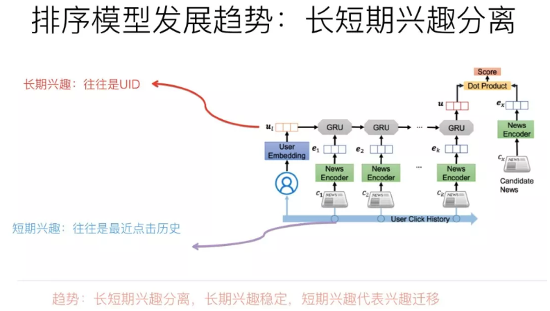

我们知道，用户兴趣其实是可以继续细分的，一种典型的分法就是划分为长期兴趣和短期兴趣。长期兴趣代表用户长久的比较稳定的偏好；而短期兴趣具有不断变化等特点。两者综合，可以从稳定性和变化性这个维度来表征用户偏好。

最近推荐系统在排序侧模型的演进方向来说，把用户长期兴趣和短期兴趣分离并各自建立模型是个技术小趋势。那么用什么信息作为用户的短期兴趣表征？什么信息作为用户的长期兴趣表征呢？各自又用什么模型来集成这些信息呢？这是这个趋势的三个关键之处。

目前的常用做法是：用户短期兴趣往往使用用户点击 \( 或购买，互动等其它行为类型 \) 过的物品序列来表征，尤其对于比较活跃的用户，用点击序列更能体现短期的含义，因为出于工程效率的考虑，如果用户行为序列太长，往往不会都拿来使用，而是使用最近的 K 个行为序列中的物品，来表征用户兴趣，而这明显更含有短期的含义；因为点击序列具备序列性和时间属性，所以对于这类数据，用那些能够刻画序列特性或者物品局部相关性的模型比较合适，比如 RNN／CNN和Transformer 都比较适合用来对用户短期兴趣建模。

而用户长期兴趣如何表征呢？我们换个角度来看，其实传统的以特征作为用户兴趣表征的方法，其中部分特征就是从用户长期兴趣出发来刻画的，比如群体人群属性，是种间接刻画用户长期兴趣的方法，再比如类似用户兴趣标签，是种用用户行为序列物品的统计结果来表征用户长期兴趣的方法。这些方法当然可以用来刻画用户长期兴趣，但是往往粒度太粗，所以我们其实需要一个比较细致刻画用户长期兴趣的方式和方法。目前在对长短期兴趣分离的工作中，关于如何刻画用户长期兴趣，往往还是用非常简单的方法，就是用 UID 特征来表征用户的长期兴趣，通过训练过程对 UID 进行 Embedding 编码，以此学习到的 UID Embedding 作为用户长期兴趣表征，而用户行为序列物品作为用户短期兴趣表征。当然，UID 如果用一些其它手段比如矩阵分解获得的 Embedding 初始化，也是很有帮助的。

总而言之，用户长期兴趣和短期兴趣的分离建模，应该还是有意义的。长期兴趣目前建模方式还比较简单，这里完全可以引入一些新方法来进行进一步的兴趣刻画，而且有很大的建模空间。

#### 典型工作

Neural News Recommendation with Long- and Short-term User Representations

Sequence-Aware Recommendation with Long-Term and Short-Term Attention Memory Networks

## Source



