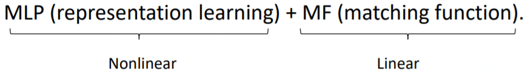
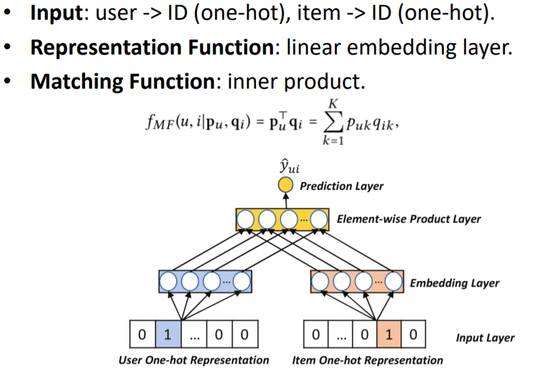
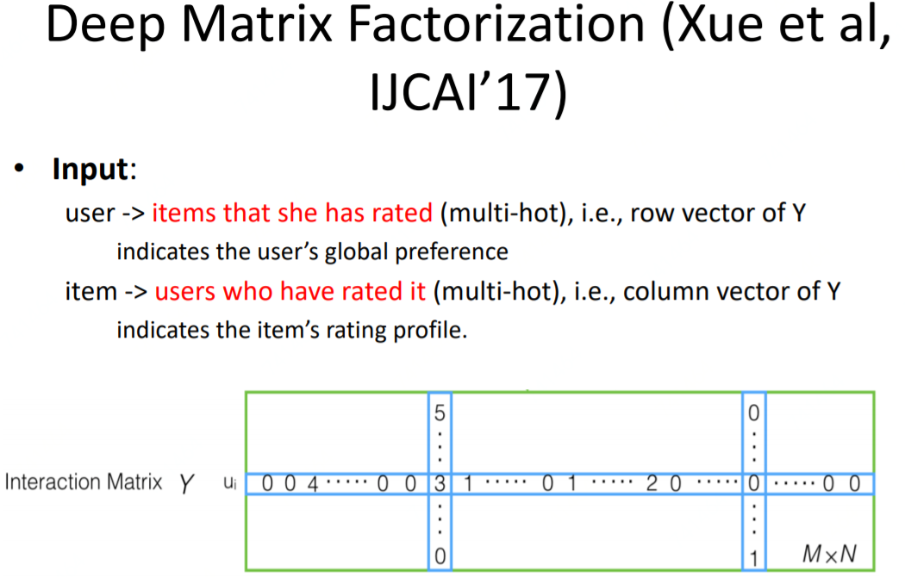
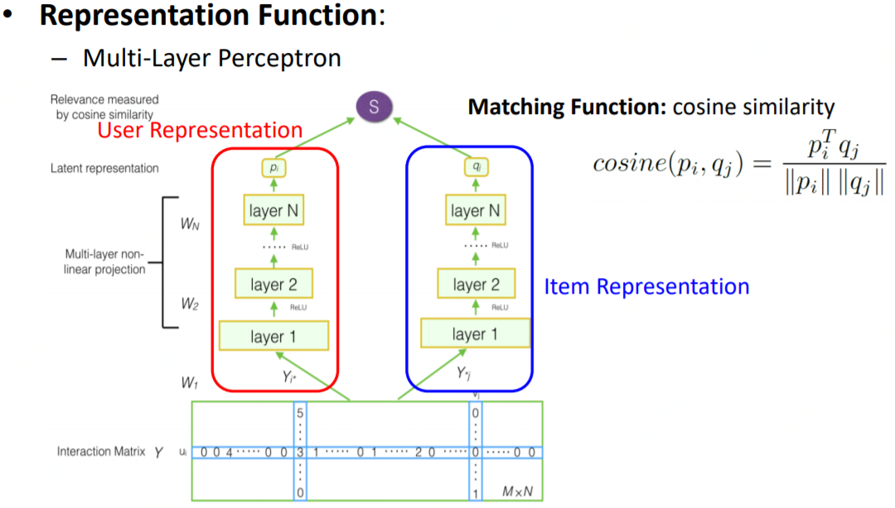
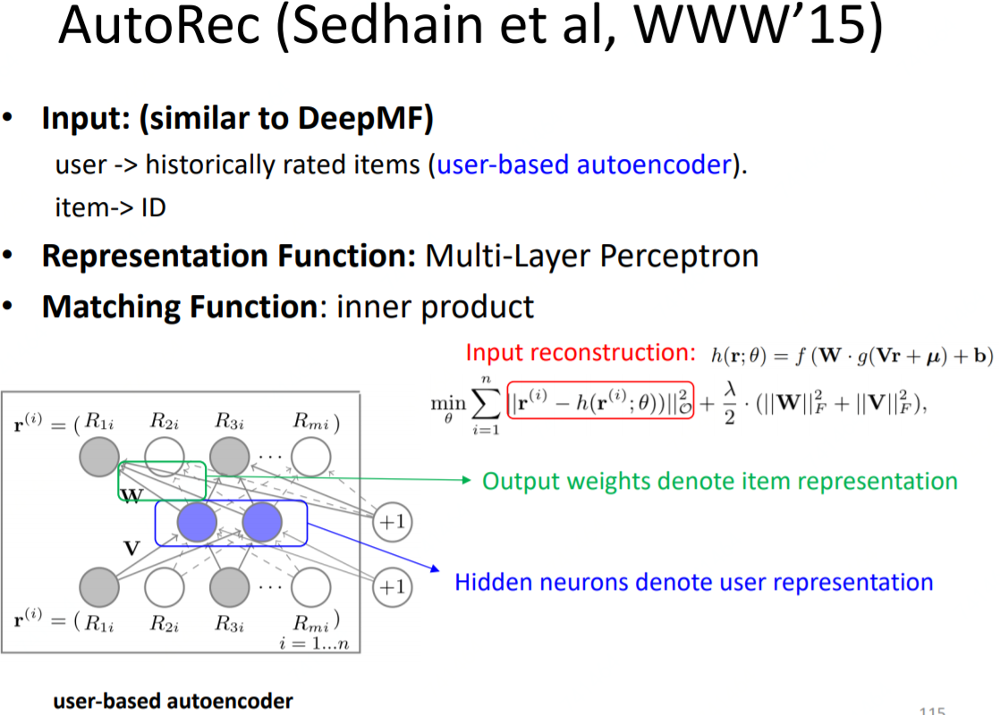
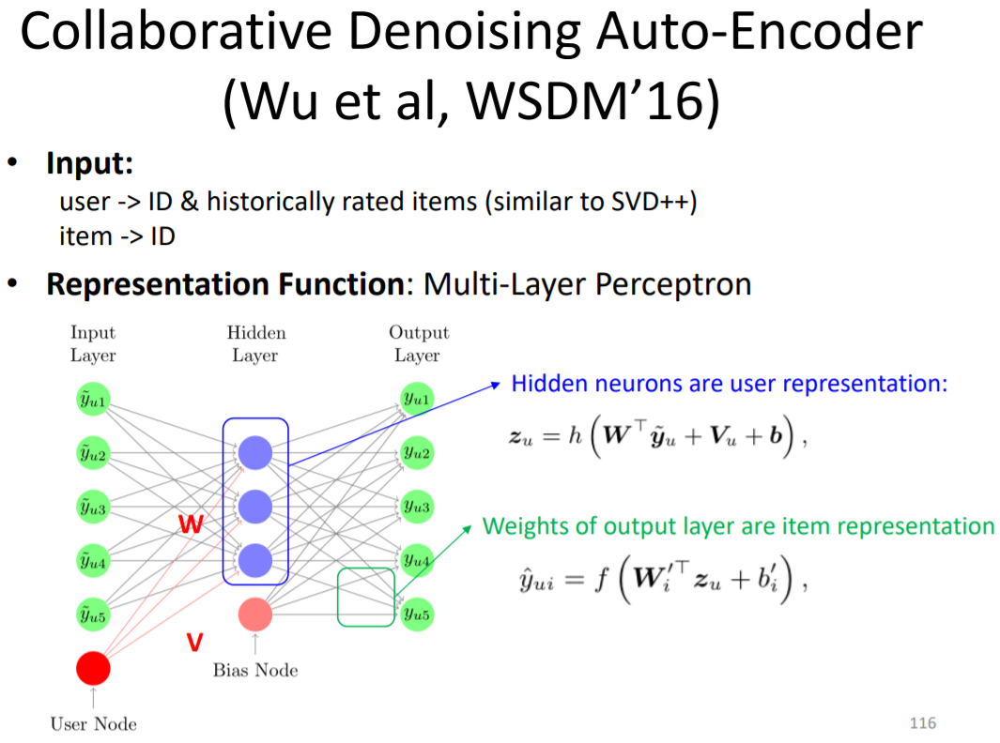

# 协同过滤

这类方法是仅仅建立在user-item的交互矩阵上。简单总结一下，基于Collaborative Filtering的做representation learning的特点：

* 用ID或者ID对应的历史行为作为user、item的profile
* 用历史行为的模型更具有表达能力，但训练起来代价也更大

而Auto-Encoder的方法可以等价为：

用MLP来进行representation learning（和MF不一样的是，是非线性的），然后用MF进行线性的match。

首先，简单复习一下MF，如果用神经网络的方式来解释MF，就是如下这样的：

输入只有userID和item\_ID，representation function就是简单的线性embedding层，就是取出id对应的embedding而已；然后matching function就是内积。

## \*\*\*\*[**Deep Matrix Factorization\(Xue et al, IJCAI' 17\)**](https://pdfs.semanticscholar.org/35e7/4c47cf4b3a1db7c9bfe89966d1c7c0efadd0.pdf?_ga=2.148333367.182853621.1552882810-701334199.1540873247)\*\*\*\*

用user作用过的item的打分集合来表示用户，即multi-hot，例如\[0 1 0 0 4 0 0 0 5\]，然后再接几层MLP，来学习更深层次的user的embedding的学习。例如，假设item有100万个，可以这么设置layer：1000 \* 1000 -&gt;1000-&gt;500-&gt;250。

用对item作用过的用户的打分集合来表示item，即multi-hot，例如\[0 2 0 0 3 0 0 0 1\]，然后再接几层MLP，来学习更深层次的item的embedding的学习。例如，假设user有100万个，可以这么设置layer：1000 \* 1000 -&gt;1000-&gt;500-&gt;250。

得到最后的user和item的embedding后，用cosine计算他们的匹配分。这个模型的明显的一个缺点是，第一层全连接的参数非常大，例如上述我举的例子就是1000\*1000\*1000。

## [AutoRec \(Sedhain et al, WWW’15\)](http://users.cecs.anu.edu.au/~u5098633/papers/www15.pdf)

这篇论文是根据auto-encoder来做的，auto-encoder是利用重建输入来学习特征表示的方法。auto-encoder的方法用来做推荐也分为user-based和item-based的，这里只介绍user-based。

先用user作用过的item来表示user，然后用auto-encoder来重建输入。然后隐层就可以用来表示user。然后输入层和输出层其实都是有V个节点（V是item集合的大小），那么每一个输出层的节点到隐层的K条边就可以用来表示item，那么user和item的向量表示都有了，就可以用内积来计算他们的相似度。值得注意的是，输入端到user的表示隐层之间，可以多接几个FC；另外，隐层可以用非线性函数，所以auto-encoder学习user的表示是非线性的。

## [Collaborative Denoising Auto-Encoder\(Wu et al, WSDM’16\)](https://dl.acm.org/citation.cfm?id=2835837)

这篇论文和上述的auto-encoder的差异主要是输入端加入了userID，但是重建的输出层没有加user\_ID，这其实就是按照svd++的思路来的，比较巧妙，svd++的思想在很多地方可以用上：

## Source





