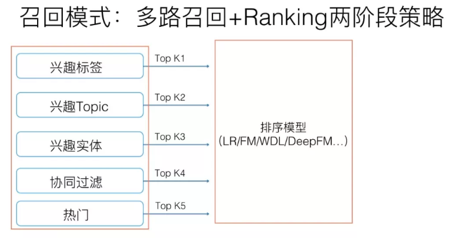
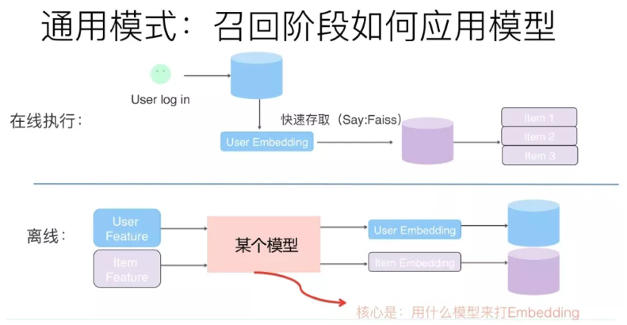
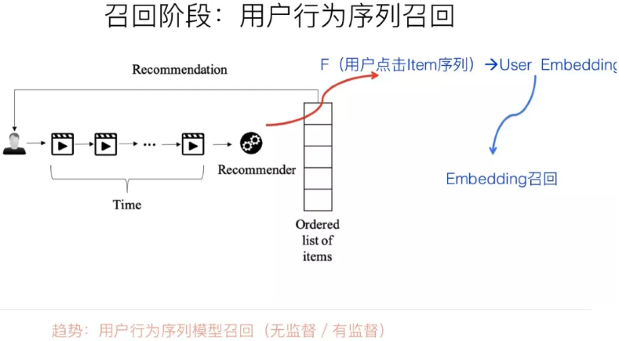
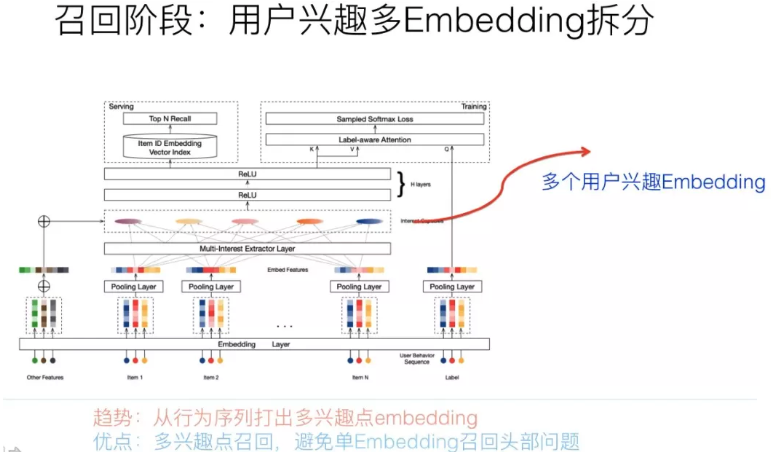
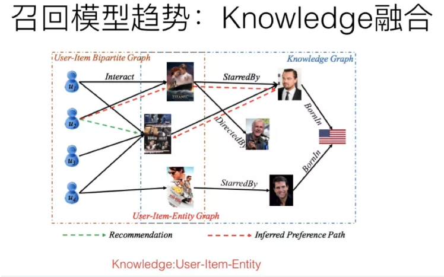
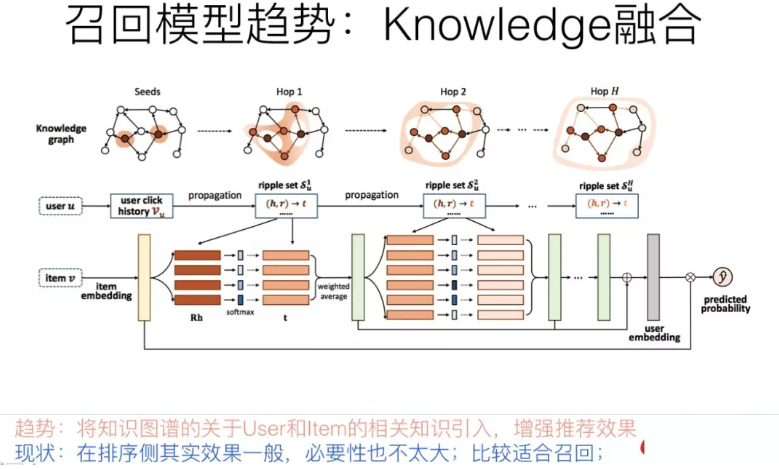
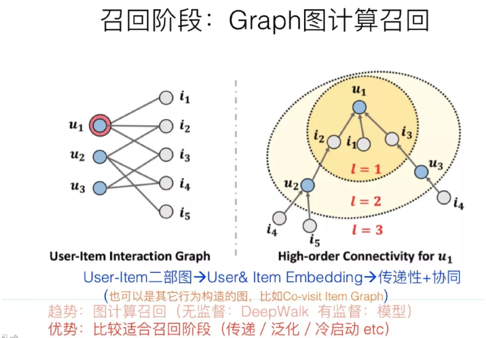
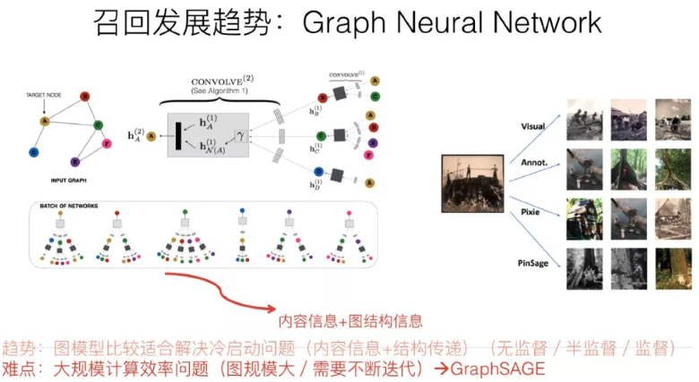

# 召回

推荐系统的召回阶段是很关键的一个环节，但是客观的说，传统地看，这个环节，技术含量是不太高的，偏向策略型导向，往往灵机一动，就能想到一个策略，增加一路新的召回。你在网上搜，发现讲推荐模型的，95%是讲排序阶段的模型，讲召回的别说模型，讲它本身的都很少，这与它的策略导向有关系，大家觉得没什么好讲的。总体而言，召回环节的有监督模型化以及一切 Embedding 化，这是两个相辅相成的总体发展趋势。而打 embedding 的具体方法，则可以有各种选择，比如下面介绍的几个技术发展趋势，可以理解为不同的给用户和物品打 embedding 的不同方法而已。

## 模型召回

传统的标准召回结构一般是多路召回，如上图所示。如果我们根据召回路是否有用户个性化因素存在来划分，可以分成两大类：一类是无个性化因素的召回路，比如热门商品或者热门文章或者历史点击率高的物料的召回；另外一类是包含个性化因素的召回路，比如用户兴趣标签召回。我们应该怎么看待包含个性化因素的召回路呢？其实吧，你可以这么看，可以把某个召回路看作是：单特征模型排序的排序结果。意思是，可以把某路召回，看成是某个排序模型的排序结果，只不过，这个排序模型，在用户侧和物品侧只用了一个特征。比如说，标签召回，其实就是用用户兴趣标签和物品标签进行排序的单特征排序结果；再比如协同召回，可以看成是只包含 UID 和 ItemID 的两个特征的排序结果….诸如此类。我们应该统一从排序的角度来看待推荐系统的各个环节，这样可能会更好理解本文所讲述的一些技术。

如果我们换做上面的角度看待有个性化因素召回路，那么在召回阶段引入模型，就是自然而然的一个拓展结果：无非是把单特征排序，拓展成多特征排序的模型而已；而多路召回，则可以通过引入多特征，被融入到独立的召回模型中，找到它的替代品。如此而已。所以，随着技术的发展，在 embedding 基础上的模型化召回，必然是个符合技术发展潮流的方向。

那么如何在召回阶段利用模型来代替多路召回呢？上图展示了一个抽象的模型召回的通用架构，核心思想是：将用户特征和物品特征分离，各自通过某个具体的模型，分别打出用户 Embedding 以及物品 Embedding。在线上，可以根据用户兴趣 Embedding，采用类似 Faiss 等高效 Embedding 检索工具，快速找出和用户兴趣匹配的物品，这样就等于做出了利用多特征融合的召回模型了。理论上来说，任何你能见到的有监督模型，都可以用来做这个召回模型，比如 FM／FFM／DNN 等，常说的所谓 "双塔" 模型，指的其实是用户侧和物品侧特征分离分别打 Embedding 的结构而已，并非具体的模型。

模型召回具备自己独有的好处和优势，比如多路召回每路截断条数的超参个性化问题等会自然被消解掉。当然，它也会带来自己的问题，比较典型的是召回内容头部问题，因为之前多路，每路召回个数靠硬性截断，可以根据需要，保证你想要召回的，总能通过某一路拉回来；而由于换成了模型召回，面向海量物料库，排在前列得分高的可能聚集在几个物料分布比较多的头部领域。解决这个问题的方法包括比如训练数据对头部领域的降采样，减少某些领域主导，以及在模型角度鼓励多样性等不同的方法。

另外一点值得注意的是：如果在召回阶段使用模型召回，理论上也应该同步采用和排序模型相同的优化目标，尤其是如果排序阶段采用多目标优化的情况下，召回模型也应该对应采取相同的多目标优化。同理，如果整个流程中包含粗排模块，粗排也应该采用和精排相同的多目标优化，几个环节优化目标应保持一致。因为召回和粗排是精排的前置环节，否则，如果优化目标不一致，很可能会出现高质量精排目标，在前置环节就被过滤掉的可能，影响整体效果。

#### 典型工作

[FM 模型召回：推荐系统召回四模型之：全能的 FM 模型](https://zhuanlan.zhihu.com/p/58160982)

DNN 双塔召回：Sampling-Bias-Corrected Neural Modeling for Large Corpus Item Recommendations

## **用户行为序列召回**

用户在使用 APP 或者网站的时候，一般会产生一些针对物品的行为，比如点击一些感兴趣的物品，收藏或者互动行为，或者是购买商品等。而一般用户之所以会对物品发生行为，往往意味着这些物品是符合用户兴趣的，而不同类型的行为，可能代表了不同程度的兴趣。比如购买就是比点击更能表征用户兴趣的行为

而用户行为过的物品序列，其实是具备表征用户兴趣的非常有价值的信息，而且这种兴趣表征，是细粒度的用户兴趣，所以对于刻画用户兴趣具备特别的价值。利用用户行为过的物品序列，来表征用户兴趣，具备很好的实用价值。

如果我们抽象地来看的话，利用用户行为过的物品序列对用户兴趣建模，本质上就是这么个过程：输入是用户行为过的物品序列，可以只用物品 ID 表征，也可以融入物品的 Side Information 比如名称，描述，图片等，现在我们需要一个函数 Fun，这个函数以这些物品为输入，需要通过一定的方法把这些进行糅合到一个 embedding 里，而这个糅合好的 embedding，就代表了用户兴趣。无论是在召回过程，还是排序过程，都可以融入用户行为序列。在召回阶段，我们可以用用户兴趣 Embedding 采取向量召回，而在排序阶段，这个 embedding 则可以作为用户侧的特征。

所以，核心在于：这个物品聚合函数 Fun 如何定义的问题。这里需要注意的一点是：用户行为序列中的物品，是有时间顺序的。理论上，任何能够体现时序特点或特征局部性关联的模型，都比较适合应用在这里，典型的比如 CNN、RNN、Transformer 等，都比较适合用来集成用户行为序列信息。而目前的很多试验结果证明，GRU \( RNN 的变体模型 \) 可能是聚合用户行为序列效果最好又比较简单的模型。当然，RNN 不能并行的低效率，那是另外一个问题。

在召回阶段，如何根据用户行为序列打 embedding，可以采取有监督的模型，比如 Next Item Prediction 的预测方式即可；也可以采用无监督的方式，比如物品只要能打出 embedding，就能无监督集成用户行为序列内容，例如 Sum Pooling。而排序侧，必然是有监督的模式，需要注意的是：排序侧表征用户特征的时候，可以只用用户行为过的物品序列，也可以混合用户其它特征，比如群体属性特征等一起来表征用户兴趣，方式比较灵活。比如 DIEN，就是典型的采用混合模式的方法。

#### 典型工作

GRU：Recurrent Neural Networks with Top-k Gains for Session-based Recommendations

CNN：Personalized Top-N Sequential Recommendation via Convolutional Sequence Embedding

Transformer: Self-Attentive Sequential Recommendation

## **用户多兴趣拆分**

上文讲了利用用户行为物品序列，打出用户兴趣 Embedding 的做法。但是，另外一个现实是：用户往往是多兴趣的，比如可能同时对娱乐、体育、收藏感兴趣。这些不同的兴趣也能从用户行为序列的物品构成上看出来，比如行为序列中大部分是娱乐类，一部分体育类，少部分收藏类等。那么能否把用户行为序列物品中，这种不同类型的用户兴趣细分，而不是都笼统地打到一个用户兴趣 Embedding 里呢？用户多兴趣拆分就是解决这类更细致刻画用户兴趣的方向。

用户多兴趣拆分，本质上是上文所叙述的用户行为序列打 embedding 方向的一个细化，无非上文说的是：以用户行为序列物品作为输入，通过一些能体现时序特点的模型，映射成一个用户兴趣 embedding。而用户多兴趣拆分，输入是一样的，输出不同，无非由输出单独一个用户 embedding，换成输出多个用户兴趣 embedding 而已。虽说道理如此，但是在具体技术使用方向上却不太一样，对于单用户兴趣 embedding 来说，只需要考虑信息有效集成即可；而对于多用户兴趣拆分来说，需要多做些事情，多做什么事情呢？本质上，把用户行为序列打到多个 embedding 上，实际它是个类似聚类的过程，就是把不同的 Item，聚类到不同的兴趣类别里去。目前常用的拆分用户兴趣 embedding 的方法，主要是胶囊网络和 Memory Network，但是理论上，很多类似聚类的方法应该都是有效的，所以完全可以在这块替换成你自己的能产生聚类效果的方法来做。

说到这里，有同学会问了：把用户行为序列拆分到不同的 embedding 里，有这个必要吗？反正不论怎样，即使是一个 embedding，信息都已经包含到里面了，并未有什么信息损失问题呀。这个问题很好。我的个人感觉是：在召回阶段，把用户兴趣拆分成多个 embedding 是有直接价值和意义的，前面我们说过，召回阶段有时候容易碰到头部问题，就是比如通过用户兴趣 embedding 拉回来的物料，可能集中在头部优势领域中，造成弱势兴趣不太能体现出来的问题。而如果把用户兴趣进行拆分，每个兴趣 embedding 各自拉回部分相关的物料，则可以很大程度缓解召回的头部问题。所以我感觉，这种兴趣拆分，在召回阶段是很合适的，可以定向解决它面临的一些实际问题。对于排序环节，是否有必要把用户兴趣拆分成多个，我倒觉得必要性不是太大，很难直观感受这样做背后发生作用的机理是怎样的。我能想到的，在排序环节使用多兴趣 Embedding 能发生作用的地方，好像有一个：因为我们在计算 user 对某个 item 是否感兴趣的时候，对于用户行为序列物品，往往计算目标 item 和行为序列物品的 Attention 是有帮助的，因为用户兴趣是多样的，物品 Item 的类型归属往往是唯一的，所以行为序列里面只有一部分物品和当前要判断的 Item 是类型相关的，这会对判断有作用，其它的无关物品其实没啥用，于是 Attention 就是必要的，可以减少那些无关物品对当前物品判断的影响。而当行为序列物品太多的时候，我们知道，Atttention 计算是非常耗时的操作，如果我们把这种 Attention 计算，放到聚类完的几个兴趣 embedding 维度计算，无疑能极大提升训练和预测的速度。貌似这个优点还是成立的。

#### 典型工作

召回：Multi-Interest Network with Dynamic Routing for Recommendation at Tmall

排序：Practice on Long Sequential User Behavior Modeling for Click-Through Rate Prediction

## 知识图谱融合召回

推荐系统中，最核心的数据是用户对物品的行为数据，因为这直接表明了用户兴趣所在。如上图所示，如果把用户放在一侧，物品放在另一侧，若用户对某物品有行为产生，则建立一条边，这样就构建了用户-物品交互的二部图。其实，有另外一种隐藏在冰山之下的数据，那就是物品之间是有一些知识联系存在的，就是我们常说的知识图谱，而这类数据是可以考虑用来增强推荐效果的，尤其是对于用户行为数据稀疏的场景，或者冷启动场景。以上图例子说明，用户点击过电影 "泰坦尼克号"，这是用户行为数据，我们知道，电影 "泰坦尼克号" 的主演是莱昂纳多，于是可以推荐其它由莱昂纳多主演的电影给这个用户。后面这几步操作，利用的是电影领域的知识图谱数据，通过知识图谱中的 "电影1—&gt;主演—&gt;电影2" 的图路径给出的推荐结果。

用于做推荐，一般有两大类知识图谱融合模式：知识图谱 Embedding 模式 \( KGE \) 及图路径模式。知识图谱 Embedding 模式首先根据 TransE 等对知识图谱进行 Embedding 化编码的工具，将节点和边转换成 Embedding 表征方式。然后根据用户行为过的物品，以及物品在知识图谱中的 Embedding 和知识图谱中其它知识 embedding 的距离，来扩展物品的信息含量，或者扩充用户行为数据，类似用已知的用户行为数据，在知识图谱辅助下进行外扩。知识图谱的 Embedding 模式在可解释性方面比较弱，因为知识之间的关联是通过 Embedding 计算出来的，不好解释为什么从这个知识跳到那个知识；而图路径模式则是根据物品属性之间的关联等人工定义好的所谓 Meta-Path，也就是人工定义的知识图谱中知识的关联和传播模式，通过中间属性来对知识传播进行路径搭建，具体例子就是上面说的 "电影1主演电影2"，这就是人事先定义好的 Meta-Path，也就是人把自己的经验写成规则，来利用知识图谱里的数据。图路径模式在可解释性方面效果较好，因为是人工定义的传播路径，所以非常好理解知识传播关系，但是往往实际应用效果并不好。

知识图谱是一种信息拓展的模式，很明显，对知识进行近距离的拓展，这可能会带来信息补充作用，但是如果拓展的比较远，或者拓展不当，反而可能会引入噪音，这个道理好理解。所以，我的感觉是，知识图谱在排序侧并不是特别好用，如果想用的化，比较适合用户行为数据非常稀疏以及用户冷启动的场景，也就是说如果用户数据太少，需要拓展，可以考虑使用它。另外，知识图谱还有一个普适性的问题，完全通用的知识图谱在特定场景下是否好用，对此我是有疑问的，而专业性的知识图谱，还有一个如何构建以及构建成本问题；而且很多时候，所谓的知识传播，是可以通过添加属性特征来解决的，比如：电影1—&gt;主演—&gt;电影2这种知识传播路径，完全可以通过把主演作为电影这个实体的属性特征加入常规排序模型，来达到类似知识近距离传播的目的，所以感觉也不是很有必要在排序侧专门去做知识图谱拓展这种事情。

这种知识拓展，可能比较适合用在召回阶段，因为对于传统观点的召回来说，精准并不是最重要的目标，找出和用户兴趣有一定程度相关性但是又具备泛化性能的物品是召回侧的重点，所以可能知识图谱的模式更适合将知识图谱放在召回侧。

当然，知识图谱有一个独有的优势和价值，那就是对于推荐结果的可解释性；比如推荐给用户某个物品，可以在知识图谱里通过物品的关键关联路径给出合理解释，这对于推荐结果的解释性来说是很好的，因为知识图谱说到底是人编码出来让自己容易理解的一套知识体系，所以人非常容易理解其间的关系。但是，在推荐领域目前的工作中，知识图谱的可解释性往往是和图路径方法关联在一起的，而 Path 类方法，很多实验证明了，在排序角度来看，是效果最差的一类方法。所以，我觉得，应该把知识图谱的可解释性优势从具体方法中独立出来，专门用它来做推荐结果的可解释性，这样就能独立发挥它自身的优势。

至于如何利用知识图谱做召回，其实很直观，比如可以采取如下的无监督学习版本：例如，推荐系统里对用户感兴趣的实体比如某个或者某些明星，往往是个单独的召回路，而可以根据用户的兴趣实体，通过知识图谱的实体 Embedding 化表达后 \( 或者直接在知识图谱节点上外扩 \)，通过知识外扩或者可以根据 Embedding 相似性，拓展出相关实体。形成另外一路相关性弱，但是泛化能力强的 Knowledge 融合召回路。

#### 典型工作

1. KGAT: Knowledge Graph Attention Network for Recommendation

2. RippleNet: Propagating User Preferences on the Knowledge Graph for Recommender Systems

## 图神经网络模型召回

严格来说，知识图谱其实是图神经网络的一个比较特殊的具体实例，但是，知识图谱因为编码的是静态知识，而不是用户比较直接的行为数据，和具体应用距离比较远，这可能是导致两者在推荐领域表现差异的主要原因。图神经网络中的图结构，可以是上面介绍知识图谱时候说过的 "用户-物品" 二部图，也可以是我们常见的有向图或者无向图，图中的节点是各种不同类型的物品及用户，边往往是通过用户行为建立起来的，可以是具体用户的具体行为，也可以是所有用户的群体统计行为，比如物品1—&gt;物品2可以有边，边还可以带上权重，如果越多的用户对物品1进行行为后对物品2进行行为，则这条边的权重越大。而且对于用户或者物品来说，其属性也可以体现在图中，比如对于一个微博，它的文本内容、图片内容、发布者等等属性都可以引入到图中，比如挂接到物品上，或者建立独立的节点也是可以的，这取决于具体的做法。

图神经网络的最终目的是要通过一定技术手段，获得图中节点的 embedding 编码。最常用的 embedding 聚合工具是 CNN，对于某个图节点来说，它的输入可以有两类信息，一类是自身的属性信息，比如上面举的微博的例子；另外一类是图结构信息，就是和当前节点有直接边关联的其它节点信息。通过 CNN，可以对两类信息进行编码和聚合，形成图节点的 embedding。通过 CNN 等信息聚合器，在图节点上进行计算，并反复迭代更新图节点的 embedding，就能够最终获得可靠的图节点 embedding 信息，而这种迭代过程，其实体现的是远距离的节点将信息逐步通过图结构传递信息的过程，所以图结构是可以进行知识传递和补充的。

我们可以进一步思考下，图节点因为可以带有属性信息，比如物品的 Content 信息，所以明显这对于解决物品侧的冷启动问题有帮助；而因为它也允许知识在图中远距离进行传递，所以比如对于用户行为比较少的场景，可以形成知识传递和补充，这说明它也比较适合用于数据稀疏的推荐场景；另外一面，图中的边往往是通过用户行为构建的，而用户行为，在统计层面来看，本质上是一种协同信息，比如我们常说的 "A 物品协同 B 物品"，本质上就是说很多用户行为了物品 A 后，大概率会去对物品 B 进行行为；所以图具备的一个很好的优势是：它比较便于把协同信息、用户行为信息、内容属性信息等各种异质信息在一个统一的框架里进行融合，并统一表征为 embedding 的形式，这是它独有的一个优势，做起来比较自然。另外的一个特有优势，就是信息在图中的传播性，所以对于推荐的冷启动以及数据稀疏场景应该特别有用。

因为图神经网络，最终获得的往往是图中节点的 embedding，这个 embedding，就像我们上面说的，其实融合了各种异质信息。所以它是特别适合用来做召回的，比如拿到图网络中用户的 embedding 和物品 embedding，可以直接用来做向量召回。当然，物品和用户的 embedding 也可以作为特征，引入排序模型中，这都是比较自然的。有些推荐场景也可以直接根据 embedding 计算 user to user/item to item 的推荐结果，比如看了又看这种推荐场景。

早期的图神经网络做推荐，因为需要全局信息，所以计算速度是个问题，往往图规模都非常小，不具备实战价值。而 GraphSAGE 则通过一些手段比如从临近节点进行采样等减少计算规模，加快计算速度，很多后期改进计算效率的方法都是从这个工作衍生的；而 PinSage 在 GraphSAGE 基础上 \( 这是同一拨人做的 \)，进一步采取大规模分布式计算，拓展了图计算的实用性，可以计算 Pinterest 的30亿规模节点、180亿规模边的巨型图，并产生了较好的落地效果。所以这两个工作可以重点借鉴一下。

总体而言，图模型召回，是个很有前景的值得探索的方向。

#### 典型工作

GraphSAGE: Inductive Representation Learning on Large Graphs

PinSage: Graph Convolutional Neural Networks for Web-Scale Recommender Systems

## Source



