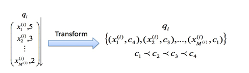
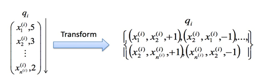
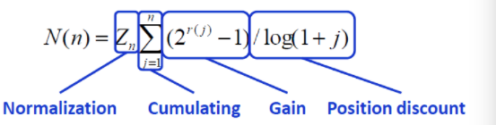
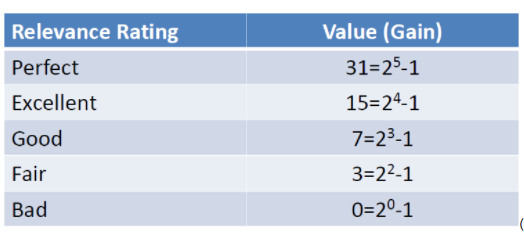
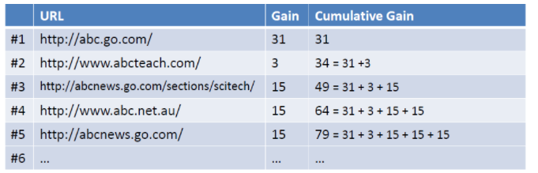
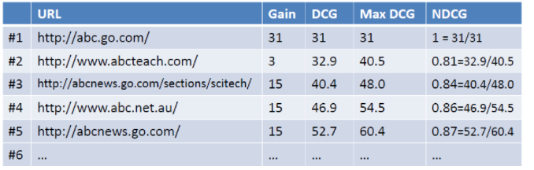
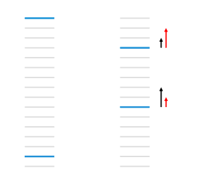
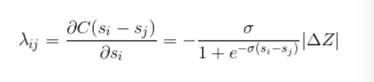
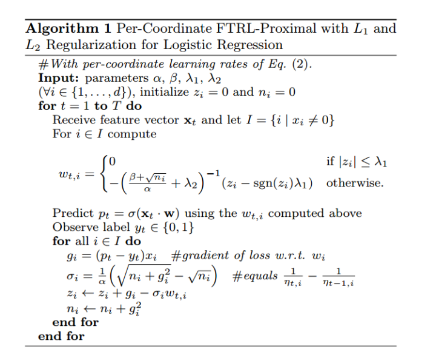
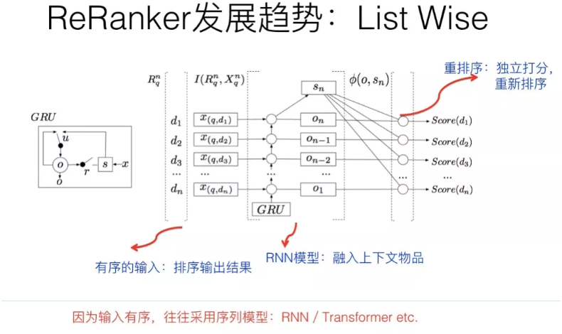

# 重排

在重排环节，常规的做法，这里是个策略出没之地，就是集中了各种业务和技术策略。比如为了更好的推荐体验，这里会加入去除重复、结果打散增加推荐结果的多样性、强插某种类型的推荐结果等等不同类型的策略。

按理说，这块没什么可讲的。但是，如果从技术发展趋势角度看，重排阶段上模型，来代替各种花样的业务策略，是个总体的大趋势。

## Learning to rank基本方法

常用的排序学习分为三种类型：PointWise，PairWise和ListWise。

### PointWise

单文档方法的处理对象是单独的一篇文档，将文档转换为特征向量后，机器学习系统根据从训练数据中学习到的分类或者回归函数对文档打分，打分结果即是搜索结果

PointWise方法很好理解，即使用传统的机器学习方法对给定查询下的文档的相关度进行学习，比如CTR就可以采用PointWise的方法学习，但是有时候排序的先后顺序是很重要的，而PointWise方法学习到全局的相关性，并不对先后顺序的优劣做惩罚。

### PairWise

对于搜索系统来说，系统接收到用户査询后，返回相关文档列表，所以问题的关键是确定文档之间的先后顺序关系。单文档方法完全从单个文档的分类得分角度计算，没有考虑文档之间的顺序关系。文档对方法将排序问题转化为多个pair的排序问题，比较不同文章的先后顺序。

但是文档对方法也存在如下问题：

1. 文档对方法考虑了两个文档对的相对先后顺序，却没有考虑文档出现在搜索列表中的位置，排在搜索结果前面的文档更为重要，如果靠前的文档出现判断错误，代价明显高于排在后面的文档。
2. 同时不同的査询，其相关文档数量差异很大，所以转换为文档对之后， 有的查询对能有几百个对应的文档对，而有的查询只有十几个对应的文档对，这对机器学习系统的效果评价造成困难

常用PairWise实现：1、SVM Rank    2、RankNet\(2007\)    3、RankBoost\(2003\)

### ListWise

单文档方法将训练集里每一个文档当做一个训练实例，文档对方法将同一个査询的搜索结果里任意两个文档对作为一个训练实例，文档列表方法与上述两种方法都不同，ListWise方法直接考虑整体序列，针对Ranking评价指标进行优化。比如常用的MAP, NDCG。常用的ListWise方法有：

1、LambdaRank    2、AdaRank    3、SoftRank    4、LambdaMART

## Learning to rank指标介绍

### MAP\(Mean Average Precision\)

假设有两个主题，主题1有4个相关网页，主题2有5个相关网页。某系统对于主题1检索出4个相关网页，其rank分别为1, 2, 4, 7；对于主题2检索出3个相关网页，其rank分别为1,3,5。对于主题1，平均准确率为\(1/1+2/2+3/4+4/7\)/4=0.83。对于主题2，平均准确率为\(1/1+2/3+3/5+0+0\)/5=0.45。则MAP= \(0.83+0.45\)/2=0.64。

### NDCG\(Normalized Discounted Cumulative Gain\)

NDCG把相关度分为r个等级，如果 $$r＝5$$ ，等级设定分别文 $$2^5-1$$ ， $$2^4-1$$ 等等

那么加入现在有一个query为abc， 返回如下图所示的列表，假设用户选择和排序结果无关，则累积增益值如右列所示：

 考虑到靠前的位置点击概率越大，那么靠下的位置需要加上衰减因子。 $$\frac{\log2}{\log(1+j)}$$  ，求和就可以得到DCG的值，最后为了使得不同不搜索结果可以比较，用DCG/MaxDCG就可以得到NDCG的值了。MaxDCG就是当前情况下最佳排序的DCG值。如图所示MaxDCG就是1、3、4、5、2的排序情况下的DCG的值\(rank 2的gain较低，应该排到后面）

### MRR\(Mean Reciprocal Rank\)

给定查询q，q在相关文档的位置是r，那么MRR\(q\)就是1/R

## [LambdaMART模型原理](https://www.researchgate.net/publication/228936665_From_ranknet_to_lambdarank_to_lambdamart_An_overview)

LambdaMART是Learning to rank其中的一个算法，在Yahoo! Learning to Rank Challenge比赛中夺冠队伍用的就是这个模型。

LambdaMART模型从名字上可以拆分成Lambda和MART两部分，训练模型采用的是MART也就是GBDT，lambda是MART求解使用的梯度，其物理含义是一个待排序文档下一次迭代应该排序的方向。

但Lambda最初并不是诞生于LambdaMART，而是在LambdaRank模型中被提出，而LambdaRank模型又是在RankNet模型的基础上改进而来。所以了解LambdaRank需要从RankNet开始说起。

**RankNet**

RankNet是一个pairwise模型，上文介绍在pairwise模型中，将排序问题转化为多个pair的排序问题，比较文档 $$d_i$$ 排在文档 $$d_j$$ 之前的概率。如下图所示

最终的输出的sigmoid函数，RankNet采用神经网络模型优化损失函数，故称为RankNet。

可是这样有什么问题呢？排序指标如NDCG、MAP和MRR都不是平滑的函数，RankNet的方法采用优化损失函数来间接优化排序指标。

**LambdaRank**

如图所示，蓝色表示相关的文档，灰色表示不相关的文档。RankNet以pairwise计算cost左边为13，右图将第一个文档下调3个位置，将第二个文档下调5个位置，cost就降为11。如此以来，虽然RankNet的损失函数得到优化，但是NDCG和ERR等指标却下降了。

RankNet优化的方向是黑色箭头，而我们想要的其实是红色的箭头。LambdaRank就是基于这个，其中lambda表示红色箭头。

LambdaRank不是通过显示定义损失函数再求梯度的方式对排序问题进行求解，而是分析排序问题需要的梯度的物理意义，直接定义梯度，Lambda梯度由两部分相乘得到：\(1\)RankNet中交叉熵概率损失函数的梯度；\(2\)交换 $$U_i$$ ， $$U_j$$ 位置后IR评价指标Z的差值。具体如下：

**lambdaMART**

我们知道GBDT算法每一次迭代中， 需要学习上一次结果和真实结果的残差。在lambdaMART中，每次迭代用的并不是残差，lambda在这里充当替代残差的计算方法。LambdaMART算法流程：

GBDT算法流程

对比lambdaMART和GBDT算法流程，主要框架是相同的，只不过LambdaMART模型用lambda梯度代替了GBDT的残差。

## [FTRL模型原理](https://www.researchgate.net/publication/262412214_Ad_click_prediction_a_view_from_the_trenches)

击率预估问题（CTR）是搜索、广告和推荐中一个非常重要的模块。在CTR计算的过程中，常常采用LR模型。FTRL属于在线算法，和SGD等常用的在线优化方法对比，可以产生较好的稀疏性，非常适合ID特征较多，维度较高的特征。Google的论文中已经给出了很详细的工程化实现的说明，该方法也已经广泛的应用

参数优化：

第一项：保证参数不偏移历史参数  
第二项：保证w不会变化太大  
第三项：代表L1正则，获得稀疏解

算法流程：

## **List Wise 重排序**

关于 List Wise 排序，可以从两个角度来说，一个是优化目标或损失函数；一个是推荐模块的模型结构。

推荐系统里 Learning to Rank 做排序，我们知道常见的有三种优化目标：Point Wise、Pair Wise 和 List Wise。所以我们首先应该明确的一点是：List Wise 它不是指的具体的某个或者某类模型，而是指的模型的优化目标或者损失函数定义方式，理论上各种不用的模型都可以使用 List Wise 损失来进行模型训练。最简单的损失函数定义是 Point Wise，就是输入用户特征和单个物品特征，对这个物品进行打分，物品之间的排序，就是谁应该在谁前面，不用考虑。明显这种方式无论是训练还是在线推理，都非常简单直接效率高，但是它的缺点是没有考虑物品直接的关联，而这在排序中其实是有用的。Pair Wise 损失在训练模型时，直接用两个物品的顺序关系来训练模型，就是说优化目标是物品 A 排序要高于物品 B，类似这种优化目标。其实 Pair Wise 的 Loss 在推荐领域已经被非常广泛的使用，比如BPR损失，就是典型且非常有效的 Pair Wise 的 Loss Function，经常被使用，尤其在隐式反馈中，是非常有效的优化目标。List Wise 的 Loss 更关注整个列表中物品顺序关系，会从列表整体中物品顺序的角度考虑，来优化模型。在推荐中，List Wise 损失函数因为训练数据的制作难，训练速度慢，在线推理速度慢等多种原因，尽管用的还比较少，但是因为更注重排序结果整体的最优性，所以也是目前很多推荐系统正在做的事情。

从模型结构上来看。因为重排序模块往往是放在精排模块之后，而精排已经对推荐物品做了比较准确的打分，所以往往重排模块的输入是精排模块的 Top 得分输出结果，也就是说，是有序的。而精排模块的打分或者排序对于重排模块来说，是非常重要的参考信息。于是，这个排序模块的输出顺序就比较重要，而能够考虑到输入的序列性的模型，自然就是重排模型的首选。我们知道，最常见的考虑时序性的模型是 RNN 和 Transformer，所以经常把这两类模型用在重排模块，这是很自然的事情。一般的做法是：排序 Top 结果的物品有序，作为 RNN 或者 Transformer 的输入，RNN 或者 Transformer 明显可以考虑在特征级别，融合当前物品上下文，也就是排序列表中其它物品，的特征，来从列表整体评估效果。RNN 或者 Transformer 每个输入对应位置经过特征融合，再次输出预测得分，按照新预测的得分重新对物品排序，就完成了融合上下文信息，进行重新排序的目的。

尽管目前还没看到 CNN 做重排的方法，但是从机制上来说，明显 CNN 也是比较适合用来做重排环节模型的，感兴趣的同学可以试一试。当然，前面说的强化学习，也是非常适合用在 List Wise 优化的，目前也有不少相关工作出现。

#### 典型工作

1.Personalized Re-ranking for Recommendation

2.Learning a Deep Listwise Context Model for Ranking Refinement

## **Source**





\*\*\*\*

