# 大规模图处理

## 各种网络及其度

### 无/有向网络中节点的度

#### 无向网络

Degree \(or degree centrality\) of a vertex: $$d(v_i)$$ ：

              $$d(v_i) = |v_j| \ s.t. \ e_{ij} \in E \wedge e_{ij} = e_{ji}$$，$$\#$$ of edges connected to it

eg. 下图中 $$d(A) = 4,\ d(H) = 2$$ 

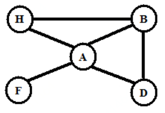

#### 有向网络

In-degree of a vertex $$d_{in}(v_i)$$ ： $$d_{in}(v_i) = |v_j| \ s.t. \ e_{ij} \in E$$ ，$$\#$$ of edges pointing to $$v_i$$ 

Out-degree of a vertex $$d_{out}(v_i)$$ ： $$d_{out}(v_i) = |v_j| \ s.t. \ e_{ji} \in E$$ ，$$\#$$ of edges from $$v_i$$ 

eg. 下图中 $$d_{in}(A) = 3, \ d_{out}(A) = 1;\ d_{in}(B) = 2, \ d_{out}(B) = 2$$ 

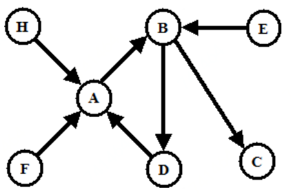

### 各网络及其度的定义

Simple network: If a network has neither self-edges nor multi-edges

Multi-edge \(multigraph\): If more than one edge between the same pair of vertices

Self-loop: If an edge connects vertex to itself

Direct graph \(digraph\): If each edge has a direction

Weighted graph: If a weight $$w_{ij}$$ \(a real number \) is associated with each edge $$v_{ij}$$ 

## 网络图结构及性质

Subgraph: A subset of the nodes and edges in a graph/network

Clique \(complete graph\): Every node is connected to every other

Singleton vs. dyad \(two nodes and their relationship\) vs. triad: 

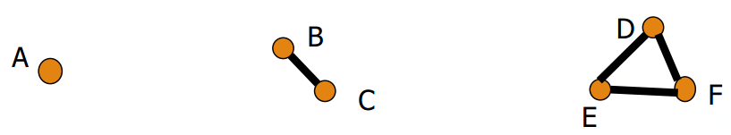

Ego-centric network: A net work pull out by selecting a node and all of its connections

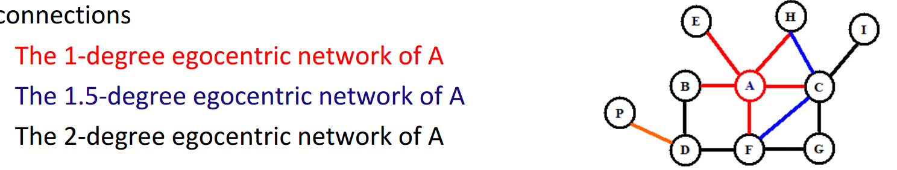

## 度的分布

### Degree sequence

The list of degrees of the nodes sorted in non-increasing order. Eg: in $$G_1$$ ，degree sequence:\(4, 3, 2, 2, 1\)

### Degree frequency distribution

Let $$N_K$$ denote the $$\#$$ of vertices with degree k, $$(N_0,N_1,\dots,N_t), \ t$$ is max degree for a node

Eg: in $$G_1$$ ，degree frequency distribution: \(0, 1, 2, 1, 1\)

### Degree distribution

Probability mass function $$f$$ for random variable $$X$$:

                       $$(f(0), f(1),\dots,f(t)),\ where\ f(k) = P(X=k) = N_k/n$$ 

  
Eg: in ​ $$G_1$$ ，degree distribution: \(0, 0.2, 0.4, 0.2, 0.2\)

## 路径

### Walk

In a graph $$G$$ between nodes $$X$$ and $$Y$$ : ordered sequence of vertices, starting at $$X$$ and ending at $$Y$$, s.t. there is an edge between every pair of consecutive vertices

### Hop

The length of the walk

### Path

A walk with distinct vertices

### Shortest Path \(geodesic path, $$d$$ \)

     Geodesic paths are not necessarily unique: It is quite possible to have more than one path of equal length between a given pair of vertices

    Diameter of a graph: the length of the longest geodesic path between any pair of vertices in the network for which a path actually exists

### Average Path Length\( $$<d>$$ \)

Average of the shortest paths between all pairs of nodes: $$<d> = \frac{1}{N(N-1)} \sum \limits_{i,j=1,N(i\neq j)}d_{i,j}$$ 

### Eulerian Path

A path that traverses each edge in a network exactly once

### Hamilton Path

A path that visits each vertex in a network exactly once

### Distance

The length of the **shortest** path

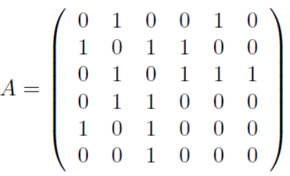

Total $$\#$$ of path length 2 from $$j$$ to $$i$$ ,via any vertex in $$N_{ij}^{(2)}$$ is：$$N_{ij}^{(2)} = \sum_{k=1}^n A_{ik}A_{kj} = [A^2]_{ij}$$

So, generalizing to path of arbitrary length, we have： $$N_{ij}^(r) = [A^r]_{ij}$$ 

When starting and ending at the same vertex $$i$$ , we have： $$L_r = \sum_{i=1}^n[A^r]_{ii} = Tr A^r$$ 

$$\#$$ of loops can be expressed in terms of adjacency matrix：

          Matrix $$A$$ written in the form of $$A = UKU^T$$ , $$U$$ is the orthogonal matrix of eigenvectors and $$K$$ is the diagonal matrix of eigenvalues \(SVD\)：

$$L_r = Tr(UKU^T)^r = Tr(UK^rU^T)=Tr(UU^TK^r)=Tr(K^r)=\sum_i k_i^r$$, where $$k_i$$ is the $$i$$-th eigenvalue of the adjacency matrix

### Independent Paths

#### Edge-independent: 

        Two path connecting a pair of vertices are edge-independent if they share no edges

#### Vertex-independent: 

        Two path are vertex-independent if they share no vertices other than the starting and ending vertices

## 半径与直径

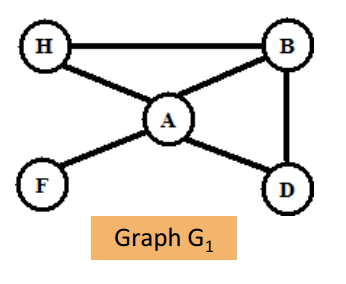

### Eccentricity

The eccentricity of a node $$v_i$$ is the maximum distance from $$v_i$$ to any other nodes in graph

$$e(v_i) = max_j\{d(v_i,v_j)\}$$      Eg. $$e(A) = 1, e(F) = e(B) = e(D) = e(H) =2$$ 

### Radius

Radius of a connected graph $$G$$ : the min eccentricity of any node in $$G$$ 

$$r(G) = min_i\{e(v_i)\} = min_i\{d(v_i,v_j)\}$$       Eg. $$r(G_1) = 1$$ 

### Diameter

Diameter of a connected graph $$G$$ : the max eccentricity of any node in $$G$$ 

$$d(G) = max_i\{e(v_i)\} = max_{i,j}\{d(v_i,v_j)\}$$      Eg. $$d(G1) = 2$$ 

## 弱/强连接&出/入元素（有向图）

### Weakly/Strongly connected

Weakly: If the vertices are connected by 1 or more paths when one can go either way along any edge

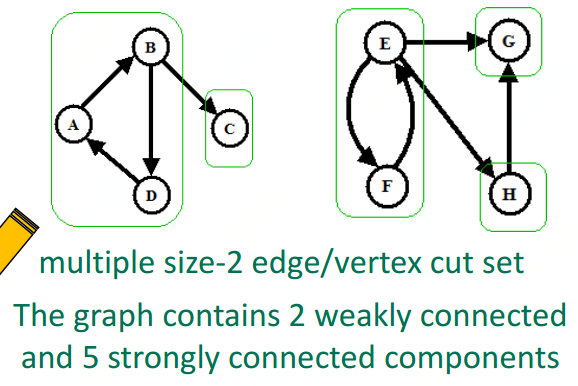

### In/Out-component

Out-component: Those reachable from vertex A

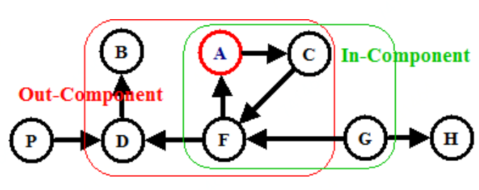

## 簇类系数

因为真实的网络可能十分稀疏，所以需要这么一个衡量系数去衡量一下密集度

Clustering coefficient of a node $$v_i$$:  A measure of the density of edges in the neighborhood of $$v_i$$ 

Let $$G_i = (V_i,E_i)$$ be the subgraph induced by the neighbors of vertex $$v_i$$ , $$|V_i| = n_i$$\( $$\#$$ of neighbors of $$v_i$$ \), and $$|E_i| = m_i$$ \( $$\#$$ of edges among the neighbors of $$v_i$$ \)

For undirected network: $$C(v_i) = \frac{\# edges\ in\ G_i}{max\ \#edges\ in\ G_i} = \frac{m_i}{\binom{n_i}{2}} = \frac{2\times m_i}{n_i(n_i-1)}$$ 

For directed network: $$C(v_i) = \frac{\# edges\ in\ G_i}{max\ \#edges\ in\ G_i}  = \frac{m_i}{n_i(n_i-1)}$$ 

For a graph: $$C(G) = \frac{1}{n}\sum \limits_i C(v_i)$$    averaging the local clustering coefficient of all the vertices

## 双边网络

Bipartite Network: two kinds of vertices, and edges linking only vertices of unlike types

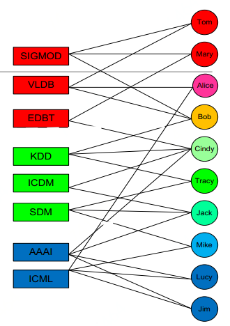

Incidence matrix: $$B_{ij} = 1$$ if vertex $$j$$ links to group $$i$$, $$0$$ otherwise

The projection to one-mode can be written in terms of the incidence matrix $$B$$ as follow:

                                          $$P_{ij}=\sum_{k=1}^g B_{ki}B_{kj} = \sum_{k=1}^g B_{ik}^TB_{kj}$$ 

The product of $$B_{ki}B_{kj}$$ will be $$1$$ if $$i$$ and $$j$$ both belong to the sample group $$k$$ in the bi-partite network

## 协同引证与文献耦合

### Co-citation

Co-citation of vertices $$i$$ and $$j$$ : $$A_{ik}A_{jk}=1$$ , if $$i$$ and $$j$$ are both cited by $$k$$ 

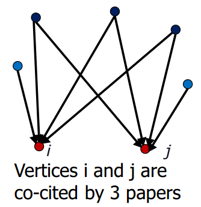

$$\#$$ of vertices having outgoing edges pointing to both $$i$$ and $$j$$ :

                                      $$C_{ij} = \sum_{k=1}^n A_{ik}A_{jk} = \sum_{k=1}^n A_{ik}A_{kj}^T$$ 

Co-citation matrix: its a symmetric matrix $$C = AA^T$$ 

Diagonal matrix $$(C_{ii})$$: total $$\#$$ papers citing $$i$$ 

### Bibliographic coupling

Bibliographic coupling of vertices $$i$$ and $$j$$ : $$A_{ik}A_{jk}=1$$ , if $$i$$ and $$j$$ both cite $$k$$ 

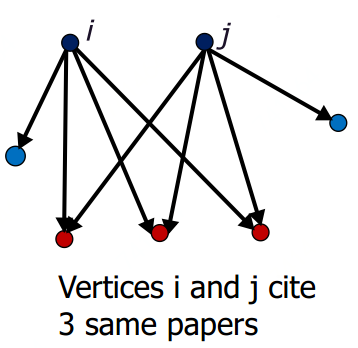

Bibliographic coupling of $$i$$ and $$j$$ :

                                     $$B_{ij} = \sum_{k=1}^n A_{ki}A_{kj} = \sum_{k=1}^nA_{ik}^T A_{kj}$$ 

Bibliographic coupling matrix: $$B=A^TA$$ 

Diagonal matrix $$(B_{ii})$$: total $$\#$$ papers cited by $$i$$ 

### Co-citation&Bibliographic Coupling Comparison

Strong co-citation must have a lot of incoming edges

Strong bib-coupling if two papers have similar citations

## 图计算任务和算法

### 图计算的任务

1、Graph pattern matching: subgraph matching...

2、 Graph analytics: PageRank ...

### 图计算的算法

PageRank, Simrank, HITS, Label Propagation, Maximal-Independent-Set, Maximal-Node-Matching, Connected-Component, Shortest Distance ...

## 程序模型框架

不支持：N    支持：Y

| Model | Data/Graph Integration | Both Graph Matching/Analytic | Explicit Loop Control | Systems |
| :---: | :---: | :---: | :---: | :---: |
| Vertex-Centric | N | N | N | Giraph, Pregel, WindCatch, GPS, Grace, Pregel+, TUX |
| Edge-Centric | N | N | N | PowerGraph, GraphChi, X-Stream, TurboGraph, FlashGraph, Powerlyra |
| Block-Centric | N | N | N | Giraph++, Blogel |
| Linear Algebra | N | N | N | PEGASUS, GraphTwist, LA3 |
| Grape | N | Y | N | Grape |
| DSL | N | N | Y | Green-Marl |
| Datalog | N | Y | Y | Socialite, Distribute-Socialite, DeALS |
| Dataflow | Y | Y | Y | GraphX, GraphFrame, Pregelix |
| SQL-G | Y | Y | Y | SQL-G, EmptyHeaded |

### 

