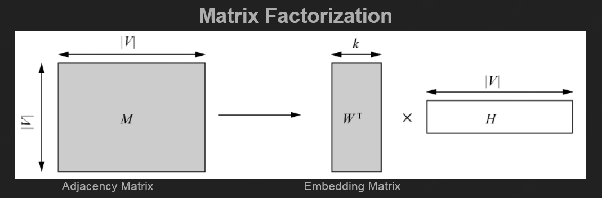
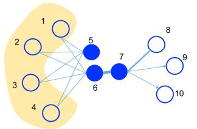
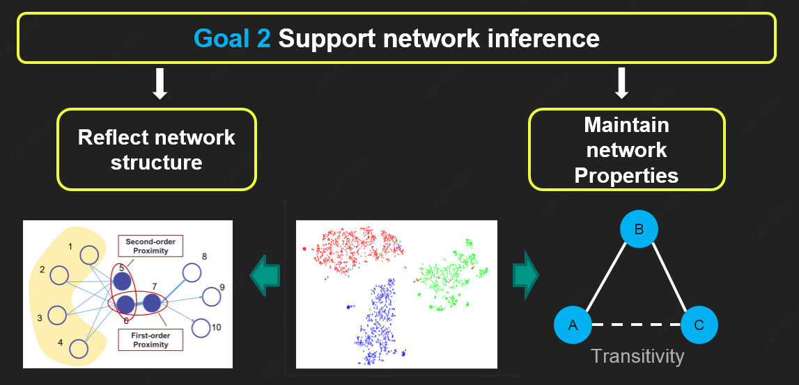
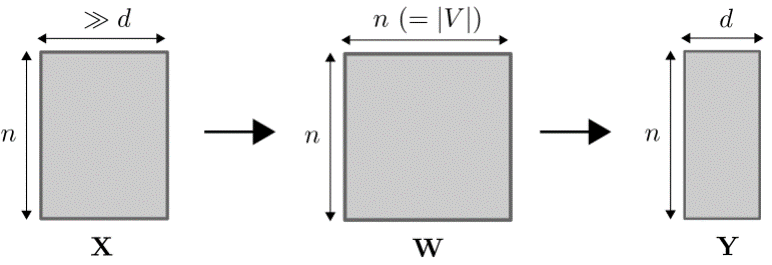
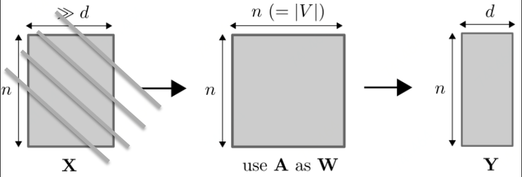
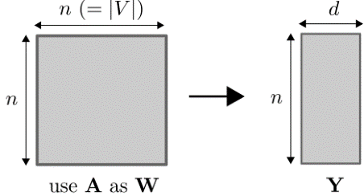
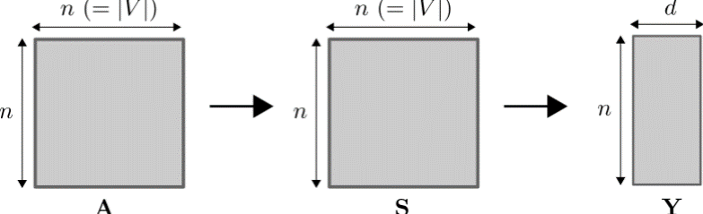

# 网络映射

## 网络映射的目标

### 1. 网络重构性

即原网络依旧可以从映射的空间中再重构生成。

#### 诚然，我们如果只考虑网络重构性，直接用SVD等矩阵分解就可以得到低维度矩阵来表示网络所有的节点及节点间连接关系。

#### 但是这样丧失了很多隐含信息，比如high order的拓扑结构。（如果两个节点并未直接相连，我们并不能说两者之间没有关系，比如下图5与6虽然不相连，但second order approximation很高）

### 2. 映射空间支持网络推断

即依旧可以反应网络结构和保持网络特性，依旧可以进行网络分析（Node importance; Community detection; Network distance; Link prediction; Node classification ...）

## 图映射与网络映射

_**Graphs**_ exist in mathematics. \(Data Structure\)

    Mathematical structures used to model pairwise relations between objects

_**Networks**_ exist in the real word. \(Data\)

    Social networks, logistic networks, biology networks, etc...

#### Network can be represented by graph. Dataset that is not a network can also be represented by a graph

### 图映射

图映射最初被提出是作用于降维的技术，比如[MDS，ISOMAP，LLE](https://chmx0929.gitbook.io/machine-learning/shu-ju-wa-jue/shu-ju-wa-jue/shu-ju-yu-chu-li/shu-ju-jiang-wei)等流形学习降维方法。基本思想都是基于 $$n$$ 个样本的特征先构造出一个 $$n\times n$$ 的近似矩阵来表示图，然后从这个构造的矩阵中生成低维度的表示方法，如下图所示

我们确实可以将图映射方法用在网络上，不用从样本特征下手构造，直接用网络拓扑结构就可以

但是图映射技术在网络映射上表现不好，很大原因就是因为一个真实的网络的邻接矩阵并不是一个合适的近似矩阵，矩阵所包含的信息极为有限，比如尽管 $$u$$ 和 $$v$$ 相似，但邻接矩阵中 $$A_{uv}=0$$； $$A_{uv}<A_{uw}$$并不能保证 $$w$$ 比 $$v$$ 更与 $$u$$ 相似。

### 网络映射启发式

通过对比图映射与网络映射，我们找到，关键就是近似矩阵如何构建。对于图映射来说，近似矩阵是已经定义好的，而对于网络映射，需要我们使用合适的方法去定义。

基于不同的原则，我们可以分为三大类网络映射方法：

1、网络结构维持的网络映射

2、网络性质维持的网络映射

3、动态网络映射

## Source

[https://github.com/thunlp/NRLPapers](https://github.com/thunlp/NRLPapers)

[http://pengcui.thumedialab.com/papers/NetworkEmbeddingSurvey.pdf](http://pengcui.thumedialab.com/papers/NetworkEmbeddingSurvey.pdf)

[http://pengcui.thumedialab.com/papers/KDD%20network%20representation%20tutorial-v3.pptx](http://pengcui.thumedialab.com/papers/KDD%20network%20representation%20tutorial-v3.pptx)

