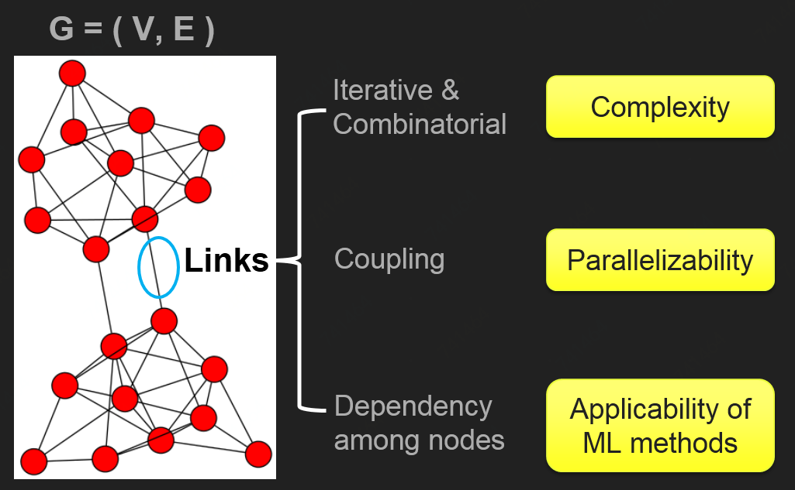
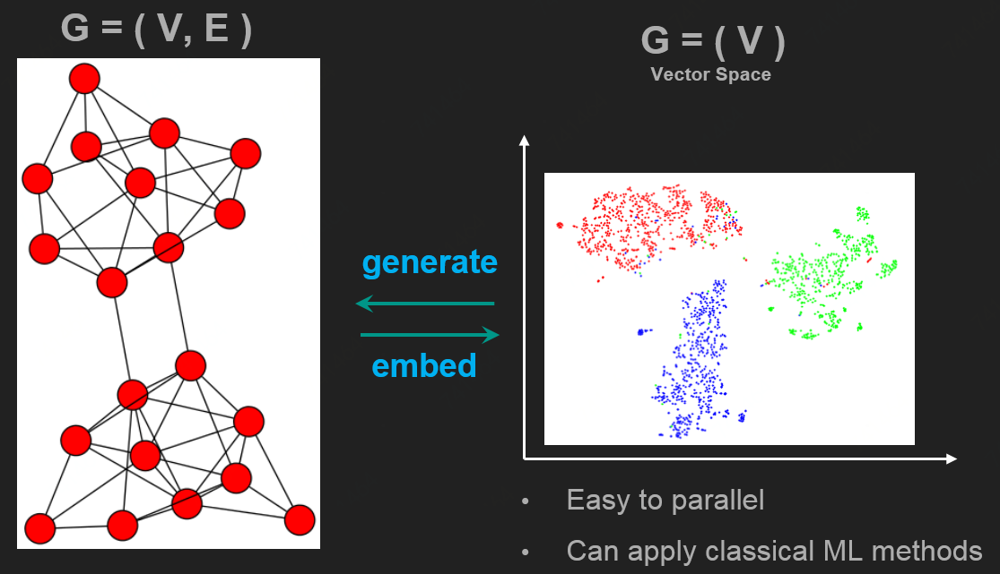

# 网络图模型

## 网络

网络/图： $$G=(V,E), \ where\ V: vertices/nodes,\ E:edges/links$$ 

诚然，我们可以直接用 $$Adjacency\ matrix$$ 对网络进行表示，但这样会丢失很多信息（具体在网络映射章节解释）。

## 网络分析任务

大都是描述或预测性问题：节点影响力\(Node importance\)；寻找节点社区\(Community detection\)；网络距离\(Network distance\)；链接预测\(Link prediction\)；节点分类\(Node classification\)...

## 瓶颈

### 1. 高计算复杂度

如果要计算一个网络中两个节点的相似度，首先要计算与其相连的各节点，而各节点又有相连节点。所以，分析一个网络中两节点的相似度，相当于需要遍历整个网络，这个计算复杂度是极其高的。

### 2. 低并发能力

网络确实可以并行计算，但是因为网络节点相互间的关联性，导致并行计算的同时各机器间又要有大量交互，这大大降低了并行计算的优势。

### 3. 不适用机器学习方法

现有机器学习方法大都假设元素可用向量空间中的一个向量表示，所以我们正在探寻将网络映射成向量，这样就将新的问题转化成已知问题可进行解决了。

## 网络图模型方案

因为存在上述瓶颈，现在存在两大流派去处理网络图模型：

1、大规模图处理

        在系统和框架中寻求解决方案，设计网络图模型针对需求的对应算法

2、网络映射

        将网络图映射到矩阵或向量中，将新问题转化成之前解决过的问题

## 应用

怎样将网络图应用落地现在正是业界讨论的方向，大体思路有两种：

1、使用图结构预训练，比如将网络映射成向量，代入到各种算法模型中去。

2、将结构化的数据直接加入模型中，比如[Tensorflow的结构化](https://www.bilibili.com/video/av67654030)训练，将结构信息作为约束，当成正则项加进去，大致思路是Loss让模型准，在Loss后再加正则项让相邻或相似样本结果也相近，这样做很明显的好处就是可以解决只有少量标注样本的模型训练问题，比如我们只有少量论文标注了类别，但我们知道论文之间引用关系或其他meta-path，这个关系即可作为正则约束来帮助提高模型训练。

## Source



[http://pengcui.thumedialab.com/papers/NetworkEmbeddingSurvey.pdf](http://pengcui.thumedialab.com/papers/NetworkEmbeddingSurvey.pdf)

[http://pengcui.thumedialab.com/papers/KDD%20network%20representation%20tutorial-v3.pptx](http://pengcui.thumedialab.com/papers/KDD%20network%20representation%20tutorial-v3.pptx)

