# 异构信息网络

## 异构网络

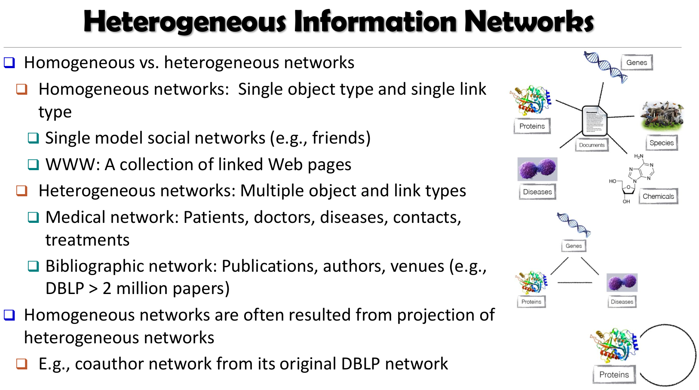

### 同质网络

了解异构网络之前需要先了解什么是同质网络。所谓同质网络即网络中结点都是同一类型主体，链接方式也是相同的。比如论文，论文之间链接为引用，这就构成了一个简单的同质网络。

### 异构网络

一个异构网络是由多种对象节点与不同类型链接构成的网络，也可看做是多个不同同质网络所结合而成。比如论文，作者，会议，学术名词构成的一个异构网络。

## 聚类与排序

### 聚类与排序

#### RankClus

排序与聚类相互加强：更好聚类可从排序中获得，排序范围又从聚类习得

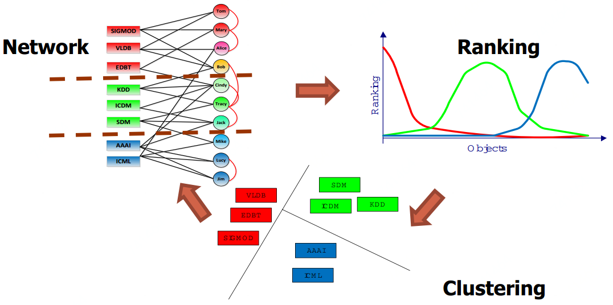

**启发式**

排序分数可以在不同类型的主体间通过网络进行传播

1、高排名的作者发布高排名论文在排名较高的会议或期刊：

                                                             $$\vec r_Y(j) = \sum \limits_{i=1}^mW_{YX}(j,i)\vec r_X(i)$$ 

2、顶级会议或期刊吸引高排名作者发高排名论文：

                                                             $$\vec r_X(i) = \sum \limits_{j=1}^mW_{XY}(i,j)\vec r_Y(j)$$ 

3、作者的排名受与他合作的作者的论文排名影响：

                                                              $$\vec r_Y(i) = \alpha\sum \limits_{j=1}^mW_{YX}\vec r_X(j)+(1-\alpha)\sum \limits_{j=1}^nW_{YY}(i,j)\vec r_Y(j)$$ 

4、所分析网络领域的其他特性\(由于本例基于DBLP，就先用上3个\)

**算法**

```text
初始化：随机聚类
迭代：//EM框架
    排序，每个主体的排名由每个子类的每个子网络影响
    生成新的目标主体参数
    调整聚类
终止：直到变化<阈值
```

#### NetClus

NetClus把一个网络分割成一个个子网络

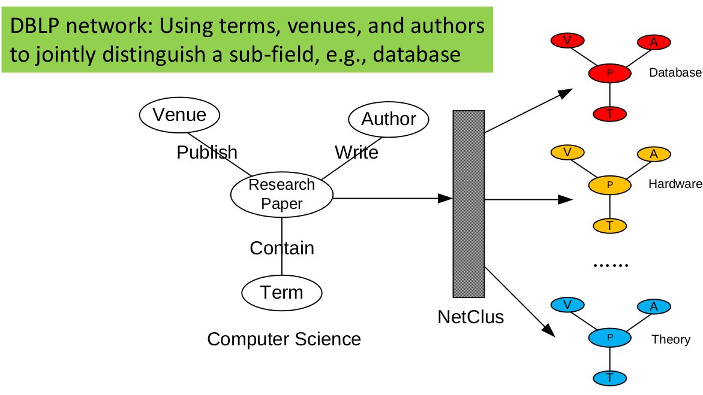

**算法**

```text
初始化：为目标主体生成初始分区和初始网络聚类簇
迭代：//EM框架
    对每一个网络聚类簇构建基于排序的概率生成模型
    计算每个目标主体的后验概率
    根据后验概率调整每个簇类
终止：簇类变化不大
```

DBLP为例：

$$G=(V,E,W)$$，其中权重 $$w_{x_ix_j}$$ 为节点 $$x_i$$ 与 $$x_j$$ 的链接

$$V=A\cup C\cup D \cup T$$ ，作者、会议、论文、词汇

$$w_{x_ix_j}=\begin{cases} 1,\ if\ x_i(x_j) \in A \cup C\ and\ x_j(x_i)\in D\ and\ x_i\ has\ link\ to\ x_j\\ c,\ if\ x_i(x_j)\in T\ and\ x_j(x_i)\in D\ and\ x_i(x_j)\ appears\ c\ times\ in\ x_j(x_i)\\ 0,\ otherwise \end{cases}$$ 

Ranking： $$p(x|T_x,G) = \frac{\sum_{y\in N_{G}(x)}W_{xy}}{\sum_{x'\in T_x}\sum_{y\in N_G(x')}W_{x'y}}$$ 

对于DBLP来说即： 

             $$P(Y|T_Y,G)=W_{YZ}W_{ZX}P(X|T_X,G)$$ 

             $$P(C,T_C,G)=W_{CD}D^{-1}_{DA}W_{DA}P(A|T_A,G)$$ 

              $$P(A|T_A,G)=W_{AD}D^{-1}_{DC}W_{DC}P(C|T_C,G)$$ 

### 相似查找

异构信息网络中的相似查找是聚类分析的基础，比如社交网络中，哪一个人与目标人最相似

#### Random walk

通过Meta-path $$P$$，从 $$x$$ 随机行走到达 $$y$$ 的概率：

                                $$s(x,y) = \sum_{p\in P}prob(p)$$     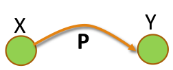 

在Personalized PageRank\(P-Pagerank\)中被使用，对于有高的度的节点敏感

#### Pairwise random walk

根据Meta-path $$(p_1,p_2)$$ ，从 $$(x,y)$$ 点随机行走，到达共同节点 $$z$$ 的概率：

             $$s(x,y) = \sum_{(p_1,p_2)\in (P_1,P_2)}prob(p_1)prob(p2)$$      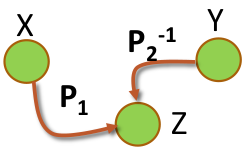 

在SimRank中被使用，对于纯节点\(in-link或out-link为高度倾斜的分布\)敏感

#### SimRank

如果两个主体被相似的主体关联，则认为这两个主体相似：

$$s(a,b)=\frac{C}{|I(a)||I(b)|}\sum\limits_{i=1}^{|I(a)|}\sum\limits_{j=1}^{|I(b)|}s(I_i(a),I_j(b))$$ 

#### Personalized PageRank\(P-Pagerank\)

P-Pagerank的分数 $$x$$ 被定义为： $$x=\alpha Px + (1-\alpha)b$$，其中 $$P$$ 为网络 $$G$$ 的转移矩阵， $$b$$ 为一个随机向量\(Personalized vector\)， $$\alpha \in (0,1)$$，是隐形传输常数

#### PathSim

**Meta-path：**两个主体在Meta-level的路径，描述两主体的关系比如作者-论文-作者（两个人共写一篇论文，这是网络中两作者间一种联系），当然一个网络中有多种Meta-path，比如作者-论文-会议-论文-作者...

对peer敏感，定义一个Meta-path，通过Meta-path计算相似度，比如作者-论文-作者\(则表示对一起共事的作者敏感\)、作者-论文-会议-论文-作者\(同一领域的敏感\)

                                                  $$s(x,y)=\frac{2\times |\{p_{x\sim\to y}:p_{x\sim\to y}\in P \}|}{|\{p_{x\sim\to x}:p_{x\sim\to x}\in P \}|+|\{p_{y\sim\to y}:p_{y\sim\to y}\in P \}|}$$ 

比如下图例子 $$s(Mike, Jim) = \frac{2\times (2\times50+1\times 20)}{(2\times 2+1\times 1)+(50\times 50+20\times 20)} = 0.0826$$

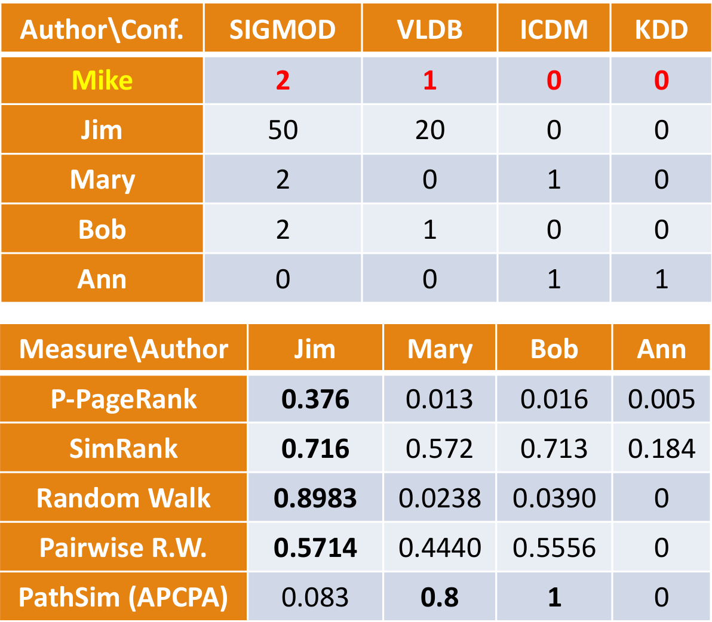

### 基于用户指导使用Meta-path的聚类

用户可能基于不同的目的使用不同的Meta-path，比如DBLP中，用户重视作者们的学校，或者是专业领域...

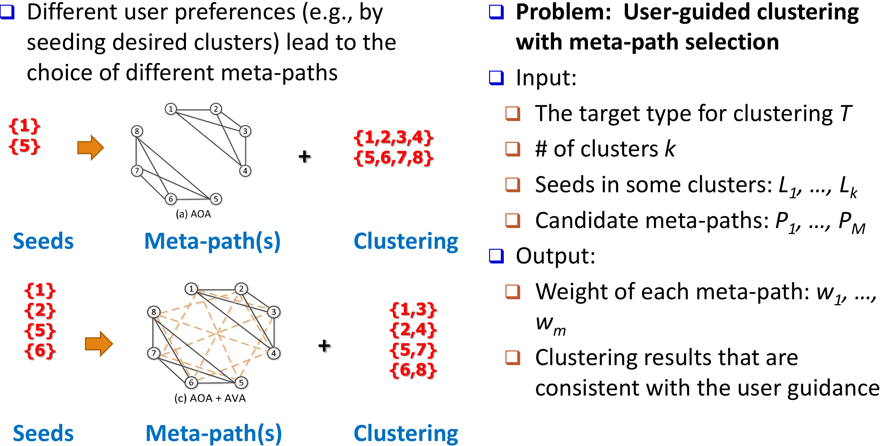

#### PathSelClus

1、Modeling the Relationship Generation: A good clustering result should lead to high likelihood in observing existing relationships

For each meta path $$\mathcal{P}_m$$ ，let the relation matrix be $$W_m$$：

    The relationship $$\langle t_i,  f_j\rangle$$is generated with paramenter $$\pi_{i,j,m}$$ 

    Each $$\pi_{i,m}$$ is a mixture model of multinomial distribution：

                      $$\pi_{i,j,m} = P(j|i,m) = \sum\limits_kP(k|i)P(j|k,m)=\sum\limits_k\theta_{ik}\beta_{kj,m}$$ 

                          $$\theta_{ik}$$：the probability that $$t_i$$ belongs to Cluster$$k$$

                         $$\beta_{kj}$$：the probability that feature object $$f_j$$appearing in Cluster $$k$$ 

    The probability to observing all the relationship in$$\mathcal{P}_m$$：

                      $$P(W_m|\prod_m,\Theta,B_m) = \prod\limits_i P(w_{i,m}|\pi_{i,m},\Theta,B_m) = \prod\limits_i\prod\limits_j(\pi_{i,j,m})^{w_{i,j,m}}$$ 

2、Modeling the Guidance from Users: The more consistent with the guidance, the higher probability of the clustering result

For each soft clustering probability vector $$\theta_i$$：

    Model it as generated from a Dirichlet prior

        If $$t_i$$ is labeled as a seed in Cluster $$k^*$$:

            The prior density is a K-d dirichlet distribution with parameter vector $$\lambda e_{k^*}+1$$ 

                 $$\lambda$$ is the user confidence for the guidance

                 $$e_{k^*}$$ is an all-zero vector except for item $$k^*$$, which is 1

        If $$t_i$$ is not labeled in any cluster:

            The prior density is uniform, a special case of Dirchlet distribution, with paramenter vector 1

             $$p(\theta_i,\lambda)= \begin{cases} \prod_k\theta_{ik}^{1_{\{t_i\in \mathcal{L}\}^{\lambda}}}=\theta_{ik^*}^\lambda,\ if\ t_i\ is \ labeled\ and\ t_i \in \mathcal{L}_{k^*} \\ 1,\ \ \ \ \ \ \ \ \ \ \ \ \ \ \ \ \ \ \ \ \ \ \ \ , if\ t_i\ is\ not\ labeled \end{cases}$$ 

3、Modeling the Quality Weights for Meta-Paths: The more consistent with the clustering result, the higher quality weight

Model quality weight $$\alpha_m$$ as the relative weight for each relationship in $$W_m$$ 

    Observation of relationships: $$W_m\to\alpha W_m$$ 

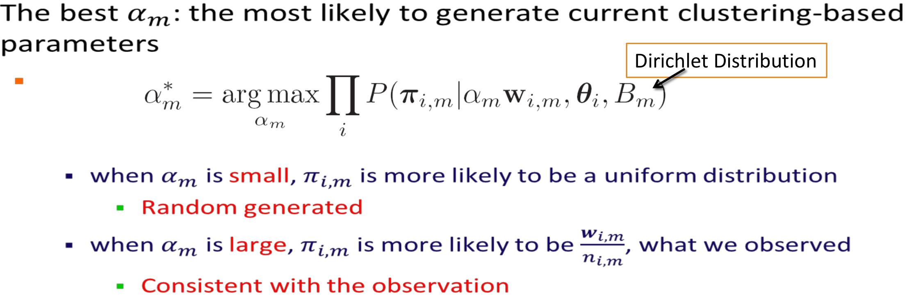

**学习算法**

An iterative algorithm that clustering result $$\Theta$$ and quality weight vector $$\alpha$$ mutually enhance each other

    Step 1: Optimize $$\Theta$$ given $$\alpha$$ 

    $$\theta_i$$ is determined by all the relation matrices with different weights $$\alpha_m$$, as well as the labeled seeds

        $$\theta_{ik}^t \propto \sum \alpha_m \sum w_{i,j,m}p(z_{i,j,m}=k|\Theta^{t-1},B^{t-1})+1_{\{t_i\in\mathcal{L}_k\}^\lambda}$$ 

    Step 2: Optimize $$\alpha$$ given $$\Theta$$ 

    In general, the higher likelihood of observing $$W_m$$ given $$\Theta$$, the higher $$\alpha_m$$ 

        $$\alpha_m^t = \alpha_m^{t-1}\frac{\sum_i(\phi(\alpha_m^{t-1}n_{im}+|F_m|)n_{i,m}-\sum_j\phi(\alpha_m^{t-1}w_{ij,m}+1)w_{ij,m})}{-\sum_i\sum_jw_{ij,m}log\ \pi_{ij,m}}$$ 

## 分类与预测

### 异构网络分类

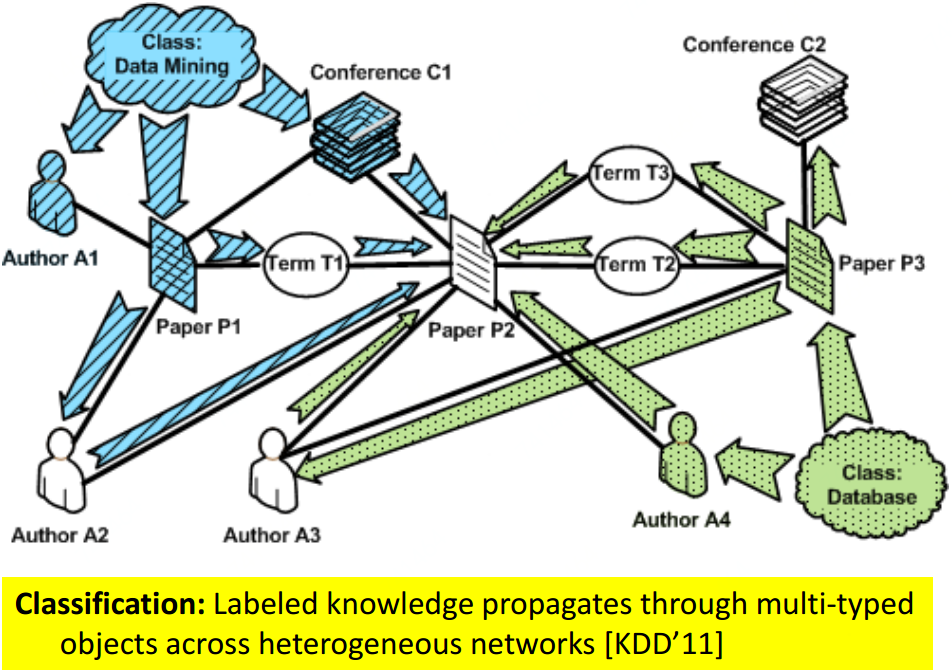

#### [GNetMine](https://github.com/chmx0929/UIUCclasses/tree/master/512DataMiningPrinciples/Assignments/assignment1/data)

利用异构网络信息传递（实现代码见标题链接），基于以下两启发式：

1、两个主体 $$x_{ip}$$ 与 $$x_{jq}$$ 预测结果同属于类别 $$k$$ 的话，他们应当相似 $$x_{ip}\longleftrightarrow x_{jq}\ (R_{ij,pq}>0)$$ 

2、已知类别的数据我们模型的预测结果应该与事实一致或相似

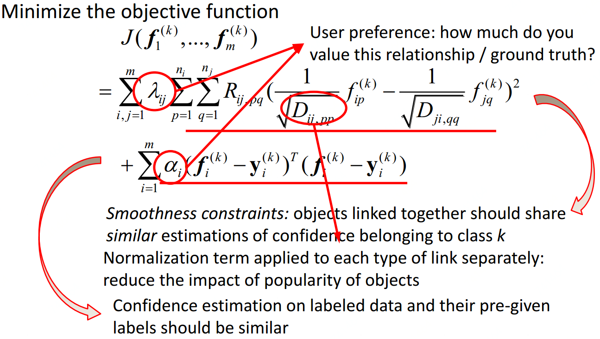

算法流程：

Step 0： $$\forall k \in \{1,\dots ,K\},\ \forall i \in \{1,\dots ,m\}$$ 初始化 $$f^{(k)}_i(0)=y_i^{(k)}$$ 且 $$t=0$$ 

Step 1：基于当前的 $$f^{(k)}_i(t)$$ ，计算：

                               $$f^{(k)}_i(t+1) = \frac{\sum^m_{j=1,j\neq i}\lambda_{ij}S_{ij}f^{(k)}_j(t)+2\lambda_{ii}S_{ii}f^{(k)}_i(t)+\alpha_iy_i^{(k)}}{\sum^m_{j=1,j\neq i}\lambda_{ij}+2\lambda_{ii}+\alpha_i}$$ 

Step 2：重复上步直到收敛或变化小于一定阈值

Step 3：对于每个 $$i\in \{1,\dots,m\}$$ ，根据第p个数据指定主体 $$\mathcal{X}_i$$ 类别：

                         $$c_{ip}=\arg \max_{1\leq k\leq K}f_{ip}^{(k)*}$$ ，其中 $$f^{(k)*}_i=[f_{i1}^{(k)}*,\dots,f_{in_i}^{(k)}*]^T$$ 

这里解释一下上述算法流程：

第0步label一共 $$K$$ 个，有 $$m$$ 个关系图所以初始化没什么可说的。

第1步： $$\lambda$$ 作为参数调节异构网络中信息传播率， $$\alpha$$ 作为参数调节每轮ground truth参数。

式子分子分为三块：

* 第一部分 $$\lambda_{ij}S_{ij}f_j^{(k)}(t)$$ 为基于上一轮结果各关系图信息再传播
* 第二部分 $$2\lambda_{ii}S_{ii}f_i^{(k)}(t)$$ 为基于上一轮结果自信息再传播
* 第三部分 $$\alpha_iy_i^{(k)}$$ 为当前轮继续加入ground truth

其中 $$S_{ij}=D_{ij}^{(-1/2)}R_{ij}D_{ji}^{-1/2}$$ ， $$R_{ij}$$ 即关系图，比如行为作者、列为论文，前后两个对角矩阵是为了让关系图归一化，因为一篇文章一般有多个作者，一个作者一般有多篇文章。

第2步：跟阈值判断或限定轮数，没什么可说的

第3

#### RankClass

GNetMine将每个主体同等对待，RankClass中高排序的主体会在分类中起到更大作用

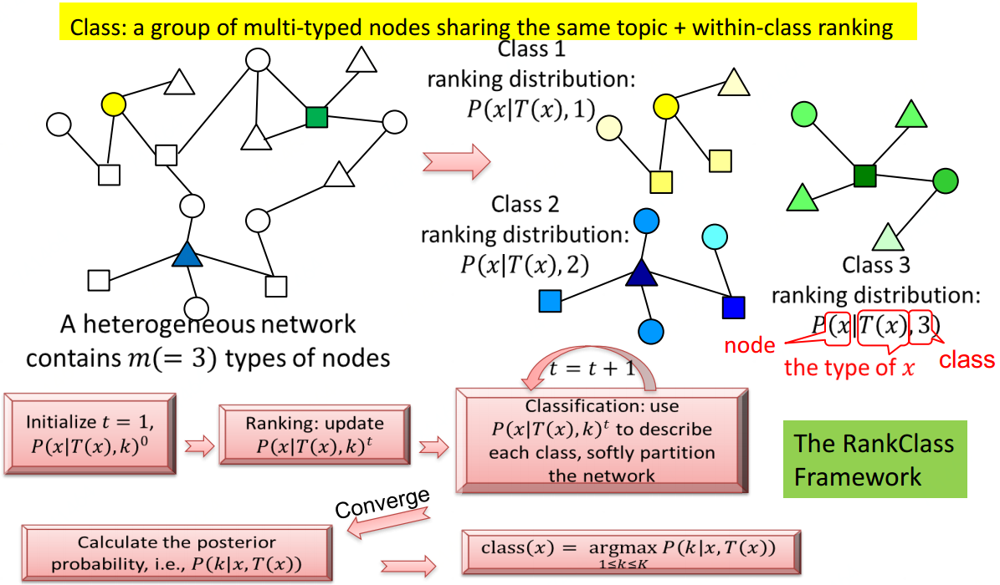

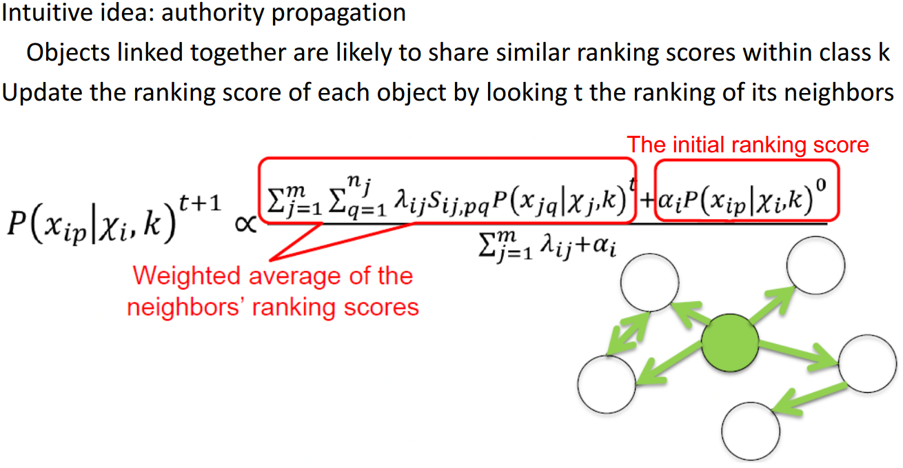

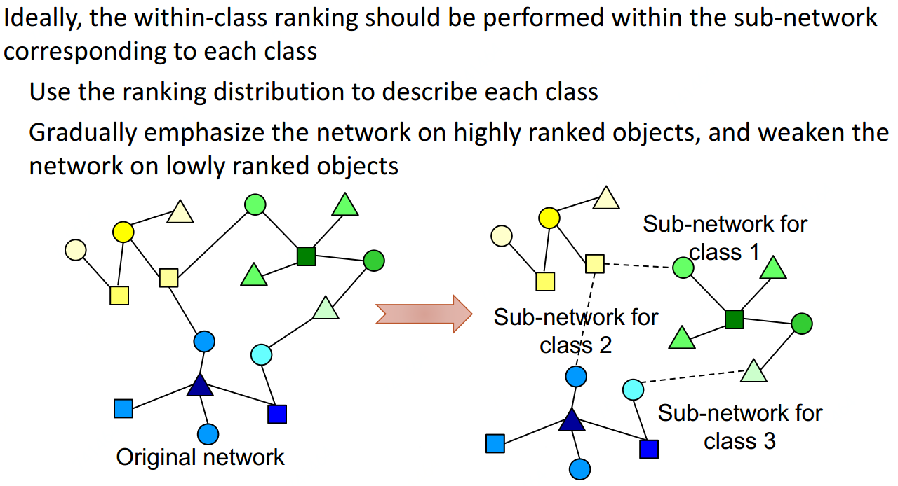

### 关联预测

#### **Relationship Prediction vs. Link Prediction**

在同质网络中的关联预测即连接预测 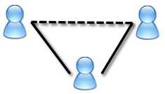 

异构网络中因为主体类型不同  或者路径不同  

#### PathPredict

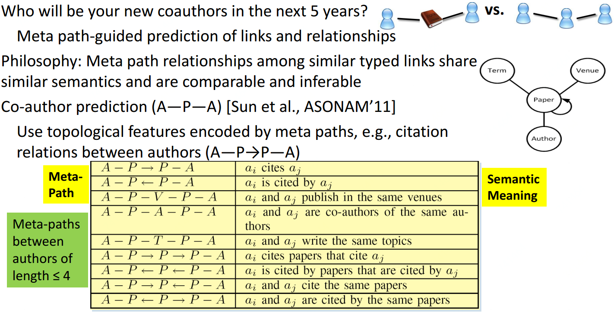

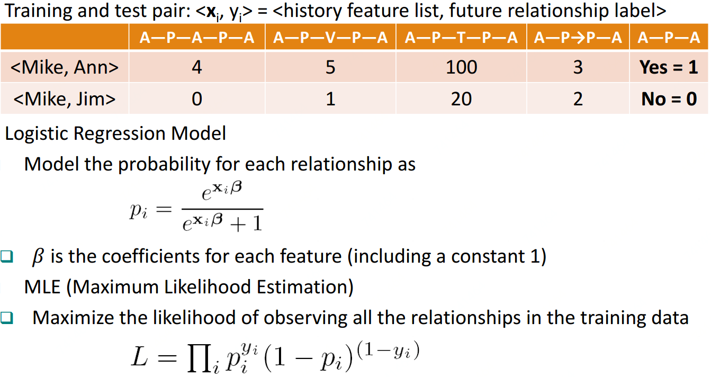

#### PathPredict\_When

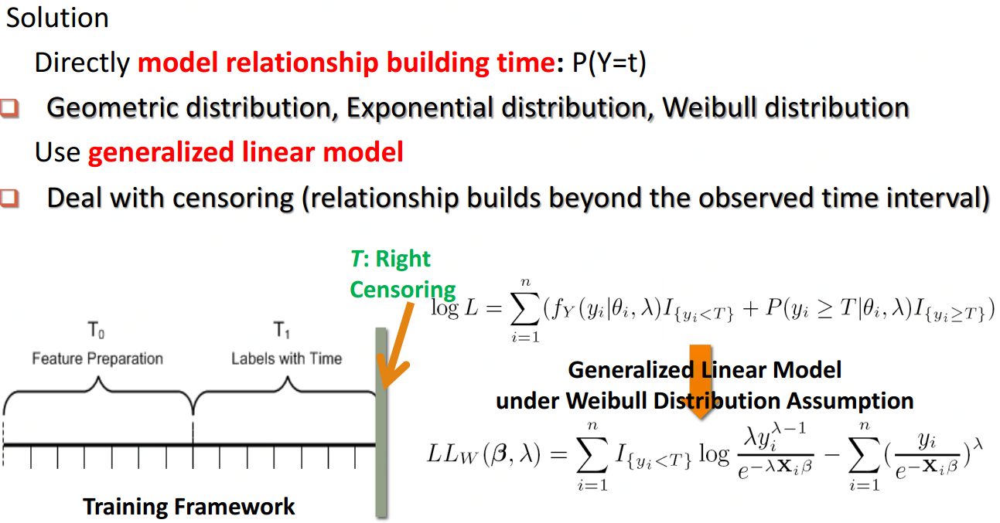

### 基于异构的推荐

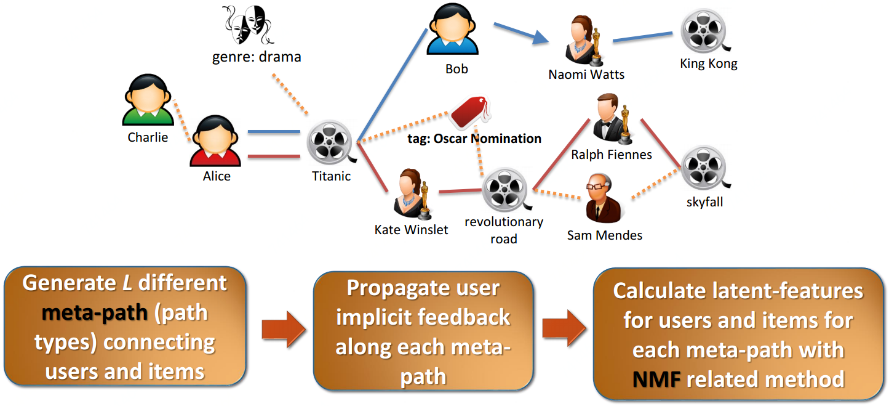

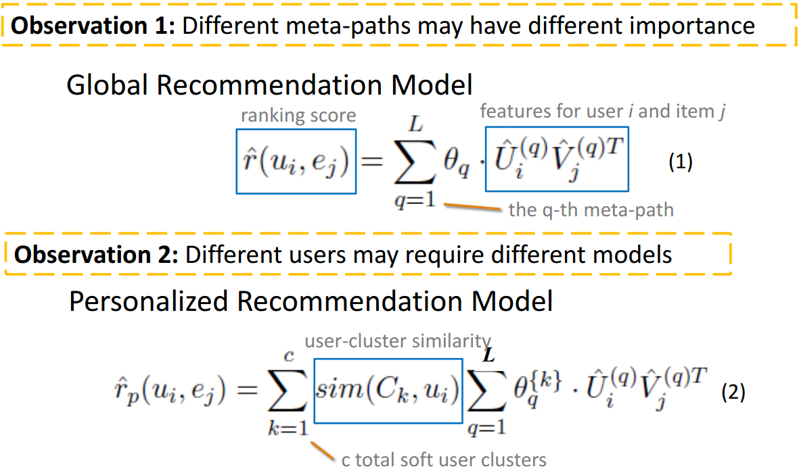

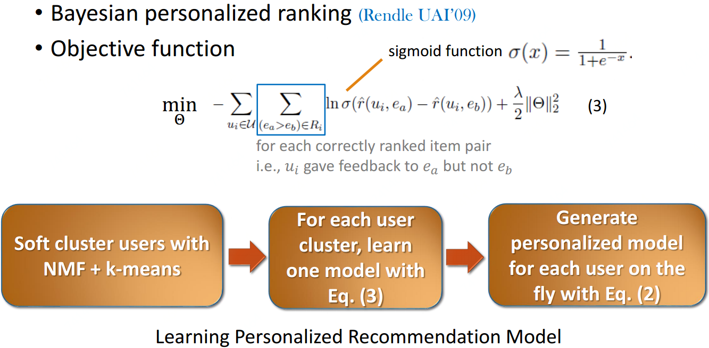

#### ClusCite

给定一原稿\(标题，简要或目录\)及其属性\(作者，目标会议或期刊\)，推荐一系列高质量引用文献


## 其他数据挖掘

### [发展的或动态的信息网络挖掘](http://keg.cs.tsinghua.edu.cn/jietang/publications/TKDE13-Sun-etl-al-co-evolution-of-multi-typed-objects-in-dynamic-networks.pdf)

发掘异构网络中社区的演化 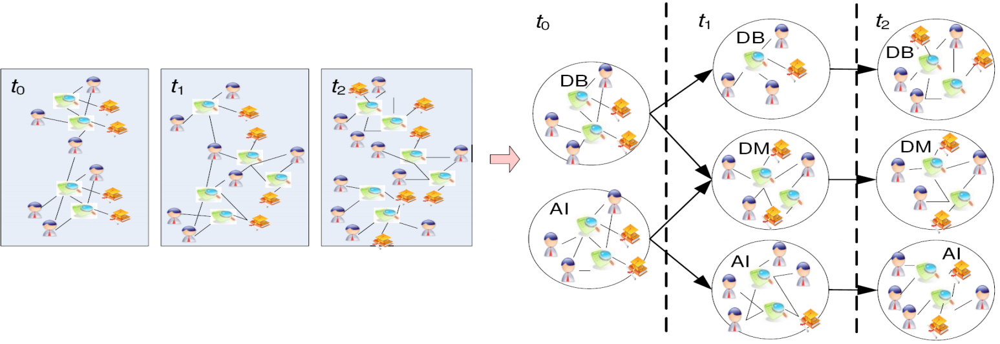 

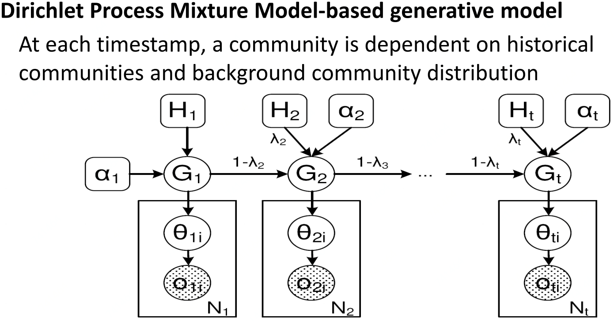


### 角色发掘

比如通过军中的指令发布，找到将军，团长，士兵角色...

#### 目的

根据输入的信息网络\(可能是同构\)，输出一颗含各主体的树\(或森林\)，比如下图，根据发paper信息，找到导师与学生等

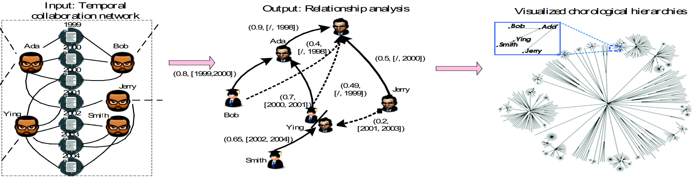

#### 框架

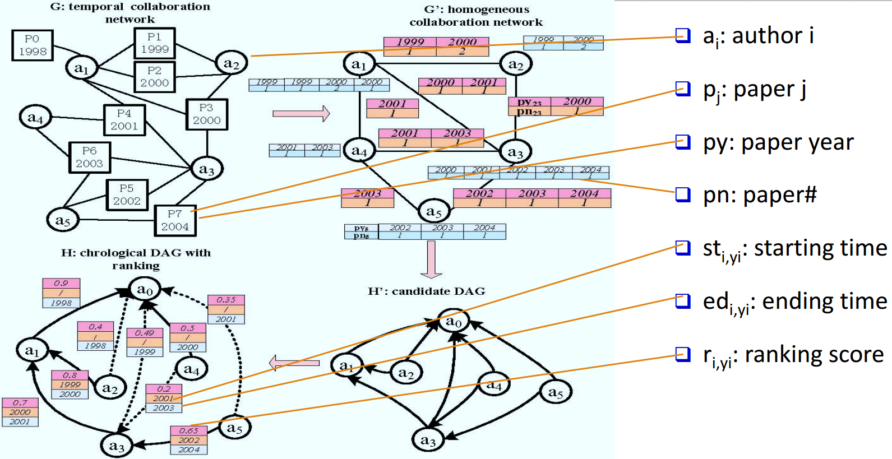

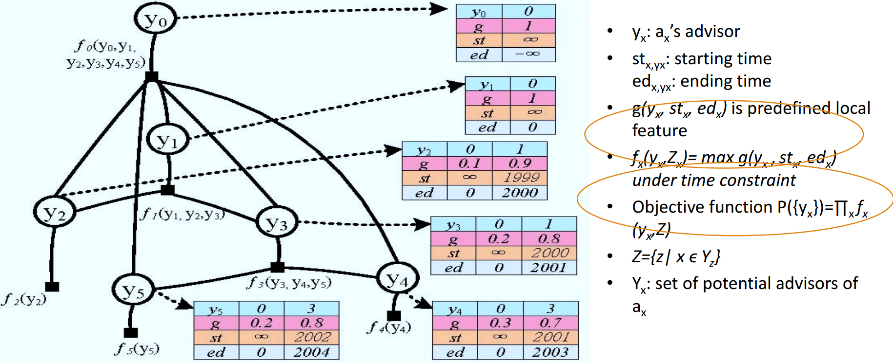


### 利用异构进行数据清洗\(区别\)

DBLP的paper有好多重名的作者，比如叫“Wei Wang”的就有好几个，利用异构网络对他们进行区分

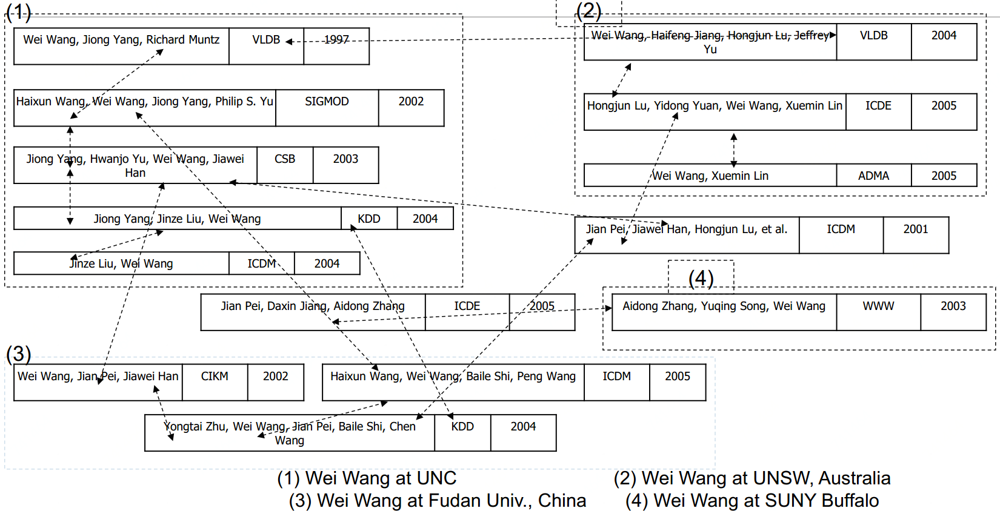

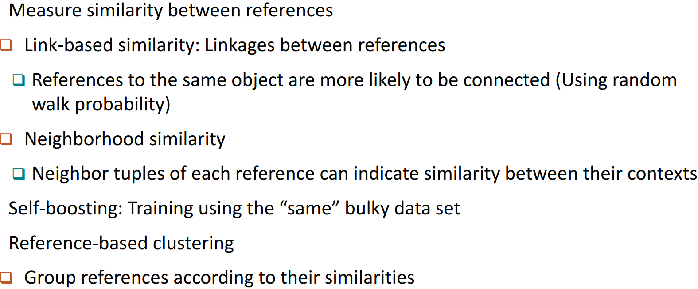

### 实体集合拓展

想通过异构网络解决问题：给予一些种子，找到其相似实体

比如给{red, blue, green} -&gt; all colors，但是给orange -&gt; color or fruits?

\*\*\*\*[**EgoSet**](http://www.cond.org/wsdm-egoset.pdf)\*\*\*\*

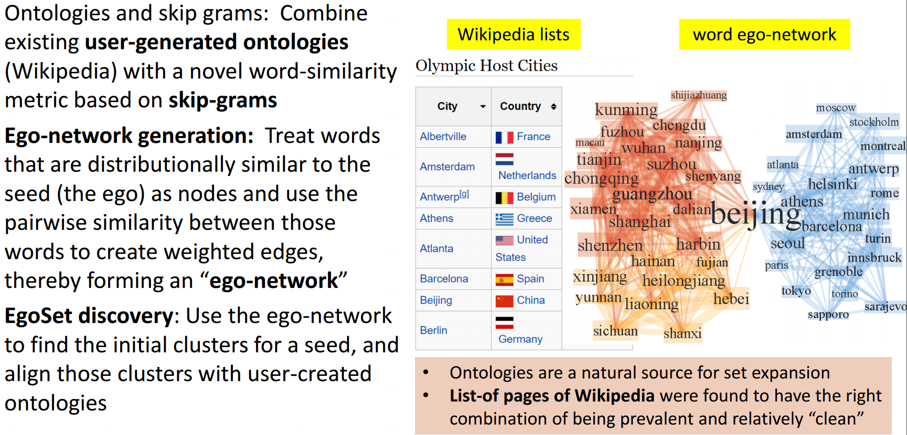

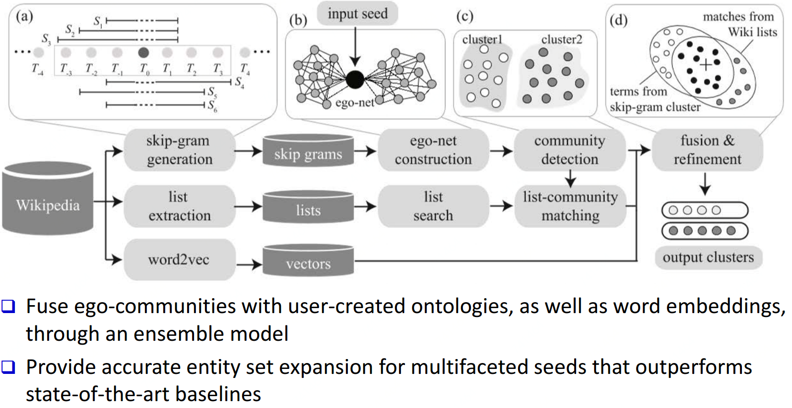

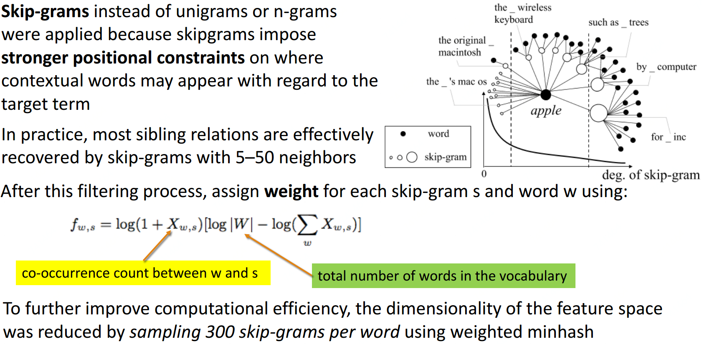

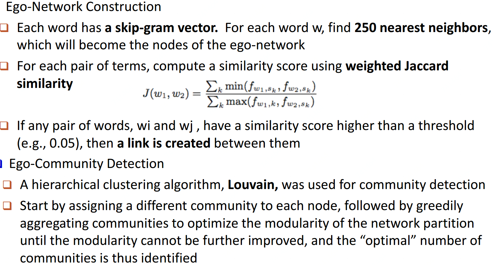

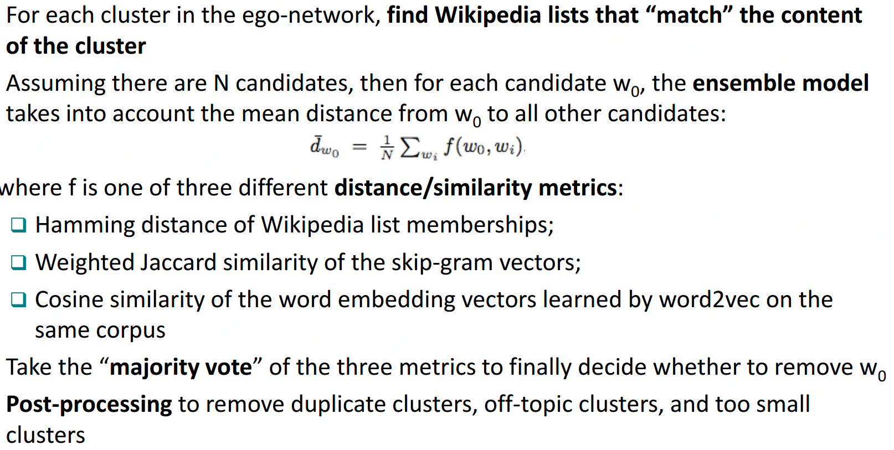

## Source




