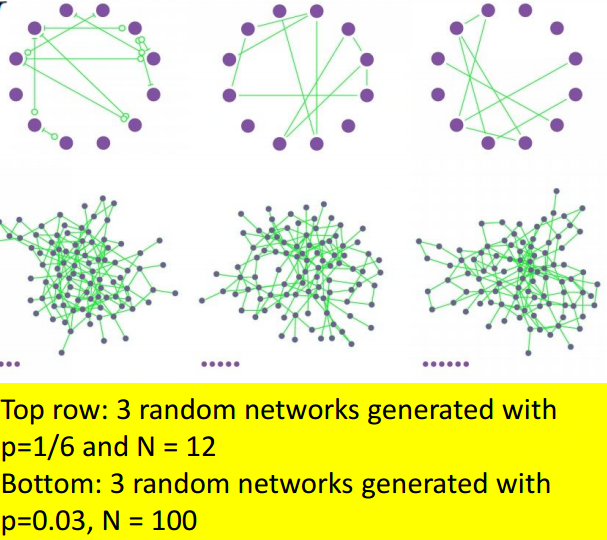
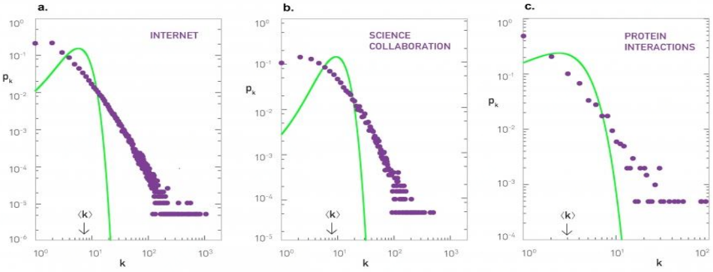
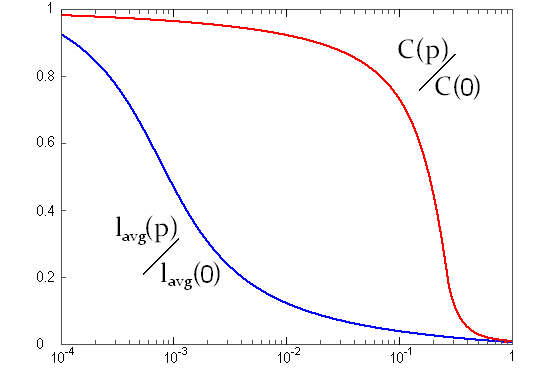
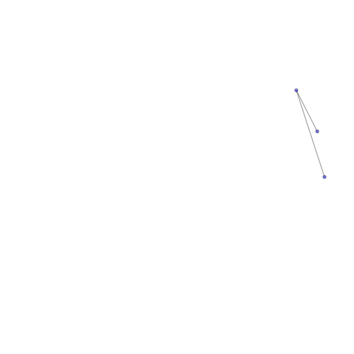

# 网络形成模型

尽管现实中网络\(社交网络、生物网络...\)存在于各个领域但他们之间存在一些相同的特征\(直径相似\(6度理论\),度较高的节点帮助聚类等\)，网络形成模型可以帮助我们更深入挖掘此类特性等。换句通俗语言，知道怎么来的，可以指导我们怎么用。

## 真实网络的共性

现实中的网络最明显两个特征就是网络大，且非常稀疏

### Small-world性质

平均路径长度 $$\mu_L$$大小和 $$n$$\(网络中节点数\)对数比例相关： $$\mu_L \propto \log\ n$$ 

### Scale-free性质\(幂定律分布\)

 绝大多数节点有很少量的度\(边\)，而小部分节点有很大的度\(边\)

一个节点有 $$k$$ 度的概率： $$f(k) \propto k^{-\gamma}$$ 

log-log图上为一条直线： $$\log f(k) = \log(\alpha k^{-\gamma})=-\gamma \log k\ +\ \log\alpha $$ 

### Clustering effect

如果两个节点有相同邻居，那么这两个节点链接的概率高

## Erdös-Rényi Random graph model

$$G(N，p)$$ ：一个网络有 $$N$$ 个节点，每两个节点连接的概率为 $$p$$ 

很明显，如果网络比较小\( $$N$$比较小 \)，则服从二项分布；若网络较大 （$$N$$较大，$$p$$ 相对小）则泊松分布

但是实际中网络并非泊松分布的，起码有一些中心点，节点的度更广，下图为ER model的网络与实际对比

## Watts-Strogatz small world graph model

这个模型相较上面完全随机网络加入了small world特征\(6度理论\)，平均路径长度比随机网络短。所以这个模型网络中大部分的节点彼此并不相连，但绝大部分节点之间经过少数几步就可到达。

### 集聚系数\(Cluster coefficient\)

描述图或网络中的顶点（节点）之间结集成团的程度的系数。具体来说，是一个点的邻接点之间相互连接的程度。例如在社交网络中，你的朋友之间相互认识的程度。一个节点 $$s_i$$ 的集聚系数 $$C(i)$$ 等于所有与它相连的顶点相互之间所连的边的数量，除以这些顶点之间可以连出的最大边数。显然 $$C(i)$$ 是一个介于0与1之间的数。$$C(i)$$ 越接近1，表示这个节点附近的点越有“抱团”的趋势。

### 构造思路

首先从一个规则的网络开始。这个网络中的 $$N$$ 个节点排成正多边形，每个节点都与离它最近的 $$2K$$ 个节点相连。其中 $$K$$ 是一个远小于 $$N$$ 的正整数。 

选择网络中的一个节点，从它开始（它自己是1号节点）将所有节点顺时针编号，再将每个节点连出的连接也按顺时针排序。然后，1号节点的第1条连接会有 $$0<P<1$$ 的概率被重连。重连方式如下：保持1号节点这一端不变，将连接的另一端随机换成网络里的另一个节点，但不能使得两个节点之间有多于1个连接。

 重连之后，对2号、3号节点也做同样的事（如果这其中有连接已经有过重连的机会，就不再重复），直到绕完一圈为止。 再次从1号节点的第2条连接开始，重复第2个步骤和第3个步骤，直到绕完一圈为止。 再次从1号节点开始，重复第4个步骤，直到所有的连接都被执行过第2个步骤（重连的步骤）。

由于 $$NK$$ 个连接里每个连接都恰好有一次重连的机会，所以这个过程最后总会结束。最后得到的网络称为WS模型网络。

WS集聚系数表达式： $$C(p)=\frac{3(K-1)}{2(2K-1)}(1-p)^3$$ 

## Barabási-Albert Scale-free model

初始化：由含 $$m_0$$ 个节点的初始网络开始

一次加一个节点，新节点链接到 $$m\leq m_0$$ 个已存在节点，其概率与现有节点已有的链路数成比例。新节点链接已存节点 $$i$$ 的概率为： $$p_i = \frac{k_i}{\sum \limits_j k_j}$$， $$k_j$$ 为节点 $$i$$ 的度，并且在所有预先存在的节点j上进行求和\(比如分母是网络中当前边缘数的两倍\)。重度链接的节点\(hubs\)倾向于快速累积更多链路，而仅具有少量链路的节点不太可能被选择作为新链路的目的地。新节点具有将其自身附加到已经高度链接的节点的“偏好”。

