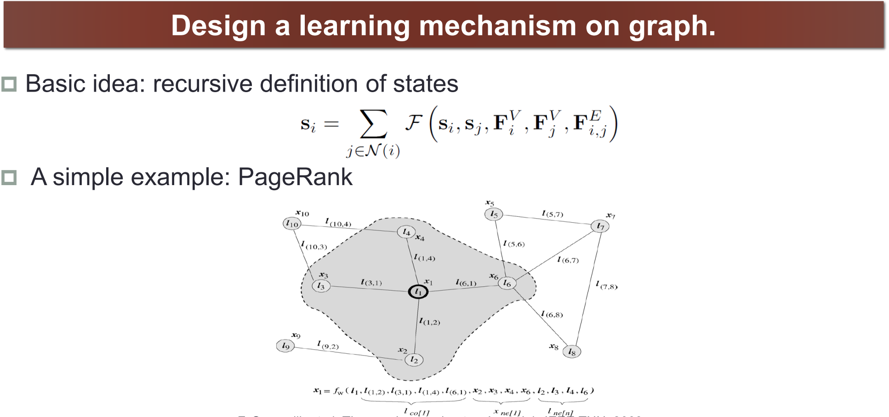
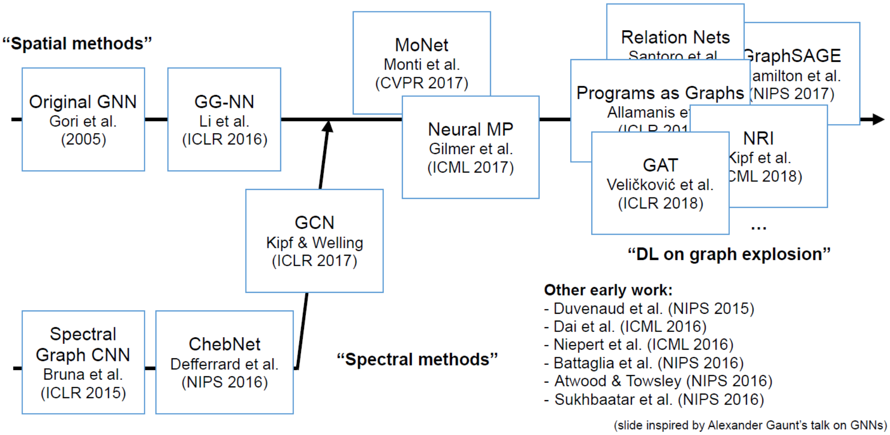
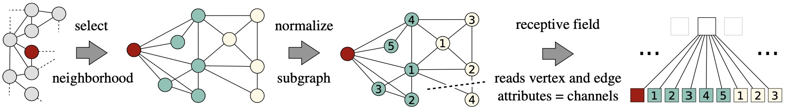
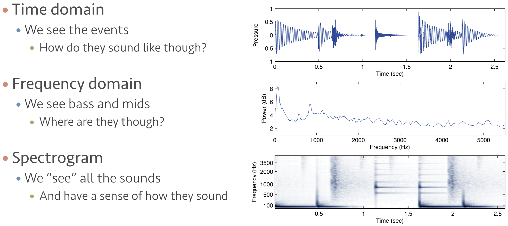
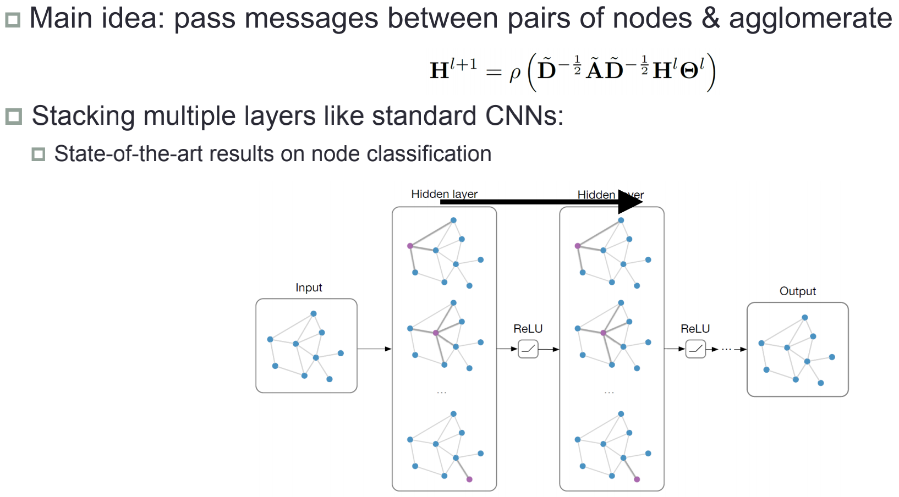
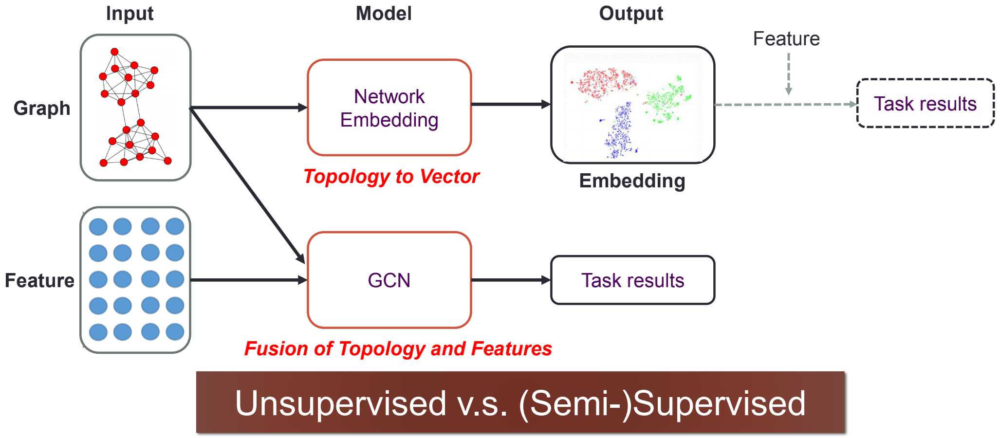

# Graph Neural Network

Graph Neural Network最近很火，各会议论文很多，尤其是GCN的论文暴涨，这里简单介绍下。Graph Neural Network核心思想是在Graph这种数据结构上设计一种学习机制，用来学习到网络数据的隐含信息以帮助我们解决各类的问题。

就像我们在图片这种数据上采用CNN，卷积的学习机制帮助我们很好的学习到了图片特征，以帮助我们进行图片分类等任务。引入Attention机制在NLP任务中，也很好的解决了翻译等问题。这两种方式都很简单，比如卷积本质其实就是加权求和而已，但是落地验证效果都很好。原因就是两种方法都模拟了人类的认知方式，我们看图片也是看几个重要的区域识别图片上的到底是什么，Attention模拟了人通过上下文讲river的事情了解bank语义是河岸这种关联关系的提取。像图片和文本数据我们很有经验，因为他是实实在在的。而Network有一定的抽象提取，所以怎样在Graph这种数据结构上模拟人类认知经验也比较少，现在主要基于Spatial methods和Spectral methods两种思路结合Neural Network进行学习机制设计。

## Spatial methods vs. Spectral methods

如同CNN，卷积将图片的信息加权求和后放入Neural Network进行学习，我们这里要设计的是怎样将Graph的信息处理后放入Neural Network。

### **Spatial methods**

Spatial methods其实就是在节点上下功夫，通过节点信息提取Graph中节点的拓扑空间特征，核心就是下面两个问题：

1. 按照什么规则逻辑选取我们中心target节点的neighbor们
2. 选取好neighbor们后，按照什么方式处理他们的特征

比如我们熟知的Deep Walk，就是一种典型的Spatial method，他的邻居选取规则逻辑：固定长度的Random Walk，特征处理方式：word2vec方法。

### **Spectral methods**

Spectral methods其实就是借助[光谱图理论](https://link.zhihu.com/?target=https%3A//en.wikipedia.org/wiki/Spectral_graph_theory)来提取Graph上的信息。我们已经有比较成熟的信号处理，比如语音信号，如下图。Graph也是一种信号，我们通过转换去表示他，这是信号处理的一个分之，Graph Signal Processing。

大火的Graph Convolutional Network就是一个典型的Spectral method，他将Graph进行Fourier Transformation后，融合卷积的思想，结合Neural Network去解决我们的任务。

上面阐述了Spatial methods和Spectral methods，下面我们简单做个应用流程上的对比。Spatial methods的方法通过Network Embedding将节点的拓扑结构信息映射到向量空间，再加入Feature信息或约束解决问题\(加Feature可选，比如节点相似计算直接算向量cos\)；而Spectral methods的方法GCN融合拓扑结构和特征，直接针对问题建Neural Network模型。

## Source



