# 性质维持的网络映射

如果将网络看做是同质的，那性质大家都一致，只要注重结构就可以。但现实中，网络是异构的，比如社交网络中，主体有人，机构等等\(不同类型实体\)，相互之间可以留言、评论、转发...\(不同类型链接\)。所以说异构网络更贴近真实网络。异构网络映射主要挑战：由于异构网络的异构性，如何选取最优类型的信息

## 网络特性

网络有两大特性：1、传递性\(Transitivity\)    2、不确定性\(Uncertainty\)

### 传递性\(Transitivity\)

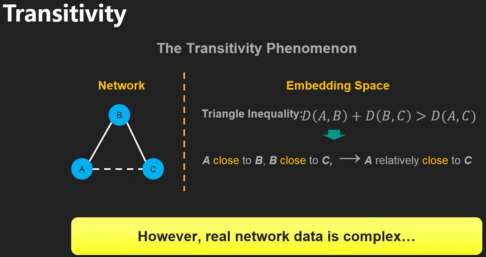

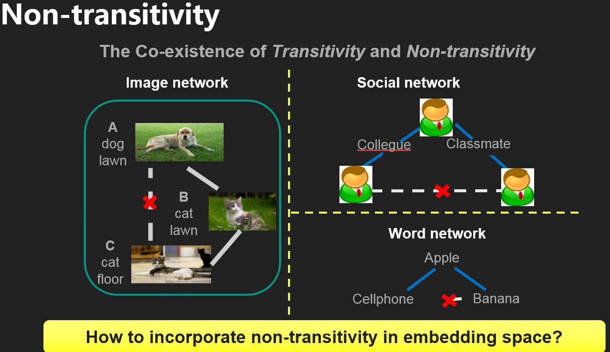

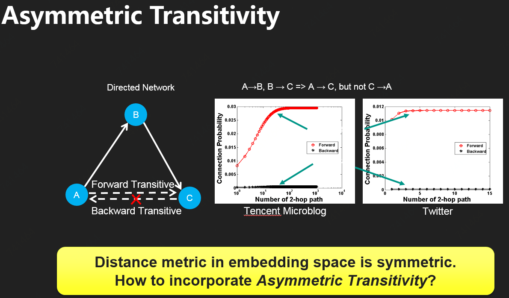

#### [Non-transitivity](http://media.cs.tsinghua.edu.cn/~multimedia/cuipeng/papers/KDD-NonTransitiveHashing.pdf)

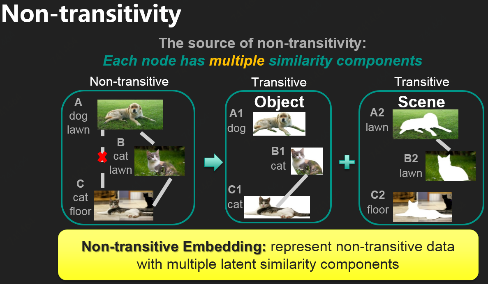

[Asymmetric Transitivity](https://www.kdd.org/kdd2016/papers/files/rfp0184-ouA.pdf)

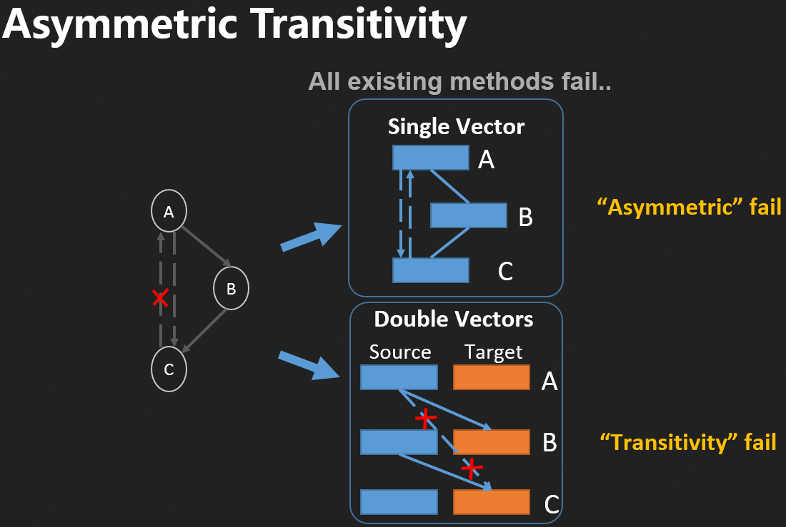

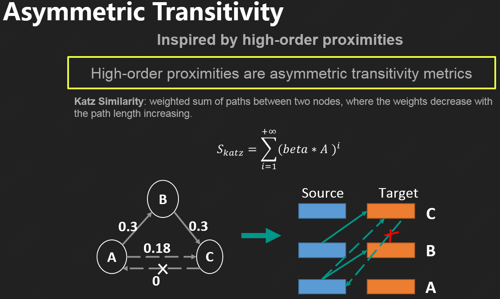

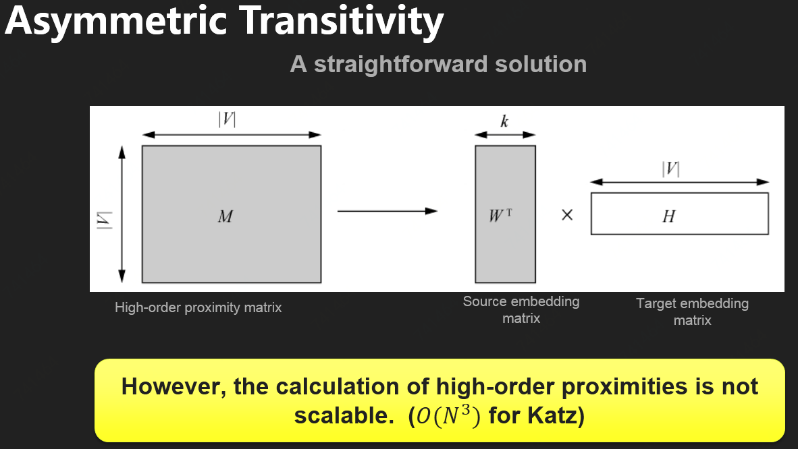

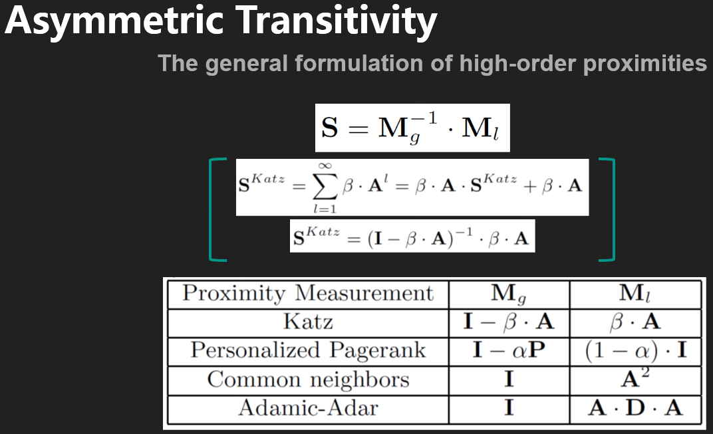

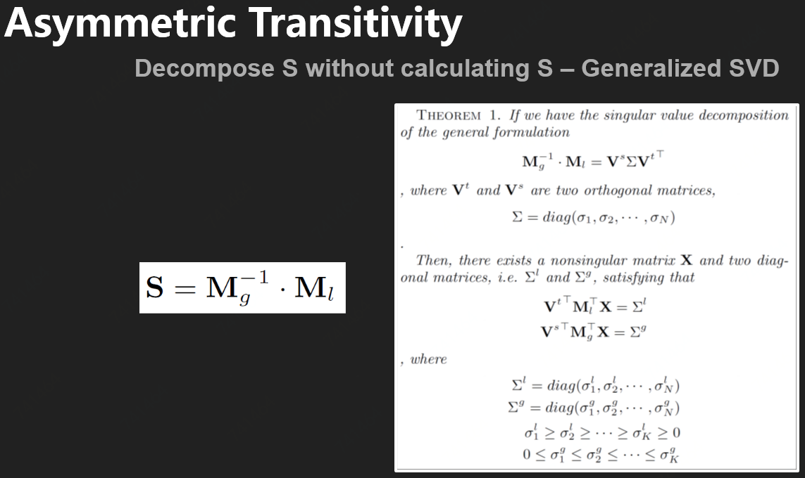

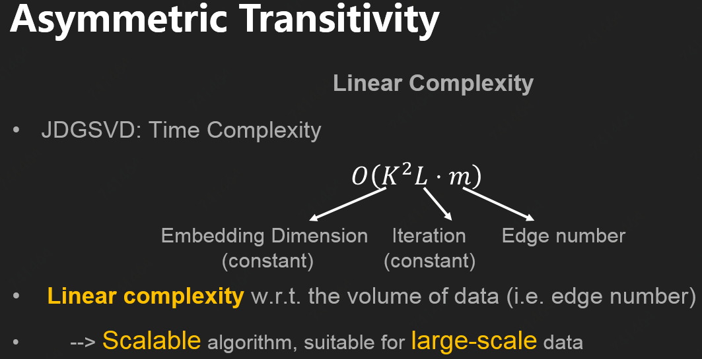

### 不确定性\(Uncertainty\)

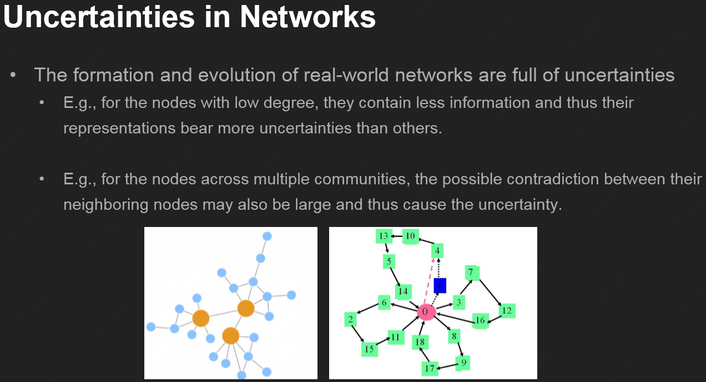

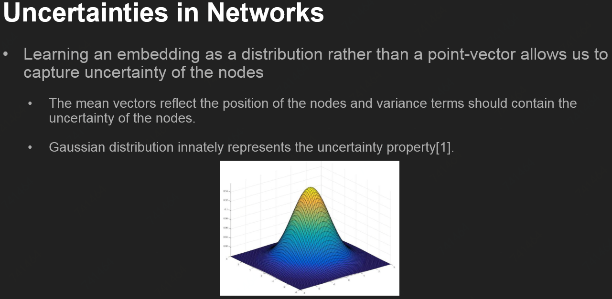

## [Deep Variational Network Embedding in Wasserstein Space](http://pengcui.thumedialab.com/papers/NE-DeepVariational.pdf)

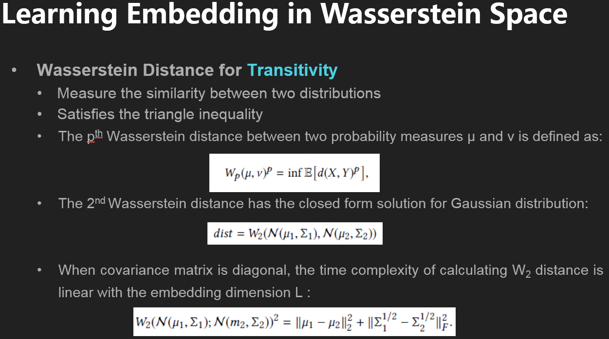

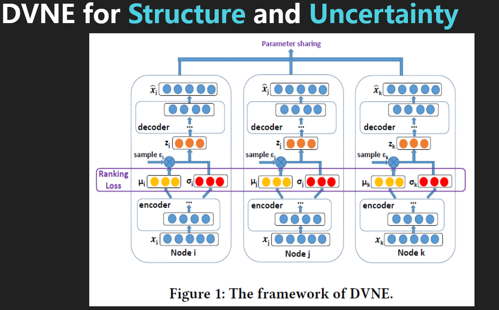

## [Task-Guided and Path-Augmented Embedding](http://web.cs.ucla.edu/~tingchen/papers/WSDM17_Chen.pdf)

相较于常规的网络映射，**任务指向的映射**更兼顾到指导的标签，比如“韩家炜”应与关键词“数据挖掘”接近

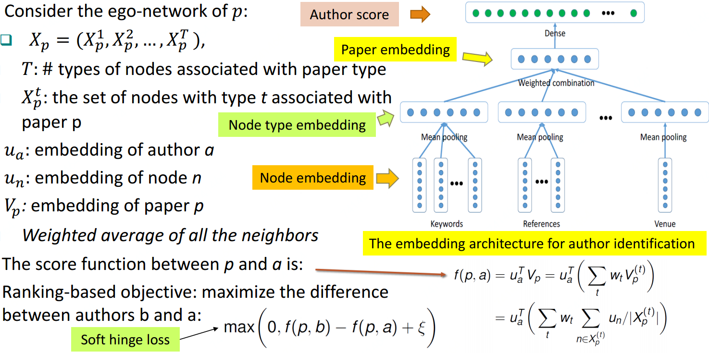

**路径扩大的映射**照顾到整个网络的结构，比如关键词“异构网络映射”应与“节点表达”接近

**模型拼接与路径选择**

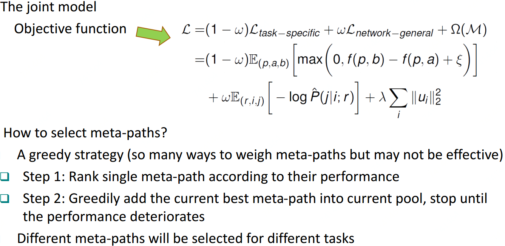

## Source



