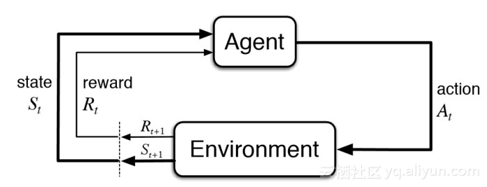

# 增强学习

当我们操纵电脑，每发出一个行为，电脑都会做出一定的响应，比如通过点击鼠标打开了某个文件、播放了某个音乐等。通过这些响应，我们就逐渐明白了每一个动作所产生的效果，也逐渐明白在各种场景下应该采取的动作。这种学习方式也是交互式的。

这种交互式的学习方法就是增强学习（Reinforcement Learning，也翻译成强化学习），可以说这种学习方式在我们的生活中无处不在。上面举例的方式介绍了增强学习的概念，下面将对增强学习的过程进行详细的定义。

首先我们要明确增强学习中的两个主要角色——学习者和环境。我们将参与学习的本体称为学者（Agent），而与Agent进行交互的外部环境称为环境（Environment）。为了方便描述和计算，我们将流动的连续时间抽象成一个个离散的时间片段，将Agent和环境双方的交互限定在一个个时间片段内；每一个时间片段对应双方的一轮交互。具体来说，双方会产生如下交互。

1. （1）在时间窗口 $$t$$ 内，环境会处于某一个状态（State） $$S_t$$ 下，而Agent也可以感受到这个状态。比如原始人处于一片森林中，在他的面前有一只死兔子。
2. （2）Agent会根据自己的某种应对环境的策略（Policy） $$\pi$$ 对环境所处的状态产生某个动作（Action） $$A_t$$ 。比如原始人的策略是看到死动物就上前捡走。
3. （3）环境会根据Agent在上一个时间窗口的动作 $$A_t$$ 产生一定的反馈，以奖励（Reward） $$R_t$$ 的形式被Agent捕获或感知。与奖励一道被Agent捕获或感知的，还有环境的最新状态 $$S_{t+1}$$ 。当然，这里的“奖励”并不是中文里带有褒义的奖励，只是表示反馈的意思。比如原始人捡起死兔子，获得了食物，那个这个“奖励”就是正面的奖励；如果原始人捡起兔子，却掉入了一个陷阱中，那么这个“奖励”实际上就是一个惩罚，也就是负面的奖励。

就这样，在每一个我们划分的时间片段内，上面的过程将会进行一次，整个过程也会随着时间的流逝不断循环进行，直到某个终止条件出现，比如上面原始人掉入陷阱挂掉了，那么他和环境交互就终止了。整个过程如下图：

## 两特征

Agent作为交互过程中的主动方，他的目标是尽可能多地获得回报。从上面的定义中可以看出，增强学习的模式本身有两个显著的特点：

#### 1、在不断的尝试中学习

Agent并不会被告知自己要学习什么，而是要通过不断的实践获得经验。当Agent完成一个动作后，他将获得一些反馈，在增强学习中我们会将其抽象成一个数字，叫作奖励。对于Agent来说，他的目标就是尽可能地获得奖励，而为了实现这个目标，他需要做的是不断地尝试，获得反馈，然后利用反馈结果进行学习。对于俄罗斯方块这个游戏，在不断地游戏过程中，玩家会找到一定的规律，知道在给定的某种情况下应该做出什么样的操作。这个过程和我们熟知的监督学习并不相同，在监督学习中，Agent要学习的内容和答案往往是事先确定的，而且答案也是唯一的。如果把这种学习方法放在玩俄罗斯方块上，那么需要在操作俄罗斯方块每一步前已经知道最优操作，这显然是不现实的。

#### 2、延迟奖励

对于Agent来说，学习是一个时序的过程，Agent要把这个时序问题看成一个整体，站在全局的角度看待问题，而不应该将问题拆解成一个个小的部分。Agent的目标是尽可能在整个过程中获得最多的奖励，所以通常不但需要在当前状态下获得充足的奖励，还需要在未来的长期时间内获得奖励。这一点和监督学习相比也有很大的不同。对于俄罗斯方块这个游戏，最有说服力的例子就是它的得分机制。俄罗斯方块根据同时消去的层数决定应该得到的分数，同时消去的层数越多，所得到的分数涨幅比例就越大，一般来说，一次性消除4行的得分会比4词各消除一行的得分高很多。正是因为这样的机制，使得很多玩家不急于消除方块，而是等到方块积累到一定程度后再一次性消除。除俄罗斯方块之外，还有很多增强学习的例子具有这样的特点，延迟获得的奖励往往更诱人。

## 两策略

正式因为上面所述的两个特点，增强学习拥有其他学习方式所没有的一个挑战，那就是如何平衡探索（Exploration）和利用（Exploitation）两个策略的关系。

所谓探索，就是尽可能多地尝试新的动作，以获得更多不同的反馈和奖励，从而使Agent对问题有更多的认识，并可以帮助他找到更好的方法。当然，在探索尝试的过程中，Agent也会尝试一些奖励较低的方法，这样会拉低他获得的总奖励；在俄罗斯方块中，探索指的是采用一些全新的方块组合方式进行游戏，这些组合方式有的可能效果一般，有的则会获得比当前组合策略更多的分数。

所谓利用，就是根据现有的动作尝试和奖励信息，总结出一套在当前状态下最好的策略，从而认真贯彻这套策略，按照这套策略进行行动。这样做的好处是可以保证现在的动作是当前状态下最好的，可以获得最多的奖励；但是与此同时，Agent也会失去获得更多奖励的潜在机会，因为Agent有可能还没有接触到比当前策略更好的策略，他还没有体会到更好的策略能为他带来更多的奖励。在俄罗斯方块中，利用指的是采用现有方块组合中最好的策略进行游戏，不去尝试新的组合策略。

## Source





