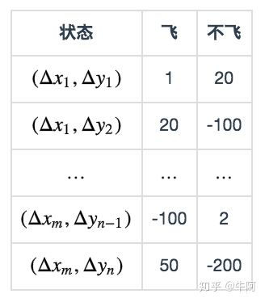

# 未知环境模型的问题

对于绝大多数现实中的增强学习问题，Agent只能在采取动作之后获得下一个状态以及对应的奖励，对其中的概率转移函数和奖励函数的细节无法知晓。这一类算法也被称为无模型（Model-Free）算法。当然，没有模型不代表无法进行求解，我们可以通过采样的方法进行求解，也就是具有增强学习特色的学习方式——在实践中学习，当模型通过实践采样到大量的与环境交互的数据之后，它就可以利用这些数据求出价值函数的模型，求解在当前数据下的最优策略了。在无模型算法中，比较经典的有蒙特卡罗法和时序差分法。

## 蒙特卡罗法

在很多增强学习问题中，我们发现想获得环境模型完整的状态转移概率比较困难，但是获取某一步动作后的状态和奖励序列是比较容易的。比较典型的例子就是电子游戏，一般来说，玩家想要把每一个场景（也可以称作状态）下经过任意操作后产生的状态完全收集到是不太现实的，但是游戏会自然而然地为玩家展现出它的下一个场景和奖励。这里通常只考虑有明确终止状态的问题，这样将每一轮Agent从开始到结束的MDP（马尔可夫决策过程）称为一个交互流（Episode）。通过和环境的不断交互，Agent可以获得一定数量的交互流，并利用这些交流学习策略。实际上蒙特卡罗法的总体计算思路和动态规划法的计算思路相似。对于蒙特卡罗法，首先要做的同样是策略估计，也就是对于固定的策略 $$\pi$$ ，计算 $$v_\pi$$ 和 $$q_\pi$$ ，然后再进行策略改进。唯一不同的是，蒙特卡罗法在策略评估这一步采用了蒙特卡罗采样的方法。蒙特卡罗法的核心思想就是将交互流中顺序出现的状态和动作进行平均，从而得到对于每一个状态的价值函数，然后利用这个价值函数求出相应的策略。蒙特卡罗法在统计样本的过程中有两种方式：

* 全样本统计法（Every-visit MC method），也就是把每一个交互流中出现的所有状态对都记录下来，用于评估状态的价值函数。
* 首次出现样本统计法（First-visit MC method），也就是对于每一个状态 $$s$$ ，在每一个交互流中只统计第一次出现的状态信息，用于评估状态的价值函数。

以下是蒙特卡罗版的策略评估算法，这里采用首次出现样本统计法。

初始化： $$\pi\gets$$ 需要评估的策略， $$V\gets$$ 任意状态-值函数， $$\text{Returns}(s)\gets$$ 空列表，针对所有 $$s\in S$$ 

Repeat forever：

* （a）使用策略 $$\pi$$ 生成一个交互流
* （b）针对交互流中出现的每一个状态 $$s$$ ：
*                   $$G\gets s$$ 第一次出现时的回报
*                   将 $$G$$ 添加在列表 $$\text{Returns}(s)$$ 的最后
*                   $$V(s)\gets \text{average(Return(s))}$$ 

上面的算法评估是状态价值函数，在拥有模型详细信息的情况下，利用它推导出策略是没有问题的；但是在没有模型信息的情况下，计算策略需要从每一个状态出发，遍历所有的动作计算出 $$q(s,a)$$ ，然后再求出最优策略 $$\arg\max q(s,a)$$ 。既然这样，我们需要考虑评估 $$q(s,a)$$ 的蒙特卡罗法。同样可以采用评估 $$v(s)$$ 的方法来评估 $$q(s,a)$$ ，但是这里同样有一个问题，那就是有的 $$(s,a)$$ 对可能极难出现在交流中。对于没有出现的 $$(s,a)$$ 对来说，计算他们的价值比较困难，因此判断这个动作是否是这个 $$s$$ 的最优策略变得比较困难。对于这个问题，一种解决方法就是保持探索（Exploration），给所有没有在交互流中出现的动作一定的概率。在完成评估后，我们就可以求出当前价值函数下的策略，也就是策略改进的步骤。完整的算法如下：

初始化：

* for all $$s\in S, a\in A(s)$$ ：
*         $$Q(s,a)\gets$$ 任意值
*         $$\pi(s)\gets$$ 任意值
*          $$\text{Returns}(s,a)\gets$$ 空列表

Repeat forever：

* （a）选择 $$S_0\in S$$ 和 $$A_0\in A(s_0)$$ ，这样可以保证所有的pair概率都大于0
* （b）根据策略 $$\pi$$ 生成一个交互流
* （c）针对出现在交互流中的每一个 $$\langle s,a\rangle$$ 对
*                 $$G\gets\langle s,a\rangle$$ 第一次出现时对应的回报
*                  将 $$G$$ 添加在列表 $$\text{Returns}(s)$$ 的最后
*                 $$Q(s,a)\gets \text{average(Return(s,a))}$$ 
* （d）针对交互流中的每一个状态 $$s$$ 
*                  $$\pi(s)\gets \arg\max_aQ(s,a)$$ 

## 时序差分法

时序差分法（Temporal Difference）结合了动态规划法和蒙特卡罗法的特点。和动态规划法类似，时序差分法的参数更新只需要交互流中的部分信息即可，不需要像蒙特卡罗法那样收集完一个交互流之后才能进行计算；同时和蒙特卡罗法类似，时序差分法同样根据交互流的信息进行参数更新，而不像动态规划法那样需要知道模型的细节信息。在蒙特卡罗法中，需要等待一个交流结束后，计算在这个交互流中某个状态 $$s$$ 的回报 $$G_t$$ ，然后用这个回报更新状态 $$s$$ 的价值函数，公式如下：

                                                     $$V(S_t)\gets V(S_t)+\alpha[G_t-V(S_t)]$$ 

式中的 $$\alpha$$ 指的是更新步长。与蒙特卡罗法不同的是，时序差分法只需要等待下一个状态产生即可。利用当前价值函数对下一个状态的评估 $$V(S_{t+1})$$ 和动作产生的奖励 $$R_{t+1}$$ ，就可以组合得到状态 $$S_t$$ 的回报。于是可以得到如下公式：

                                        $$V(S_t)\gets V(S_t)+\alpha[R_{t+1}+\gamma V(S_{t+1})-V(S_t)]$$ 

这就是时序差分法的更新公式。从另一个角度考虑这个公式，可以将公式进行转换，得到：

                                         $$V(S_t)\gets (1-\alpha)V(S_t)+\alpha[R_{t+1}+\gamma V(S_{t+1})]$$ 

实际上 $$\alpha$$ 相当于一个滑动平均的参数，让最新的价值函数值由原有的价值函数值和计算得到的回报加权平均得到。以下是时序差分法的策略评估过程。

输入：需要评估的策略 $$\pi$$ 

随机初始化 $$V(s)$$ （例如： $$V(s)=0,\forall s\in S^+$$ ）

Repeat \(for each episode\)：

           初始化 $$S$$ 

           Repeat \(for each step of episode\)：

                    $$A\gets$$ 策略 $$\pi$$ 在 $$S$$ 时采用的动作

                    采取动作 $$A$$ ，得到奖励 $$R$$ 及下一状态 $$S'$$ 

                    $$V(S)\gets V(S)+\alpha[R+\gamma V(S')-V(S)]$$ 

                     $$S\gets S'$$ 

            until $$S$$ 是结束状态

时序差分法和蒙特卡罗法相比有一定的优势，它可以自然地实现为在线增量的算法，不必等到整个交互流结束后才更新价值函数，而且在很多实际应用中，时序差分法比蒙特卡罗法拥有更快的收敛速度。

### [Q-Learning](https://www.zhihu.com/question/26408259/answer/123230350)

 提到Q-learning，我们需要先了解Q的含义。Q为动作效用函数（action-utility function），用于评价在特定状态下采取某个动作的优劣。它是智能体的记忆。下面以小鸟怎么飞为例来介绍Q-Learning。我们可以通过强化学习（reinforcement learning）来解决小鸟怎么飞这个问题。强化学习中有状态（state）、动作（action）、奖赏（reward）这三个要素。智能体（Agent，指小鸟）会根据当前状态来采取动作，并记录被反馈的奖赏，以便下次再到相同状态时能采取更优的动作。

在这个问题中，最直观的状态提取方法就是以游戏每一帧的画面为状态。但为了简化问题，这里我将选用[SarvagyaVaish](https://github.com/SarvagyaVaish/FlappyBirdRL)项目中提出的状态表达：取小鸟到下一组管子的水平距离和垂直距离差作为小鸟的状态。更准确地说， $$\Delta x$$ 与 $$\Delta y$$  的定义如下图所示：


 **状态：**对于每一个状态 $$(\Delta x,\Delta y)$$ ， $$\Delta x$$ 为水平距离， $$\Delta y$$ 为水平距离。

**动作选择：** 每一帧，小鸟只有两种动作可选：1.向上飞一下。2.什么都不做。

**奖赏：**小鸟活着时，每一帧给予1的奖赏；若死亡，则给予-1000的奖赏。

在这个问题中， 状态和动作的组合是有限的。所以我们可以把Q当做是一张表格。表中的每一行记录了状态 $$(\Delta x,\Delta y)$$  ，选择不同动作（飞或不飞）时的奖赏：



这张表一共 $$m \times n$$ 行，表示 $$m \times n$$ 个状态，每个状态所对应的动作都有一个效用值。

理想状态下，在完成训练后，我们会获得一张完美的Q表格。我们希望只要小鸟根据当前位置查找到对应的行，选择效用值较大的动作作为当前帧的动作，就可以无限地存活。

**训练：**下面的伪代码说明了我们如何训练，来得到一个尽量完美的Q表格。

```text
初始化 Q = {};
while Q 未收敛：
    初始化小鸟的位置S，开始新一轮游戏
    while S != 死亡状态：
        使用策略π，获得动作a=π(S) 
        使用动作a进行游戏，获得小鸟的新位置S',与奖励R(S,a)
        Q[S,A] ← (1-α)*Q[S,A] + α*(R(S,a) + γ* max Q[S',a]) // 更新Q
        S ← S'
```

其中有些值得注意的地方：

1、使用策略 $$\pi$$ ，获得动作 $$a = \pi(S)$$ 

最直观易懂的策略 $$\pi(S)$$ 是根据Q表格来选择效用最大的动作（若两个动作效用值一样，如初始时某位置处效用值都为 $$0$$ ，那就选第一个动作）。

但这样的选择可能会使Q陷入局部最优：在位置 $$S_0$$ 处，在第一次选择了动作1（飞）并获取了 $$r_1>0$$ 的奖赏后，算法将永远无法对动作2（不飞）进行更新，即使动作2最终会给出 $$r_2>r_1$$ 的奖赏。

改进的策略为 $$\varepsilon$$-greedy方法：每个状态以 $$\varepsilon$$ 的概率进行探索，此时将随机选取飞或不飞，而剩下的 $$1-\varepsilon$$ 的概率则进行开发，即按上述方法，选取当前状态下效用值较大的动作。

2、更新Q表格

Q表格将根据以下公式进行更新：

                          $$Q(S,A) \leftarrow (1-\alpha)Q(S,A) + \alpha[R(S, a) + \gamma\max\limits_aQ(S', a)]$$ 

其中 $$\alpha$$ 为学习速率（learning rate）， $$\gamma$$ 为折扣因子（discount factor）。根据公式可以看出，学习速率 $$\alpha$$ 越大，保留之前训练的效果就越少。折扣因子 $$\gamma$$  越大， $$max_aQ(S', a)$$ 所起到的作用就越大。但 $$max_aQ(S', a)$$ 指什么呢？

考虑小鸟在对状态进行更新时，会关心到眼前利益（ $$R$$ ），和记忆中的利益（ $$\max\limits_aQ(S', a)$$ ）。 $$\max\limits_aQ(S', a)$$ 是记忆中的利益。它是小鸟记忆里，新位置 $$S'$$  能给出的最大效用值。如果小鸟在过去的游戏中于位置 $$S'$$  的某个动作上吃过甜头（例如选择了某个动作之后获得了50的奖赏），这个公式就可以让它提早地得知这个消息，以便使下回再通过位置 $$S$$ 时选择正确的动作继续进入这个吃甜头的位置 $$S'$$ 。

可以看出， $$\gamma$$ 越大，小鸟就会越重视以往经验，越小，小鸟只重视眼前利益（ $$R$$ ）。

## Source




