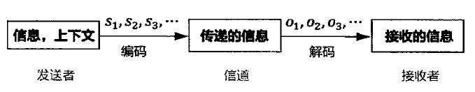

# 自然语言处理

## 自然语言处理基础

### 通用应用

1、机器翻译：计算机具备将一种语言翻译成另一种语言的能力

2、情感分析：计算机能够判断用户评论的情感色彩

3、智能问答：计算机能够正确的回答输入的问题

4、文摘生成：计算机能够准确归纳、总结并生成文本摘要

5、文本分类：计算机能够采集各种文章，进行主题分析，从而进行自动分类

6、舆论分析：计算机能够判断目前的舆论的导向

7、知识图谱：知识点相互连接而形成的语义网络

### 基本术语

1、分词\(Segment\)：将文本分割成最小的能够独立活动的有意义的语言成分。对中文来说十分重要。例如：“美国/会/通过对台售武法案”又可“美/国会/通过对台售武法案”

2、词性标注\(Part-of-speech Tagging\)：将词性\(动词、名词、形容词等\)标注，目的是表征词的一种隐藏状态，隐藏状态的转移就构成了状态转移序列。例如：我/r 爱/v 北京/ns 天安门/ns

3、命名实体识别\(NER, Named Entity Recognition\)：从文本中识别具有特定类别的实体\(通常是名词\)，例如人名、地名、机构名、专有名词等。例如：山东鲁能泰山

4、句法分析\(Syntax Parsing\)：最初利用语言学家的只是来构建的。目的是解析句子中各个成分的依赖关系，往往最终生成的结果是一颗句法分析树。句法分析可以解决传统词袋模型不考虑上下文的问题。

5、指代消除\(Anaphora Resolution\)：他她它，这里...等代词到底代表前文的什么内容

6、情感识别\(Emotion Recognition\)：情感识别本质是分类问题，一般可分为正面、负面、中性等。

7、纠错\(Correction\)：自动纠错在搜索技术以及输入法中利用的多。由于用户单词拼错等等...

8、问答系统\(QA System\)：类似机器人的人工智能系统

### 知识结构

1、句法语义分析：针对目标句子，进行各种句法分析，如分词、词性标记、命名实体识别及链接、句法分析、语义角色和多义词消歧等。

2、关键词抽取：抽取目标文本的主要信息，比如从一条新闻中抽取关键信息。主要是了解是谁、于何时、为何、对谁、做了何事、产生了有什么结果。涉及实体识别、时间抽取、因果关系抽取等多项关键技术。

3、文本挖掘：主要包含了对文本的聚类、分类、信息抽取、摘要、情感分析以及对挖掘的信息和知识的可视化、交互式的呈现界面

4、机器翻译：将输入的源语言通过自动翻译转化为另一种语言的文本。根据输入的数据类型的不同，可细分为文本翻译、语音翻译、手语翻译、图形翻译等。

5、信息检索：对大规模的文档进行索引。可简单对文档中的词汇，赋以不同的权重来建立索引，也可使用算法模型来建立更加深层次的索引。查询时，首先对输入来进行分析，然后在索引里面查找匹配的候选文档，再根据一个排序机制把候选文档排序，最后输出排序得分较高的文档。

6、问答系统：针对某个自然语言表达的问题，由问答系统给出一个精准的答案。需要对自然语言查询语句进行语义分析，包括实体链接、关系识别，形成逻辑表达式，然后到知识库中查找可能的候选答案并通过一个排序机制找出最佳的答案。

7、对话系统：系统通过多回合对话，跟用户进行聊天、回答、完成某项任务。主要涉及用户意图理解、通用聊天引擎、问答引擎、对话管理等技术。此外，为了体现上下文相关，要具备多轮对话能力。同时，为了体现个性化，对话系统还需要基于用户画像做个性化回复。

### 三个层面

1、词法层面：包括分词和词性标注两部分。

2、句法分析：对输入的文本以句子为单位，进行分析得到句子的句法结构的处理过程。

3、语义分析：理解句子表达的真实语义。

## 自然语言处理发展

分为两个阶段：人类学习语言的方式（基于规则）、基于数学模型和统计方法（基于统计）

#### 人类学习语言的方式（基于规则）

20世纪50至70年代，对计算机处理自然语言的认识基本都基于人类学习语言的方式，也就是说，想方设法用电脑模拟人脑。当时，学术界认为要让机器完成翻译或者语音识别等人类才能做得事，必须要让计算机拥有类似人类这样的智能。

#### 基于数学模型和统计方法（基于统计）

20世纪70年代，基于统计的方法的核心模型是**通信系统**加**隐马尔可夫模型**。之后随着计算能力的提高和数据量的不断增加，通过统计得到的句法规则甚至比语言学家总结的更具说服力。

## 通信模型

一个典型的通信系统：发送者（人或者机器）发送信息时，需要采取一种能在媒体中（比如空气、电线）传播的信号（语音或电话线的调制信号），这个过程就是广义上的编码。然后通过媒体传播到接收方，这个过程就是信道传输。在接收方，接受者（人或者机器）根据事先约定好的方法，将这些信号还原成发送者的信息，这个过程就是广义上的解码。

其中 $$S_1,S_2,S_3,\dots$$ 表示信息源发出的信号（比如手机发送的信号）。 $$O_1,O_2,O_3,\dots$$ 是接收器（比如另一部手机）接收到的信号。通信中的解码就是根据接收到的信号 $$O_1,O_2,O_3,\dots$$ 还原发送的信号 $$S_1,S_2,S_3,\dots$$ 。在通信中，如何根据接收端的观测信号来推测信号源发送的信息呢？只需要从所有的源信息中找到最可能产生出观测信号的那一个信息。用概率论的语言来描述，就是在已知 $$O_1,O_2,O_3,\dots$$ 的情况下，求得令条件概率

$$P(S_1,S_2,S_3,\cdots|O_1,O_2,O_3,\cdots)$$ 达到最大值的那个信息串 $$S_1,S_2,S_3,\cdots$$ ，即

                       $$S_1,S_2,S_3,\cdots = \mathop{arg max} \limits_{all S_1,S_2,S_3,\cdots} P(S_1,S_2,S_3,\cdots|O_1,O_2,O_3,\cdots)$$ 

上面的概率不容易直接求出，不过可以间接地计算它。利用贝叶斯公式可以把上述公式等价变换成

                                       $$\frac{P(O_1,O_2,O_3,\cdots|S_1,S_2,S_3,\cdots)\cdot P(S_1,S_2,S_3,\cdots)}{P(O_1,O_2,O_3,\cdots)}$$ 

其中 $$P(O_1,O_2,O_3,\cdots|S_1,S_2,S_3,\cdots)$$ 表示信息 $$S_1,S_2,S_3,\cdots$$ 在传输后变成接收的信号 $$O_1,O_2,O_3,\cdots$$ 的可能性；而 $$P(S_1,S_2,S_3,\cdots)$$ 表示 $$S_1,S_2,S_3,\cdots$$ 本身是一个在接收端合乎情理的信号（比如一个合乎情理的句子）的可能性；最后 $$P(O_1,O_2,O_3,\cdots)$$ 表示在发送端（比如说话的人）产生信息 $$O_1,O_2,O_3,\cdots$$ 的可能性，因为一旦信息 $$O_1,O_2,O_3,\cdots$$ 产生了，它就不会改变了，这时 $$P(O_1,O_2,O_3,\cdots)$$ 就是一个可以忽略的常数。因此，上面的公式可等价成

                           $$P(O_1,O_2,O_3,\cdots|S_1,S_2,S_3,\cdots)\cdot P(S_1,S_2,S_3,\cdots)$$ 

虽然多了一项，但这个公式完全可以用隐马尔可夫模型来估计。

## 隐马尔可夫模型

更详细可见机器学习概率图模型部分。

### 马尔可夫链

假设随机过程中各个状态$$s_t$$的概率分布，只与它之前的一个状态$$s_{t-1}$$有关，即 $$P(s_t|s_1,s_2,s_3,\dots,s_{t-1}) = P(s_t|s_{t-1})$$ 。比如硬性规定今天的气温只跟昨天有关，跟前天或之前的天气无关。这种假设未必适用所有的应用，但是至少对以前很多不好解决的问题给出了近似解。这个假设后来被命名为马尔可夫假设，而符合这个假设的随机过程则称为马尔可夫过程，也称为马尔可夫链。

上图中，四个圈表示四个状态，每条边表示一个可能的状态转换，边上的权值为转移概率。例如，状态 $$m_1$$ 到状态 $$m_2$$ 之间只有一条边，且边上的权重为1.0。这表示从状态 $$m_1$$ 只可能转换到状态 $$m_2$$ ，转移概率为1.0。从 $$m_2$$ 出发的有两条边：到 $$m_3$$ 和到 $$m_4$$ 。其中权值0.6表示：如果某个时刻 $$t$$ 的状态 $$s_t$$是 $$m_2$$ ，则下一个时刻的状态 $$s_{t+1} = m_3$$ 的概率是60%。如果用数学符号表示是 $$P(s_{t+1}=m_3|s_t=m_2) = 0.6$$ 。类似的，有 $$P(s_{t+1}=m_4|s_t=m_2) = 0.4$$ 。随机选择一个状态作为初始状态，随后按照上述规则随机选择后续状态。这样运行一段时间 $$T$$ 后，就会产生一个状态序列： $$s_1,s_2,s_3,\dots,s_T$$ 。

### 隐马尔可夫模型

隐马尔可夫模型是马尔可夫链的一个扩展：任一时刻 $$t$$ 的状态 $$s_t$$ 是不可见的。观察者没法通过观察到一个状态序列 $$s_1,s_2,s_3,\dots s_T$$ 来推测转移概率等参数。但是，隐马尔可夫模型在每个时刻 $$t$$ 会输出一个符号 $$o_t$$ ，而且 $$o_t$$ 跟 $$s_t$$ 相关且仅跟 $$s_t$$ 相关。即，我们观测不到状态变化，只能观测到输出符号。

基于马尔可夫假设和独立输出假设，我们可以计算出某个特定的状态序列 $$s_1,s_2,s_3,\cdots$$ 产生输出符号 $$o_1,o_2,o_3,\cdots$$ 的概率

                               $$P(s_1,s_2,s_3,\cdots,o_1,o_2,o_3,\cdots) = \prod \limits_t P(s_t|s_{t-1})\cdot P(o_t|s_t)$$ 

现在我们把马尔可夫假设和独立输出假设用于通信编码问题（上一节最后一个公式），即把

                                $$P(o_1,o_2,o_3,\cdots|s_1,s_2,s_3,\cdots) = \prod \limits_t P(o_t|s_t)$$ 

                                $$P(s_1,s_2,s_3,\cdots) = \prod \limits_t P(s_t|s_{t-1})$$ 

这样通信的解码问题就可以用隐马尔可夫模型来解决了。至于如何找出上面式子的最大值，进而找出识别的句子 $$s_1,s_2,s_3,\cdots$$ ，可以利用维特比算法来解决。

针对不同的应用， $$P(s_1,s_2,s_3,\cdots|o_1,o_2,o_3,\cdots)$$ 的名称也各不相同，在语音识别中它称为“声学模型”，机器翻译中是“翻译模型”，在拼写矫正中是“纠错模型”。

### 隐马尔可夫模型的训练

围绕着隐马尔可夫模型有三个基本问题：

        _1、给定一个模型，如何计算某个特定的输出序列的概率_

        _2、给定一个模型和某个特定的输出序列，如何找到最能产生这个输出序列的状态序列_

        _3、给定足够量的观测数据，如何估计隐马尔可夫模型的参数_

#### 1、给定一个模型，如何计算某个特定的输出序列的概率

使用前向与后向（Forward-Backward）算法。

#### 2、给定一个模型和某个特定的输出序列，如何找到最能产生这个输出序列的状态序列

使用维特比（Viterbi Algorithm）算法。 

#### 3、给定足够量的观测数据，如何估计隐马尔可夫模型的参数

使用鲍姆-韦尔奇算法。

