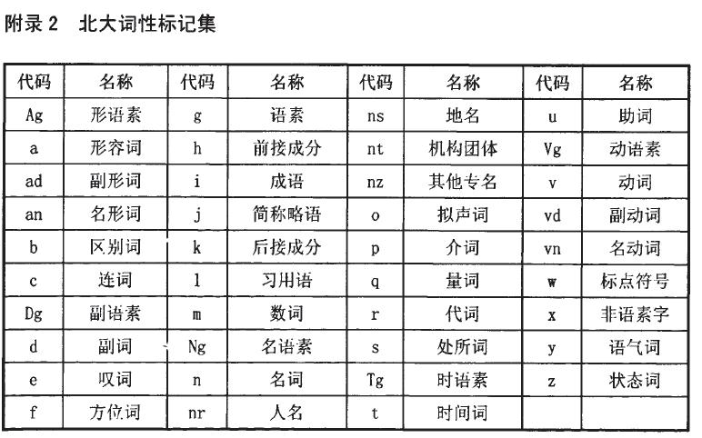

# 词性标注

词性标注是在给指定句子中判定每个词的语法范畴，确定其词性并加以标注的过程。比如“这儿/代词 是/动词 个/量词 非常/副词 漂亮/形容词 的/结构助词 公园/名词”

词性标注最简单的方法就是从语料库中统计每个词所对应的高频词性，将其作为默认词性，但这样显然还有提升空间。目前较主流的方法是如同分词一样，将句子的词性标注作为一个序列标注问题来解决，如隐含马尔可夫模型、条件随机场模型等皆可在词性标注任务中使用。

## 词性标注规范

中文领域标注标准较为主流的主要为北大的词性标注集和滨州词性标注集两大类。下图北大词性标注集。



## Jieba库中词性标注

```text
1) 首先基于正则表达式进行汉字判断，正则表达式如下：
   re_han_internal = re.compile("([\u4E00-\u9FD5a-zA-Z0-9+#&\._]+)")
2) 分类处理
   2.1)若符合上面的正则表达式，则判定为汉字，然后基于前缀词典构建有向无环图，再基于
       有向无环图计算最大概率路径，同时在前缀词典中找出它所分的词性，若在词典中未找
       到，则赋予词性为"x"(代表未知)。当然，若在这个过程中，设置HMM，且待标注词为
       未登录词，则会通过HMM方式进行词性标注。
   2.2)若不符合上面的正则表达式，那么继续通过正则表达式进行类型判断，分别赋予"x"(未知)
       、"m"(数词)、"eng"(英文)
```

HMM在2.1\)步骤中，将基于字标注的分词方法与词性标注结合，使用复合标注集。比如对于名词“人民”，它的词性标注是n，而分词的标注序列是BE，于是“人”的标注就是B\_n，“民”的标注是E\_n

