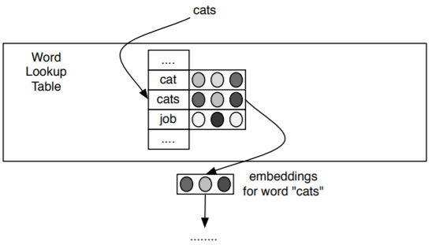
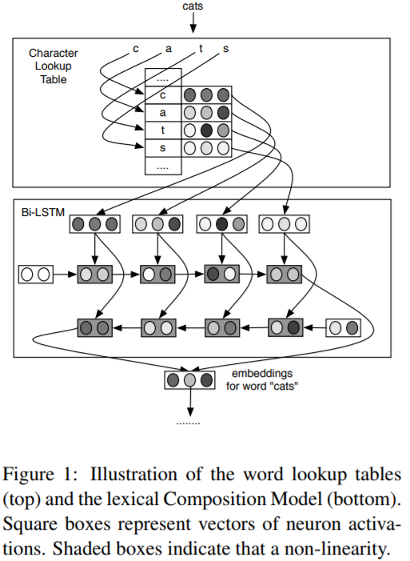
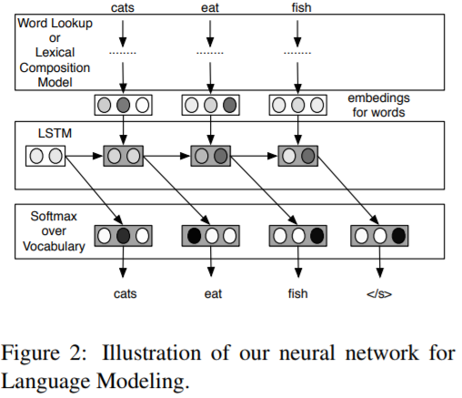

# 基于Bi-LSTM的词性标注模型

在神经网络中常见的词向量模型是给词汇表建立一个查找表（Lookup Table），每个单词都可以在查找表中找到一个对应的词向量，然后多个词向量再组合成后续神经网络层的输入。

普通的词向量结合大量语料可以学习到单词间语义（Semantic）和语法（Syntactic）上的相似性。举个例子，模型可以学到cats、kings、queens之间的线性相关性与cat、king、queen之间的线性相关性一样。不过模型并不能学到前面这组单词是由后面这组单词在末尾加s得到的。也就是说，对于没见过的单词，普通的词向量模型是没有办法的，即使这些单词是词汇表中单词的变形或者组合。除此之外，英语的词汇表是非常庞大的，想要建立一个完善的查找表并不是一件容易的事情。

普通的词向量模型查找表过于庞大，于是就有人提出将单词拆成更小的单元——词素（Morpheme）。不过，词素的切分本身又要依赖于词素解析器（Morphological Analyzer）。因此又有人提出了基于字符的词向量（Character-based Embedding of Words）模型，在Ling等人2015年发表的论文中也叫[C2W（Compositional Character to Word）模型](https://aclweb.org/anthology/D15-1176)。

基于字符的词向量模型的输入、输出和普通的词向量模型是一样的，因此在神经网络模型中这两种模型可以相互替换。与普通的词向量模型类似，基于字符的词向量模型是给字符集合建立一个查找表。字符集合包括大小写字母、数字、标点等。每个字符都可以在查找表中找到对应的字符向量。每个单词都可以看成一串字符，将单词中的字符串对应的词向量从左到右依次送入LSTM模型，再从右向左依次送入LSTM模型。两个方向的LSTM模型生成的结果组合成当前单词的词向量，这样就可以利用Bi-LSTM模型得到单词的向量表示。整个过程如下图所示。

有了词向量模型就可以构建词性标注模型了。下面介绍用来做词性标注的Bi-LSTM模型架构，如下图。Bi-LSTM的输入是一串单词的特征值，这些特征值既可以用普通的词向量模型得到，也可以用基于字符的词向量模型得到。按照单词从左向右的顺序，把这些单词对应的词向量融入LSTM；同理，按照单词从右向左的顺序，把这些单词的词向量送入LSTM模型。两个LSTM模型的输出线性组合成Bi-LSTM的输出，将这个输出送入Softmax层，得到最终的词性标注结果。

相对于普通的词向量模型，基于字符的词向量模型减少了很多参数。不过，因为英文中单词构成的复杂性，该模型在词性标注上的表现并没有超越现有模型。因为，虽然基于字符的词向量模型可以学习ed，ily这种形变特征，但是英文中有些字符构成很像的单词之间差异却很大。比如lesson和lessen，虽然从字符角度看起来很像，但是它们的含义却完全不同。不过，在一些单词形态更丰富的语言（如：土耳其语）中，基于字符的词向量模型的表现优于普通模型。

## Source



